<!-- markdownlint-capture -->
<!-- markdownlint-disable -->

# Code Metrics

This file is dynamically maintained by a bot, *please do not* edit this by hand. It represents various [code metrics](https://aka.ms/dotnet/code-metrics), such as cyclomatic complexity, maintainability index, and so on.

<div id='apphost'></div>

## AppHost :heavy_check_mark:

The *AppHost.csproj* project file contains:

- 3 namespaces.
- 4 named types.
- 451 total lines of source code.
- Approximately 109 lines of executable code.
- The highest cyclomatic complexity is 6 :heavy_check_mark:.

<details>
<summary>
  <strong id="global+namespace">
    &lt;global namespace&gt; :heavy_check_mark:
  </strong>
</summary>
<br>

The `<global namespace>` namespace contains 1 named types.

- 1 named types.
- 29 total lines of source code.
- Approximately 12 lines of executable code.
- The highest cyclomatic complexity is 1 :heavy_check_mark:.

<details>
<summary>
  <strong id="program$">
    &lt;Program&gt;$ :heavy_check_mark:
  </strong>
</summary>
<br>

- The `<Program>$` contains 1 members.
- 29 total lines of source code.
- Approximately 12 lines of executable code.
- The highest cyclomatic complexity is 1 :heavy_check_mark:.

| Member kind | Line number | Maintainability index | Cyclomatic complexity | Depth of inheritance | Class coupling | Lines of source / executable code |
| :-: | :-: | :-: | :-: | :-: | :-: | :-: |
| Method | <a href='https://github.com/mpaulosky/IssueTracker/blob/main/src/AppHost/Program.cs#L10' title='<top-level-statements-entry-point>'>10</a> | 70 | 1 :heavy_check_mark: | 0 | 5 | 29 / 6 |

<a href="#global+namespace">:top: back to &lt;global namespace&gt;</a>

</details>

</details>

<details>
<summary>
  <strong id="apphost-extensions">
    AppHost.Extensions :heavy_check_mark:
  </strong>
</summary>
<br>

The `AppHost.Extensions` namespace contains 2 named types.

- 2 named types.
- 279 total lines of source code.
- Approximately 69 lines of executable code.
- The highest cyclomatic complexity is 6 :heavy_check_mark:.

<details>
<summary>
  <strong id="mongodbhostingextensions">
    MongoDBHostingExtensions :heavy_check_mark:
  </strong>
</summary>
<br>

- The `MongoDBHostingExtensions` contains 1 members.
- 127 total lines of source code.
- Approximately 37 lines of executable code.
- The highest cyclomatic complexity is 5 :heavy_check_mark:.

| Member kind | Line number | Maintainability index | Cyclomatic complexity | Depth of inheritance | Class coupling | Lines of source / executable code |
| :-: | :-: | :-: | :-: | :-: | :-: | :-: |
| Method | <a href='https://github.com/mpaulosky/IssueTracker/blob/main/src/AppHost/Extensions/MongoDBHostingExtensions.cs#L24' title='IResourceBuilder<MongoDBServerResource> MongoDBHostingExtensions.AddMongoDBWithManagement(IDistributedApplicationBuilder builder, string name, string databaseName = "IssueTrackerDb")'>24</a> | 46 | 5 :heavy_check_mark: | 0 | 7 | 121 / 37 |

<a href="#MongoDBHostingExtensions-class-diagram">:link: to `MongoDBHostingExtensions` class diagram</a>

<a href="#apphost-extensions">:top: back to AppHost.Extensions</a>

</details>

<details>
<summary>
  <strong id="redisextensions">
    RedisExtensions :heavy_check_mark:
  </strong>
</summary>
<br>

- The `RedisExtensions` contains 1 members.
- 138 total lines of source code.
- Approximately 32 lines of executable code.
- The highest cyclomatic complexity is 6 :heavy_check_mark:.

| Member kind | Line number | Maintainability index | Cyclomatic complexity | Depth of inheritance | Class coupling | Lines of source / executable code |
| :-: | :-: | :-: | :-: | :-: | :-: | :-: |
| Method | <a href='https://github.com/mpaulosky/IssueTracker/blob/main/src/AppHost/Extensions/RedisExtensions.cs#L43' title='IResourceBuilder<RedisResource> RedisExtensions.AddRedisCache(IDistributedApplicationBuilder builder, string name = "redis", int database = 0)'>43</a> | 48 | 6 :heavy_check_mark: | 0 | 9 | 132 / 32 |

<a href="#RedisExtensions-class-diagram">:link: to `RedisExtensions` class diagram</a>

<a href="#apphost-extensions">:top: back to AppHost.Extensions</a>

</details>

</details>

<details>
<summary>
  <strong id="apphost-helpers">
    AppHost.Helpers :heavy_check_mark:
  </strong>
</summary>
<br>

The `AppHost.Helpers` namespace contains 1 named types.

- 1 named types.
- 143 total lines of source code.
- Approximately 28 lines of executable code.
- The highest cyclomatic complexity is 5 :heavy_check_mark:.

<details>
<summary>
  <strong id="cacheadminhelper">
    CacheAdminHelper :heavy_check_mark:
  </strong>
</summary>
<br>

- The `CacheAdminHelper` contains 3 members.
- 132 total lines of source code.
- Approximately 28 lines of executable code.
- The highest cyclomatic complexity is 5 :heavy_check_mark:.

| Member kind | Line number | Maintainability index | Cyclomatic complexity | Depth of inheritance | Class coupling | Lines of source / executable code |
| :-: | :-: | :-: | :-: | :-: | :-: | :-: |
| Method | <a href='https://github.com/mpaulosky/IssueTracker/blob/main/src/AppHost/Helpers/CacheAdminHelper.cs#L78' title='Task CacheAdminHelper.ClearAllRedisDatabasesAsync(string connectionString)'>78</a> | 70 | 3 :heavy_check_mark: | 0 | 6 | 37 / 6 |
| Method | <a href='https://github.com/mpaulosky/IssueTracker/blob/main/src/AppHost/Helpers/CacheAdminHelper.cs#L34' title='Task CacheAdminHelper.ClearRedisDatabaseAsync(string connectionString, int database = 0)'>34</a> | 63 | 3 :heavy_check_mark: | 0 | 6 | 44 / 10 |
| Method | <a href='https://github.com/mpaulosky/IssueTracker/blob/main/src/AppHost/Helpers/CacheAdminHelper.cs#L109' title='Task<Dictionary<string, string>> CacheAdminHelper.GetRedisInfoAsync(string connectionString)'>109</a> | 61 | 5 :heavy_check_mark: | 0 | 8 | 43 / 12 |

<a href="#CacheAdminHelper-class-diagram">:link: to `CacheAdminHelper` class diagram</a>

<a href="#apphost-helpers">:top: back to AppHost.Helpers</a>

</details>

</details>

<a href="#apphost">:top: back to AppHost</a>

<div id='issuetracker-corebusiness'></div>

## IssueTracker.CoreBusiness :heavy_check_mark:

The *IssueTracker.CoreBusiness.csproj* project file contains:

- 5 namespaces.
- 21 named types.
- 1,473 total lines of source code.
- Approximately 361 lines of executable code.
- The highest cyclomatic complexity is 2 :heavy_check_mark:.

<details>
<summary>
  <strong id="issuetracker-corebusiness-bogusfakes">
    IssueTracker.CoreBusiness.BogusFakes :heavy_check_mark:
  </strong>
</summary>
<br>

The `IssueTracker.CoreBusiness.BogusFakes` namespace contains 5 named types.

- 5 named types.
- 545 total lines of source code.
- Approximately 169 lines of executable code.
- The highest cyclomatic complexity is 2 :heavy_check_mark:.

<details>
<summary>
  <strong id="fakecategory">
    FakeCategory :heavy_check_mark:
  </strong>
</summary>
<br>

- The `FakeCategory` contains 5 members.
- 129 total lines of source code.
- Approximately 31 lines of executable code.
- The highest cyclomatic complexity is 2 :heavy_check_mark:.

| Member kind | Line number | Maintainability index | Cyclomatic complexity | Depth of inheritance | Class coupling | Lines of source / executable code |
| :-: | :-: | :-: | :-: | :-: | :-: | :-: |
| Method | <a href='https://github.com/mpaulosky/IssueTracker/blob/main/src/CoreBusiness/IssueTracker.CoreBusiness/BogusFakes/FakeCategory.cs#L125' title='Faker<CategoryModel> FakeCategory.GenerateFake(bool useNewSeed = false)'>125</a> | 63 | 2 :heavy_check_mark: | 0 | 4 | 20 / 12 |
| Method | <a href='https://github.com/mpaulosky/IssueTracker/blob/main/src/CoreBusiness/IssueTracker.CoreBusiness/BogusFakes/FakeCategory.cs#L113' title='List<BasicCategoryModel> FakeCategory.GetBasicCategories(int numberOfCategories, bool useNewSeed = false)'>113</a> | 75 | 1 :heavy_check_mark: | 0 | 6 | 12 / 4 |
| Method | <a href='https://github.com/mpaulosky/IssueTracker/blob/main/src/CoreBusiness/IssueTracker.CoreBusiness/BogusFakes/FakeCategory.cs#L41' title='List<CategoryModel> FakeCategory.GetCategories()'>41</a> | 78 | 1 :heavy_check_mark: | 0 | 4 | 51 / 2 |
| Method | <a href='https://github.com/mpaulosky/IssueTracker/blob/main/src/CoreBusiness/IssueTracker.CoreBusiness/BogusFakes/FakeCategory.cs#L95' title='List<CategoryModel> FakeCategory.GetCategories(int numberOfCategories, bool useNewSeed = false)'>95</a> | 69 | 2 :heavy_check_mark: | 0 | 8 | 17 / 6 |
| Method | <a href='https://github.com/mpaulosky/IssueTracker/blob/main/src/CoreBusiness/IssueTracker.CoreBusiness/BogusFakes/FakeCategory.cs#L23' title='CategoryModel FakeCategory.GetNewCategory(bool keepId = false, bool useNewSeed = false)'>23</a> | 68 | 2 :heavy_check_mark: | 0 | 4 | 19 / 7 |

<a href="#FakeCategory-class-diagram">:link: to `FakeCategory` class diagram</a>

<a href="#issuetracker-corebusiness-bogusfakes">:top: back to IssueTracker.CoreBusiness.BogusFakes</a>

</details>

<details>
<summary>
  <strong id="fakecomment">
    FakeComment :heavy_check_mark:
  </strong>
</summary>
<br>

- The `FakeComment` contains 4 members.
- 80 total lines of source code.
- Approximately 33 lines of executable code.
- The highest cyclomatic complexity is 2 :heavy_check_mark:.

| Member kind | Line number | Maintainability index | Cyclomatic complexity | Depth of inheritance | Class coupling | Lines of source / executable code |
| :-: | :-: | :-: | :-: | :-: | :-: | :-: |
| Method | <a href='https://github.com/mpaulosky/IssueTracker/blob/main/src/CoreBusiness/IssueTracker.CoreBusiness/BogusFakes/FakeComment.cs#L73' title='Faker<CommentModel> FakeComment.GenerateFake(bool useNewSeed = false)'>73</a> | 58 | 2 :heavy_check_mark: | 0 | 9 | 23 / 16 |
| Method | <a href='https://github.com/mpaulosky/IssueTracker/blob/main/src/CoreBusiness/IssueTracker.CoreBusiness/BogusFakes/FakeComment.cs#L61' title='List<BasicCommentModel> FakeComment.GetBasicComments(int numberOfComments, bool useNewSeed = false)'>61</a> | 75 | 1 :heavy_check_mark: | 0 | 6 | 12 / 4 |
| Method | <a href='https://github.com/mpaulosky/IssueTracker/blob/main/src/CoreBusiness/IssueTracker.CoreBusiness/BogusFakes/FakeComment.cs#L43' title='List<CommentModel> FakeComment.GetComments(int numberOfComments, bool useNewSeed = false)'>43</a> | 69 | 2 :heavy_check_mark: | 0 | 8 | 17 / 6 |
| Method | <a href='https://github.com/mpaulosky/IssueTracker/blob/main/src/CoreBusiness/IssueTracker.CoreBusiness/BogusFakes/FakeComment.cs#L23' title='CommentModel FakeComment.GetNewComment(bool keepId = false, bool useNewSeed = false)'>23</a> | 68 | 2 :heavy_check_mark: | 0 | 4 | 19 / 7 |

<a href="#FakeComment-class-diagram">:link: to `FakeComment` class diagram</a>

<a href="#issuetracker-corebusiness-bogusfakes">:top: back to IssueTracker.CoreBusiness.BogusFakes</a>

</details>

<details>
<summary>
  <strong id="fakeissue">
    FakeIssue :heavy_check_mark:
  </strong>
</summary>
<br>

- The `FakeIssue` contains 4 members.
- 87 total lines of source code.
- Approximately 40 lines of executable code.
- The highest cyclomatic complexity is 2 :heavy_check_mark:.

| Member kind | Line number | Maintainability index | Cyclomatic complexity | Depth of inheritance | Class coupling | Lines of source / executable code |
| :-: | :-: | :-: | :-: | :-: | :-: | :-: |
| Method | <a href='https://github.com/mpaulosky/IssueTracker/blob/main/src/CoreBusiness/IssueTracker.CoreBusiness/BogusFakes/FakeIssue.cs#L77' title='Faker<IssueModel> FakeIssue.GenerateFake(bool useNewSeed = false)'>77</a> | 55 | 2 :heavy_check_mark: | 0 | 11 | 26 / 21 |
| Method | <a href='https://github.com/mpaulosky/IssueTracker/blob/main/src/CoreBusiness/IssueTracker.CoreBusiness/BogusFakes/FakeIssue.cs#L65' title='List<BasicIssueModel> FakeIssue.GetBasicIssues(int numberOfIssues, bool useNewSeed = false)'>65</a> | 75 | 1 :heavy_check_mark: | 0 | 5 | 12 / 4 |
| Method | <a href='https://github.com/mpaulosky/IssueTracker/blob/main/src/CoreBusiness/IssueTracker.CoreBusiness/BogusFakes/FakeIssue.cs#L47' title='List<IssueModel> FakeIssue.GetIssues(int numberOfIssues, bool useNewSeed = false)'>47</a> | 69 | 2 :heavy_check_mark: | 0 | 8 | 17 / 6 |
| Method | <a href='https://github.com/mpaulosky/IssueTracker/blob/main/src/CoreBusiness/IssueTracker.CoreBusiness/BogusFakes/FakeIssue.cs#L23' title='IssueModel FakeIssue.GetNewIssue(bool keepId = false, bool useNewSeed = false)'>23</a> | 64 | 2 :heavy_check_mark: | 0 | 8 | 23 / 9 |

<a href="#FakeIssue-class-diagram">:link: to `FakeIssue` class diagram</a>

<a href="#issuetracker-corebusiness-bogusfakes">:top: back to IssueTracker.CoreBusiness.BogusFakes</a>

</details>

<details>
<summary>
  <strong id="fakestatus">
    FakeStatus :heavy_check_mark:
  </strong>
</summary>
<br>

- The `FakeStatus` contains 5 members.
- 119 total lines of source code.
- Approximately 31 lines of executable code.
- The highest cyclomatic complexity is 2 :heavy_check_mark:.

| Member kind | Line number | Maintainability index | Cyclomatic complexity | Depth of inheritance | Class coupling | Lines of source / executable code |
| :-: | :-: | :-: | :-: | :-: | :-: | :-: |
| Method | <a href='https://github.com/mpaulosky/IssueTracker/blob/main/src/CoreBusiness/IssueTracker.CoreBusiness/BogusFakes/FakeStatus.cs#L115' title='Faker<StatusModel> FakeStatus.GenerateFake(bool useNewSeed = false)'>115</a> | 63 | 2 :heavy_check_mark: | 0 | 4 | 20 / 12 |
| Method | <a href='https://github.com/mpaulosky/IssueTracker/blob/main/src/CoreBusiness/IssueTracker.CoreBusiness/BogusFakes/FakeStatus.cs#L103' title='List<BasicStatusModel> FakeStatus.GetBasicStatuses(int numberOfStatuses, bool useNewSeed = false)'>103</a> | 75 | 1 :heavy_check_mark: | 0 | 6 | 12 / 4 |
| Method | <a href='https://github.com/mpaulosky/IssueTracker/blob/main/src/CoreBusiness/IssueTracker.CoreBusiness/BogusFakes/FakeStatus.cs#L23' title='StatusModel FakeStatus.GetNewStatus(bool keepId = false, bool useNewSeed = false)'>23</a> | 68 | 2 :heavy_check_mark: | 0 | 4 | 19 / 7 |
| Method | <a href='https://github.com/mpaulosky/IssueTracker/blob/main/src/CoreBusiness/IssueTracker.CoreBusiness/BogusFakes/FakeStatus.cs#L41' title='List<StatusModel> FakeStatus.GetStatuses()'>41</a> | 79 | 1 :heavy_check_mark: | 0 | 4 | 41 / 2 |
| Method | <a href='https://github.com/mpaulosky/IssueTracker/blob/main/src/CoreBusiness/IssueTracker.CoreBusiness/BogusFakes/FakeStatus.cs#L85' title='List<StatusModel> FakeStatus.GetStatuses(int numberOfStatuses, bool useNewSeed = false)'>85</a> | 70 | 2 :heavy_check_mark: | 0 | 8 | 17 / 6 |

<a href="#FakeStatus-class-diagram">:link: to `FakeStatus` class diagram</a>

<a href="#issuetracker-corebusiness-bogusfakes">:top: back to IssueTracker.CoreBusiness.BogusFakes</a>

</details>

<details>
<summary>
  <strong id="fakeuser">
    FakeUser :heavy_check_mark:
  </strong>
</summary>
<br>

- The `FakeUser` contains 4 members.
- 80 total lines of source code.
- Approximately 34 lines of executable code.
- The highest cyclomatic complexity is 2 :heavy_check_mark:.

| Member kind | Line number | Maintainability index | Cyclomatic complexity | Depth of inheritance | Class coupling | Lines of source / executable code |
| :-: | :-: | :-: | :-: | :-: | :-: | :-: |
| Method | <a href='https://github.com/mpaulosky/IssueTracker/blob/main/src/CoreBusiness/IssueTracker.CoreBusiness/BogusFakes/FakeUser.cs#L73' title='Faker<UserModel> FakeUser.GenerateFake(bool useNewSeed = false)'>73</a> | 58 | 2 :heavy_check_mark: | 0 | 4 | 23 / 17 |
| Method | <a href='https://github.com/mpaulosky/IssueTracker/blob/main/src/CoreBusiness/IssueTracker.CoreBusiness/BogusFakes/FakeUser.cs#L61' title='List<BasicUserModel> FakeUser.GetBasicUser(int numberOfUsers, bool useNewSeed = false)'>61</a> | 75 | 1 :heavy_check_mark: | 0 | 6 | 12 / 4 |
| Method | <a href='https://github.com/mpaulosky/IssueTracker/blob/main/src/CoreBusiness/IssueTracker.CoreBusiness/BogusFakes/FakeUser.cs#L23' title='UserModel FakeUser.GetNewUser(bool keepId = false, bool useNewSeed = false)'>23</a> | 68 | 2 :heavy_check_mark: | 0 | 4 | 19 / 7 |
| Method | <a href='https://github.com/mpaulosky/IssueTracker/blob/main/src/CoreBusiness/IssueTracker.CoreBusiness/BogusFakes/FakeUser.cs#L43' title='List<UserModel> FakeUser.GetUsers(int numberOfUsers, bool useNewSeed = false)'>43</a> | 70 | 2 :heavy_check_mark: | 0 | 6 | 17 / 6 |

<a href="#FakeUser-class-diagram">:link: to `FakeUser` class diagram</a>

<a href="#issuetracker-corebusiness-bogusfakes">:top: back to IssueTracker.CoreBusiness.BogusFakes</a>

</details>

</details>

<details>
<summary>
  <strong id="issuetracker-corebusiness-contracts">
    IssueTracker.CoreBusiness.Contracts :heavy_check_mark:
  </strong>
</summary>
<br>

The `IssueTracker.CoreBusiness.Contracts` namespace contains 1 named types.

- 1 named types.
- 16 total lines of source code.
- Approximately 0 lines of executable code.
- The highest cyclomatic complexity is 2 :heavy_check_mark:.

<details>
<summary>
  <strong id="idatabasesettings">
    IDatabaseSettings :heavy_check_mark:
  </strong>
</summary>
<br>

- The `IDatabaseSettings` contains 2 members.
- 6 total lines of source code.
- Approximately 0 lines of executable code.
- The highest cyclomatic complexity is 2 :heavy_check_mark:.

| Member kind | Line number | Maintainability index | Cyclomatic complexity | Depth of inheritance | Class coupling | Lines of source / executable code |
| :-: | :-: | :-: | :-: | :-: | :-: | :-: |
| Property | <a href='https://github.com/mpaulosky/IssueTracker/blob/main/src/CoreBusiness/IssueTracker.CoreBusiness/Contracts/IDatabaseSettings.cs#L14' title='string IDatabaseSettings.ConnectionStrings'>14</a> | 100 | 2 :heavy_check_mark: | 0 | 0 | 1 / 0 |
| Property | <a href='https://github.com/mpaulosky/IssueTracker/blob/main/src/CoreBusiness/IssueTracker.CoreBusiness/Contracts/IDatabaseSettings.cs#L16' title='string IDatabaseSettings.DatabaseName'>16</a> | 100 | 2 :heavy_check_mark: | 0 | 0 | 1 / 0 |

<a href="#IDatabaseSettings-class-diagram">:link: to `IDatabaseSettings` class diagram</a>

<a href="#issuetracker-corebusiness-contracts">:top: back to IssueTracker.CoreBusiness.Contracts</a>

</details>

</details>

<details>
<summary>
  <strong id="issuetracker-corebusiness-enum">
    IssueTracker.CoreBusiness.Enum :heavy_check_mark:
  </strong>
</summary>
<br>

The `IssueTracker.CoreBusiness.Enum` namespace contains 3 named types.

- 3 named types.
- 35 total lines of source code.
- Approximately 0 lines of executable code.
- The highest cyclomatic complexity is 0 :heavy_check_mark:.

<details>
<summary>
  <strong id="enums-category">
    Enums.Category :heavy_check_mark:
  </strong>
</summary>
<br>

- The `Enums.Category` contains 5 members.
- 11 total lines of source code.
- Approximately 0 lines of executable code.
- The highest cyclomatic complexity is 0 :heavy_check_mark:.

| Member kind | Line number | Maintainability index | Cyclomatic complexity | Depth of inheritance | Class coupling | Lines of source / executable code |
| :-: | :-: | :-: | :-: | :-: | :-: | :-: |
| Field | <a href='https://github.com/mpaulosky/IssueTracker/blob/main/src/CoreBusiness/IssueTracker.CoreBusiness/Enum/Enums.cs#L22' title='Category.Clarification'>22</a> | 100 | 0 :heavy_check_mark: | 0 | 0 | 1 / 0 |
| Field | <a href='https://github.com/mpaulosky/IssueTracker/blob/main/src/CoreBusiness/IssueTracker.CoreBusiness/Enum/Enums.cs#L19' title='Category.Design'>19</a> | 100 | 0 :heavy_check_mark: | 0 | 0 | 1 / 0 |
| Field | <a href='https://github.com/mpaulosky/IssueTracker/blob/main/src/CoreBusiness/IssueTracker.CoreBusiness/Enum/Enums.cs#L20' title='Category.Documentation'>20</a> | 100 | 0 :heavy_check_mark: | 0 | 0 | 1 / 0 |
| Field | <a href='https://github.com/mpaulosky/IssueTracker/blob/main/src/CoreBusiness/IssueTracker.CoreBusiness/Enum/Enums.cs#L21' title='Category.Implementation'>21</a> | 100 | 0 :heavy_check_mark: | 0 | 0 | 1 / 0 |
| Field | <a href='https://github.com/mpaulosky/IssueTracker/blob/main/src/CoreBusiness/IssueTracker.CoreBusiness/Enum/Enums.cs#L23' title='Category.Miscellaneous'>23</a> | 100 | 0 :heavy_check_mark: | 0 | 0 | 1 / 0 |

<a href="#Enums.Category-class-diagram">:link: to `Enums.Category` class diagram</a>

<a href="#issuetracker-corebusiness-enum">:top: back to IssueTracker.CoreBusiness.Enum</a>

</details>

<details>
<summary>
  <strong id="enums">
    Enums :question:
  </strong>
</summary>
<br>

- The `Enums` contains 0 members.
- 25 total lines of source code.
- Approximately 0 lines of executable code.
- The highest cyclomatic complexity is 0 :question:.

| Member kind | Line number | Maintainability index | Cyclomatic complexity | Depth of inheritance | Class coupling | Lines of source / executable code |
| :-: | :-: | :-: | :-: | :-: | :-: | :-: |

<a href="#Enums-class-diagram">:link: to `Enums` class diagram</a>

<a href="#issuetracker-corebusiness-enum">:top: back to IssueTracker.CoreBusiness.Enum</a>

</details>

<details>
<summary>
  <strong id="enums-status">
    Enums.Status :heavy_check_mark:
  </strong>
</summary>
<br>

- The `Enums.Status` contains 4 members.
- 10 total lines of source code.
- Approximately 0 lines of executable code.
- The highest cyclomatic complexity is 0 :heavy_check_mark:.

| Member kind | Line number | Maintainability index | Cyclomatic complexity | Depth of inheritance | Class coupling | Lines of source / executable code |
| :-: | :-: | :-: | :-: | :-: | :-: | :-: |
| Field | <a href='https://github.com/mpaulosky/IssueTracker/blob/main/src/CoreBusiness/IssueTracker.CoreBusiness/Enum/Enums.cs#L31' title='Status.Answered'>31</a> | 100 | 0 :heavy_check_mark: | 0 | 0 | 1 / 0 |
| Field | <a href='https://github.com/mpaulosky/IssueTracker/blob/main/src/CoreBusiness/IssueTracker.CoreBusiness/Enum/Enums.cs#L33' title='Status.Dismissed'>33</a> | 100 | 0 :heavy_check_mark: | 0 | 0 | 1 / 0 |
| Field | <a href='https://github.com/mpaulosky/IssueTracker/blob/main/src/CoreBusiness/IssueTracker.CoreBusiness/Enum/Enums.cs#L34' title='Status.InWork'>34</a> | 100 | 0 :heavy_check_mark: | 0 | 0 | 1 / 0 |
| Field | <a href='https://github.com/mpaulosky/IssueTracker/blob/main/src/CoreBusiness/IssueTracker.CoreBusiness/Enum/Enums.cs#L32' title='Status.Watching'>32</a> | 100 | 0 :heavy_check_mark: | 0 | 0 | 1 / 0 |

<a href="#Enums.Status-class-diagram">:link: to `Enums.Status` class diagram</a>

<a href="#issuetracker-corebusiness-enum">:top: back to IssueTracker.CoreBusiness.Enum</a>

</details>

</details>

<details>
<summary>
  <strong id="issuetracker-corebusiness-helpers">
    IssueTracker.CoreBusiness.Helpers :heavy_check_mark:
  </strong>
</summary>
<br>

The `IssueTracker.CoreBusiness.Helpers` namespace contains 1 named types.

- 1 named types.
- 33 total lines of source code.
- Approximately 1 lines of executable code.
- The highest cyclomatic complexity is 1 :heavy_check_mark:.

<details>
<summary>
  <strong id="collectionnames">
    CollectionNames :heavy_check_mark:
  </strong>
</summary>
<br>

- The `CollectionNames` contains 1 members.
- 23 total lines of source code.
- Approximately 1 lines of executable code.
- The highest cyclomatic complexity is 1 :heavy_check_mark:.

| Member kind | Line number | Maintainability index | Cyclomatic complexity | Depth of inheritance | Class coupling | Lines of source / executable code |
| :-: | :-: | :-: | :-: | :-: | :-: | :-: |
| Method | <a href='https://github.com/mpaulosky/IssueTracker/blob/main/src/CoreBusiness/IssueTracker.CoreBusiness/Helpers/CollectionNames.cs#L22' title='string CollectionNames.GetCollectionName(string entityName)'>22</a> | 88 | 1 :heavy_check_mark: | 0 | 0 | 17 / 1 |

<a href="#CollectionNames-class-diagram">:link: to `CollectionNames` class diagram</a>

<a href="#issuetracker-corebusiness-helpers">:top: back to IssueTracker.CoreBusiness.Helpers</a>

</details>

</details>

<details>
<summary>
  <strong id="issuetracker-corebusiness-models">
    IssueTracker.CoreBusiness.Models :heavy_check_mark:
  </strong>
</summary>
<br>

The `IssueTracker.CoreBusiness.Models` namespace contains 11 named types.

- 11 named types.
- 844 total lines of source code.
- Approximately 191 lines of executable code.
- The highest cyclomatic complexity is 2 :heavy_check_mark:.

<details>
<summary>
  <strong id="basiccategorymodel">
    BasicCategoryModel :heavy_check_mark:
  </strong>
</summary>
<br>

- The `BasicCategoryModel` contains 5 members.
- 50 total lines of source code.
- Approximately 6 lines of executable code.
- The highest cyclomatic complexity is 2 :heavy_check_mark:.

| Member kind | Line number | Maintainability index | Cyclomatic complexity | Depth of inheritance | Class coupling | Lines of source / executable code |
| :-: | :-: | :-: | :-: | :-: | :-: | :-: |
| Method | <a href='https://github.com/mpaulosky/IssueTracker/blob/main/src/CoreBusiness/IssueTracker.CoreBusiness/Models/BasicCategoryModel.cs#L21' title='BasicCategoryModel.BasicCategoryModel()'>21</a> | 100 | 1 :heavy_check_mark: | 0 | 0 | 6 / 0 |
| Method | <a href='https://github.com/mpaulosky/IssueTracker/blob/main/src/CoreBusiness/IssueTracker.CoreBusiness/Models/BasicCategoryModel.cs#L29' title='BasicCategoryModel.BasicCategoryModel(CategoryModel category)'>29</a> | 83 | 1 :heavy_check_mark: | 0 | 1 | 9 / 2 |
| Method | <a href='https://github.com/mpaulosky/IssueTracker/blob/main/src/CoreBusiness/IssueTracker.CoreBusiness/Models/BasicCategoryModel.cs#L40' title='BasicCategoryModel.BasicCategoryModel(string categoryName, string categoryDescription)'>40</a> | 85 | 1 :heavy_check_mark: | 0 | 0 | 10 / 2 |
| Property | <a href='https://github.com/mpaulosky/IssueTracker/blob/main/src/CoreBusiness/IssueTracker.CoreBusiness/Models/BasicCategoryModel.cs#L60' title='string BasicCategoryModel.CategoryDescription'>60</a> | 100 | 2 :heavy_check_mark: | 0 | 1 | 7 / 1 |
| Property | <a href='https://github.com/mpaulosky/IssueTracker/blob/main/src/CoreBusiness/IssueTracker.CoreBusiness/Models/BasicCategoryModel.cs#L52' title='string BasicCategoryModel.CategoryName'>52</a> | 100 | 2 :heavy_check_mark: | 0 | 1 | 7 / 1 |

<a href="#BasicCategoryModel-class-diagram">:link: to `BasicCategoryModel` class diagram</a>

<a href="#issuetracker-corebusiness-models">:top: back to IssueTracker.CoreBusiness.Models</a>

</details>

<details>
<summary>
  <strong id="basiccommentmodel">
    BasicCommentModel :heavy_check_mark:
  </strong>
</summary>
<br>

- The `BasicCommentModel` contains 7 members.
- 27 total lines of source code.
- Approximately 6 lines of executable code.
- The highest cyclomatic complexity is 2 :heavy_check_mark:.

| Member kind | Line number | Maintainability index | Cyclomatic complexity | Depth of inheritance | Class coupling | Lines of source / executable code |
| :-: | :-: | :-: | :-: | :-: | :-: | :-: |
| Method | <a href='https://github.com/mpaulosky/IssueTracker/blob/main/src/CoreBusiness/IssueTracker.CoreBusiness/Models/BasicCommentModel.cs#L22' title='BasicCommentModel.BasicCommentModel(CommentModel comment)'>22</a> | 68 | 1 :heavy_check_mark: | 0 | 4 | 13 / 6 |
| Property | <a href='https://github.com/mpaulosky/IssueTracker/blob/main/src/CoreBusiness/IssueTracker.CoreBusiness/Models/BasicCommentModel.cs#L37' title='BasicUserModel BasicCommentModel.Author'>37</a> | 100 | 2 :heavy_check_mark: | 0 | 1 | 1 / 0 |
| Property | <a href='https://github.com/mpaulosky/IssueTracker/blob/main/src/CoreBusiness/IssueTracker.CoreBusiness/Models/BasicCommentModel.cs#L35' title='DateTime BasicCommentModel.DateCreated'>35</a> | 100 | 2 :heavy_check_mark: | 0 | 1 | 1 / 0 |
| Property | <a href='https://github.com/mpaulosky/IssueTracker/blob/main/src/CoreBusiness/IssueTracker.CoreBusiness/Models/BasicCommentModel.cs#L34' title='string BasicCommentModel.Description'>34</a> | 100 | 2 :heavy_check_mark: | 0 | 0 | 1 / 0 |
| Property | <a href='https://github.com/mpaulosky/IssueTracker/blob/main/src/CoreBusiness/IssueTracker.CoreBusiness/Models/BasicCommentModel.cs#L32' title='string BasicCommentModel.Id'>32</a> | 100 | 2 :heavy_check_mark: | 0 | 0 | 1 / 0 |
| Property | <a href='https://github.com/mpaulosky/IssueTracker/blob/main/src/CoreBusiness/IssueTracker.CoreBusiness/Models/BasicCommentModel.cs#L36' title='BasicIssueModel BasicCommentModel.Issue'>36</a> | 100 | 2 :heavy_check_mark: | 0 | 1 | 1 / 0 |
| Property | <a href='https://github.com/mpaulosky/IssueTracker/blob/main/src/CoreBusiness/IssueTracker.CoreBusiness/Models/BasicCommentModel.cs#L33' title='string BasicCommentModel.Title'>33</a> | 100 | 2 :heavy_check_mark: | 0 | 0 | 1 / 0 |

<a href="#BasicCommentModel-class-diagram">:link: to `BasicCommentModel` class diagram</a>

<a href="#issuetracker-corebusiness-models">:top: back to IssueTracker.CoreBusiness.Models</a>

</details>

<details>
<summary>
  <strong id="basicissuemodel">
    BasicIssueModel :heavy_check_mark:
  </strong>
</summary>
<br>

- The `BasicIssueModel` contains 9 members.
- 81 total lines of source code.
- Approximately 14 lines of executable code.
- The highest cyclomatic complexity is 2 :heavy_check_mark:.

| Member kind | Line number | Maintainability index | Cyclomatic complexity | Depth of inheritance | Class coupling | Lines of source / executable code |
| :-: | :-: | :-: | :-: | :-: | :-: | :-: |
| Method | <a href='https://github.com/mpaulosky/IssueTracker/blob/main/src/CoreBusiness/IssueTracker.CoreBusiness/Models/BasicIssueModel.cs#L21' title='BasicIssueModel.BasicIssueModel()'>21</a> | 100 | 1 :heavy_check_mark: | 0 | 0 | 6 / 0 |
| Method | <a href='https://github.com/mpaulosky/IssueTracker/blob/main/src/CoreBusiness/IssueTracker.CoreBusiness/Models/BasicIssueModel.cs#L29' title='BasicIssueModel.BasicIssueModel(IssueModel issue)'>29</a> | 66 | 1 :heavy_check_mark: | 0 | 5 | 14 / 7 |
| Property | <a href='https://github.com/mpaulosky/IssueTracker/blob/main/src/CoreBusiness/IssueTracker.CoreBusiness/Models/BasicIssueModel.cs#L75' title='BasicUserModel BasicIssueModel.Author'>75</a> | 100 | 2 :heavy_check_mark: | 0 | 1 | 7 / 1 |
| Property | <a href='https://github.com/mpaulosky/IssueTracker/blob/main/src/CoreBusiness/IssueTracker.CoreBusiness/Models/BasicIssueModel.cs#L83' title='BasicCategoryModel BasicIssueModel.Category'>83</a> | 100 | 2 :heavy_check_mark: | 0 | 1 | 7 / 1 |
| Property | <a href='https://github.com/mpaulosky/IssueTracker/blob/main/src/CoreBusiness/IssueTracker.CoreBusiness/Models/BasicIssueModel.cs#L66' title='DateTime BasicIssueModel.DateCreated'>66</a> | 100 | 2 :heavy_check_mark: | 0 | 2 | 3 / 1 |
| Property | <a href='https://github.com/mpaulosky/IssueTracker/blob/main/src/CoreBusiness/IssueTracker.CoreBusiness/Models/BasicIssueModel.cs#L62' title='string BasicIssueModel.Description'>62</a> | 100 | 2 :heavy_check_mark: | 0 | 1 | 7 / 1 |
| Property | <a href='https://github.com/mpaulosky/IssueTracker/blob/main/src/CoreBusiness/IssueTracker.CoreBusiness/Models/BasicIssueModel.cs#L46' title='string BasicIssueModel.Id'>46</a> | 100 | 2 :heavy_check_mark: | 0 | 1 | 7 / 1 |
| Property | <a href='https://github.com/mpaulosky/IssueTracker/blob/main/src/CoreBusiness/IssueTracker.CoreBusiness/Models/BasicIssueModel.cs#L91' title='BasicStatusModel BasicIssueModel.Status'>91</a> | 100 | 2 :heavy_check_mark: | 0 | 1 | 7 / 1 |
| Property | <a href='https://github.com/mpaulosky/IssueTracker/blob/main/src/CoreBusiness/IssueTracker.CoreBusiness/Models/BasicIssueModel.cs#L54' title='string BasicIssueModel.Title'>54</a> | 100 | 2 :heavy_check_mark: | 0 | 1 | 7 / 1 |

<a href="#BasicIssueModel-class-diagram">:link: to `BasicIssueModel` class diagram</a>

<a href="#issuetracker-corebusiness-models">:top: back to IssueTracker.CoreBusiness.Models</a>

</details>

<details>
<summary>
  <strong id="basicstatusmodel">
    BasicStatusModel :heavy_check_mark:
  </strong>
</summary>
<br>

- The `BasicStatusModel` contains 5 members.
- 50 total lines of source code.
- Approximately 6 lines of executable code.
- The highest cyclomatic complexity is 2 :heavy_check_mark:.

| Member kind | Line number | Maintainability index | Cyclomatic complexity | Depth of inheritance | Class coupling | Lines of source / executable code |
| :-: | :-: | :-: | :-: | :-: | :-: | :-: |
| Method | <a href='https://github.com/mpaulosky/IssueTracker/blob/main/src/CoreBusiness/IssueTracker.CoreBusiness/Models/BasicStatusModel.cs#L21' title='BasicStatusModel.BasicStatusModel()'>21</a> | 100 | 1 :heavy_check_mark: | 0 | 0 | 6 / 0 |
| Method | <a href='https://github.com/mpaulosky/IssueTracker/blob/main/src/CoreBusiness/IssueTracker.CoreBusiness/Models/BasicStatusModel.cs#L29' title='BasicStatusModel.BasicStatusModel(StatusModel status)'>29</a> | 83 | 1 :heavy_check_mark: | 0 | 1 | 9 / 2 |
| Method | <a href='https://github.com/mpaulosky/IssueTracker/blob/main/src/CoreBusiness/IssueTracker.CoreBusiness/Models/BasicStatusModel.cs#L40' title='BasicStatusModel.BasicStatusModel(string statusName, string statusDescription)'>40</a> | 85 | 1 :heavy_check_mark: | 0 | 0 | 10 / 2 |
| Property | <a href='https://github.com/mpaulosky/IssueTracker/blob/main/src/CoreBusiness/IssueTracker.CoreBusiness/Models/BasicStatusModel.cs#L60' title='string BasicStatusModel.StatusDescription'>60</a> | 100 | 2 :heavy_check_mark: | 0 | 1 | 7 / 1 |
| Property | <a href='https://github.com/mpaulosky/IssueTracker/blob/main/src/CoreBusiness/IssueTracker.CoreBusiness/Models/BasicStatusModel.cs#L52' title='string BasicStatusModel.StatusName'>52</a> | 100 | 2 :heavy_check_mark: | 0 | 1 | 7 / 1 |

<a href="#BasicStatusModel-class-diagram">:link: to `BasicStatusModel` class diagram</a>

<a href="#issuetracker-corebusiness-models">:top: back to IssueTracker.CoreBusiness.Models</a>

</details>

<details>
<summary>
  <strong id="basicusermodel">
    BasicUserModel :heavy_check_mark:
  </strong>
</summary>
<br>

- The `BasicUserModel` contains 8 members.
- 88 total lines of source code.
- Approximately 15 lines of executable code.
- The highest cyclomatic complexity is 2 :heavy_check_mark:.

| Member kind | Line number | Maintainability index | Cyclomatic complexity | Depth of inheritance | Class coupling | Lines of source / executable code |
| :-: | :-: | :-: | :-: | :-: | :-: | :-: |
| Method | <a href='https://github.com/mpaulosky/IssueTracker/blob/main/src/CoreBusiness/IssueTracker.CoreBusiness/Models/BasicUserModel.cs#L21' title='BasicUserModel.BasicUserModel()'>21</a> | 100 | 1 :heavy_check_mark: | 0 | 0 | 6 / 0 |
| Method | <a href='https://github.com/mpaulosky/IssueTracker/blob/main/src/CoreBusiness/IssueTracker.CoreBusiness/Models/BasicUserModel.cs#L29' title='BasicUserModel.BasicUserModel(UserModel user)'>29</a> | 71 | 1 :heavy_check_mark: | 0 | 1 | 12 / 5 |
| Method | <a href='https://github.com/mpaulosky/IssueTracker/blob/main/src/CoreBusiness/IssueTracker.CoreBusiness/Models/BasicUserModel.cs#L46' title='BasicUserModel.BasicUserModel(string id, string firstName, string lastName, string emailAddress, string displayName)'>46</a> | 72 | 1 :heavy_check_mark: | 0 | 0 | 21 / 5 |
| Property | <a href='https://github.com/mpaulosky/IssueTracker/blob/main/src/CoreBusiness/IssueTracker.CoreBusiness/Models/BasicUserModel.cs#L90' title='string BasicUserModel.DisplayName'>90</a> | 100 | 2 :heavy_check_mark: | 0 | 1 | 7 / 1 |
| Property | <a href='https://github.com/mpaulosky/IssueTracker/blob/main/src/CoreBusiness/IssueTracker.CoreBusiness/Models/BasicUserModel.cs#L98' title='string BasicUserModel.EmailAddress'>98</a> | 100 | 2 :heavy_check_mark: | 0 | 1 | 7 / 1 |
| Property | <a href='https://github.com/mpaulosky/IssueTracker/blob/main/src/CoreBusiness/IssueTracker.CoreBusiness/Models/BasicUserModel.cs#L74' title='string BasicUserModel.FirstName'>74</a> | 100 | 2 :heavy_check_mark: | 0 | 1 | 7 / 1 |
| Property | <a href='https://github.com/mpaulosky/IssueTracker/blob/main/src/CoreBusiness/IssueTracker.CoreBusiness/Models/BasicUserModel.cs#L66' title='string BasicUserModel.Id'>66</a> | 100 | 2 :heavy_check_mark: | 0 | 1 | 7 / 1 |
| Property | <a href='https://github.com/mpaulosky/IssueTracker/blob/main/src/CoreBusiness/IssueTracker.CoreBusiness/Models/BasicUserModel.cs#L82' title='string BasicUserModel.LastName'>82</a> | 100 | 2 :heavy_check_mark: | 0 | 1 | 7 / 1 |

<a href="#BasicUserModel-class-diagram">:link: to `BasicUserModel` class diagram</a>

<a href="#issuetracker-corebusiness-models">:top: back to IssueTracker.CoreBusiness.Models</a>

</details>

<details>
<summary>
  <strong id="categorymodel">
    CategoryModel :heavy_check_mark:
  </strong>
</summary>
<br>

- The `CategoryModel` contains 5 members.
- 55 total lines of source code.
- Approximately 20 lines of executable code.
- The highest cyclomatic complexity is 2 :heavy_check_mark:.

| Member kind | Line number | Maintainability index | Cyclomatic complexity | Depth of inheritance | Class coupling | Lines of source / executable code |
| :-: | :-: | :-: | :-: | :-: | :-: | :-: |
| Property | <a href='https://github.com/mpaulosky/IssueTracker/blob/main/src/CoreBusiness/IssueTracker.CoreBusiness/Models/CategoryModel.cs#L57' title='bool CategoryModel.Archived'>57</a> | 100 | 2 :heavy_check_mark: | 0 | 3 | 9 / 4 |
| Property | <a href='https://github.com/mpaulosky/IssueTracker/blob/main/src/CoreBusiness/IssueTracker.CoreBusiness/Models/CategoryModel.cs#L65' title='BasicUserModel CategoryModel.ArchivedBy'>65</a> | 100 | 2 :heavy_check_mark: | 0 | 1 | 7 / 1 |
| Property | <a href='https://github.com/mpaulosky/IssueTracker/blob/main/src/CoreBusiness/IssueTracker.CoreBusiness/Models/CategoryModel.cs#L47' title='string CategoryModel.CategoryDescription'>47</a> | 100 | 2 :heavy_check_mark: | 0 | 3 | 9 / 5 |
| Property | <a href='https://github.com/mpaulosky/IssueTracker/blob/main/src/CoreBusiness/IssueTracker.CoreBusiness/Models/CategoryModel.cs#L37' title='string CategoryModel.CategoryName'>37</a> | 100 | 2 :heavy_check_mark: | 0 | 3 | 9 / 5 |
| Property | <a href='https://github.com/mpaulosky/IssueTracker/blob/main/src/CoreBusiness/IssueTracker.CoreBusiness/Models/CategoryModel.cs#L27' title='string? CategoryModel.Id'>27</a> | 100 | 2 :heavy_check_mark: | 0 | 5 | 10 / 5 |

<a href="#CategoryModel-class-diagram">:link: to `CategoryModel` class diagram</a>

<a href="#issuetracker-corebusiness-models">:top: back to IssueTracker.CoreBusiness.Models</a>

</details>

<details>
<summary>
  <strong id="commentmodel">
    CommentModel :heavy_check_mark:
  </strong>
</summary>
<br>

- The `CommentModel` contains 11 members.
- 103 total lines of source code.
- Approximately 31 lines of executable code.
- The highest cyclomatic complexity is 2 :heavy_check_mark:.

| Member kind | Line number | Maintainability index | Cyclomatic complexity | Depth of inheritance | Class coupling | Lines of source / executable code |
| :-: | :-: | :-: | :-: | :-: | :-: | :-: |
| Property | <a href='https://github.com/mpaulosky/IssueTracker/blob/main/src/CoreBusiness/IssueTracker.CoreBusiness/Models/CommentModel.cs#L113' title='BasicUserModel CommentModel.AnswerSelectedBy'>113</a> | 100 | 2 :heavy_check_mark: | 0 | 1 | 7 / 1 |
| Property | <a href='https://github.com/mpaulosky/IssueTracker/blob/main/src/CoreBusiness/IssueTracker.CoreBusiness/Models/CommentModel.cs#L87' title='bool CommentModel.Archived'>87</a> | 100 | 2 :heavy_check_mark: | 0 | 3 | 9 / 4 |
| Property | <a href='https://github.com/mpaulosky/IssueTracker/blob/main/src/CoreBusiness/IssueTracker.CoreBusiness/Models/CommentModel.cs#L95' title='BasicUserModel CommentModel.ArchivedBy'>95</a> | 100 | 2 :heavy_check_mark: | 0 | 1 | 7 / 1 |
| Property | <a href='https://github.com/mpaulosky/IssueTracker/blob/main/src/CoreBusiness/IssueTracker.CoreBusiness/Models/CommentModel.cs#L69' title='BasicUserModel CommentModel.Author'>69</a> | 100 | 2 :heavy_check_mark: | 0 | 1 | 7 / 1 |
| Property | <a href='https://github.com/mpaulosky/IssueTracker/blob/main/src/CoreBusiness/IssueTracker.CoreBusiness/Models/CommentModel.cs#L53' title='DateTime CommentModel.DateCreated'>53</a> | 100 | 2 :heavy_check_mark: | 0 | 4 | 9 / 5 |
| Property | <a href='https://github.com/mpaulosky/IssueTracker/blob/main/src/CoreBusiness/IssueTracker.CoreBusiness/Models/CommentModel.cs#L43' title='string CommentModel.Description'>43</a> | 100 | 2 :heavy_check_mark: | 0 | 3 | 9 / 5 |
| Property | <a href='https://github.com/mpaulosky/IssueTracker/blob/main/src/CoreBusiness/IssueTracker.CoreBusiness/Models/CommentModel.cs#L23' title='string CommentModel.Id'>23</a> | 100 | 2 :heavy_check_mark: | 0 | 3 | 9 / 3 |
| Property | <a href='https://github.com/mpaulosky/IssueTracker/blob/main/src/CoreBusiness/IssueTracker.CoreBusiness/Models/CommentModel.cs#L105' title='bool CommentModel.IsAnswer'>105</a> | 100 | 2 :heavy_check_mark: | 0 | 3 | 9 / 4 |
| Property | <a href='https://github.com/mpaulosky/IssueTracker/blob/main/src/CoreBusiness/IssueTracker.CoreBusiness/Models/CommentModel.cs#L61' title='BasicIssueModel CommentModel.Issue'>61</a> | 100 | 2 :heavy_check_mark: | 0 | 1 | 7 / 1 |
| Property | <a href='https://github.com/mpaulosky/IssueTracker/blob/main/src/CoreBusiness/IssueTracker.CoreBusiness/Models/CommentModel.cs#L33' title='string CommentModel.Title'>33</a> | 100 | 2 :heavy_check_mark: | 0 | 3 | 9 / 5 |
| Property | <a href='https://github.com/mpaulosky/IssueTracker/blob/main/src/CoreBusiness/IssueTracker.CoreBusiness/Models/CommentModel.cs#L77' title='HashSet<string> CommentModel.UserVotes'>77</a> | 100 | 2 :heavy_check_mark: | 0 | 1 | 7 / 1 |

<a href="#CommentModel-class-diagram">:link: to `CommentModel` class diagram</a>

<a href="#issuetracker-corebusiness-models">:top: back to IssueTracker.CoreBusiness.Models</a>

</details>

<details>
<summary>
  <strong id="databasesettings">
    DatabaseSettings :heavy_check_mark:
  </strong>
</summary>
<br>

- The `DatabaseSettings` contains 4 members.
- 41 total lines of source code.
- Approximately 8 lines of executable code.
- The highest cyclomatic complexity is 2 :heavy_check_mark:.

| Member kind | Line number | Maintainability index | Cyclomatic complexity | Depth of inheritance | Class coupling | Lines of source / executable code |
| :-: | :-: | :-: | :-: | :-: | :-: | :-: |
| Method | <a href='https://github.com/mpaulosky/IssueTracker/blob/main/src/CoreBusiness/IssueTracker.CoreBusiness/Models/DatabaseSettings.cs#L22' title='DatabaseSettings.DatabaseSettings()'>22</a> | 100 | 1 :heavy_check_mark: | 0 | 0 | 6 / 0 |
| Method | <a href='https://github.com/mpaulosky/IssueTracker/blob/main/src/CoreBusiness/IssueTracker.CoreBusiness/Models/DatabaseSettings.cs#L31' title='DatabaseSettings.DatabaseSettings(string connectionStrings, string databaseName)'>31</a> | 85 | 1 :heavy_check_mark: | 0 | 0 | 10 / 2 |
| Property | <a href='https://github.com/mpaulosky/IssueTracker/blob/main/src/CoreBusiness/IssueTracker.CoreBusiness/Models/DatabaseSettings.cs#L44' title='string DatabaseSettings.ConnectionStrings'>44</a> | 100 | 2 :heavy_check_mark: | 0 | 2 | 8 / 3 |
| Property | <a href='https://github.com/mpaulosky/IssueTracker/blob/main/src/CoreBusiness/IssueTracker.CoreBusiness/Models/DatabaseSettings.cs#L53' title='string DatabaseSettings.DatabaseName'>53</a> | 100 | 2 :heavy_check_mark: | 0 | 2 | 8 / 3 |

<a href="#DatabaseSettings-class-diagram">:link: to `DatabaseSettings` class diagram</a>

<a href="#issuetracker-corebusiness-models">:top: back to IssueTracker.CoreBusiness.Models</a>

</details>

<details>
<summary>
  <strong id="issuemodel">
    IssueModel :heavy_check_mark:
  </strong>
</summary>
<br>

- The `IssueModel` contains 11 members.
- 108 total lines of source code.
- Approximately 34 lines of executable code.
- The highest cyclomatic complexity is 2 :heavy_check_mark:.

| Member kind | Line number | Maintainability index | Cyclomatic complexity | Depth of inheritance | Class coupling | Lines of source / executable code |
| :-: | :-: | :-: | :-: | :-: | :-: | :-: |
| Property | <a href='https://github.com/mpaulosky/IssueTracker/blob/main/src/CoreBusiness/IssueTracker.CoreBusiness/Models/IssueModel.cs#L108' title='bool IssueModel.ApprovedForRelease'>108</a> | 100 | 2 :heavy_check_mark: | 0 | 3 | 9 / 4 |
| Property | <a href='https://github.com/mpaulosky/IssueTracker/blob/main/src/CoreBusiness/IssueTracker.CoreBusiness/Models/IssueModel.cs#L90' title='bool IssueModel.Archived'>90</a> | 100 | 2 :heavy_check_mark: | 0 | 3 | 9 / 4 |
| Property | <a href='https://github.com/mpaulosky/IssueTracker/blob/main/src/CoreBusiness/IssueTracker.CoreBusiness/Models/IssueModel.cs#L98' title='BasicUserModel IssueModel.ArchivedBy'>98</a> | 100 | 2 :heavy_check_mark: | 0 | 1 | 7 / 1 |
| Property | <a href='https://github.com/mpaulosky/IssueTracker/blob/main/src/CoreBusiness/IssueTracker.CoreBusiness/Models/IssueModel.cs#L72' title='BasicUserModel IssueModel.Author'>72</a> | 100 | 2 :heavy_check_mark: | 0 | 1 | 7 / 1 |
| Property | <a href='https://github.com/mpaulosky/IssueTracker/blob/main/src/CoreBusiness/IssueTracker.CoreBusiness/Models/IssueModel.cs#L64' title='BasicCategoryModel IssueModel.Category'>64</a> | 100 | 2 :heavy_check_mark: | 0 | 1 | 7 / 1 |
| Property | <a href='https://github.com/mpaulosky/IssueTracker/blob/main/src/CoreBusiness/IssueTracker.CoreBusiness/Models/IssueModel.cs#L56' title='DateTime IssueModel.DateCreated'>56</a> | 100 | 2 :heavy_check_mark: | 0 | 4 | 9 / 5 |
| Property | <a href='https://github.com/mpaulosky/IssueTracker/blob/main/src/CoreBusiness/IssueTracker.CoreBusiness/Models/IssueModel.cs#L46' title='string IssueModel.Description'>46</a> | 100 | 2 :heavy_check_mark: | 0 | 3 | 9 / 5 |
| Property | <a href='https://github.com/mpaulosky/IssueTracker/blob/main/src/CoreBusiness/IssueTracker.CoreBusiness/Models/IssueModel.cs#L26' title='string IssueModel.Id'>26</a> | 100 | 2 :heavy_check_mark: | 0 | 3 | 9 / 3 |
| Property | <a href='https://github.com/mpaulosky/IssueTracker/blob/main/src/CoreBusiness/IssueTracker.CoreBusiness/Models/IssueModel.cs#L80' title='BasicStatusModel IssueModel.IssueStatus'>80</a> | 100 | 2 :heavy_check_mark: | 0 | 1 | 7 / 1 |
| Property | <a href='https://github.com/mpaulosky/IssueTracker/blob/main/src/CoreBusiness/IssueTracker.CoreBusiness/Models/IssueModel.cs#L118' title='bool IssueModel.Rejected'>118</a> | 100 | 2 :heavy_check_mark: | 0 | 3 | 9 / 4 |
| Property | <a href='https://github.com/mpaulosky/IssueTracker/blob/main/src/CoreBusiness/IssueTracker.CoreBusiness/Models/IssueModel.cs#L36' title='string IssueModel.Title'>36</a> | 100 | 2 :heavy_check_mark: | 0 | 3 | 9 / 5 |

<a href="#IssueModel-class-diagram">:link: to `IssueModel` class diagram</a>

<a href="#issuetracker-corebusiness-models">:top: back to IssueTracker.CoreBusiness.Models</a>

</details>

<details>
<summary>
  <strong id="statusmodel">
    StatusModel :heavy_check_mark:
  </strong>
</summary>
<br>

- The `StatusModel` contains 5 members.
- 54 total lines of source code.
- Approximately 18 lines of executable code.
- The highest cyclomatic complexity is 2 :heavy_check_mark:.

| Member kind | Line number | Maintainability index | Cyclomatic complexity | Depth of inheritance | Class coupling | Lines of source / executable code |
| :-: | :-: | :-: | :-: | :-: | :-: | :-: |
| Property | <a href='https://github.com/mpaulosky/IssueTracker/blob/main/src/CoreBusiness/IssueTracker.CoreBusiness/Models/StatusModel.cs#L56' title='bool StatusModel.Archived'>56</a> | 100 | 2 :heavy_check_mark: | 0 | 3 | 9 / 4 |
| Property | <a href='https://github.com/mpaulosky/IssueTracker/blob/main/src/CoreBusiness/IssueTracker.CoreBusiness/Models/StatusModel.cs#L64' title='BasicUserModel StatusModel.ArchivedBy'>64</a> | 100 | 2 :heavy_check_mark: | 0 | 1 | 7 / 1 |
| Property | <a href='https://github.com/mpaulosky/IssueTracker/blob/main/src/CoreBusiness/IssueTracker.CoreBusiness/Models/StatusModel.cs#L26' title='string StatusModel.Id'>26</a> | 100 | 2 :heavy_check_mark: | 0 | 3 | 9 / 3 |
| Property | <a href='https://github.com/mpaulosky/IssueTracker/blob/main/src/CoreBusiness/IssueTracker.CoreBusiness/Models/StatusModel.cs#L46' title='string StatusModel.StatusDescription'>46</a> | 100 | 2 :heavy_check_mark: | 0 | 3 | 9 / 5 |
| Property | <a href='https://github.com/mpaulosky/IssueTracker/blob/main/src/CoreBusiness/IssueTracker.CoreBusiness/Models/StatusModel.cs#L36' title='string StatusModel.StatusName'>36</a> | 100 | 2 :heavy_check_mark: | 0 | 3 | 9 / 5 |

<a href="#StatusModel-class-diagram">:link: to `StatusModel` class diagram</a>

<a href="#issuetracker-corebusiness-models">:top: back to IssueTracker.CoreBusiness.Models</a>

</details>

<details>
<summary>
  <strong id="usermodel">
    UserModel :heavy_check_mark:
  </strong>
</summary>
<br>

- The `UserModel` contains 8 members.
- 84 total lines of source code.
- Approximately 33 lines of executable code.
- The highest cyclomatic complexity is 2 :heavy_check_mark:.

| Member kind | Line number | Maintainability index | Cyclomatic complexity | Depth of inheritance | Class coupling | Lines of source / executable code |
| :-: | :-: | :-: | :-: | :-: | :-: | :-: |
| Property | <a href='https://github.com/mpaulosky/IssueTracker/blob/main/src/CoreBusiness/IssueTracker.CoreBusiness/Models/UserModel.cs#L86' title='bool UserModel.Archived'>86</a> | 100 | 2 :heavy_check_mark: | 0 | 3 | 9 / 4 |
| Property | <a href='https://github.com/mpaulosky/IssueTracker/blob/main/src/CoreBusiness/IssueTracker.CoreBusiness/Models/UserModel.cs#L94' title='BasicUserModel UserModel.ArchivedBy'>94</a> | 100 | 2 :heavy_check_mark: | 0 | 1 | 7 / 1 |
| Property | <a href='https://github.com/mpaulosky/IssueTracker/blob/main/src/CoreBusiness/IssueTracker.CoreBusiness/Models/UserModel.cs#L66' title='string UserModel.DisplayName'>66</a> | 100 | 2 :heavy_check_mark: | 0 | 3 | 9 / 5 |
| Property | <a href='https://github.com/mpaulosky/IssueTracker/blob/main/src/CoreBusiness/IssueTracker.CoreBusiness/Models/UserModel.cs#L76' title='string UserModel.EmailAddress'>76</a> | 100 | 2 :heavy_check_mark: | 0 | 3 | 9 / 5 |
| Property | <a href='https://github.com/mpaulosky/IssueTracker/blob/main/src/CoreBusiness/IssueTracker.CoreBusiness/Models/UserModel.cs#L46' title='string UserModel.FirstName'>46</a> | 100 | 2 :heavy_check_mark: | 0 | 3 | 9 / 5 |
| Property | <a href='https://github.com/mpaulosky/IssueTracker/blob/main/src/CoreBusiness/IssueTracker.CoreBusiness/Models/UserModel.cs#L27' title='string UserModel.Id'>27</a> | 100 | 2 :heavy_check_mark: | 0 | 4 | 10 / 5 |
| Property | <a href='https://github.com/mpaulosky/IssueTracker/blob/main/src/CoreBusiness/IssueTracker.CoreBusiness/Models/UserModel.cs#L56' title='string UserModel.LastName'>56</a> | 100 | 2 :heavy_check_mark: | 0 | 3 | 9 / 5 |
| Property | <a href='https://github.com/mpaulosky/IssueTracker/blob/main/src/CoreBusiness/IssueTracker.CoreBusiness/Models/UserModel.cs#L36' title='string UserModel.ObjectIdentifier'>36</a> | 100 | 2 :heavy_check_mark: | 0 | 2 | 8 / 3 |

<a href="#UserModel-class-diagram">:link: to `UserModel` class diagram</a>

<a href="#issuetracker-corebusiness-models">:top: back to IssueTracker.CoreBusiness.Models</a>

</details>

</details>

<a href="#issuetracker-corebusiness">:top: back to IssueTracker.CoreBusiness</a>

<div id='issuetracker-plugins-mongo'></div>

## IssueTracker.PlugIns.Mongo :question:

The *IssueTracker.PlugIns.Mongo.csproj* project file contains:

- 0 namespaces.
- 0 named types.
- 0 total lines of source code.
- Approximately 0 lines of executable code.
- The highest cyclomatic complexity is 0 :question:.

<a href="#issuetracker-plugins-mongo">:top: back to IssueTracker.PlugIns.Mongo</a>

<div id='issuetracker-plugins'></div>

## IssueTracker.PlugIns :heavy_check_mark:

The *IssueTracker.PlugIns.csproj* project file contains:

- 2 namespaces.
- 7 named types.
- 628 total lines of source code.
- Approximately 7 lines of executable code.
- The highest cyclomatic complexity is 1 :heavy_check_mark:.

<details>
<summary>
  <strong id="issuetracker-plugins-contracts">
    IssueTracker.PlugIns.Contracts :heavy_check_mark:
  </strong>
</summary>
<br>

The `IssueTracker.PlugIns.Contracts` namespace contains 1 named types.

- 1 named types.
- 22 total lines of source code.
- Approximately 0 lines of executable code.
- The highest cyclomatic complexity is 1 :heavy_check_mark:.

<details>
<summary>
  <strong id="imongodbcontextfactory">
    IMongoDbContextFactory :heavy_check_mark:
  </strong>
</summary>
<br>

- The `IMongoDbContextFactory` contains 5 members.
- 12 total lines of source code.
- Approximately 0 lines of executable code.
- The highest cyclomatic complexity is 1 :heavy_check_mark:.

| Member kind | Line number | Maintainability index | Cyclomatic complexity | Depth of inheritance | Class coupling | Lines of source / executable code |
| :-: | :-: | :-: | :-: | :-: | :-: | :-: |
| Property | <a href='https://github.com/mpaulosky/IssueTracker/blob/main/src/PlugIns/IssueTracker.PlugIns/Contracts/IMongoDbContextFactory.cs#L16' title='IMongoClient IMongoDbContextFactory.Client'>16</a> | 100 | 1 :heavy_check_mark: | 0 | 1 | 1 / 0 |
| Property | <a href='https://github.com/mpaulosky/IssueTracker/blob/main/src/PlugIns/IssueTracker.PlugIns/Contracts/IMongoDbContextFactory.cs#L18' title='string IMongoDbContextFactory.ConnectionString'>18</a> | 100 | 1 :heavy_check_mark: | 0 | 0 | 1 / 0 |
| Property | <a href='https://github.com/mpaulosky/IssueTracker/blob/main/src/PlugIns/IssueTracker.PlugIns/Contracts/IMongoDbContextFactory.cs#L14' title='IMongoDatabase IMongoDbContextFactory.Database'>14</a> | 100 | 1 :heavy_check_mark: | 0 | 1 | 1 / 0 |
| Property | <a href='https://github.com/mpaulosky/IssueTracker/blob/main/src/PlugIns/IssueTracker.PlugIns/Contracts/IMongoDbContextFactory.cs#L20' title='string IMongoDbContextFactory.DbName'>20</a> | 100 | 1 :heavy_check_mark: | 0 | 0 | 1 / 0 |
| Method | <a href='https://github.com/mpaulosky/IssueTracker/blob/main/src/PlugIns/IssueTracker.PlugIns/Contracts/IMongoDbContextFactory.cs#L22' title='IMongoCollection<T> IMongoDbContextFactory.GetCollection<T>(string name)'>22</a> | 100 | 1 :heavy_check_mark: | 0 | 1 | 1 / 0 |

<a href="#IMongoDbContextFactory-class-diagram">:link: to `IMongoDbContextFactory` class diagram</a>

<a href="#issuetracker-plugins-contracts">:top: back to IssueTracker.PlugIns.Contracts</a>

</details>

</details>

<details>
<summary>
  <strong id="issuetracker-plugins-dataaccess">
    IssueTracker.PlugIns.DataAccess :heavy_check_mark:
  </strong>
</summary>
<br>

The `IssueTracker.PlugIns.DataAccess` namespace contains 6 named types.

- 6 named types.
- 606 total lines of source code.
- Approximately 7 lines of executable code.
- The highest cyclomatic complexity is 1 :heavy_check_mark:.

<details>
<summary>
  <strong id="categoryrepository">
    CategoryRepository :question:
  </strong>
</summary>
<br>

- The `CategoryRepository` contains 0 members.
- 4 total lines of source code.
- Approximately 0 lines of executable code.
- The highest cyclomatic complexity is 0 :question:.

| Member kind | Line number | Maintainability index | Cyclomatic complexity | Depth of inheritance | Class coupling | Lines of source / executable code |
| :-: | :-: | :-: | :-: | :-: | :-: | :-: |

<a href="#CategoryRepository-class-diagram">:link: to `CategoryRepository` class diagram</a>

<a href="#issuetracker-plugins-dataaccess">:top: back to IssueTracker.PlugIns.DataAccess</a>

</details>

<details>
<summary>
  <strong id="commentrepository">
    CommentRepository :question:
  </strong>
</summary>
<br>

- The `CommentRepository` contains 0 members.
- 4 total lines of source code.
- Approximately 0 lines of executable code.
- The highest cyclomatic complexity is 0 :question:.

| Member kind | Line number | Maintainability index | Cyclomatic complexity | Depth of inheritance | Class coupling | Lines of source / executable code |
| :-: | :-: | :-: | :-: | :-: | :-: | :-: |

<a href="#CommentRepository-class-diagram">:link: to `CommentRepository` class diagram</a>

<a href="#issuetracker-plugins-dataaccess">:top: back to IssueTracker.PlugIns.DataAccess</a>

</details>

<details>
<summary>
  <strong id="issuerepository">
    IssueRepository :question:
  </strong>
</summary>
<br>

- The `IssueRepository` contains 0 members.
- 4 total lines of source code.
- Approximately 0 lines of executable code.
- The highest cyclomatic complexity is 0 :question:.

| Member kind | Line number | Maintainability index | Cyclomatic complexity | Depth of inheritance | Class coupling | Lines of source / executable code |
| :-: | :-: | :-: | :-: | :-: | :-: | :-: |

<a href="#IssueRepository-class-diagram">:link: to `IssueRepository` class diagram</a>

<a href="#issuetracker-plugins-dataaccess">:top: back to IssueTracker.PlugIns.DataAccess</a>

</details>

<details>
<summary>
  <strong id="mongodbcontextfactory">
    MongoDbContextFactory :heavy_check_mark:
  </strong>
</summary>
<br>

- The `MongoDbContextFactory` contains 6 members.
- 68 total lines of source code.
- Approximately 7 lines of executable code.
- The highest cyclomatic complexity is 1 :heavy_check_mark:.

| Member kind | Line number | Maintainability index | Cyclomatic complexity | Depth of inheritance | Class coupling | Lines of source / executable code |
| :-: | :-: | :-: | :-: | :-: | :-: | :-: |
| Method | <a href='https://github.com/mpaulosky/IssueTracker/blob/main/src/PlugIns/IssueTracker.PlugIns/DataAccess/MongoDbContextFactory.cs#L21' title='MongoDbContextFactory.MongoDbContextFactory(IDatabaseSettings settings)'>21</a> | 75 | 1 :heavy_check_mark: | 0 | 5 | 14 / 4 |
| Property | <a href='https://github.com/mpaulosky/IssueTracker/blob/main/src/PlugIns/IssueTracker.PlugIns/DataAccess/MongoDbContextFactory.cs#L46' title='IMongoClient MongoDbContextFactory.Client'>46</a> | 100 | 1 :heavy_check_mark: | 0 | 1 | 7 / 0 |
| Property | <a href='https://github.com/mpaulosky/IssueTracker/blob/main/src/PlugIns/IssueTracker.PlugIns/DataAccess/MongoDbContextFactory.cs#L54' title='string MongoDbContextFactory.ConnectionString'>54</a> | 100 | 1 :heavy_check_mark: | 0 | 0 | 7 / 0 |
| Property | <a href='https://github.com/mpaulosky/IssueTracker/blob/main/src/PlugIns/IssueTracker.PlugIns/DataAccess/MongoDbContextFactory.cs#L38' title='IMongoDatabase MongoDbContextFactory.Database'>38</a> | 100 | 1 :heavy_check_mark: | 0 | 1 | 7 / 0 |
| Property | <a href='https://github.com/mpaulosky/IssueTracker/blob/main/src/PlugIns/IssueTracker.PlugIns/DataAccess/MongoDbContextFactory.cs#L62' title='string MongoDbContextFactory.DbName'>62</a> | 100 | 1 :heavy_check_mark: | 0 | 0 | 7 / 0 |
| Method | <a href='https://github.com/mpaulosky/IssueTracker/blob/main/src/PlugIns/IssueTracker.PlugIns/DataAccess/MongoDbContextFactory.cs#L71' title='IMongoCollection<T> MongoDbContextFactory.GetCollection<T>(string? name)'>71</a> | 82 | 1 :heavy_check_mark: | 0 | 4 | 15 / 3 |

<a href="#MongoDbContextFactory-class-diagram">:link: to `MongoDbContextFactory` class diagram</a>

<a href="#issuetracker-plugins-dataaccess">:top: back to IssueTracker.PlugIns.DataAccess</a>

</details>

<details>
<summary>
  <strong id="statusrepository">
    StatusRepository :question:
  </strong>
</summary>
<br>

- The `StatusRepository` contains 0 members.
- 4 total lines of source code.
- Approximately 0 lines of executable code.
- The highest cyclomatic complexity is 0 :question:.

| Member kind | Line number | Maintainability index | Cyclomatic complexity | Depth of inheritance | Class coupling | Lines of source / executable code |
| :-: | :-: | :-: | :-: | :-: | :-: | :-: |

<a href="#StatusRepository-class-diagram">:link: to `StatusRepository` class diagram</a>

<a href="#issuetracker-plugins-dataaccess">:top: back to IssueTracker.PlugIns.DataAccess</a>

</details>

<details>
<summary>
  <strong id="userrepository">
    UserRepository :question:
  </strong>
</summary>
<br>

- The `UserRepository` contains 0 members.
- 4 total lines of source code.
- Approximately 0 lines of executable code.
- The highest cyclomatic complexity is 0 :question:.

| Member kind | Line number | Maintainability index | Cyclomatic complexity | Depth of inheritance | Class coupling | Lines of source / executable code |
| :-: | :-: | :-: | :-: | :-: | :-: | :-: |

<a href="#UserRepository-class-diagram">:link: to `UserRepository` class diagram</a>

<a href="#issuetracker-plugins-dataaccess">:top: back to IssueTracker.PlugIns.DataAccess</a>

</details>

</details>

<a href="#issuetracker-plugins">:top: back to IssueTracker.PlugIns</a>

<div id='servicedefaults'></div>

## ServiceDefaults :heavy_check_mark:

The *ServiceDefaults.csproj* project file contains:

- 3 namespaces.
- 6 named types.
- 404 total lines of source code.
- Approximately 54 lines of executable code.
- The highest cyclomatic complexity is 4 :heavy_check_mark:.

<details>
<summary>
  <strong id="servicedefaults-healthchecks">
    ServiceDefaults.HealthChecks :heavy_check_mark:
  </strong>
</summary>
<br>

The `ServiceDefaults.HealthChecks` namespace contains 2 named types.

- 2 named types.
- 141 total lines of source code.
- Approximately 30 lines of executable code.
- The highest cyclomatic complexity is 3 :heavy_check_mark:.

<details>
<summary>
  <strong id="mongodbhealthcheck">
    MongoDbHealthCheck :heavy_check_mark:
  </strong>
</summary>
<br>

- The `MongoDbHealthCheck` contains 4 members.
- 57 total lines of source code.
- Approximately 14 lines of executable code.
- The highest cyclomatic complexity is 1 :heavy_check_mark:.

| Member kind | Line number | Maintainability index | Cyclomatic complexity | Depth of inheritance | Class coupling | Lines of source / executable code |
| :-: | :-: | :-: | :-: | :-: | :-: | :-: |
| Field | <a href='https://github.com/mpaulosky/IssueTracker/blob/main/src/ServiceDefaults/HealthChecks/MongoDbHealthCheck.cs#L17' title='IMongoClient MongoDbHealthCheck._client'>17</a> | 100 | 0 :heavy_check_mark: | 0 | 1 | 1 / 0 |
| Method | <a href='https://github.com/mpaulosky/IssueTracker/blob/main/src/ServiceDefaults/HealthChecks/MongoDbHealthCheck.cs#L24' title='MongoDbHealthCheck.MongoDbHealthCheck(IMongoClient client)'>24</a> | 96 | 1 :heavy_check_mark: | 0 | 1 | 8 / 1 |
| Method | <a href='https://github.com/mpaulosky/IssueTracker/blob/main/src/ServiceDefaults/HealthChecks/MongoDbHealthCheck.cs#L35' title='Task<HealthCheckResult> MongoDbHealthCheck.CheckHealthAsync(HealthCheckContext context, CancellationToken cancellationToken = null)'>35</a> | 60 | 1 :heavy_check_mark: | 0 | 11 | 39 / 12 |
| Field | <a href='https://github.com/mpaulosky/IssueTracker/blob/main/src/ServiceDefaults/HealthChecks/MongoDbHealthCheck.cs#L18' title='TimeSpan MongoDbHealthCheck.Timeout'>18</a> | 93 | 0 :heavy_check_mark: | 0 | 2 | 1 / 1 |

<a href="#MongoDbHealthCheck-class-diagram">:link: to `MongoDbHealthCheck` class diagram</a>

<a href="#servicedefaults-healthchecks">:top: back to ServiceDefaults.HealthChecks</a>

</details>

<details>
<summary>
  <strong id="redishealthcheck">
    RedisHealthCheck :heavy_check_mark:
  </strong>
</summary>
<br>

- The `RedisHealthCheck` contains 4 members.
- 62 total lines of source code.
- Approximately 16 lines of executable code.
- The highest cyclomatic complexity is 3 :heavy_check_mark:.

| Member kind | Line number | Maintainability index | Cyclomatic complexity | Depth of inheritance | Class coupling | Lines of source / executable code |
| :-: | :-: | :-: | :-: | :-: | :-: | :-: |
| Field | <a href='https://github.com/mpaulosky/IssueTracker/blob/main/src/ServiceDefaults/HealthChecks/RedisHealthCheck.cs#L17' title='IConnectionMultiplexer RedisHealthCheck._connection'>17</a> | 100 | 0 :heavy_check_mark: | 0 | 1 | 1 / 0 |
| Method | <a href='https://github.com/mpaulosky/IssueTracker/blob/main/src/ServiceDefaults/HealthChecks/RedisHealthCheck.cs#L24' title='RedisHealthCheck.RedisHealthCheck(IConnectionMultiplexer connection)'>24</a> | 96 | 1 :heavy_check_mark: | 0 | 1 | 8 / 1 |
| Method | <a href='https://github.com/mpaulosky/IssueTracker/blob/main/src/ServiceDefaults/HealthChecks/RedisHealthCheck.cs#L35' title='Task<HealthCheckResult> RedisHealthCheck.CheckHealthAsync(HealthCheckContext context, CancellationToken cancellationToken = null)'>35</a> | 58 | 3 :heavy_check_mark: | 0 | 9 | 44 / 14 |
| Field | <a href='https://github.com/mpaulosky/IssueTracker/blob/main/src/ServiceDefaults/HealthChecks/RedisHealthCheck.cs#L18' title='TimeSpan RedisHealthCheck.Timeout'>18</a> | 93 | 0 :heavy_check_mark: | 0 | 2 | 1 / 1 |

<a href="#RedisHealthCheck-class-diagram">:link: to `RedisHealthCheck` class diagram</a>

<a href="#servicedefaults-healthchecks">:top: back to ServiceDefaults.HealthChecks</a>

</details>

</details>

<details>
<summary>
  <strong id="servicedefaults-observability">
    ServiceDefaults.Observability :heavy_check_mark:
  </strong>
</summary>
<br>

The `ServiceDefaults.Observability` namespace contains 1 named types.

- 1 named types.
- 42 total lines of source code.
- Approximately 5 lines of executable code.
- The highest cyclomatic complexity is 2 :heavy_check_mark:.

<details>
<summary>
  <strong id="opentelemetryextensions">
    OpenTelemetryExtensions :heavy_check_mark:
  </strong>
</summary>
<br>

- The `OpenTelemetryExtensions` contains 1 members.
- 31 total lines of source code.
- Approximately 5 lines of executable code.
- The highest cyclomatic complexity is 2 :heavy_check_mark:.

| Member kind | Line number | Maintainability index | Cyclomatic complexity | Depth of inheritance | Class coupling | Lines of source / executable code |
| :-: | :-: | :-: | :-: | :-: | :-: | :-: |
| Method | <a href='https://github.com/mpaulosky/IssueTracker/blob/main/src/ServiceDefaults/Observability/OpenTelemetryExtensions.cs#L22' title='IHostApplicationBuilder OpenTelemetryExtensions.AddOpenTelemetryExporters(IHostApplicationBuilder builder)'>22</a> | 75 | 2 :heavy_check_mark: | 0 | 4 | 25 / 5 |

<a href="#OpenTelemetryExtensions-class-diagram">:link: to `OpenTelemetryExtensions` class diagram</a>

<a href="#servicedefaults-observability">:top: back to ServiceDefaults.Observability</a>

</details>

</details>

<details>
<summary>
  <strong id="servicedefaults">
    ServiceDefaults :heavy_check_mark:
  </strong>
</summary>
<br>

The `ServiceDefaults` namespace contains 3 named types.

- 3 named types.
- 221 total lines of source code.
- Approximately 19 lines of executable code.
- The highest cyclomatic complexity is 4 :heavy_check_mark:.

<details>
<summary>
  <strong id="cacheservice">
    CacheService :question:
  </strong>
</summary>
<br>

- The `CacheService` contains 0 members.
- 4 total lines of source code.
- Approximately 0 lines of executable code.
- The highest cyclomatic complexity is 0 :question:.

| Member kind | Line number | Maintainability index | Cyclomatic complexity | Depth of inheritance | Class coupling | Lines of source / executable code |
| :-: | :-: | :-: | :-: | :-: | :-: | :-: |

<a href="#CacheService-class-diagram">:link: to `CacheService` class diagram</a>

<a href="#servicedefaults">:top: back to ServiceDefaults</a>

</details>

<details>
<summary>
  <strong id="extensions">
    Extensions :heavy_check_mark:
  </strong>
</summary>
<br>

- The `Extensions` contains 2 members.
- 77 total lines of source code.
- Approximately 17 lines of executable code.
- The highest cyclomatic complexity is 4 :heavy_check_mark:.

| Member kind | Line number | Maintainability index | Cyclomatic complexity | Depth of inheritance | Class coupling | Lines of source / executable code |
| :-: | :-: | :-: | :-: | :-: | :-: | :-: |
| Method | <a href='https://github.com/mpaulosky/IssueTracker/blob/main/src/ServiceDefaults/Extensions.cs#L22' title='IHostApplicationBuilder Extensions.AddServiceDefaults(IHostApplicationBuilder builder)'>22</a> | 58 | 4 :heavy_check_mark: | 0 | 4 | 58 / 15 |
| Method | <a href='https://github.com/mpaulosky/IssueTracker/blob/main/src/ServiceDefaults/Extensions.cs#L81' title='WebApplication Extensions.MapDefaultEndpoints(WebApplication app)'>81</a> | 89 | 1 :heavy_check_mark: | 0 | 2 | 12 / 2 |

<a href="#Extensions-class-diagram">:link: to `Extensions` class diagram</a>

<a href="#servicedefaults">:top: back to ServiceDefaults</a>

</details>

<details>
<summary>
  <strong id="icacheservice">
    ICacheService :heavy_check_mark:
  </strong>
</summary>
<br>

- The `ICacheService` contains 3 members.
- 33 total lines of source code.
- Approximately 2 lines of executable code.
- The highest cyclomatic complexity is 1 :heavy_check_mark:.

| Member kind | Line number | Maintainability index | Cyclomatic complexity | Depth of inheritance | Class coupling | Lines of source / executable code |
| :-: | :-: | :-: | :-: | :-: | :-: | :-: |
| Method | <a href='https://github.com/mpaulosky/IssueTracker/blob/main/src/ServiceDefaults/CacheService.cs#L24' title='Task<T?> ICacheService.GetAsync<T>(string key)'>24</a> | 100 | 1 :heavy_check_mark: | 0 | 1 | 8 / 0 |
| Method | <a href='https://github.com/mpaulosky/IssueTracker/blob/main/src/ServiceDefaults/CacheService.cs#L43' title='Task ICacheService.RemoveAsync(string key)'>43</a> | 100 | 1 :heavy_check_mark: | 0 | 1 | 7 / 0 |
| Method | <a href='https://github.com/mpaulosky/IssueTracker/blob/main/src/ServiceDefaults/CacheService.cs#L35' title='Task ICacheService.SetAsync<T>(string key, T value, TimeSpan? expiration = null)'>35</a> | 87 | 1 :heavy_check_mark: | 0 | 3 | 10 / 2 |

<a href="#ICacheService-class-diagram">:link: to `ICacheService` class diagram</a>

<a href="#servicedefaults">:top: back to ServiceDefaults</a>

</details>

</details>

<a href="#servicedefaults">:top: back to ServiceDefaults</a>

<div id='issuetracker-services'></div>

## IssueTracker.Services :heavy_check_mark:

The *IssueTracker.Services.csproj* project file contains:

- 11 namespaces.
- 15 named types.
- 1,360 total lines of source code.
- Approximately 0 lines of executable code.
- The highest cyclomatic complexity is 1 :heavy_check_mark:.

<details>
<summary>
  <strong id="issuetracker-services-category">
    IssueTracker.Services.Category :question:
  </strong>
</summary>
<br>

The `IssueTracker.Services.Category` namespace contains 1 named types.

- 1 named types.
- 99 total lines of source code.
- Approximately 0 lines of executable code.
- The highest cyclomatic complexity is 0 :question:.

<details>
<summary>
  <strong id="categoryservice">
    CategoryService :question:
  </strong>
</summary>
<br>

- The `CategoryService` contains 0 members.
- 4 total lines of source code.
- Approximately 0 lines of executable code.
- The highest cyclomatic complexity is 0 :question:.

| Member kind | Line number | Maintainability index | Cyclomatic complexity | Depth of inheritance | Class coupling | Lines of source / executable code |
| :-: | :-: | :-: | :-: | :-: | :-: | :-: |

<a href="#CategoryService-class-diagram">:link: to `CategoryService` class diagram</a>

<a href="#issuetracker-services-category">:top: back to IssueTracker.Services.Category</a>

</details>

</details>

<details>
<summary>
  <strong id="issuetracker-services-comment">
    IssueTracker.Services.Comment :question:
  </strong>
</summary>
<br>

The `IssueTracker.Services.Comment` namespace contains 1 named types.

- 1 named types.
- 142 total lines of source code.
- Approximately 0 lines of executable code.
- The highest cyclomatic complexity is 0 :question:.

<details>
<summary>
  <strong id="commentservice">
    CommentService :question:
  </strong>
</summary>
<br>

- The `CommentService` contains 0 members.
- 4 total lines of source code.
- Approximately 0 lines of executable code.
- The highest cyclomatic complexity is 0 :question:.

| Member kind | Line number | Maintainability index | Cyclomatic complexity | Depth of inheritance | Class coupling | Lines of source / executable code |
| :-: | :-: | :-: | :-: | :-: | :-: | :-: |

<a href="#CommentService-class-diagram">:link: to `CommentService` class diagram</a>

<a href="#issuetracker-services-comment">:top: back to IssueTracker.Services.Comment</a>

</details>

</details>

<details>
<summary>
  <strong id="issuetracker-services-category-interface">
    IssueTracker.Services.Category.Interface :heavy_check_mark:
  </strong>
</summary>
<br>

The `IssueTracker.Services.Category.Interface` namespace contains 1 named types.

- 1 named types.
- 63 total lines of source code.
- Approximately 0 lines of executable code.
- The highest cyclomatic complexity is 1 :heavy_check_mark:.

<details>
<summary>
  <strong id="icategoryservice">
    ICategoryService :heavy_check_mark:
  </strong>
</summary>
<br>

- The `ICategoryService` contains 5 members.
- 52 total lines of source code.
- Approximately 0 lines of executable code.
- The highest cyclomatic complexity is 1 :heavy_check_mark:.

| Member kind | Line number | Maintainability index | Cyclomatic complexity | Depth of inheritance | Class coupling | Lines of source / executable code |
| :-: | :-: | :-: | :-: | :-: | :-: | :-: |
| Method | <a href='https://github.com/mpaulosky/IssueTracker/blob/main/src/Services/IssueTracker.Services/Category/Interface/ICategoryService.cs#L23' title='Task ICategoryService.ArchiveCategory(CategoryModel category)'>23</a> | 100 | 1 :heavy_check_mark: | 0 | 2 | 7 / 0 |
| Method | <a href='https://github.com/mpaulosky/IssueTracker/blob/main/src/Services/IssueTracker.Services/Category/Interface/ICategoryService.cs#L31' title='Task ICategoryService.CreateCategory(CategoryModel category)'>31</a> | 100 | 1 :heavy_check_mark: | 0 | 2 | 7 / 0 |
| Method | <a href='https://github.com/mpaulosky/IssueTracker/blob/main/src/Services/IssueTracker.Services/Category/Interface/ICategoryService.cs#L54' title='Task<List<CategoryModel>> ICategoryService.GetCategories()'>54</a> | 100 | 1 :heavy_check_mark: | 0 | 3 | 11 / 0 |
| Method | <a href='https://github.com/mpaulosky/IssueTracker/blob/main/src/Services/IssueTracker.Services/Category/Interface/ICategoryService.cs#L42' title='Task<CategoryModel> ICategoryService.GetCategory(string? categoryId)'>42</a> | 100 | 1 :heavy_check_mark: | 0 | 3 | 10 / 0 |
| Method | <a href='https://github.com/mpaulosky/IssueTracker/blob/main/src/Services/IssueTracker.Services/Category/Interface/ICategoryService.cs#L62' title='Task ICategoryService.UpdateCategory(CategoryModel category)'>62</a> | 100 | 1 :heavy_check_mark: | 0 | 2 | 7 / 0 |

<a href="#ICategoryService-class-diagram">:link: to `ICategoryService` class diagram</a>

<a href="#issuetracker-services-category-interface">:top: back to IssueTracker.Services.Category.Interface</a>

</details>

</details>

<details>
<summary>
  <strong id="issuetracker-services-comment-interface">
    IssueTracker.Services.Comment.Interface :heavy_check_mark:
  </strong>
</summary>
<br>

The `IssueTracker.Services.Comment.Interface` namespace contains 1 named types.

- 1 named types.
- 94 total lines of source code.
- Approximately 0 lines of executable code.
- The highest cyclomatic complexity is 1 :heavy_check_mark:.

<details>
<summary>
  <strong id="icommentservice">
    ICommentService :heavy_check_mark:
  </strong>
</summary>
<br>

- The `ICommentService` contains 8 members.
- 83 total lines of source code.
- Approximately 0 lines of executable code.
- The highest cyclomatic complexity is 1 :heavy_check_mark:.

| Member kind | Line number | Maintainability index | Cyclomatic complexity | Depth of inheritance | Class coupling | Lines of source / executable code |
| :-: | :-: | :-: | :-: | :-: | :-: | :-: |
| Method | <a href='https://github.com/mpaulosky/IssueTracker/blob/main/src/Services/IssueTracker.Services/Comment/Interface/ICommentService.cs#L23' title='Task ICommentService.ArchiveComment(CommentModel comment)'>23</a> | 100 | 1 :heavy_check_mark: | 0 | 2 | 7 / 0 |
| Method | <a href='https://github.com/mpaulosky/IssueTracker/blob/main/src/Services/IssueTracker.Services/Comment/Interface/ICommentService.cs#L31' title='Task ICommentService.CreateComment(CommentModel comment)'>31</a> | 100 | 1 :heavy_check_mark: | 0 | 2 | 7 / 0 |
| Method | <a href='https://github.com/mpaulosky/IssueTracker/blob/main/src/Services/IssueTracker.Services/Comment/Interface/ICommentService.cs#L42' title='Task<CommentModel> ICommentService.GetComment(string commentId)'>42</a> | 100 | 1 :heavy_check_mark: | 0 | 2 | 10 / 0 |
| Method | <a href='https://github.com/mpaulosky/IssueTracker/blob/main/src/Services/IssueTracker.Services/Comment/Interface/ICommentService.cs#L54' title='Task<List<CommentModel>> ICommentService.GetComments()'>54</a> | 100 | 1 :heavy_check_mark: | 0 | 3 | 11 / 0 |
| Method | <a href='https://github.com/mpaulosky/IssueTracker/blob/main/src/Services/IssueTracker.Services/Comment/Interface/ICommentService.cs#L76' title='Task<List<CommentModel>> ICommentService.GetCommentsByIssue(BasicIssueModel issue)'>76</a> | 100 | 1 :heavy_check_mark: | 0 | 4 | 10 / 0 |
| Method | <a href='https://github.com/mpaulosky/IssueTracker/blob/main/src/Services/IssueTracker.Services/Comment/Interface/ICommentService.cs#L65' title='Task<List<CommentModel>> ICommentService.GetCommentsByUser(string userId)'>65</a> | 100 | 1 :heavy_check_mark: | 0 | 3 | 10 / 0 |
| Method | <a href='https://github.com/mpaulosky/IssueTracker/blob/main/src/Services/IssueTracker.Services/Comment/Interface/ICommentService.cs#L84' title='Task ICommentService.UpdateComment(CommentModel comment)'>84</a> | 100 | 1 :heavy_check_mark: | 0 | 2 | 7 / 0 |
| Method | <a href='https://github.com/mpaulosky/IssueTracker/blob/main/src/Services/IssueTracker.Services/Comment/Interface/ICommentService.cs#L93' title='Task ICommentService.UpVoteComment(string commentId, string userId)'>93</a> | 100 | 1 :heavy_check_mark: | 0 | 1 | 8 / 0 |

<a href="#ICommentService-class-diagram">:link: to `ICommentService` class diagram</a>

<a href="#issuetracker-services-comment-interface">:top: back to IssueTracker.Services.Comment.Interface</a>

</details>

</details>

<details>
<summary>
  <strong id="issuetracker-services-issue-interface">
    IssueTracker.Services.Issue.Interface :heavy_check_mark:
  </strong>
</summary>
<br>

The `IssueTracker.Services.Issue.Interface` namespace contains 1 named types.

- 1 named types.
- 95 total lines of source code.
- Approximately 0 lines of executable code.
- The highest cyclomatic complexity is 1 :heavy_check_mark:.

<details>
<summary>
  <strong id="iissueservice">
    IIssueService :heavy_check_mark:
  </strong>
</summary>
<br>

- The `IIssueService` contains 8 members.
- 84 total lines of source code.
- Approximately 0 lines of executable code.
- The highest cyclomatic complexity is 1 :heavy_check_mark:.

| Member kind | Line number | Maintainability index | Cyclomatic complexity | Depth of inheritance | Class coupling | Lines of source / executable code |
| :-: | :-: | :-: | :-: | :-: | :-: | :-: |
| Method | <a href='https://github.com/mpaulosky/IssueTracker/blob/main/src/Services/IssueTracker.Services/Issue/Interface/IIssueService.cs#L23' title='Task IIssueService.ArchiveIssue(IssueModel issue)'>23</a> | 100 | 1 :heavy_check_mark: | 0 | 2 | 7 / 0 |
| Method | <a href='https://github.com/mpaulosky/IssueTracker/blob/main/src/Services/IssueTracker.Services/Issue/Interface/IIssueService.cs#L31' title='Task IIssueService.CreateIssue(IssueModel issue)'>31</a> | 100 | 1 :heavy_check_mark: | 0 | 2 | 7 / 0 |
| Method | <a href='https://github.com/mpaulosky/IssueTracker/blob/main/src/Services/IssueTracker.Services/Issue/Interface/IIssueService.cs#L77' title='Task<List<IssueModel>> IIssueService.GetApprovedIssues()'>77</a> | 100 | 1 :heavy_check_mark: | 0 | 3 | 8 / 0 |
| Method | <a href='https://github.com/mpaulosky/IssueTracker/blob/main/src/Services/IssueTracker.Services/Issue/Interface/IIssueService.cs#L42' title='Task<IssueModel> IIssueService.GetIssue(string? issueId)'>42</a> | 100 | 1 :heavy_check_mark: | 0 | 3 | 10 / 0 |
| Method | <a href='https://github.com/mpaulosky/IssueTracker/blob/main/src/Services/IssueTracker.Services/Issue/Interface/IIssueService.cs#L54' title='Task<List<IssueModel>> IIssueService.GetIssues()'>54</a> | 100 | 1 :heavy_check_mark: | 0 | 3 | 11 / 0 |
| Method | <a href='https://github.com/mpaulosky/IssueTracker/blob/main/src/Services/IssueTracker.Services/Issue/Interface/IIssueService.cs#L68' title='Task<List<IssueModel>> IIssueService.GetIssuesByUser(string userId)'>68</a> | 100 | 1 :heavy_check_mark: | 0 | 3 | 13 / 0 |
| Method | <a href='https://github.com/mpaulosky/IssueTracker/blob/main/src/Services/IssueTracker.Services/Issue/Interface/IIssueService.cs#L86' title='Task<List<IssueModel>> IIssueService.GetIssuesWaitingForApproval()'>86</a> | 100 | 1 :heavy_check_mark: | 0 | 3 | 8 / 0 |
| Method | <a href='https://github.com/mpaulosky/IssueTracker/blob/main/src/Services/IssueTracker.Services/Issue/Interface/IIssueService.cs#L94' title='Task IIssueService.UpdateIssue(IssueModel issue)'>94</a> | 100 | 1 :heavy_check_mark: | 0 | 2 | 7 / 0 |

<a href="#IIssueService-class-diagram">:link: to `IIssueService` class diagram</a>

<a href="#issuetracker-services-issue-interface">:top: back to IssueTracker.Services.Issue.Interface</a>

</details>

</details>

<details>
<summary>
  <strong id="issuetracker-services-status-interface">
    IssueTracker.Services.Status.Interface :heavy_check_mark:
  </strong>
</summary>
<br>

The `IssueTracker.Services.Status.Interface` namespace contains 1 named types.

- 1 named types.
- 63 total lines of source code.
- Approximately 0 lines of executable code.
- The highest cyclomatic complexity is 1 :heavy_check_mark:.

<details>
<summary>
  <strong id="istatusservice">
    IStatusService :heavy_check_mark:
  </strong>
</summary>
<br>

- The `IStatusService` contains 5 members.
- 52 total lines of source code.
- Approximately 0 lines of executable code.
- The highest cyclomatic complexity is 1 :heavy_check_mark:.

| Member kind | Line number | Maintainability index | Cyclomatic complexity | Depth of inheritance | Class coupling | Lines of source / executable code |
| :-: | :-: | :-: | :-: | :-: | :-: | :-: |
| Method | <a href='https://github.com/mpaulosky/IssueTracker/blob/main/src/Services/IssueTracker.Services/Status/Interface/IStatusService.cs#L23' title='Task IStatusService.ArchiveStatus(StatusModel status)'>23</a> | 100 | 1 :heavy_check_mark: | 0 | 2 | 7 / 0 |
| Method | <a href='https://github.com/mpaulosky/IssueTracker/blob/main/src/Services/IssueTracker.Services/Status/Interface/IStatusService.cs#L31' title='Task IStatusService.CreateStatus(StatusModel status)'>31</a> | 100 | 1 :heavy_check_mark: | 0 | 2 | 7 / 0 |
| Method | <a href='https://github.com/mpaulosky/IssueTracker/blob/main/src/Services/IssueTracker.Services/Status/Interface/IStatusService.cs#L42' title='Task<StatusModel> IStatusService.GetStatus(string statusId)'>42</a> | 100 | 1 :heavy_check_mark: | 0 | 2 | 10 / 0 |
| Method | <a href='https://github.com/mpaulosky/IssueTracker/blob/main/src/Services/IssueTracker.Services/Status/Interface/IStatusService.cs#L54' title='Task<List<StatusModel>> IStatusService.GetStatuses()'>54</a> | 100 | 1 :heavy_check_mark: | 0 | 3 | 11 / 0 |
| Method | <a href='https://github.com/mpaulosky/IssueTracker/blob/main/src/Services/IssueTracker.Services/Status/Interface/IStatusService.cs#L62' title='Task IStatusService.UpdateStatus(StatusModel status)'>62</a> | 100 | 1 :heavy_check_mark: | 0 | 2 | 7 / 0 |

<a href="#IStatusService-class-diagram">:link: to `IStatusService` class diagram</a>

<a href="#issuetracker-services-status-interface">:top: back to IssueTracker.Services.Status.Interface</a>

</details>

</details>

<details>
<summary>
  <strong id="issuetracker-services-user-interface">
    IssueTracker.Services.User.Interface :heavy_check_mark:
  </strong>
</summary>
<br>

The `IssueTracker.Services.User.Interface` namespace contains 1 named types.

- 1 named types.
- 74 total lines of source code.
- Approximately 0 lines of executable code.
- The highest cyclomatic complexity is 1 :heavy_check_mark:.

<details>
<summary>
  <strong id="iuserservice">
    IUserService :heavy_check_mark:
  </strong>
</summary>
<br>

- The `IUserService` contains 6 members.
- 63 total lines of source code.
- Approximately 0 lines of executable code.
- The highest cyclomatic complexity is 1 :heavy_check_mark:.

| Member kind | Line number | Maintainability index | Cyclomatic complexity | Depth of inheritance | Class coupling | Lines of source / executable code |
| :-: | :-: | :-: | :-: | :-: | :-: | :-: |
| Method | <a href='https://github.com/mpaulosky/IssueTracker/blob/main/src/Services/IssueTracker.Services/User/Interface/IUserService.cs#L23' title='Task IUserService.ArchiveUser(UserModel user)'>23</a> | 100 | 1 :heavy_check_mark: | 0 | 2 | 7 / 0 |
| Method | <a href='https://github.com/mpaulosky/IssueTracker/blob/main/src/Services/IssueTracker.Services/User/Interface/IUserService.cs#L31' title='Task IUserService.CreateUser(UserModel user)'>31</a> | 100 | 1 :heavy_check_mark: | 0 | 2 | 7 / 0 |
| Method | <a href='https://github.com/mpaulosky/IssueTracker/blob/main/src/Services/IssueTracker.Services/User/Interface/IUserService.cs#L42' title='Task<UserModel> IUserService.GetUser(string? userId)'>42</a> | 100 | 1 :heavy_check_mark: | 0 | 3 | 10 / 0 |
| Method | <a href='https://github.com/mpaulosky/IssueTracker/blob/main/src/Services/IssueTracker.Services/User/Interface/IUserService.cs#L53' title='Task<UserModel> IUserService.GetUserFromAuthentication(string? userObjectIdentifierId)'>53</a> | 100 | 1 :heavy_check_mark: | 0 | 3 | 10 / 0 |
| Method | <a href='https://github.com/mpaulosky/IssueTracker/blob/main/src/Services/IssueTracker.Services/User/Interface/IUserService.cs#L65' title='Task<List<UserModel>> IUserService.GetUsers()'>65</a> | 100 | 1 :heavy_check_mark: | 0 | 3 | 11 / 0 |
| Method | <a href='https://github.com/mpaulosky/IssueTracker/blob/main/src/Services/IssueTracker.Services/User/Interface/IUserService.cs#L73' title='Task IUserService.UpdateUser(UserModel user)'>73</a> | 100 | 1 :heavy_check_mark: | 0 | 2 | 7 / 0 |

<a href="#IUserService-class-diagram">:link: to `IUserService` class diagram</a>

<a href="#issuetracker-services-user-interface">:top: back to IssueTracker.Services.User.Interface</a>

</details>

</details>

<details>
<summary>
  <strong id="issuetracker-services-issue">
    IssueTracker.Services.Issue :question:
  </strong>
</summary>
<br>

The `IssueTracker.Services.Issue` namespace contains 1 named types.

- 1 named types.
- 143 total lines of source code.
- Approximately 0 lines of executable code.
- The highest cyclomatic complexity is 0 :question:.

<details>
<summary>
  <strong id="issueservice">
    IssueService :question:
  </strong>
</summary>
<br>

- The `IssueService` contains 0 members.
- 4 total lines of source code.
- Approximately 0 lines of executable code.
- The highest cyclomatic complexity is 0 :question:.

| Member kind | Line number | Maintainability index | Cyclomatic complexity | Depth of inheritance | Class coupling | Lines of source / executable code |
| :-: | :-: | :-: | :-: | :-: | :-: | :-: |

<a href="#IssueService-class-diagram">:link: to `IssueService` class diagram</a>

<a href="#issuetracker-services-issue">:top: back to IssueTracker.Services.Issue</a>

</details>

</details>

<details>
<summary>
  <strong id="issuetracker-services-pluginrepositoryinterfaces">
    IssueTracker.Services.PlugInRepositoryInterfaces :heavy_check_mark:
  </strong>
</summary>
<br>

The `IssueTracker.Services.PlugInRepositoryInterfaces` namespace contains 5 named types.

- 5 named types.
- 382 total lines of source code.
- Approximately 0 lines of executable code.
- The highest cyclomatic complexity is 1 :heavy_check_mark:.

<details>
<summary>
  <strong id="icategoryrepository">
    ICategoryRepository :heavy_check_mark:
  </strong>
</summary>
<br>

- The `ICategoryRepository` contains 5 members.
- 51 total lines of source code.
- Approximately 0 lines of executable code.
- The highest cyclomatic complexity is 1 :heavy_check_mark:.

| Member kind | Line number | Maintainability index | Cyclomatic complexity | Depth of inheritance | Class coupling | Lines of source / executable code |
| :-: | :-: | :-: | :-: | :-: | :-: | :-: |
| Method | <a href='https://github.com/mpaulosky/IssueTracker/blob/main/src/Services/IssueTracker.Services/PlugInRepositoryInterfaces/ICategoryRepository.cs#L23' title='Task ICategoryRepository.ArchiveAsync(CategoryModel category)'>23</a> | 100 | 1 :heavy_check_mark: | 0 | 2 | 7 / 0 |
| Method | <a href='https://github.com/mpaulosky/IssueTracker/blob/main/src/Services/IssueTracker.Services/PlugInRepositoryInterfaces/ICategoryRepository.cs#L31' title='Task ICategoryRepository.CreateAsync(CategoryModel category)'>31</a> | 100 | 1 :heavy_check_mark: | 0 | 2 | 7 / 0 |
| Method | <a href='https://github.com/mpaulosky/IssueTracker/blob/main/src/Services/IssueTracker.Services/PlugInRepositoryInterfaces/ICategoryRepository.cs#L51' title='Task<IEnumerable<CategoryModel>> ICategoryRepository.GetAllAsync()'>51</a> | 100 | 1 :heavy_check_mark: | 0 | 3 | 8 / 0 |
| Method | <a href='https://github.com/mpaulosky/IssueTracker/blob/main/src/Services/IssueTracker.Services/PlugInRepositoryInterfaces/ICategoryRepository.cs#L42' title='Task<CategoryModel> ICategoryRepository.GetAsync(string? itemId)'>42</a> | 100 | 1 :heavy_check_mark: | 0 | 3 | 10 / 0 |
| Method | <a href='https://github.com/mpaulosky/IssueTracker/blob/main/src/Services/IssueTracker.Services/PlugInRepositoryInterfaces/ICategoryRepository.cs#L61' title='Task ICategoryRepository.UpdateAsync(string? itemId, CategoryModel category)'>61</a> | 100 | 1 :heavy_check_mark: | 0 | 3 | 9 / 0 |

<a href="#ICategoryRepository-class-diagram">:link: to `ICategoryRepository` class diagram</a>

<a href="#issuetracker-services-pluginrepositoryinterfaces">:top: back to IssueTracker.Services.PlugInRepositoryInterfaces</a>

</details>

<details>
<summary>
  <strong id="icommentrepository">
    ICommentRepository :heavy_check_mark:
  </strong>
</summary>
<br>

- The `ICommentRepository` contains 8 members.
- 83 total lines of source code.
- Approximately 0 lines of executable code.
- The highest cyclomatic complexity is 1 :heavy_check_mark:.

| Member kind | Line number | Maintainability index | Cyclomatic complexity | Depth of inheritance | Class coupling | Lines of source / executable code |
| :-: | :-: | :-: | :-: | :-: | :-: | :-: |
| Method | <a href='https://github.com/mpaulosky/IssueTracker/blob/main/src/Services/IssueTracker.Services/PlugInRepositoryInterfaces/ICommentRepository.cs#L23' title='Task ICommentRepository.ArchiveAsync(CommentModel comment)'>23</a> | 100 | 1 :heavy_check_mark: | 0 | 2 | 7 / 0 |
| Method | <a href='https://github.com/mpaulosky/IssueTracker/blob/main/src/Services/IssueTracker.Services/PlugInRepositoryInterfaces/ICommentRepository.cs#L31' title='Task ICommentRepository.CreateAsync(CommentModel comment)'>31</a> | 100 | 1 :heavy_check_mark: | 0 | 2 | 7 / 0 |
| Method | <a href='https://github.com/mpaulosky/IssueTracker/blob/main/src/Services/IssueTracker.Services/PlugInRepositoryInterfaces/ICommentRepository.cs#L52' title='Task<IEnumerable<CommentModel>?> ICommentRepository.GetAllAsync()'>52</a> | 100 | 1 :heavy_check_mark: | 0 | 4 | 9 / 0 |
| Method | <a href='https://github.com/mpaulosky/IssueTracker/blob/main/src/Services/IssueTracker.Services/PlugInRepositoryInterfaces/ICommentRepository.cs#L42' title='Task<CommentModel> ICommentRepository.GetAsync(string itemId)'>42</a> | 100 | 1 :heavy_check_mark: | 0 | 2 | 10 / 0 |
| Method | <a href='https://github.com/mpaulosky/IssueTracker/blob/main/src/Services/IssueTracker.Services/PlugInRepositoryInterfaces/ICommentRepository.cs#L74' title='Task<IEnumerable<CommentModel>> ICommentRepository.GetByIssueAsync(BasicIssueModel issue)'>74</a> | 100 | 1 :heavy_check_mark: | 0 | 4 | 10 / 0 |
| Method | <a href='https://github.com/mpaulosky/IssueTracker/blob/main/src/Services/IssueTracker.Services/PlugInRepositoryInterfaces/ICommentRepository.cs#L63' title='Task<IEnumerable<CommentModel>> ICommentRepository.GetByUserAsync(string userId)'>63</a> | 100 | 1 :heavy_check_mark: | 0 | 3 | 10 / 0 |
| Method | <a href='https://github.com/mpaulosky/IssueTracker/blob/main/src/Services/IssueTracker.Services/PlugInRepositoryInterfaces/ICommentRepository.cs#L84' title='Task ICommentRepository.UpdateAsync(string itemId, CommentModel comment)'>84</a> | 100 | 1 :heavy_check_mark: | 0 | 2 | 9 / 0 |
| Method | <a href='https://github.com/mpaulosky/IssueTracker/blob/main/src/Services/IssueTracker.Services/PlugInRepositoryInterfaces/ICommentRepository.cs#L93' title='Task ICommentRepository.UpVoteAsync(string itemId, string userId)'>93</a> | 100 | 1 :heavy_check_mark: | 0 | 1 | 8 / 0 |

<a href="#ICommentRepository-class-diagram">:link: to `ICommentRepository` class diagram</a>

<a href="#issuetracker-services-pluginrepositoryinterfaces">:top: back to IssueTracker.Services.PlugInRepositoryInterfaces</a>

</details>

<details>
<summary>
  <strong id="iissuerepository">
    IIssueRepository :heavy_check_mark:
  </strong>
</summary>
<br>

- The `IIssueRepository` contains 8 members.
- 80 total lines of source code.
- Approximately 0 lines of executable code.
- The highest cyclomatic complexity is 1 :heavy_check_mark:.

| Member kind | Line number | Maintainability index | Cyclomatic complexity | Depth of inheritance | Class coupling | Lines of source / executable code |
| :-: | :-: | :-: | :-: | :-: | :-: | :-: |
| Method | <a href='https://github.com/mpaulosky/IssueTracker/blob/main/src/Services/IssueTracker.Services/PlugInRepositoryInterfaces/IIssueRepository.cs#L23' title='Task IIssueRepository.ArchiveAsync(IssueModel issue)'>23</a> | 100 | 1 :heavy_check_mark: | 0 | 2 | 7 / 0 |
| Method | <a href='https://github.com/mpaulosky/IssueTracker/blob/main/src/Services/IssueTracker.Services/PlugInRepositoryInterfaces/IIssueRepository.cs#L31' title='Task IIssueRepository.CreateAsync(IssueModel issue)'>31</a> | 100 | 1 :heavy_check_mark: | 0 | 2 | 7 / 0 |
| Method | <a href='https://github.com/mpaulosky/IssueTracker/blob/main/src/Services/IssueTracker.Services/PlugInRepositoryInterfaces/IIssueRepository.cs#L51' title='Task<IEnumerable<IssueModel>> IIssueRepository.GetAllAsync()'>51</a> | 100 | 1 :heavy_check_mark: | 0 | 3 | 8 / 0 |
| Method | <a href='https://github.com/mpaulosky/IssueTracker/blob/main/src/Services/IssueTracker.Services/PlugInRepositoryInterfaces/IIssueRepository.cs#L60' title='Task<IEnumerable<IssueModel>> IIssueRepository.GetApprovedAsync()'>60</a> | 100 | 1 :heavy_check_mark: | 0 | 3 | 8 / 0 |
| Method | <a href='https://github.com/mpaulosky/IssueTracker/blob/main/src/Services/IssueTracker.Services/PlugInRepositoryInterfaces/IIssueRepository.cs#L42' title='Task<IssueModel> IIssueRepository.GetAsync(string itemId)'>42</a> | 100 | 1 :heavy_check_mark: | 0 | 2 | 10 / 0 |
| Method | <a href='https://github.com/mpaulosky/IssueTracker/blob/main/src/Services/IssueTracker.Services/PlugInRepositoryInterfaces/IIssueRepository.cs#L71' title='Task<IEnumerable<IssueModel>> IIssueRepository.GetByUserAsync(string userId)'>71</a> | 100 | 1 :heavy_check_mark: | 0 | 3 | 10 / 0 |
| Method | <a href='https://github.com/mpaulosky/IssueTracker/blob/main/src/Services/IssueTracker.Services/PlugInRepositoryInterfaces/IIssueRepository.cs#L80' title='Task<IEnumerable<IssueModel>> IIssueRepository.GetWaitingForApprovalAsync()'>80</a> | 100 | 1 :heavy_check_mark: | 0 | 3 | 8 / 0 |
| Method | <a href='https://github.com/mpaulosky/IssueTracker/blob/main/src/Services/IssueTracker.Services/PlugInRepositoryInterfaces/IIssueRepository.cs#L90' title='Task IIssueRepository.UpdateAsync(string itemId, IssueModel issue)'>90</a> | 100 | 1 :heavy_check_mark: | 0 | 2 | 9 / 0 |

<a href="#IIssueRepository-class-diagram">:link: to `IIssueRepository` class diagram</a>

<a href="#issuetracker-services-pluginrepositoryinterfaces">:top: back to IssueTracker.Services.PlugInRepositoryInterfaces</a>

</details>

<details>
<summary>
  <strong id="istatusrepository">
    IStatusRepository :heavy_check_mark:
  </strong>
</summary>
<br>

- The `IStatusRepository` contains 5 members.
- 51 total lines of source code.
- Approximately 0 lines of executable code.
- The highest cyclomatic complexity is 1 :heavy_check_mark:.

| Member kind | Line number | Maintainability index | Cyclomatic complexity | Depth of inheritance | Class coupling | Lines of source / executable code |
| :-: | :-: | :-: | :-: | :-: | :-: | :-: |
| Method | <a href='https://github.com/mpaulosky/IssueTracker/blob/main/src/Services/IssueTracker.Services/PlugInRepositoryInterfaces/IStatusRepository.cs#L23' title='Task IStatusRepository.ArchiveAsync(StatusModel status)'>23</a> | 100 | 1 :heavy_check_mark: | 0 | 2 | 7 / 0 |
| Method | <a href='https://github.com/mpaulosky/IssueTracker/blob/main/src/Services/IssueTracker.Services/PlugInRepositoryInterfaces/IStatusRepository.cs#L31' title='Task IStatusRepository.CreateAsync(StatusModel status)'>31</a> | 100 | 1 :heavy_check_mark: | 0 | 2 | 7 / 0 |
| Method | <a href='https://github.com/mpaulosky/IssueTracker/blob/main/src/Services/IssueTracker.Services/PlugInRepositoryInterfaces/IStatusRepository.cs#L51' title='Task<IEnumerable<StatusModel>> IStatusRepository.GetAllAsync()'>51</a> | 100 | 1 :heavy_check_mark: | 0 | 3 | 8 / 0 |
| Method | <a href='https://github.com/mpaulosky/IssueTracker/blob/main/src/Services/IssueTracker.Services/PlugInRepositoryInterfaces/IStatusRepository.cs#L42' title='Task<StatusModel> IStatusRepository.GetAsync(string itemId)'>42</a> | 100 | 1 :heavy_check_mark: | 0 | 2 | 10 / 0 |
| Method | <a href='https://github.com/mpaulosky/IssueTracker/blob/main/src/Services/IssueTracker.Services/PlugInRepositoryInterfaces/IStatusRepository.cs#L61' title='Task IStatusRepository.UpdateAsync(string itemId, StatusModel status)'>61</a> | 100 | 1 :heavy_check_mark: | 0 | 2 | 9 / 0 |

<a href="#IStatusRepository-class-diagram">:link: to `IStatusRepository` class diagram</a>

<a href="#issuetracker-services-pluginrepositoryinterfaces">:top: back to IssueTracker.Services.PlugInRepositoryInterfaces</a>

</details>

<details>
<summary>
  <strong id="iuserrepository">
    IUserRepository :heavy_check_mark:
  </strong>
</summary>
<br>

- The `IUserRepository` contains 6 members.
- 62 total lines of source code.
- Approximately 0 lines of executable code.
- The highest cyclomatic complexity is 1 :heavy_check_mark:.

| Member kind | Line number | Maintainability index | Cyclomatic complexity | Depth of inheritance | Class coupling | Lines of source / executable code |
| :-: | :-: | :-: | :-: | :-: | :-: | :-: |
| Method | <a href='https://github.com/mpaulosky/IssueTracker/blob/main/src/Services/IssueTracker.Services/PlugInRepositoryInterfaces/IUserRepository.cs#L23' title='Task IUserRepository.ArchiveAsync(UserModel user)'>23</a> | 100 | 1 :heavy_check_mark: | 0 | 2 | 7 / 0 |
| Method | <a href='https://github.com/mpaulosky/IssueTracker/blob/main/src/Services/IssueTracker.Services/PlugInRepositoryInterfaces/IUserRepository.cs#L31' title='Task IUserRepository.CreateAsync(UserModel user)'>31</a> | 100 | 1 :heavy_check_mark: | 0 | 2 | 7 / 0 |
| Method | <a href='https://github.com/mpaulosky/IssueTracker/blob/main/src/Services/IssueTracker.Services/PlugInRepositoryInterfaces/IUserRepository.cs#L62' title='Task<IEnumerable<UserModel>> IUserRepository.GetAllAsync()'>62</a> | 100 | 1 :heavy_check_mark: | 0 | 3 | 8 / 0 |
| Method | <a href='https://github.com/mpaulosky/IssueTracker/blob/main/src/Services/IssueTracker.Services/PlugInRepositoryInterfaces/IUserRepository.cs#L42' title='Task<UserModel> IUserRepository.GetAsync(string itemId)'>42</a> | 100 | 1 :heavy_check_mark: | 0 | 2 | 10 / 0 |
| Method | <a href='https://github.com/mpaulosky/IssueTracker/blob/main/src/Services/IssueTracker.Services/PlugInRepositoryInterfaces/IUserRepository.cs#L53' title='Task<UserModel> IUserRepository.GetFromAuthenticationAsync(string userObjectIdentifierId)'>53</a> | 100 | 1 :heavy_check_mark: | 0 | 2 | 10 / 0 |
| Method | <a href='https://github.com/mpaulosky/IssueTracker/blob/main/src/Services/IssueTracker.Services/PlugInRepositoryInterfaces/IUserRepository.cs#L72' title='Task IUserRepository.UpdateAsync(string itemId, UserModel user)'>72</a> | 100 | 1 :heavy_check_mark: | 0 | 2 | 9 / 0 |

<a href="#IUserRepository-class-diagram">:link: to `IUserRepository` class diagram</a>

<a href="#issuetracker-services-pluginrepositoryinterfaces">:top: back to IssueTracker.Services.PlugInRepositoryInterfaces</a>

</details>

</details>

<details>
<summary>
  <strong id="issuetracker-services-status">
    IssueTracker.Services.Status :question:
  </strong>
</summary>
<br>

The `IssueTracker.Services.Status` namespace contains 1 named types.

- 1 named types.
- 109 total lines of source code.
- Approximately 0 lines of executable code.
- The highest cyclomatic complexity is 0 :question:.

<details>
<summary>
  <strong id="statusservice">
    StatusService :question:
  </strong>
</summary>
<br>

- The `StatusService` contains 0 members.
- 4 total lines of source code.
- Approximately 0 lines of executable code.
- The highest cyclomatic complexity is 0 :question:.

| Member kind | Line number | Maintainability index | Cyclomatic complexity | Depth of inheritance | Class coupling | Lines of source / executable code |
| :-: | :-: | :-: | :-: | :-: | :-: | :-: |

<a href="#StatusService-class-diagram">:link: to `StatusService` class diagram</a>

<a href="#issuetracker-services-status">:top: back to IssueTracker.Services.Status</a>

</details>

</details>

<details>
<summary>
  <strong id="issuetracker-services-user">
    IssueTracker.Services.User :question:
  </strong>
</summary>
<br>

The `IssueTracker.Services.User` namespace contains 1 named types.

- 1 named types.
- 96 total lines of source code.
- Approximately 0 lines of executable code.
- The highest cyclomatic complexity is 0 :question:.

<details>
<summary>
  <strong id="userservice">
    UserService :question:
  </strong>
</summary>
<br>

- The `UserService` contains 0 members.
- 4 total lines of source code.
- Approximately 0 lines of executable code.
- The highest cyclomatic complexity is 0 :question:.

| Member kind | Line number | Maintainability index | Cyclomatic complexity | Depth of inheritance | Class coupling | Lines of source / executable code |
| :-: | :-: | :-: | :-: | :-: | :-: | :-: |

<a href="#UserService-class-diagram">:link: to `UserService` class diagram</a>

<a href="#issuetracker-services-user">:top: back to IssueTracker.Services.User</a>

</details>

</details>

<a href="#issuetracker-services">:top: back to IssueTracker.Services</a>

<div id='issuetracker-ui'></div>

## IssueTracker.UI :exploding_head:

The *IssueTracker.UI.csproj* project file contains:

- 8 namespaces.
- 24 named types.
- 1,798 total lines of source code.
- Approximately 432 lines of executable code.
- The highest cyclomatic complexity is 18 :exploding_head:.

<details>
<summary>
  <strong id="global+namespace">
    &lt;global namespace&gt; :heavy_check_mark:
  </strong>
</summary>
<br>

The `<global namespace>` namespace contains 1 named types.

- 1 named types.
- 61 total lines of source code.
- Approximately 44 lines of executable code.
- The highest cyclomatic complexity is 3 :heavy_check_mark:.

<details>
<summary>
  <strong id="program$">
    &lt;Program&gt;$ :heavy_check_mark:
  </strong>
</summary>
<br>

- The `<Program>$` contains 1 members.
- 61 total lines of source code.
- Approximately 44 lines of executable code.
- The highest cyclomatic complexity is 3 :heavy_check_mark:.

| Member kind | Line number | Maintainability index | Cyclomatic complexity | Depth of inheritance | Class coupling | Lines of source / executable code |
| :-: | :-: | :-: | :-: | :-: | :-: | :-: |
| Method | <a href='https://github.com/mpaulosky/IssueTracker/blob/main/src/UI/IssueTracker.UI/Program.cs#L10' title='<top-level-statements-entry-point>'>10</a> | 56 | 3 :heavy_check_mark: | 0 | 5 | 61 / 22 |

<a href="#global+namespace">:top: back to &lt;global namespace&gt;</a>

</details>

</details>

<details>
<summary>
  <strong id="issuetracker-ui-components">
    IssueTracker.UI.Components :heavy_check_mark:
  </strong>
</summary>
<br>

The `IssueTracker.UI.Components` namespace contains 5 named types.

- 5 named types.
- 322 total lines of source code.
- Approximately 58 lines of executable code.
- The highest cyclomatic complexity is 3 :heavy_check_mark:.

<details>
<summary>
  <strong id="commentcomponent">
    CommentComponent :heavy_check_mark:
  </strong>
</summary>
<br>

- The `CommentComponent` contains 11 members.
- 111 total lines of source code.
- Approximately 22 lines of executable code.
- The highest cyclomatic complexity is 3 :heavy_check_mark:.

| Member kind | Line number | Maintainability index | Cyclomatic complexity | Depth of inheritance | Class coupling | Lines of source / executable code |
| :-: | :-: | :-: | :-: | :-: | :-: | :-: |
| Field | <a href='https://github.com/mpaulosky/IssueTracker/blob/main/src/UI/IssueTracker.UI/Components/CommentComponent.razor.cs#L17' title='CommentModel? CommentComponent._archivingComment'>17</a> | 100 | 0 :heavy_check_mark: | 0 | 2 | 1 / 0 |
| Method | <a href='https://github.com/mpaulosky/IssueTracker/blob/main/src/UI/IssueTracker.UI/Components/CommentComponent.razor.cs#L93' title='Task CommentComponent.ArchiveComment()'>93</a> | 76 | 1 :heavy_check_mark: | 0 | 6 | 11 / 4 |
| Method | <a href='https://github.com/mpaulosky/IssueTracker/blob/main/src/UI/IssueTracker.UI/Components/CommentComponent.razor.cs#L25' title='bool CommentComponent.CanMarkAnswer()'>25</a> | 93 | 1 :heavy_check_mark: | 0 | 3 | 8 / 1 |
| Method | <a href='https://github.com/mpaulosky/IssueTracker/blob/main/src/UI/IssueTracker.UI/Components/CommentComponent.razor.cs#L118' title='string CommentComponent.GetAnswerStatusCssClass(CommentModel comment)'>118</a> | 94 | 2 :heavy_check_mark: | 0 | 2 | 9 / 1 |
| Method | <a href='https://github.com/mpaulosky/IssueTracker/blob/main/src/UI/IssueTracker.UI/Components/CommentComponent.razor.cs#L69' title='string CommentComponent.GetUpVoteBottomText(CommentModel comment)'>69</a> | 92 | 2 :heavy_check_mark: | 0 | 2 | 9 / 1 |
| Method | <a href='https://github.com/mpaulosky/IssueTracker/blob/main/src/UI/IssueTracker.UI/Components/CommentComponent.razor.cs#L54' title='string CommentComponent.GetUpVoteTopText(CommentModel comment)'>54</a> | 78 | 3 :heavy_check_mark: | 0 | 3 | 14 / 3 |
| Method | <a href='https://github.com/mpaulosky/IssueTracker/blob/main/src/UI/IssueTracker.UI/Components/CommentComponent.razor.cs#L79' title='string CommentComponent.GetVoteCssClass(CommentModel comment)'>79</a> | 79 | 3 :heavy_check_mark: | 0 | 3 | 14 / 3 |
| Property | <a href='https://github.com/mpaulosky/IssueTracker/blob/main/src/UI/IssueTracker.UI/Components/CommentComponent.razor.cs#L18' title='CommentModel CommentComponent.Item'>18</a> | 100 | 2 :heavy_check_mark: | 0 | 2 | 1 / 1 |
| Property | <a href='https://github.com/mpaulosky/IssueTracker/blob/main/src/UI/IssueTracker.UI/Components/CommentComponent.razor.cs#L19' title='UserModel CommentComponent.LoggedInUser'>19</a> | 100 | 2 :heavy_check_mark: | 0 | 2 | 1 / 1 |
| Method | <a href='https://github.com/mpaulosky/IssueTracker/blob/main/src/UI/IssueTracker.UI/Components/CommentComponent.razor.cs#L106' title='Task CommentComponent.SetAnswer(CommentModel comment)'>106</a> | 81 | 1 :heavy_check_mark: | 0 | 5 | 11 / 3 |
| Method | <a href='https://github.com/mpaulosky/IssueTracker/blob/main/src/UI/IssueTracker.UI/Components/CommentComponent.razor.cs#L34' title='Task CommentComponent.VoteUp(CommentModel comment)'>34</a> | 77 | 3 :heavy_check_mark: | 0 | 4 | 18 / 4 |

<a href="#CommentComponent-class-diagram">:link: to `CommentComponent` class diagram</a>

<a href="#issuetracker-ui-components">:top: back to IssueTracker.UI.Components</a>

</details>

<details>
<summary>
  <strong id="commentcreatecomponent">
    CommentCreateComponent :heavy_check_mark:
  </strong>
</summary>
<br>

- The `CommentCreateComponent` contains 5 members.
- 36 total lines of source code.
- Approximately 8 lines of executable code.
- The highest cyclomatic complexity is 2 :heavy_check_mark:.

| Member kind | Line number | Maintainability index | Cyclomatic complexity | Depth of inheritance | Class coupling | Lines of source / executable code |
| :-: | :-: | :-: | :-: | :-: | :-: | :-: |
| Field | <a href='https://github.com/mpaulosky/IssueTracker/blob/main/src/UI/IssueTracker.UI/Components/CommentCreateComponent.razor.cs#L17' title='CreateCommentDto CommentCreateComponent._comment'>17</a> | 93 | 0 :heavy_check_mark: | 0 | 1 | 1 / 1 |
| Method | <a href='https://github.com/mpaulosky/IssueTracker/blob/main/src/UI/IssueTracker.UI/Components/CommentCreateComponent.razor.cs#L43' title='void CommentCreateComponent.ClosePage()'>43</a> | 100 | 1 :heavy_check_mark: | 0 | 2 | 7 / 1 |
| Method | <a href='https://github.com/mpaulosky/IssueTracker/blob/main/src/UI/IssueTracker.UI/Components/CommentCreateComponent.razor.cs#L23' title='Task CommentCreateComponent.CreateComment()'>23</a> | 76 | 1 :heavy_check_mark: | 0 | 8 | 16 / 4 |
| Property | <a href='https://github.com/mpaulosky/IssueTracker/blob/main/src/UI/IssueTracker.UI/Components/CommentCreateComponent.razor.cs#L19' title='IssueModel CommentCreateComponent.Issue'>19</a> | 100 | 2 :heavy_check_mark: | 0 | 2 | 1 / 1 |
| Property | <a href='https://github.com/mpaulosky/IssueTracker/blob/main/src/UI/IssueTracker.UI/Components/CommentCreateComponent.razor.cs#L21' title='UserModel CommentCreateComponent.LoggedInUser'>21</a> | 100 | 2 :heavy_check_mark: | 0 | 2 | 1 / 1 |

<a href="#CommentCreateComponent-class-diagram">:link: to `CommentCreateComponent` class diagram</a>

<a href="#issuetracker-ui-components">:top: back to IssueTracker.UI.Components</a>

</details>

<details>
<summary>
  <strong id="issuecomponent">
    IssueComponent :heavy_check_mark:
  </strong>
</summary>
<br>

- The `IssueComponent` contains 7 members.
- 67 total lines of source code.
- Approximately 11 lines of executable code.
- The highest cyclomatic complexity is 2 :heavy_check_mark:.

| Member kind | Line number | Maintainability index | Cyclomatic complexity | Depth of inheritance | Class coupling | Lines of source / executable code |
| :-: | :-: | :-: | :-: | :-: | :-: | :-: |
| Field | <a href='https://github.com/mpaulosky/IssueTracker/blob/main/src/UI/IssueTracker.UI/Components/IssueComponent.razor.cs#L14' title='IssueModel? IssueComponent._archivingIssue'>14</a> | 100 | 0 :heavy_check_mark: | 0 | 2 | 1 / 0 |
| Method | <a href='https://github.com/mpaulosky/IssueTracker/blob/main/src/UI/IssueTracker.UI/Components/IssueComponent.razor.cs#L71' title='Task IssueComponent.ArchiveIssue()'>71</a> | 76 | 1 :heavy_check_mark: | 0 | 6 | 10 / 4 |
| Method | <a href='https://github.com/mpaulosky/IssueTracker/blob/main/src/UI/IssueTracker.UI/Components/IssueComponent.razor.cs#L25' title='string IssueComponent.GetIssueCategoryCssClass(IssueModel issue)'>25</a> | 81 | 1 :heavy_check_mark: | 0 | 2 | 19 / 2 |
| Method | <a href='https://github.com/mpaulosky/IssueTracker/blob/main/src/UI/IssueTracker.UI/Components/IssueComponent.razor.cs#L45' title='string IssueComponent.GetIssueStatusCssClass(IssueModel issue)'>45</a> | 81 | 1 :heavy_check_mark: | 0 | 2 | 18 / 2 |
| Property | <a href='https://github.com/mpaulosky/IssueTracker/blob/main/src/UI/IssueTracker.UI/Components/IssueComponent.razor.cs#L16' title='IssueModel IssueComponent.Item'>16</a> | 100 | 2 :heavy_check_mark: | 0 | 2 | 1 / 1 |
| Property | <a href='https://github.com/mpaulosky/IssueTracker/blob/main/src/UI/IssueTracker.UI/Components/IssueComponent.razor.cs#L18' title='UserModel IssueComponent.LoggedInUser'>18</a> | 100 | 2 :heavy_check_mark: | 0 | 2 | 1 / 1 |
| Method | <a href='https://github.com/mpaulosky/IssueTracker/blob/main/src/UI/IssueTracker.UI/Components/IssueComponent.razor.cs#L63' title='void IssueComponent.OpenDetailsPage(IssueModel issue)'>63</a> | 100 | 1 :heavy_check_mark: | 0 | 2 | 8 / 1 |

<a href="#IssueComponent-class-diagram">:link: to `IssueComponent` class diagram</a>

<a href="#issuetracker-ui-components">:top: back to IssueTracker.UI.Components</a>

</details>

<details>
<summary>
  <strong id="myinputradiogrouptvalue">
    MyInputRadioGroup&lt;TValue&gt; :heavy_check_mark:
  </strong>
</summary>
<br>

- The `MyInputRadioGroup<TValue>` contains 3 members.
- 19 total lines of source code.
- Approximately 5 lines of executable code.
- The highest cyclomatic complexity is 3 :heavy_check_mark:.

| Member kind | Line number | Maintainability index | Cyclomatic complexity | Depth of inheritance | Class coupling | Lines of source / executable code |
| :-: | :-: | :-: | :-: | :-: | :-: | :-: |
| Field | <a href='https://github.com/mpaulosky/IssueTracker/blob/main/src/UI/IssueTracker.UI/Components/MyInputRadioGroup.cs#L16' title='string? MyInputRadioGroup<TValue>._fieldClass'>16</a> | 100 | 0 :heavy_check_mark: | 0 | 1 | 1 / 0 |
| Field | <a href='https://github.com/mpaulosky/IssueTracker/blob/main/src/UI/IssueTracker.UI/Components/MyInputRadioGroup.cs#L17' title='string? MyInputRadioGroup<TValue>._name'>17</a> | 100 | 0 :heavy_check_mark: | 0 | 1 | 1 / 0 |
| Method | <a href='https://github.com/mpaulosky/IssueTracker/blob/main/src/UI/IssueTracker.UI/Components/MyInputRadioGroup.cs#L19' title='void MyInputRadioGroup<TValue>.OnParametersSet()'>19</a> | 73 | 3 :heavy_check_mark: | 0 | 3 | 13 / 5 |

<a href="#MyInputRadioGroup&lt;TValue&gt;-class-diagram">:link: to `MyInputRadioGroup&lt;TValue&gt;` class diagram</a>

<a href="#issuetracker-ui-components">:top: back to IssueTracker.UI.Components</a>

</details>

<details>
<summary>
  <strong id="setstatuscomponent">
    SetStatusComponent :heavy_check_mark:
  </strong>
</summary>
<br>

- The `SetStatusComponent` contains 7 members.
- 47 total lines of source code.
- Approximately 12 lines of executable code.
- The highest cyclomatic complexity is 2 :heavy_check_mark:.

| Member kind | Line number | Maintainability index | Cyclomatic complexity | Depth of inheritance | Class coupling | Lines of source / executable code |
| :-: | :-: | :-: | :-: | :-: | :-: | :-: |
| Field | <a href='https://github.com/mpaulosky/IssueTracker/blob/main/src/UI/IssueTracker.UI/Components/SetStatusComponent.razor.cs#L14' title='string? SetStatusComponent._settingStatus'>14</a> | 100 | 0 :heavy_check_mark: | 0 | 1 | 1 / 0 |
| Field | <a href='https://github.com/mpaulosky/IssueTracker/blob/main/src/UI/IssueTracker.UI/Components/SetStatusComponent.razor.cs#L15' title='List<StatusModel> SetStatusComponent._statuses'>15</a> | 93 | 0 :heavy_check_mark: | 0 | 2 | 1 / 1 |
| Method | <a href='https://github.com/mpaulosky/IssueTracker/blob/main/src/UI/IssueTracker.UI/Components/SetStatusComponent.razor.cs#L32' title='Task SetStatusComponent.CompleteSetStatus()'>32</a> | 65 | 1 :heavy_check_mark: | 0 | 8 | 24 / 8 |
| Property | <a href='https://github.com/mpaulosky/IssueTracker/blob/main/src/UI/IssueTracker.UI/Components/SetStatusComponent.razor.cs#L17' title='IssueModel SetStatusComponent.Issue'>17</a> | 100 | 2 :heavy_check_mark: | 0 | 2 | 1 / 1 |
| Property | <a href='https://github.com/mpaulosky/IssueTracker/blob/main/src/UI/IssueTracker.UI/Components/SetStatusComponent.razor.cs#L19' title='EventCallback<IssueModel> SetStatusComponent.IssueChanged'>19</a> | 100 | 2 :heavy_check_mark: | 0 | 3 | 1 / 0 |
| Method | <a href='https://github.com/mpaulosky/IssueTracker/blob/main/src/UI/IssueTracker.UI/Components/SetStatusComponent.razor.cs#L24' title='Task SetStatusComponent.OnInitializedAsync()'>24</a> | 100 | 1 :heavy_check_mark: | 0 | 4 | 7 / 1 |
| Method | <a href='https://github.com/mpaulosky/IssueTracker/blob/main/src/UI/IssueTracker.UI/Components/SetStatusComponent.razor.cs#L54' title='void SetStatusComponent.SaveStatus()'>54</a> | 100 | 1 :heavy_check_mark: | 0 | 2 | 4 / 1 |

<a href="#SetStatusComponent-class-diagram">:link: to `SetStatusComponent` class diagram</a>

<a href="#issuetracker-ui-components">:top: back to IssueTracker.UI.Components</a>

</details>

</details>

<details>
<summary>
  <strong id="issuetracker-ui-extensions">
    IssueTracker.UI.Extensions :heavy_check_mark:
  </strong>
</summary>
<br>

The `IssueTracker.UI.Extensions` namespace contains 2 named types.

- 2 named types.
- 226 total lines of source code.
- Approximately 38 lines of executable code.
- The highest cyclomatic complexity is 2 :heavy_check_mark:.

<details>
<summary>
  <strong id="allservicestoregister">
    AllServicesToRegister :heavy_check_mark:
  </strong>
</summary>
<br>

- The `AllServicesToRegister` contains 1 members.
- 40 total lines of source code.
- Approximately 12 lines of executable code.
- The highest cyclomatic complexity is 1 :heavy_check_mark:.

| Member kind | Line number | Maintainability index | Cyclomatic complexity | Depth of inheritance | Class coupling | Lines of source / executable code |
| :-: | :-: | :-: | :-: | :-: | :-: | :-: |
| Method | <a href='https://github.com/mpaulosky/IssueTracker/blob/main/src/UI/IssueTracker.UI/Extensions/AllServicesToRegister.cs#L23' title='void AllServicesToRegister.ConfigureServices(WebApplicationBuilder builder, ConfigurationManager config)'>23</a> | 67 | 1 :heavy_check_mark: | 0 | 4 | 33 / 12 |

<a href="#AllServicesToRegister-class-diagram">:link: to `AllServicesToRegister` class diagram</a>

<a href="#issuetracker-ui-extensions">:top: back to IssueTracker.UI.Extensions</a>

</details>

<details>
<summary>
  <strong id="servicecollectionextensions">
    ServiceCollectionExtensions :heavy_check_mark:
  </strong>
</summary>
<br>

- The `ServiceCollectionExtensions` contains 6 members.
- 115 total lines of source code.
- Approximately 26 lines of executable code.
- The highest cyclomatic complexity is 2 :heavy_check_mark:.

| Member kind | Line number | Maintainability index | Cyclomatic complexity | Depth of inheritance | Class coupling | Lines of source / executable code |
| :-: | :-: | :-: | :-: | :-: | :-: | :-: |
| Method | <a href='https://github.com/mpaulosky/IssueTracker/blob/main/src/UI/IssueTracker.UI/Extensions/AuthenticationService.cs#L23' title='IServiceCollection ServiceCollectionExtensions.AddAuthenticationService(IServiceCollection services, ConfigurationManager config)'>23</a> | 87 | 1 :heavy_check_mark: | 0 | 3 | 14 / 2 |
| Method | <a href='https://github.com/mpaulosky/IssueTracker/blob/main/src/UI/IssueTracker.UI/Extensions/AuthorizationService.cs#L22' title='IServiceCollection ServiceCollectionExtensions.AddAuthorizationService(IServiceCollection services)'>22</a> | 78 | 1 :heavy_check_mark: | 0 | 2 | 17 / 4 |
| Method | <a href='https://github.com/mpaulosky/IssueTracker/blob/main/src/UI/IssueTracker.UI/Extensions/RegisterConnections.cs#L14' title='IServiceCollection ServiceCollectionExtensions.RegisterConnections(IServiceCollection services, ConfigurationManager config)'>14</a> | 71 | 2 :heavy_check_mark: | 0 | 8 | 14 / 6 |
| Method | <a href='https://github.com/mpaulosky/IssueTracker/blob/main/src/UI/IssueTracker.UI/Extensions/RegisterDatabaseContext.cs#L22' title='IServiceCollection ServiceCollectionExtensions.RegisterDatabaseContext(IServiceCollection services)'>22</a> | 93 | 1 :heavy_check_mark: | 0 | 2 | 11 / 2 |
| Method | <a href='https://github.com/mpaulosky/IssueTracker/blob/main/src/UI/IssueTracker.UI/Extensions/RegisterPlugInRepositories.cs#L14' title='IServiceCollection ServiceCollectionExtensions.RegisterPlugInRepositories(IServiceCollection services)'>14</a> | 83 | 1 :heavy_check_mark: | 0 | 2 | 10 / 6 |
| Method | <a href='https://github.com/mpaulosky/IssueTracker/blob/main/src/UI/IssueTracker.UI/Extensions/RegisterServicesCollections.cs#L26' title='IServiceCollection ServiceCollectionExtensions.RegisterServicesCollections(IServiceCollection services)'>26</a> | 83 | 1 :heavy_check_mark: | 0 | 2 | 19 / 6 |

<a href="#ServiceCollectionExtensions-class-diagram">:link: to `ServiceCollectionExtensions` class diagram</a>

<a href="#issuetracker-ui-extensions">:top: back to IssueTracker.UI.Extensions</a>

</details>

</details>

<details>
<summary>
  <strong id="issuetracker-ui-helpers">
    IssueTracker.UI.Helpers :heavy_check_mark:
  </strong>
</summary>
<br>

The `IssueTracker.UI.Helpers` namespace contains 2 named types.

- 2 named types.
- 78 total lines of source code.
- Approximately 17 lines of executable code.
- The highest cyclomatic complexity is 2 :heavy_check_mark:.

<details>
<summary>
  <strong id="authenticationstateproviderhelpers">
    AuthenticationStateProviderHelpers :heavy_check_mark:
  </strong>
</summary>
<br>

- The `AuthenticationStateProviderHelpers` contains 2 members.
- 41 total lines of source code.
- Approximately 9 lines of executable code.
- The highest cyclomatic complexity is 2 :heavy_check_mark:.

| Member kind | Line number | Maintainability index | Cyclomatic complexity | Depth of inheritance | Class coupling | Lines of source / executable code |
| :-: | :-: | :-: | :-: | :-: | :-: | :-: |
| Method | <a href='https://github.com/mpaulosky/IssueTracker/blob/main/src/UI/IssueTracker.UI/Helpers/AuthenticationStateProviderHelpers.cs#L25' title='Task<UserModel> AuthenticationStateProviderHelpers.GetUserFromAuth(AuthenticationStateProvider provider, IUserService userData)'>25</a> | 76 | 2 :heavy_check_mark: | 0 | 7 | 17 / 4 |
| Method | <a href='https://github.com/mpaulosky/IssueTracker/blob/main/src/UI/IssueTracker.UI/Helpers/AuthenticationStateProviderHelpers.cs#L42' title='Task<bool> AuthenticationStateProviderHelpers.IsUserAdminAsync(AuthenticationStateProvider provider)'>42</a> | 73 | 2 :heavy_check_mark: | 0 | 6 | 17 / 5 |

<a href="#AuthenticationStateProviderHelpers-class-diagram">:link: to `AuthenticationStateProviderHelpers` class diagram</a>

<a href="#issuetracker-ui-helpers">:top: back to IssueTracker.UI.Helpers</a>

</details>

<details>
<summary>
  <strong id="mongohealthcheck">
    MongoHealthCheck :heavy_check_mark:
  </strong>
</summary>
<br>

- The `MongoHealthCheck` contains 4 members.
- 33 total lines of source code.
- Approximately 8 lines of executable code.
- The highest cyclomatic complexity is 2 :heavy_check_mark:.

| Member kind | Line number | Maintainability index | Cyclomatic complexity | Depth of inheritance | Class coupling | Lines of source / executable code |
| :-: | :-: | :-: | :-: | :-: | :-: | :-: |
| Field | <a href='https://github.com/mpaulosky/IssueTracker/blob/main/src/UI/IssueTracker.UI/Helpers/MongoHealthCheck.cs#L19' title='IMongoDbContextFactory MongoHealthCheck._factory'>19</a> | 100 | 0 :heavy_check_mark: | 0 | 1 | 1 / 0 |
| Method | <a href='https://github.com/mpaulosky/IssueTracker/blob/main/src/UI/IssueTracker.UI/Helpers/MongoHealthCheck.cs#L21' title='MongoHealthCheck.MongoHealthCheck(IMongoDbContextFactory factory)'>21</a> | 96 | 1 :heavy_check_mark: | 0 | 1 | 4 / 1 |
| Method | <a href='https://github.com/mpaulosky/IssueTracker/blob/main/src/UI/IssueTracker.UI/Helpers/MongoHealthCheck.cs#L26' title='Task<HealthCheckResult> MongoHealthCheck.CheckHealthAsync(HealthCheckContext context, CancellationToken cancellationToken = null)'>26</a> | 78 | 2 :heavy_check_mark: | 0 | 5 | 9 / 3 |
| Method | <a href='https://github.com/mpaulosky/IssueTracker/blob/main/src/UI/IssueTracker.UI/Helpers/MongoHealthCheck.cs#L36' title='Task<bool> MongoHealthCheck.CheckMongoDbConnection()'>36</a> | 78 | 1 :heavy_check_mark: | 0 | 5 | 13 / 4 |

<a href="#MongoHealthCheck-class-diagram">:link: to `MongoHealthCheck` class diagram</a>

<a href="#issuetracker-ui-helpers">:top: back to IssueTracker.UI.Helpers</a>

</details>

</details>

<details>
<summary>
  <strong id="issuetracker-ui-models">
    IssueTracker.UI.Models :heavy_check_mark:
  </strong>
</summary>
<br>

The `IssueTracker.UI.Models` namespace contains 2 named types.

- 2 named types.
- 34 total lines of source code.
- Approximately 8 lines of executable code.
- The highest cyclomatic complexity is 2 :heavy_check_mark:.

<details>
<summary>
  <strong id="createcommentdto">
    CreateCommentDto :heavy_check_mark:
  </strong>
</summary>
<br>

- The `CreateCommentDto` contains 2 members.
- 6 total lines of source code.
- Approximately 4 lines of executable code.
- The highest cyclomatic complexity is 2 :heavy_check_mark:.

| Member kind | Line number | Maintainability index | Cyclomatic complexity | Depth of inheritance | Class coupling | Lines of source / executable code |
| :-: | :-: | :-: | :-: | :-: | :-: | :-: |
| Property | <a href='https://github.com/mpaulosky/IssueTracker/blob/main/src/UI/IssueTracker.UI/Models/CreateCommentDto.cs#L16' title='string? CreateCommentDto.Description'>16</a> | 100 | 2 :heavy_check_mark: | 0 | 3 | 1 / 2 |
| Property | <a href='https://github.com/mpaulosky/IssueTracker/blob/main/src/UI/IssueTracker.UI/Models/CreateCommentDto.cs#L14' title='string? CreateCommentDto.Title'>14</a> | 100 | 2 :heavy_check_mark: | 0 | 3 | 1 / 2 |

<a href="#CreateCommentDto-class-diagram">:link: to `CreateCommentDto` class diagram</a>

<a href="#issuetracker-ui-models">:top: back to IssueTracker.UI.Models</a>

</details>

<details>
<summary>
  <strong id="createissuedto">
    CreateIssueDto :heavy_check_mark:
  </strong>
</summary>
<br>

- The `CreateIssueDto` contains 3 members.
- 8 total lines of source code.
- Approximately 4 lines of executable code.
- The highest cyclomatic complexity is 2 :heavy_check_mark:.

| Member kind | Line number | Maintainability index | Cyclomatic complexity | Depth of inheritance | Class coupling | Lines of source / executable code |
| :-: | :-: | :-: | :-: | :-: | :-: | :-: |
| Property | <a href='https://github.com/mpaulosky/IssueTracker/blob/main/src/UI/IssueTracker.UI/Models/CreateIssueDto.cs#L18' title='string? CreateIssueDto.CategoryId'>18</a> | 100 | 2 :heavy_check_mark: | 0 | 2 | 1 / 0 |
| Property | <a href='https://github.com/mpaulosky/IssueTracker/blob/main/src/UI/IssueTracker.UI/Models/CreateIssueDto.cs#L16' title='string? CreateIssueDto.Description'>16</a> | 100 | 2 :heavy_check_mark: | 0 | 3 | 1 / 2 |
| Property | <a href='https://github.com/mpaulosky/IssueTracker/blob/main/src/UI/IssueTracker.UI/Models/CreateIssueDto.cs#L14' title='string? CreateIssueDto.Title'>14</a> | 100 | 2 :heavy_check_mark: | 0 | 3 | 1 / 2 |

<a href="#CreateIssueDto-class-diagram">:link: to `CreateIssueDto` class diagram</a>

<a href="#issuetracker-ui-models">:top: back to IssueTracker.UI.Models</a>

</details>

</details>

<details>
<summary>
  <strong id="issuetracker-ui-pages">
    IssueTracker.UI.Pages :exploding_head:
  </strong>
</summary>
<br>

The `IssueTracker.UI.Pages` namespace contains 10 named types.

- 10 named types.
- 1,043 total lines of source code.
- Approximately 266 lines of executable code.
- The highest cyclomatic complexity is 18 :exploding_head:.

<details>
<summary>
  <strong id="admin">
    Admin :heavy_check_mark:
  </strong>
</summary>
<br>

- The `Admin` contains 13 members.
- 99 total lines of source code.
- Approximately 22 lines of executable code.
- The highest cyclomatic complexity is 2 :heavy_check_mark:.

| Member kind | Line number | Maintainability index | Cyclomatic complexity | Depth of inheritance | Class coupling | Lines of source / executable code |
| :-: | :-: | :-: | :-: | :-: | :-: | :-: |
| Field | <a href='https://github.com/mpaulosky/IssueTracker/blob/main/src/UI/IssueTracker.UI/Pages/Admin.razor.cs#L19' title='string Admin._currentEditingDescription'>19</a> | 93 | 0 :heavy_check_mark: | 0 | 0 | 1 / 1 |
| Field | <a href='https://github.com/mpaulosky/IssueTracker/blob/main/src/UI/IssueTracker.UI/Pages/Admin.razor.cs#L20' title='string Admin._currentEditingTitle'>20</a> | 93 | 0 :heavy_check_mark: | 0 | 0 | 1 / 1 |
| Field | <a href='https://github.com/mpaulosky/IssueTracker/blob/main/src/UI/IssueTracker.UI/Pages/Admin.razor.cs#L21' title='string Admin._editedDescription'>21</a> | 93 | 0 :heavy_check_mark: | 0 | 0 | 1 / 1 |
| Field | <a href='https://github.com/mpaulosky/IssueTracker/blob/main/src/UI/IssueTracker.UI/Pages/Admin.razor.cs#L22' title='string Admin._editedTitle'>22</a> | 93 | 0 :heavy_check_mark: | 0 | 0 | 1 / 1 |
| Field | <a href='https://github.com/mpaulosky/IssueTracker/blob/main/src/UI/IssueTracker.UI/Pages/Admin.razor.cs#L23' title='List<IssueModel>? Admin._issues'>23</a> | 100 | 0 :heavy_check_mark: | 0 | 3 | 1 / 0 |
| Method | <a href='https://github.com/mpaulosky/IssueTracker/blob/main/src/UI/IssueTracker.UI/Pages/Admin.razor.cs#L37' title='Task Admin.ApproveIssue(IssueModel issue)'>37</a> | 81 | 2 :heavy_check_mark: | 0 | 5 | 12 / 3 |
| Method | <a href='https://github.com/mpaulosky/IssueTracker/blob/main/src/UI/IssueTracker.UI/Pages/Admin.razor.cs#L106' title='void Admin.ClosePage()'>106</a> | 100 | 1 :heavy_check_mark: | 0 | 1 | 7 / 1 |
| Method | <a href='https://github.com/mpaulosky/IssueTracker/blob/main/src/UI/IssueTracker.UI/Pages/Admin.razor.cs#L85' title='void Admin.EditDescription(IssueModel model)'>85</a> | 79 | 1 :heavy_check_mark: | 0 | 2 | 10 / 3 |
| Method | <a href='https://github.com/mpaulosky/IssueTracker/blob/main/src/UI/IssueTracker.UI/Pages/Admin.razor.cs#L63' title='void Admin.EditTitle(IssueModel model)'>63</a> | 79 | 1 :heavy_check_mark: | 0 | 2 | 10 / 3 |
| Method | <a href='https://github.com/mpaulosky/IssueTracker/blob/main/src/UI/IssueTracker.UI/Pages/Admin.razor.cs#L28' title='Task Admin.OnInitializedAsync()'>28</a> | 100 | 1 :heavy_check_mark: | 0 | 5 | 7 / 1 |
| Method | <a href='https://github.com/mpaulosky/IssueTracker/blob/main/src/UI/IssueTracker.UI/Pages/Admin.razor.cs#L50' title='Task Admin.RejectIssue(IssueModel issue)'>50</a> | 81 | 2 :heavy_check_mark: | 0 | 5 | 12 / 3 |
| Method | <a href='https://github.com/mpaulosky/IssueTracker/blob/main/src/UI/IssueTracker.UI/Pages/Admin.razor.cs#L96' title='Task Admin.SaveDescription(IssueModel model)'>96</a> | 81 | 1 :heavy_check_mark: | 0 | 3 | 10 / 3 |
| Method | <a href='https://github.com/mpaulosky/IssueTracker/blob/main/src/UI/IssueTracker.UI/Pages/Admin.razor.cs#L74' title='Task Admin.SaveTitle(IssueModel model)'>74</a> | 81 | 1 :heavy_check_mark: | 0 | 3 | 10 / 3 |

<a href="#Admin-class-diagram">:link: to `Admin` class diagram</a>

<a href="#issuetracker-ui-pages">:top: back to IssueTracker.UI.Pages</a>

</details>

<details>
<summary>
  <strong id="categories">
    Categories :heavy_check_mark:
  </strong>
</summary>
<br>

- The `Categories` contains 13 members.
- 97 total lines of source code.
- Approximately 25 lines of executable code.
- The highest cyclomatic complexity is 3 :heavy_check_mark:.

| Member kind | Line number | Maintainability index | Cyclomatic complexity | Depth of inheritance | Class coupling | Lines of source / executable code |
| :-: | :-: | :-: | :-: | :-: | :-: | :-: |
| Field | <a href='https://github.com/mpaulosky/IssueTracker/blob/main/src/UI/IssueTracker.UI/Pages/Categories.razor.cs#L20' title='List<CategoryModel>? Categories._categories'>20</a> | 93 | 0 :heavy_check_mark: | 0 | 3 | 1 / 1 |
| Field | <a href='https://github.com/mpaulosky/IssueTracker/blob/main/src/UI/IssueTracker.UI/Pages/Categories.razor.cs#L22' title='RadzenDataGrid<CategoryModel>? Categories._categoriesGrid'>22</a> | 100 | 0 :heavy_check_mark: | 0 | 3 | 1 / 0 |
| Field | <a href='https://github.com/mpaulosky/IssueTracker/blob/main/src/UI/IssueTracker.UI/Pages/Categories.razor.cs#L23' title='CategoryModel? Categories._categoryToInsert'>23</a> | 100 | 0 :heavy_check_mark: | 0 | 2 | 1 / 0 |
| Field | <a href='https://github.com/mpaulosky/IssueTracker/blob/main/src/UI/IssueTracker.UI/Pages/Categories.razor.cs#L24' title='CategoryModel? Categories._categoryToUpdate'>24</a> | 100 | 0 :heavy_check_mark: | 0 | 2 | 1 / 0 |
| Method | <a href='https://github.com/mpaulosky/IssueTracker/blob/main/src/UI/IssueTracker.UI/Pages/Categories.razor.cs#L53' title='void Categories.CancelEdit(CategoryModel category)'>53</a> | 73 | 3 :heavy_check_mark: | 0 | 4 | 14 / 5 |
| Method | <a href='https://github.com/mpaulosky/IssueTracker/blob/main/src/UI/IssueTracker.UI/Pages/Categories.razor.cs#L106' title='void Categories.ClosePage()'>106</a> | 100 | 1 :heavy_check_mark: | 0 | 1 | 7 / 1 |
| Method | <a href='https://github.com/mpaulosky/IssueTracker/blob/main/src/UI/IssueTracker.UI/Pages/Categories.razor.cs#L68' title='Task Categories.DeleteRow(CategoryModel category)'>68</a> | 75 | 2 :heavy_check_mark: | 0 | 6 | 13 / 5 |
| Method | <a href='https://github.com/mpaulosky/IssueTracker/blob/main/src/UI/IssueTracker.UI/Pages/Categories.razor.cs#L34' title='Task Categories.EditRow(CategoryModel category)'>34</a> | 85 | 1 :heavy_check_mark: | 0 | 5 | 6 / 2 |
| Method | <a href='https://github.com/mpaulosky/IssueTracker/blob/main/src/UI/IssueTracker.UI/Pages/Categories.razor.cs#L82' title='Task Categories.InsertRow()'>82</a> | 87 | 1 :heavy_check_mark: | 0 | 5 | 6 / 2 |
| Method | <a href='https://github.com/mpaulosky/IssueTracker/blob/main/src/UI/IssueTracker.UI/Pages/Categories.razor.cs#L89' title='void Categories.OnCreateRow(CategoryModel category)'>89</a> | 73 | 2 :heavy_check_mark: | 0 | 5 | 13 / 5 |
| Method | <a href='https://github.com/mpaulosky/IssueTracker/blob/main/src/UI/IssueTracker.UI/Pages/Categories.razor.cs#L29' title='Task Categories.OnInitializedAsync()'>29</a> | 100 | 1 :heavy_check_mark: | 0 | 5 | 7 / 1 |
| Method | <a href='https://github.com/mpaulosky/IssueTracker/blob/main/src/UI/IssueTracker.UI/Pages/Categories.razor.cs#L41' title='void Categories.OnUpdateRow(CategoryModel category)'>41</a> | 86 | 1 :heavy_check_mark: | 0 | 3 | 6 / 2 |
| Method | <a href='https://github.com/mpaulosky/IssueTracker/blob/main/src/UI/IssueTracker.UI/Pages/Categories.razor.cs#L48' title='Task Categories.SaveRow(CategoryModel category)'>48</a> | 96 | 1 :heavy_check_mark: | 0 | 5 | 4 / 1 |

<a href="#Categories-class-diagram">:link: to `Categories` class diagram</a>

<a href="#issuetracker-ui-pages">:top: back to IssueTracker.UI.Pages</a>

</details>

<details>
<summary>
  <strong id="comment">
    Comment :heavy_check_mark:
  </strong>
</summary>
<br>

- The `Comment` contains 8 members.
- 64 total lines of source code.
- Approximately 10 lines of executable code.
- The highest cyclomatic complexity is 2 :heavy_check_mark:.

| Member kind | Line number | Maintainability index | Cyclomatic complexity | Depth of inheritance | Class coupling | Lines of source / executable code |
| :-: | :-: | :-: | :-: | :-: | :-: | :-: |
| Field | <a href='https://github.com/mpaulosky/IssueTracker/blob/main/src/UI/IssueTracker.UI/Pages/Comment.razor.cs#L18' title='CreateCommentDto Comment._comment'>18</a> | 93 | 0 :heavy_check_mark: | 0 | 1 | 1 / 1 |
| Field | <a href='https://github.com/mpaulosky/IssueTracker/blob/main/src/UI/IssueTracker.UI/Pages/Comment.razor.cs#L20' title='IssueModel? Comment._issue'>20</a> | 100 | 0 :heavy_check_mark: | 0 | 2 | 1 / 0 |
| Field | <a href='https://github.com/mpaulosky/IssueTracker/blob/main/src/UI/IssueTracker.UI/Pages/Comment.razor.cs#L22' title='UserModel? Comment._loggedInUser'>22</a> | 100 | 0 :heavy_check_mark: | 0 | 2 | 1 / 0 |
| Method | <a href='https://github.com/mpaulosky/IssueTracker/blob/main/src/UI/IssueTracker.UI/Pages/Comment.razor.cs#L71' title='void Comment.ClosePage()'>71</a> | 100 | 1 :heavy_check_mark: | 0 | 1 | 7 / 1 |
| Method | <a href='https://github.com/mpaulosky/IssueTracker/blob/main/src/UI/IssueTracker.UI/Pages/Comment.razor.cs#L39' title='Task Comment.CreateComment()'>39</a> | 76 | 1 :heavy_check_mark: | 0 | 9 | 19 / 4 |
| Property | <a href='https://github.com/mpaulosky/IssueTracker/blob/main/src/UI/IssueTracker.UI/Pages/Comment.razor.cs#L24' title='string? Comment.Id'>24</a> | 100 | 2 :heavy_check_mark: | 0 | 2 | 1 / 0 |
| Method | <a href='https://github.com/mpaulosky/IssueTracker/blob/main/src/UI/IssueTracker.UI/Pages/Comment.razor.cs#L29' title='Task Comment.OnInitializedAsync()'>29</a> | 85 | 1 :heavy_check_mark: | 0 | 5 | 9 / 2 |
| Method | <a href='https://github.com/mpaulosky/IssueTracker/blob/main/src/UI/IssueTracker.UI/Pages/Comment.razor.cs#L60' title='void Comment.OpenCommentForm(IssueModel issue)'>60</a> | 86 | 2 :heavy_check_mark: | 0 | 4 | 11 / 2 |

<a href="#Comment-class-diagram">:link: to `Comment` class diagram</a>

<a href="#issuetracker-ui-pages">:top: back to IssueTracker.UI.Pages</a>

</details>

<details>
<summary>
  <strong id="create">
    Create :heavy_check_mark:
  </strong>
</summary>
<br>

- The `Create` contains 7 members.
- 52 total lines of source code.
- Approximately 13 lines of executable code.
- The highest cyclomatic complexity is 1 :heavy_check_mark:.

| Member kind | Line number | Maintainability index | Cyclomatic complexity | Depth of inheritance | Class coupling | Lines of source / executable code |
| :-: | :-: | :-: | :-: | :-: | :-: | :-: |
| Field | <a href='https://github.com/mpaulosky/IssueTracker/blob/main/src/UI/IssueTracker.UI/Pages/Create.razor.cs#L19' title='List<CategoryModel>? Create._categories'>19</a> | 100 | 0 :heavy_check_mark: | 0 | 3 | 1 / 0 |
| Field | <a href='https://github.com/mpaulosky/IssueTracker/blob/main/src/UI/IssueTracker.UI/Pages/Create.razor.cs#L20' title='CreateIssueDto Create._issue'>20</a> | 93 | 0 :heavy_check_mark: | 0 | 1 | 1 / 1 |
| Field | <a href='https://github.com/mpaulosky/IssueTracker/blob/main/src/UI/IssueTracker.UI/Pages/Create.razor.cs#L21' title='UserModel? Create._loggedInUser'>21</a> | 100 | 0 :heavy_check_mark: | 0 | 2 | 1 / 0 |
| Field | <a href='https://github.com/mpaulosky/IssueTracker/blob/main/src/UI/IssueTracker.UI/Pages/Create.razor.cs#L22' title='List<StatusModel>? Create._statuses'>22</a> | 100 | 0 :heavy_check_mark: | 0 | 3 | 1 / 0 |
| Method | <a href='https://github.com/mpaulosky/IssueTracker/blob/main/src/UI/IssueTracker.UI/Pages/Create.razor.cs#L59' title='void Create.ClosePage()'>59</a> | 100 | 1 :heavy_check_mark: | 0 | 1 | 7 / 1 |
| Method | <a href='https://github.com/mpaulosky/IssueTracker/blob/main/src/UI/IssueTracker.UI/Pages/Create.razor.cs#L37' title='Task Create.CreateIssue()'>37</a> | 65 | 1 :heavy_check_mark: | 0 | 12 | 21 / 8 |
| Method | <a href='https://github.com/mpaulosky/IssueTracker/blob/main/src/UI/IssueTracker.UI/Pages/Create.razor.cs#L27' title='Task Create.OnInitializedAsync()'>27</a> | 81 | 1 :heavy_check_mark: | 0 | 7 | 9 / 3 |

<a href="#Create-class-diagram">:link: to `Create` class diagram</a>

<a href="#issuetracker-ui-pages">:top: back to IssueTracker.UI.Pages</a>

</details>

<details>
<summary>
  <strong id="details">
    Details :heavy_check_mark:
  </strong>
</summary>
<br>

- The `Details` contains 7 members.
- 50 total lines of source code.
- Approximately 11 lines of executable code.
- The highest cyclomatic complexity is 2 :heavy_check_mark:.

| Member kind | Line number | Maintainability index | Cyclomatic complexity | Depth of inheritance | Class coupling | Lines of source / executable code |
| :-: | :-: | :-: | :-: | :-: | :-: | :-: |
| Field | <a href='https://github.com/mpaulosky/IssueTracker/blob/main/src/UI/IssueTracker.UI/Pages/Details.razor.cs#L19' title='List<CommentModel>? Details._comments'>19</a> | 93 | 0 :heavy_check_mark: | 0 | 3 | 1 / 1 |
| Field | <a href='https://github.com/mpaulosky/IssueTracker/blob/main/src/UI/IssueTracker.UI/Pages/Details.razor.cs#L21' title='IssueModel? Details._issue'>21</a> | 93 | 0 :heavy_check_mark: | 0 | 2 | 1 / 1 |
| Field | <a href='https://github.com/mpaulosky/IssueTracker/blob/main/src/UI/IssueTracker.UI/Pages/Details.razor.cs#L23' title='UserModel? Details._loggedInUser'>23</a> | 93 | 0 :heavy_check_mark: | 0 | 2 | 1 / 1 |
| Method | <a href='https://github.com/mpaulosky/IssueTracker/blob/main/src/UI/IssueTracker.UI/Pages/Details.razor.cs#L57' title='void Details.ClosePage()'>57</a> | 100 | 1 :heavy_check_mark: | 0 | 1 | 7 / 1 |
| Property | <a href='https://github.com/mpaulosky/IssueTracker/blob/main/src/UI/IssueTracker.UI/Pages/Details.razor.cs#L25' title='string? Details.Id'>25</a> | 100 | 2 :heavy_check_mark: | 0 | 2 | 1 / 0 |
| Method | <a href='https://github.com/mpaulosky/IssueTracker/blob/main/src/UI/IssueTracker.UI/Pages/Details.razor.cs#L30' title='Task Details.OnInitializedAsync()'>30</a> | 71 | 1 :heavy_check_mark: | 0 | 8 | 14 / 6 |
| Method | <a href='https://github.com/mpaulosky/IssueTracker/blob/main/src/UI/IssueTracker.UI/Pages/Details.razor.cs#L46' title='void Details.OpenCommentForm(IssueModel issue)'>46</a> | 86 | 2 :heavy_check_mark: | 0 | 4 | 11 / 2 |

<a href="#Details-class-diagram">:link: to `Details` class diagram</a>

<a href="#issuetracker-ui-pages">:top: back to IssueTracker.UI.Pages</a>

</details>

<details>
<summary>
  <strong id="errormodel">
    ErrorModel :heavy_check_mark:
  </strong>
</summary>
<br>

- The `ErrorModel` contains 3 members.
- 17 total lines of source code.
- Approximately 6 lines of executable code.
- The highest cyclomatic complexity is 3 :heavy_check_mark:.

| Member kind | Line number | Maintainability index | Cyclomatic complexity | Depth of inheritance | Class coupling | Lines of source / executable code |
| :-: | :-: | :-: | :-: | :-: | :-: | :-: |
| Method | <a href='https://github.com/mpaulosky/IssueTracker/blob/main/src/UI/IssueTracker.UI/Pages/Error.cshtml.cs#L32' title='void ErrorModel.OnGet()'>32</a> | 100 | 3 :heavy_check_mark: | 0 | 1 | 4 / 1 |
| Property | <a href='https://github.com/mpaulosky/IssueTracker/blob/main/src/UI/IssueTracker.UI/Pages/Error.cshtml.cs#L25' title='string ErrorModel.RequestId'>25</a> | 100 | 2 :heavy_check_mark: | 0 | 0 | 1 / 1 |
| Property | <a href='https://github.com/mpaulosky/IssueTracker/blob/main/src/UI/IssueTracker.UI/Pages/Error.cshtml.cs#L27' title='bool ErrorModel.ShowRequestId'>27</a> | 100 | 2 :heavy_check_mark: | 0 | 1 | 1 / 2 |

<a href="#ErrorModel-class-diagram">:link: to `ErrorModel` class diagram</a>

<a href="#issuetracker-ui-pages">:top: back to IssueTracker.UI.Pages</a>

</details>

<details>
<summary>
  <strong id="index">
    Index :exploding_head:
  </strong>
</summary>
<br>

- The `Index` contains 24 members.
- 261 total lines of source code.
- Approximately 90 lines of executable code.
- The highest cyclomatic complexity is 18 :exploding_head:.

| Member kind | Line number | Maintainability index | Cyclomatic complexity | Depth of inheritance | Class coupling | Lines of source / executable code |
| :-: | :-: | :-: | :-: | :-: | :-: | :-: |
| Field | <a href='https://github.com/mpaulosky/IssueTracker/blob/main/src/UI/IssueTracker.UI/Pages/Index.razor.cs#L19' title='List<CategoryModel>? Index._categories'>19</a> | 100 | 0 :heavy_check_mark: | 0 | 3 | 1 / 0 |
| Field | <a href='https://github.com/mpaulosky/IssueTracker/blob/main/src/UI/IssueTracker.UI/Pages/Index.razor.cs#L20' title='bool Index._isSortedByNew'>20</a> | 93 | 0 :heavy_check_mark: | 0 | 0 | 1 / 1 |
| Field | <a href='https://github.com/mpaulosky/IssueTracker/blob/main/src/UI/IssueTracker.UI/Pages/Index.razor.cs#L21' title='List<IssueModel>? Index._issues'>21</a> | 93 | 0 :heavy_check_mark: | 0 | 3 | 1 / 1 |
| Field | <a href='https://github.com/mpaulosky/IssueTracker/blob/main/src/UI/IssueTracker.UI/Pages/Index.razor.cs#L23' title='UserModel? Index._loggedInUser'>23</a> | 100 | 0 :heavy_check_mark: | 0 | 2 | 1 / 0 |
| Field | <a href='https://github.com/mpaulosky/IssueTracker/blob/main/src/UI/IssueTracker.UI/Pages/Index.razor.cs#L24' title='string? Index._searchText'>24</a> | 93 | 0 :heavy_check_mark: | 0 | 2 | 1 / 1 |
| Field | <a href='https://github.com/mpaulosky/IssueTracker/blob/main/src/UI/IssueTracker.UI/Pages/Index.razor.cs#L25' title='string? Index._selectedCategory'>25</a> | 93 | 0 :heavy_check_mark: | 0 | 1 | 1 / 1 |
| Field | <a href='https://github.com/mpaulosky/IssueTracker/blob/main/src/UI/IssueTracker.UI/Pages/Index.razor.cs#L26' title='string? Index._selectedStatus'>26</a> | 93 | 0 :heavy_check_mark: | 0 | 1 | 1 / 1 |
| Field | <a href='https://github.com/mpaulosky/IssueTracker/blob/main/src/UI/IssueTracker.UI/Pages/Index.razor.cs#L27' title='bool Index._showCategories'>27</a> | 100 | 0 :heavy_check_mark: | 0 | 0 | 1 / 0 |
| Field | <a href='https://github.com/mpaulosky/IssueTracker/blob/main/src/UI/IssueTracker.UI/Pages/Index.razor.cs#L28' title='bool Index._showStatuses'>28</a> | 100 | 0 :heavy_check_mark: | 0 | 0 | 1 / 0 |
| Field | <a href='https://github.com/mpaulosky/IssueTracker/blob/main/src/UI/IssueTracker.UI/Pages/Index.razor.cs#L29' title='List<StatusModel>? Index._statuses'>29</a> | 100 | 0 :heavy_check_mark: | 0 | 3 | 1 / 0 |
| Method | <a href='https://github.com/mpaulosky/IssueTracker/blob/main/src/UI/IssueTracker.UI/Pages/Index.razor.cs#L169' title='Task Index.FilterIssues()'>169</a> | 57 | 6 :heavy_check_mark: | 0 | 5 | 34 / 15 |
| Method | <a href='https://github.com/mpaulosky/IssueTracker/blob/main/src/UI/IssueTracker.UI/Pages/Index.razor.cs#L258' title='string Index.GetSelectedCategoryCssClass(string category = "All")'>258</a> | 81 | 2 :heavy_check_mark: | 0 | 2 | 9 / 2 |
| Method | <a href='https://github.com/mpaulosky/IssueTracker/blob/main/src/UI/IssueTracker.UI/Pages/Index.razor.cs#L268' title='string Index.GetSelectedStatusCssClass(string status = "All")'>268</a> | 81 | 2 :heavy_check_mark: | 0 | 2 | 9 / 2 |
| Method | <a href='https://github.com/mpaulosky/IssueTracker/blob/main/src/UI/IssueTracker.UI/Pages/Index.razor.cs#L59' title='Task Index.LoadAndVerifyUser()'>59</a> | 46 | 18 :exploding_head: | 0 | 5 | 59 / 33 |
| Method | <a href='https://github.com/mpaulosky/IssueTracker/blob/main/src/UI/IssueTracker.UI/Pages/Index.razor.cs#L44' title='void Index.LoadCreateIssuePage()'>44</a> | 81 | 2 :heavy_check_mark: | 0 | 3 | 14 / 3 |
| Method | <a href='https://github.com/mpaulosky/IssueTracker/blob/main/src/UI/IssueTracker.UI/Pages/Index.razor.cs#L133' title='Task Index.LoadFilterState()'>133</a> | 63 | 5 :heavy_check_mark: | 0 | 3 | 24 / 9 |
| Method | <a href='https://github.com/mpaulosky/IssueTracker/blob/main/src/UI/IssueTracker.UI/Pages/Index.razor.cs#L120' title='Task Index.OnAfterRenderAsync(bool firstRender)'>120</a> | 79 | 2 :heavy_check_mark: | 0 | 2 | 13 / 4 |
| Method | <a href='https://github.com/mpaulosky/IssueTracker/blob/main/src/UI/IssueTracker.UI/Pages/Index.razor.cs#L225' title='Task Index.OnCategoryClick(string category = "All")'>225</a> | 74 | 1 :heavy_check_mark: | 0 | 3 | 10 / 4 |
| Method | <a href='https://github.com/mpaulosky/IssueTracker/blob/main/src/UI/IssueTracker.UI/Pages/Index.razor.cs#L34' title='Task Index.OnInitializedAsync()'>34</a> | 81 | 1 :heavy_check_mark: | 0 | 6 | 9 / 3 |
| Method | <a href='https://github.com/mpaulosky/IssueTracker/blob/main/src/UI/IssueTracker.UI/Pages/Index.razor.cs#L215' title='Task Index.OnSearchInput(string searchInput)'>215</a> | 86 | 1 :heavy_check_mark: | 0 | 3 | 9 / 2 |
| Method | <a href='https://github.com/mpaulosky/IssueTracker/blob/main/src/UI/IssueTracker.UI/Pages/Index.razor.cs#L236' title='Task Index.OnStatusClick(string status = "All")'>236</a> | 74 | 1 :heavy_check_mark: | 0 | 3 | 10 / 4 |
| Method | <a href='https://github.com/mpaulosky/IssueTracker/blob/main/src/UI/IssueTracker.UI/Pages/Index.razor.cs#L205' title='Task Index.OrderByNew(bool isNew)'>205</a> | 86 | 1 :heavy_check_mark: | 0 | 2 | 9 / 2 |
| Method | <a href='https://github.com/mpaulosky/IssueTracker/blob/main/src/UI/IssueTracker.UI/Pages/Index.razor.cs#L158' title='Task Index.SaveFilterState()'>158</a> | 75 | 1 :heavy_check_mark: | 0 | 3 | 10 / 4 |
| Method | <a href='https://github.com/mpaulosky/IssueTracker/blob/main/src/UI/IssueTracker.UI/Pages/Index.razor.cs#L248' title='string Index.SortedByNewCssClass(bool isNew)'>248</a> | 92 | 2 :heavy_check_mark: | 0 | 1 | 9 / 1 |

<a href="#Index-class-diagram">:link: to `Index` class diagram</a>

<a href="#issuetracker-ui-pages">:top: back to IssueTracker.UI.Pages</a>

</details>

<details>
<summary>
  <strong id="profile">
    Profile :heavy_check_mark:
  </strong>
</summary>
<br>

- The `Profile` contains 9 members.
- 55 total lines of source code.
- Approximately 15 lines of executable code.
- The highest cyclomatic complexity is 2 :heavy_check_mark:.

| Member kind | Line number | Maintainability index | Cyclomatic complexity | Depth of inheritance | Class coupling | Lines of source / executable code |
| :-: | :-: | :-: | :-: | :-: | :-: | :-: |
| Field | <a href='https://github.com/mpaulosky/IssueTracker/blob/main/src/UI/IssueTracker.UI/Pages/Profile.razor.cs#L19' title='List<IssueModel>? Profile._approved'>19</a> | 100 | 0 :heavy_check_mark: | 0 | 3 | 1 / 0 |
| Field | <a href='https://github.com/mpaulosky/IssueTracker/blob/main/src/UI/IssueTracker.UI/Pages/Profile.razor.cs#L20' title='List<IssueModel>? Profile._archived'>20</a> | 100 | 0 :heavy_check_mark: | 0 | 3 | 1 / 0 |
| Field | <a href='https://github.com/mpaulosky/IssueTracker/blob/main/src/UI/IssueTracker.UI/Pages/Profile.razor.cs#L21' title='List<CommentModel>? Profile._comments'>21</a> | 100 | 0 :heavy_check_mark: | 0 | 3 | 1 / 0 |
| Field | <a href='https://github.com/mpaulosky/IssueTracker/blob/main/src/UI/IssueTracker.UI/Pages/Profile.razor.cs#L22' title='List<IssueModel>? Profile._issues'>22</a> | 100 | 0 :heavy_check_mark: | 0 | 3 | 1 / 0 |
| Field | <a href='https://github.com/mpaulosky/IssueTracker/blob/main/src/UI/IssueTracker.UI/Pages/Profile.razor.cs#L24' title='UserModel? Profile._loggedInUser'>24</a> | 100 | 0 :heavy_check_mark: | 0 | 2 | 1 / 0 |
| Field | <a href='https://github.com/mpaulosky/IssueTracker/blob/main/src/UI/IssueTracker.UI/Pages/Profile.razor.cs#L25' title='List<IssueModel>? Profile._pending'>25</a> | 100 | 0 :heavy_check_mark: | 0 | 3 | 1 / 0 |
| Field | <a href='https://github.com/mpaulosky/IssueTracker/blob/main/src/UI/IssueTracker.UI/Pages/Profile.razor.cs#L26' title='List<IssueModel>? Profile._rejected'>26</a> | 100 | 0 :heavy_check_mark: | 0 | 3 | 1 / 0 |
| Method | <a href='https://github.com/mpaulosky/IssueTracker/blob/main/src/UI/IssueTracker.UI/Pages/Profile.razor.cs#L62' title='void Profile.ClosePage()'>62</a> | 100 | 1 :heavy_check_mark: | 0 | 1 | 7 / 1 |
| Method | <a href='https://github.com/mpaulosky/IssueTracker/blob/main/src/UI/IssueTracker.UI/Pages/Profile.razor.cs#L31' title='Task Profile.OnInitializedAsync()'>31</a> | 58 | 2 :heavy_check_mark: | 0 | 7 | 30 / 14 |

<a href="#Profile-class-diagram">:link: to `Profile` class diagram</a>

<a href="#issuetracker-ui-pages">:top: back to IssueTracker.UI.Pages</a>

</details>

<details>
<summary>
  <strong id="sampledata">
    SampleData :heavy_check_mark:
  </strong>
</summary>
<br>

- The `SampleData` contains 12 members.
- 175 total lines of source code.
- Approximately 48 lines of executable code.
- The highest cyclomatic complexity is 3 :heavy_check_mark:.

| Member kind | Line number | Maintainability index | Cyclomatic complexity | Depth of inheritance | Class coupling | Lines of source / executable code |
| :-: | :-: | :-: | :-: | :-: | :-: | :-: |
| Field | <a href='https://github.com/mpaulosky/IssueTracker/blob/main/src/UI/IssueTracker.UI/Pages/SampleData.razor.cs#L20' title='bool SampleData._categoriesCreated'>20</a> | 100 | 0 :heavy_check_mark: | 0 | 0 | 1 / 0 |
| Field | <a href='https://github.com/mpaulosky/IssueTracker/blob/main/src/UI/IssueTracker.UI/Pages/SampleData.razor.cs#L21' title='bool SampleData._commentsCreated'>21</a> | 100 | 0 :heavy_check_mark: | 0 | 0 | 1 / 0 |
| Field | <a href='https://github.com/mpaulosky/IssueTracker/blob/main/src/UI/IssueTracker.UI/Pages/SampleData.razor.cs#L22' title='bool SampleData._issuesCreated'>22</a> | 100 | 0 :heavy_check_mark: | 0 | 0 | 1 / 0 |
| Field | <a href='https://github.com/mpaulosky/IssueTracker/blob/main/src/UI/IssueTracker.UI/Pages/SampleData.razor.cs#L23' title='bool SampleData._statusesCreated'>23</a> | 100 | 0 :heavy_check_mark: | 0 | 0 | 1 / 0 |
| Field | <a href='https://github.com/mpaulosky/IssueTracker/blob/main/src/UI/IssueTracker.UI/Pages/SampleData.razor.cs#L24' title='bool SampleData._usersCreated'>24</a> | 100 | 0 :heavy_check_mark: | 0 | 0 | 1 / 0 |
| Method | <a href='https://github.com/mpaulosky/IssueTracker/blob/main/src/UI/IssueTracker.UI/Pages/SampleData.razor.cs#L65' title='Task SampleData.CreateCategories()'>65</a> | 59 | 2 :heavy_check_mark: | 0 | 4 | 38 / 13 |
| Method | <a href='https://github.com/mpaulosky/IssueTracker/blob/main/src/UI/IssueTracker.UI/Pages/SampleData.razor.cs#L146' title='Task SampleData.CreateComments()'>146</a> | 71 | 3 :heavy_check_mark: | 0 | 6 | 21 / 6 |
| Method | <a href='https://github.com/mpaulosky/IssueTracker/blob/main/src/UI/IssueTracker.UI/Pages/SampleData.razor.cs#L168' title='Task SampleData.CreateIssues()'>168</a> | 71 | 3 :heavy_check_mark: | 0 | 6 | 21 / 6 |
| Method | <a href='https://github.com/mpaulosky/IssueTracker/blob/main/src/UI/IssueTracker.UI/Pages/SampleData.razor.cs#L104' title='Task SampleData.CreateStatuses()'>104</a> | 62 | 2 :heavy_check_mark: | 0 | 4 | 41 / 11 |
| Method | <a href='https://github.com/mpaulosky/IssueTracker/blob/main/src/UI/IssueTracker.UI/Pages/SampleData.razor.cs#L43' title='Task SampleData.CreateUsers()'>43</a> | 71 | 3 :heavy_check_mark: | 0 | 6 | 21 / 6 |
| Method | <a href='https://github.com/mpaulosky/IssueTracker/blob/main/src/UI/IssueTracker.UI/Pages/SampleData.razor.cs#L26' title='Task SampleData.OnInitializedAsync()'>26</a> | 100 | 1 :heavy_check_mark: | 0 | 2 | 4 / 1 |
| Method | <a href='https://github.com/mpaulosky/IssueTracker/blob/main/src/UI/IssueTracker.UI/Pages/SampleData.razor.cs#L31' title='Task SampleData.SetButtonStatus()'>31</a> | 73 | 1 :heavy_check_mark: | 0 | 2 | 8 / 5 |

<a href="#SampleData-class-diagram">:link: to `SampleData` class diagram</a>

<a href="#issuetracker-ui-pages">:top: back to IssueTracker.UI.Pages</a>

</details>

<details>
<summary>
  <strong id="statuses">
    Statuses :heavy_check_mark:
  </strong>
</summary>
<br>

- The `Statuses` contains 13 members.
- 97 total lines of source code.
- Approximately 26 lines of executable code.
- The highest cyclomatic complexity is 3 :heavy_check_mark:.

| Member kind | Line number | Maintainability index | Cyclomatic complexity | Depth of inheritance | Class coupling | Lines of source / executable code |
| :-: | :-: | :-: | :-: | :-: | :-: | :-: |
| Field | <a href='https://github.com/mpaulosky/IssueTracker/blob/main/src/UI/IssueTracker.UI/Pages/Statuses.razor.cs#L20' title='List<StatusModel>? Statuses._statuses'>20</a> | 93 | 0 :heavy_check_mark: | 0 | 3 | 1 / 1 |
| Field | <a href='https://github.com/mpaulosky/IssueTracker/blob/main/src/UI/IssueTracker.UI/Pages/Statuses.razor.cs#L22' title='RadzenDataGrid<StatusModel> Statuses._statusesGrid'>22</a> | 93 | 0 :heavy_check_mark: | 0 | 2 | 1 / 1 |
| Field | <a href='https://github.com/mpaulosky/IssueTracker/blob/main/src/UI/IssueTracker.UI/Pages/Statuses.razor.cs#L23' title='StatusModel? Statuses._statusToInsert'>23</a> | 100 | 0 :heavy_check_mark: | 0 | 2 | 1 / 0 |
| Field | <a href='https://github.com/mpaulosky/IssueTracker/blob/main/src/UI/IssueTracker.UI/Pages/Statuses.razor.cs#L24' title='StatusModel? Statuses._statusToUpdate'>24</a> | 100 | 0 :heavy_check_mark: | 0 | 2 | 1 / 0 |
| Method | <a href='https://github.com/mpaulosky/IssueTracker/blob/main/src/UI/IssueTracker.UI/Pages/Statuses.razor.cs#L53' title='void Statuses.CancelEdit(StatusModel status)'>53</a> | 73 | 3 :heavy_check_mark: | 0 | 4 | 14 / 5 |
| Method | <a href='https://github.com/mpaulosky/IssueTracker/blob/main/src/UI/IssueTracker.UI/Pages/Statuses.razor.cs#L106' title='void Statuses.ClosePage()'>106</a> | 100 | 1 :heavy_check_mark: | 0 | 1 | 7 / 1 |
| Method | <a href='https://github.com/mpaulosky/IssueTracker/blob/main/src/UI/IssueTracker.UI/Pages/Statuses.razor.cs#L68' title='Task Statuses.DeleteRow(StatusModel status)'>68</a> | 75 | 2 :heavy_check_mark: | 0 | 6 | 13 / 5 |
| Method | <a href='https://github.com/mpaulosky/IssueTracker/blob/main/src/UI/IssueTracker.UI/Pages/Statuses.razor.cs#L34' title='Task Statuses.EditRow(StatusModel status)'>34</a> | 85 | 1 :heavy_check_mark: | 0 | 5 | 6 / 2 |
| Method | <a href='https://github.com/mpaulosky/IssueTracker/blob/main/src/UI/IssueTracker.UI/Pages/Statuses.razor.cs#L82' title='Task Statuses.InsertRow()'>82</a> | 87 | 1 :heavy_check_mark: | 0 | 5 | 6 / 2 |
| Method | <a href='https://github.com/mpaulosky/IssueTracker/blob/main/src/UI/IssueTracker.UI/Pages/Statuses.razor.cs#L89' title='void Statuses.OnCreateRow(StatusModel status)'>89</a> | 73 | 2 :heavy_check_mark: | 0 | 5 | 13 / 5 |
| Method | <a href='https://github.com/mpaulosky/IssueTracker/blob/main/src/UI/IssueTracker.UI/Pages/Statuses.razor.cs#L29' title='Task Statuses.OnInitializedAsync()'>29</a> | 100 | 1 :heavy_check_mark: | 0 | 5 | 7 / 1 |
| Method | <a href='https://github.com/mpaulosky/IssueTracker/blob/main/src/UI/IssueTracker.UI/Pages/Statuses.razor.cs#L41' title='void Statuses.OnUpdateRow(StatusModel status)'>41</a> | 86 | 1 :heavy_check_mark: | 0 | 3 | 6 / 2 |
| Method | <a href='https://github.com/mpaulosky/IssueTracker/blob/main/src/UI/IssueTracker.UI/Pages/Statuses.razor.cs#L48' title='Task Statuses.SaveRow(StatusModel status)'>48</a> | 96 | 1 :heavy_check_mark: | 0 | 4 | 4 / 1 |

<a href="#Statuses-class-diagram">:link: to `Statuses` class diagram</a>

<a href="#issuetracker-ui-pages">:top: back to IssueTracker.UI.Pages</a>

</details>

</details>

<details>
<summary>
  <strong id="issuetracker-ui-shared">
    IssueTracker.UI.Shared :heavy_check_mark:
  </strong>
</summary>
<br>

The `IssueTracker.UI.Shared` namespace contains 1 named types.

- 1 named types.
- 21 total lines of source code.
- Approximately 1 lines of executable code.
- The highest cyclomatic complexity is 1 :heavy_check_mark:.

<details>
<summary>
  <strong id="notauthorized">
    NotAuthorized :heavy_check_mark:
  </strong>
</summary>
<br>

- The `NotAuthorized` contains 1 members.
- 11 total lines of source code.
- Approximately 1 lines of executable code.
- The highest cyclomatic complexity is 1 :heavy_check_mark:.

| Member kind | Line number | Maintainability index | Cyclomatic complexity | Depth of inheritance | Class coupling | Lines of source / executable code |
| :-: | :-: | :-: | :-: | :-: | :-: | :-: |
| Method | <a href='https://github.com/mpaulosky/IssueTracker/blob/main/src/UI/IssueTracker.UI/Shared/NotAuthorized.razor.cs#L21' title='void NotAuthorized.ClosePage()'>21</a> | 100 | 1 :heavy_check_mark: | 0 | 1 | 4 / 1 |

<a href="#NotAuthorized-class-diagram">:link: to `NotAuthorized` class diagram</a>

<a href="#issuetracker-ui-shared">:top: back to IssueTracker.UI.Shared</a>

</details>

</details>

<details>
<summary>
  <strong id="issuetracker-ui">
    IssueTracker.UI :question:
  </strong>
</summary>
<br>

The `IssueTracker.UI` namespace contains 1 named types.

- 1 named types.
- 13 total lines of source code.
- Approximately 0 lines of executable code.
- The highest cyclomatic complexity is 0 :question:.

<details>
<summary>
  <strong id="iappmarker">
    IAppMarker :question:
  </strong>
</summary>
<br>

- The `IAppMarker` contains 0 members.
- 3 total lines of source code.
- Approximately 0 lines of executable code.
- The highest cyclomatic complexity is 0 :question:.

| Member kind | Line number | Maintainability index | Cyclomatic complexity | Depth of inheritance | Class coupling | Lines of source / executable code |
| :-: | :-: | :-: | :-: | :-: | :-: | :-: |

<a href="#IAppMarker-class-diagram">:link: to `IAppMarker` class diagram</a>

<a href="#issuetracker-ui">:top: back to IssueTracker.UI</a>

</details>

</details>

<a href="#issuetracker-ui">:top: back to IssueTracker.UI</a>

<div id='apphost-tests'></div>

## AppHost.Tests :heavy_check_mark:

The *AppHost.Tests.csproj* project file contains:

- 2 namespaces.
- 3 named types.
- 450 total lines of source code.
- Approximately 102 lines of executable code.
- The highest cyclomatic complexity is 1 :heavy_check_mark:.

<details>
<summary>
  <strong id="issuetracker-apphost-tests-helpers">
    IssueTracker.AppHost.Tests.Helpers :heavy_check_mark:
  </strong>
</summary>
<br>

The `IssueTracker.AppHost.Tests.Helpers` namespace contains 1 named types.

- 1 named types.
- 92 total lines of source code.
- Approximately 14 lines of executable code.
- The highest cyclomatic complexity is 1 :heavy_check_mark:.

<details>
<summary>
  <strong id="cacheadminhelpertests">
    CacheAdminHelperTests :heavy_check_mark:
  </strong>
</summary>
<br>

- The `CacheAdminHelperTests` contains 7 members.
- 89 total lines of source code.
- Approximately 14 lines of executable code.
- The highest cyclomatic complexity is 1 :heavy_check_mark:.

| Member kind | Line number | Maintainability index | Cyclomatic complexity | Depth of inheritance | Class coupling | Lines of source / executable code |
| :-: | :-: | :-: | :-: | :-: | :-: | :-: |
| Method | <a href='https://github.com/mpaulosky/IssueTracker/blob/main/tests/AppHost.Tests/Helpers/CacheAdminHelperTests.cs#L71' title='Task CacheAdminHelperTests.ClearAllRedisDatabasesAsync_WithEmptyConnectionString_ThrowsArgumentException()'>71</a> | 93 | 1 :heavy_check_mark: | 0 | 3 | 11 / 2 |
| Method | <a href='https://github.com/mpaulosky/IssueTracker/blob/main/tests/AppHost.Tests/Helpers/CacheAdminHelperTests.cs#L59' title='Task CacheAdminHelperTests.ClearAllRedisDatabasesAsync_WithNullConnectionString_ThrowsArgumentException()'>59</a> | 90 | 1 :heavy_check_mark: | 0 | 3 | 11 / 2 |
| Method | <a href='https://github.com/mpaulosky/IssueTracker/blob/main/tests/AppHost.Tests/Helpers/CacheAdminHelperTests.cs#L35' title='Task CacheAdminHelperTests.ClearRedisDatabaseAsync_WithEmptyConnectionString_ThrowsArgumentException()'>35</a> | 93 | 1 :heavy_check_mark: | 0 | 3 | 11 / 2 |
| Method | <a href='https://github.com/mpaulosky/IssueTracker/blob/main/tests/AppHost.Tests/Helpers/CacheAdminHelperTests.cs#L47' title='Task CacheAdminHelperTests.ClearRedisDatabaseAsync_WithNegativeDatabase_ThrowsArgumentException()'>47</a> | 87 | 1 :heavy_check_mark: | 0 | 3 | 11 / 2 |
| Method | <a href='https://github.com/mpaulosky/IssueTracker/blob/main/tests/AppHost.Tests/Helpers/CacheAdminHelperTests.cs#L23' title='Task CacheAdminHelperTests.ClearRedisDatabaseAsync_WithNullConnectionString_ThrowsArgumentException()'>23</a> | 90 | 1 :heavy_check_mark: | 0 | 3 | 11 / 2 |
| Method | <a href='https://github.com/mpaulosky/IssueTracker/blob/main/tests/AppHost.Tests/Helpers/CacheAdminHelperTests.cs#L95' title='Task CacheAdminHelperTests.GetRedisInfoAsync_WithEmptyConnectionString_ThrowsArgumentException()'>95</a> | 93 | 1 :heavy_check_mark: | 0 | 3 | 11 / 2 |
| Method | <a href='https://github.com/mpaulosky/IssueTracker/blob/main/tests/AppHost.Tests/Helpers/CacheAdminHelperTests.cs#L83' title='Task CacheAdminHelperTests.GetRedisInfoAsync_WithNullConnectionString_ThrowsArgumentException()'>83</a> | 90 | 1 :heavy_check_mark: | 0 | 3 | 11 / 2 |

<a href="#CacheAdminHelperTests-class-diagram">:link: to `CacheAdminHelperTests` class diagram</a>

<a href="#issuetracker-apphost-tests-helpers">:top: back to IssueTracker.AppHost.Tests.Helpers</a>

</details>

</details>

<details>
<summary>
  <strong id="apphost-tests">
    AppHost.Tests :heavy_check_mark:
  </strong>
</summary>
<br>

The `AppHost.Tests` namespace contains 2 named types.

- 2 named types.
- 358 total lines of source code.
- Approximately 88 lines of executable code.
- The highest cyclomatic complexity is 1 :heavy_check_mark:.

<details>
<summary>
  <strong id="mongodbhostingextensionstests">
    MongoDBHostingExtensionsTests :heavy_check_mark:
  </strong>
</summary>
<br>

- The `MongoDBHostingExtensionsTests` contains 8 members.
- 144 total lines of source code.
- Approximately 41 lines of executable code.
- The highest cyclomatic complexity is 1 :heavy_check_mark:.

| Member kind | Line number | Maintainability index | Cyclomatic complexity | Depth of inheritance | Class coupling | Lines of source / executable code |
| :-: | :-: | :-: | :-: | :-: | :-: | :-: |
| Method | <a href='https://github.com/mpaulosky/IssueTracker/blob/main/tests/AppHost.Tests/MongoDBHostingExtensionsTests.cs#L144' title='void MongoDBHostingExtensionsTests.AddMongoDBWithManagement_AddsDataVolumeAnnotation()'>144</a> | 81 | 1 :heavy_check_mark: | 0 | 2 | 15 / 3 |
| Method | <a href='https://github.com/mpaulosky/IssueTracker/blob/main/tests/AppHost.Tests/MongoDBHostingExtensionsTests.cs#L126' title='void MongoDBHostingExtensionsTests.AddMongoDBWithManagement_AddsHealthCheckAnnotation()'>126</a> | 74 | 1 :heavy_check_mark: | 0 | 2 | 17 / 5 |
| Method | <a href='https://github.com/mpaulosky/IssueTracker/blob/main/tests/AppHost.Tests/MongoDBHostingExtensionsTests.cs#L21' title='void MongoDBHostingExtensionsTests.AddMongoDBWithManagement_CreatesMongoDBResource_WithCorrectName()'>21</a> | 74 | 1 :heavy_check_mark: | 0 | 2 | 17 / 5 |
| Method | <a href='https://github.com/mpaulosky/IssueTracker/blob/main/tests/AppHost.Tests/MongoDBHostingExtensionsTests.cs#L57' title='void MongoDBHostingExtensionsTests.AddMongoDBWithManagement_CreatesMongoDBResource_WithCustomDatabaseName()'>57</a> | 73 | 1 :heavy_check_mark: | 0 | 2 | 17 / 5 |
| Method | <a href='https://github.com/mpaulosky/IssueTracker/blob/main/tests/AppHost.Tests/MongoDBHostingExtensionsTests.cs#L39' title='void MongoDBHostingExtensionsTests.AddMongoDBWithManagement_CreatesMongoDBResource_WithDefaultDatabase()'>39</a> | 74 | 1 :heavy_check_mark: | 0 | 2 | 17 / 5 |
| Method | <a href='https://github.com/mpaulosky/IssueTracker/blob/main/tests/AppHost.Tests/MongoDBHostingExtensionsTests.cs#L111' title='void MongoDBHostingExtensionsTests.AddMongoDBWithManagement_ThrowsArgumentException_WhenDatabaseNameIsNullOrWhitespace(string? databaseName)'>111</a> | 70 | 1 :heavy_check_mark: | 0 | 5 | 17 / 7 |
| Method | <a href='https://github.com/mpaulosky/IssueTracker/blob/main/tests/AppHost.Tests/MongoDBHostingExtensionsTests.cs#L93' title='void MongoDBHostingExtensionsTests.AddMongoDBWithManagement_ThrowsArgumentException_WhenNameIsNullOrWhitespace(string? name)'>93</a> | 71 | 1 :heavy_check_mark: | 0 | 5 | 17 / 7 |
| Method | <a href='https://github.com/mpaulosky/IssueTracker/blob/main/tests/AppHost.Tests/MongoDBHostingExtensionsTests.cs#L75' title='void MongoDBHostingExtensionsTests.AddMongoDBWithManagement_ThrowsArgumentNullException_WhenBuilderIsNull()'>75</a> | 77 | 1 :heavy_check_mark: | 0 | 4 | 14 / 4 |

<a href="#MongoDBHostingExtensionsTests-class-diagram">:link: to `MongoDBHostingExtensionsTests` class diagram</a>

<a href="#apphost-tests">:top: back to AppHost.Tests</a>

</details>

<details>
<summary>
  <strong id="redisextensionstests">
    RedisExtensionsTests :heavy_check_mark:
  </strong>
</summary>
<br>

- The `RedisExtensionsTests` contains 12 members.
- 200 total lines of source code.
- Approximately 47 lines of executable code.
- The highest cyclomatic complexity is 1 :heavy_check_mark:.

| Member kind | Line number | Maintainability index | Cyclomatic complexity | Depth of inheritance | Class coupling | Lines of source / executable code |
| :-: | :-: | :-: | :-: | :-: | :-: | :-: |
| Method | <a href='https://github.com/mpaulosky/IssueTracker/blob/main/tests/AppHost.Tests/Extensions/RedisExtensionsTests.cs#L200' title='void RedisExtensionsTests.AddRedisCache_AddsCommandAnnotations()'>200</a> | 74 | 1 :heavy_check_mark: | 0 | 2 | 17 / 5 |
| Method | <a href='https://github.com/mpaulosky/IssueTracker/blob/main/tests/AppHost.Tests/Extensions/RedisExtensionsTests.cs#L184' title='void RedisExtensionsTests.AddRedisCache_AddsDataVolumeAnnotation()'>184</a> | 82 | 1 :heavy_check_mark: | 0 | 2 | 15 / 3 |
| Method | <a href='https://github.com/mpaulosky/IssueTracker/blob/main/tests/AppHost.Tests/Extensions/RedisExtensionsTests.cs#L166' title='void RedisExtensionsTests.AddRedisCache_AddsHealthCheckAnnotation()'>166</a> | 74 | 1 :heavy_check_mark: | 0 | 2 | 17 / 5 |
| Method | <a href='https://github.com/mpaulosky/IssueTracker/blob/main/tests/AppHost.Tests/Extensions/RedisExtensionsTests.cs#L57' title='void RedisExtensionsTests.AddRedisCache_WithCustomDatabase_ReturnsResourceBuilder()'>57</a> | 78 | 1 :heavy_check_mark: | 0 | 2 | 16 / 4 |
| Method | <a href='https://github.com/mpaulosky/IssueTracker/blob/main/tests/AppHost.Tests/Extensions/RedisExtensionsTests.cs#L39' title='void RedisExtensionsTests.AddRedisCache_WithCustomName_ReturnsResourceBuilderWithCustomName()'>39</a> | 75 | 1 :heavy_check_mark: | 0 | 2 | 17 / 5 |
| Method | <a href='https://github.com/mpaulosky/IssueTracker/blob/main/tests/AppHost.Tests/Extensions/RedisExtensionsTests.cs#L104' title='void RedisExtensionsTests.AddRedisCache_WithEmptyName_ThrowsArgumentException()'>104</a> | 79 | 1 :heavy_check_mark: | 0 | 3 | 14 / 4 |
| Method | <a href='https://github.com/mpaulosky/IssueTracker/blob/main/tests/AppHost.Tests/Extensions/RedisExtensionsTests.cs#L119' title='void RedisExtensionsTests.AddRedisCache_WithNegativeDatabase_ThrowsArgumentException()'>119</a> | 78 | 1 :heavy_check_mark: | 0 | 3 | 14 / 4 |
| Method | <a href='https://github.com/mpaulosky/IssueTracker/blob/main/tests/AppHost.Tests/Extensions/RedisExtensionsTests.cs#L74' title='void RedisExtensionsTests.AddRedisCache_WithNullBuilder_ThrowsArgumentNullException()'>74</a> | 78 | 1 :heavy_check_mark: | 0 | 5 | 14 / 4 |
| Method | <a href='https://github.com/mpaulosky/IssueTracker/blob/main/tests/AppHost.Tests/Extensions/RedisExtensionsTests.cs#L89' title='void RedisExtensionsTests.AddRedisCache_WithNullName_ThrowsArgumentException()'>89</a> | 78 | 1 :heavy_check_mark: | 0 | 3 | 14 / 4 |
| Method | <a href='https://github.com/mpaulosky/IssueTracker/blob/main/tests/AppHost.Tests/Extensions/RedisExtensionsTests.cs#L150' title='void RedisExtensionsTests.AddRedisCache_WithoutDatabase_UsesDefaultDatabase()'>150</a> | 84 | 1 :heavy_check_mark: | 0 | 2 | 15 / 3 |
| Method | <a href='https://github.com/mpaulosky/IssueTracker/blob/main/tests/AppHost.Tests/Extensions/RedisExtensionsTests.cs#L134' title='void RedisExtensionsTests.AddRedisCache_WithoutName_UsesDefaultName()'>134</a> | 82 | 1 :heavy_check_mark: | 0 | 2 | 15 / 3 |
| Method | <a href='https://github.com/mpaulosky/IssueTracker/blob/main/tests/AppHost.Tests/Extensions/RedisExtensionsTests.cs#L23' title='void RedisExtensionsTests.AddRedisCache_WithValidBuilder_ReturnsResourceBuilder()'>23</a> | 84 | 1 :heavy_check_mark: | 0 | 2 | 15 / 3 |

<a href="#RedisExtensionsTests-class-diagram">:link: to `RedisExtensionsTests` class diagram</a>

<a href="#apphost-tests">:top: back to AppHost.Tests</a>

</details>

</details>

<a href="#apphost-tests">:top: back to AppHost.Tests</a>

<div id='architecture-tests'></div>

## Architecture.Tests :heavy_check_mark:

The *Architecture.Tests.csproj* project file contains:

- 1 namespaces.
- 1 named types.
- 72 total lines of source code.
- Approximately 12 lines of executable code.
- The highest cyclomatic complexity is 1 :heavy_check_mark:.

<details>
<summary>
  <strong id="issuetracker-architecture">
    IssueTracker.Architecture :heavy_check_mark:
  </strong>
</summary>
<br>

The `IssueTracker.Architecture` namespace contains 1 named types.

- 1 named types.
- 72 total lines of source code.
- Approximately 12 lines of executable code.
- The highest cyclomatic complexity is 1 :heavy_check_mark:.

<details>
<summary>
  <strong id="architecturetests">
    ArchitectureTests :heavy_check_mark:
  </strong>
</summary>
<br>

- The `ArchitectureTests` contains 4 members.
- 70 total lines of source code.
- Approximately 12 lines of executable code.
- The highest cyclomatic complexity is 1 :heavy_check_mark:.

| Member kind | Line number | Maintainability index | Cyclomatic complexity | Depth of inheritance | Class coupling | Lines of source / executable code |
| :-: | :-: | :-: | :-: | :-: | :-: | :-: |
| Method | <a href='https://github.com/mpaulosky/IssueTracker/blob/main/tests/Architecture.Tests/ArchitectureTests.cs#L10' title='void ArchitectureTests.AppHost_MustNotBeReferencedByOtherProjects()'>10</a> | 79 | 1 :heavy_check_mark: | 0 | 2 | 16 / 3 |
| Method | <a href='https://github.com/mpaulosky/IssueTracker/blob/main/tests/Architecture.Tests/ArchitectureTests.cs#L61' title='void ArchitectureTests.CoreBusiness_ShouldNotDependOnUIOrAppHost()'>61</a> | 80 | 1 :heavy_check_mark: | 0 | 2 | 16 / 3 |
| Method | <a href='https://github.com/mpaulosky/IssueTracker/blob/main/tests/Architecture.Tests/ArchitectureTests.cs#L44' title='void ArchitectureTests.ServiceDefaults_MustHaveNoCircularDependencies()'>44</a> | 79 | 1 :heavy_check_mark: | 0 | 2 | 16 / 3 |
| Method | <a href='https://github.com/mpaulosky/IssueTracker/blob/main/tests/Architecture.Tests/ArchitectureTests.cs#L27' title='void ArchitectureTests.UI_ShouldNotDependOnAppHost()'>27</a> | 81 | 1 :heavy_check_mark: | 0 | 2 | 16 / 3 |

<a href="#ArchitectureTests-class-diagram">:link: to `ArchitectureTests` class diagram</a>

<a href="#issuetracker-architecture">:top: back to IssueTracker.Architecture</a>

</details>

</details>

<a href="#architecture-tests">:top: back to Architecture.Tests</a>

<div id='integration-tests'></div>

## Integration.Tests :heavy_check_mark:

The *Integration.Tests.csproj* project file contains:

- 1 namespaces.
- 4 named types.
- 419 total lines of source code.
- Approximately 128 lines of executable code.
- The highest cyclomatic complexity is 4 :heavy_check_mark:.

<details>
<summary>
  <strong id="integration-tests">
    Integration.Tests :heavy_check_mark:
  </strong>
</summary>
<br>

The `Integration.Tests` namespace contains 4 named types.

- 4 named types.
- 419 total lines of source code.
- Approximately 128 lines of executable code.
- The highest cyclomatic complexity is 4 :heavy_check_mark:.

<details>
<summary>
  <strong id="cacheintegrationtests">
    CacheIntegrationTests :heavy_check_mark:
  </strong>
</summary>
<br>

- The `CacheIntegrationTests` contains 13 members.
- 408 total lines of source code.
- Approximately 104 lines of executable code.
- The highest cyclomatic complexity is 3 :heavy_check_mark:.

| Member kind | Line number | Maintainability index | Cyclomatic complexity | Depth of inheritance | Class coupling | Lines of source / executable code |
| :-: | :-: | :-: | :-: | :-: | :-: | :-: |
| Method | <a href='https://github.com/mpaulosky/IssueTracker/blob/main/tests/Integration.Tests/CacheIntegrationTests.cs#L339' title='Task CacheIntegrationTests.Cache_Maintains_Multiple_Values()'>339</a> | 58 | 3 :heavy_check_mark: | 0 | 6 | 40 / 14 |
| Method | <a href='https://github.com/mpaulosky/IssueTracker/blob/main/tests/Integration.Tests/CacheIntegrationTests.cs#L220' title='Task CacheIntegrationTests.Cache_Performance_Meets_Baseline()'>220</a> | 64 | 1 :heavy_check_mark: | 0 | 7 | 21 / 9 |
| Method | <a href='https://github.com/mpaulosky/IssueTracker/blob/main/tests/Integration.Tests/CacheIntegrationTests.cs#L311' title='Task CacheIntegrationTests.Cache_Serializes_And_Deserializes_Complex_Objects()'>311</a> | 63 | 1 :heavy_check_mark: | 0 | 7 | 27 / 10 |
| Method | <a href='https://github.com/mpaulosky/IssueTracker/blob/main/tests/Integration.Tests/CacheIntegrationTests.cs#L196' title='Task CacheIntegrationTests.Cache_Service_Handles_Corrupted_Entries_Gracefully()'>196</a> | 65 | 1 :heavy_check_mark: | 0 | 7 | 24 / 10 |
| Method | <a href='https://github.com/mpaulosky/IssueTracker/blob/main/tests/Integration.Tests/CacheIntegrationTests.cs#L242' title='Task CacheIntegrationTests.Cache_Service_Handles_Null_Values()'>242</a> | 71 | 1 :heavy_check_mark: | 0 | 5 | 20 / 6 |
| Method | <a href='https://github.com/mpaulosky/IssueTracker/blob/main/tests/Integration.Tests/CacheIntegrationTests.cs#L89' title='Task CacheIntegrationTests.Cache_Service_Operations_Work_End_To_End()'>89</a> | 62 | 1 :heavy_check_mark: | 0 | 7 | 28 / 11 |
| Method | <a href='https://github.com/mpaulosky/IssueTracker/blob/main/tests/Integration.Tests/CacheIntegrationTests.cs#L263' title='Task CacheIntegrationTests.Cache_Service_Throws_On_Invalid_Keys()'>263</a> | 69 | 1 :heavy_check_mark: | 0 | 4 | 25 / 9 |
| Method | <a href='https://github.com/mpaulosky/IssueTracker/blob/main/tests/Integration.Tests/CacheIntegrationTests.cs#L136' title='Task CacheIntegrationTests.Cache_TTL_Integration_Validated()'>136</a> | 70 | 1 :heavy_check_mark: | 0 | 4 | 20 / 6 |
| Method | <a href='https://github.com/mpaulosky/IssueTracker/blob/main/tests/Integration.Tests/CacheIntegrationTests.cs#L77' title='ICacheService CacheIntegrationTests.CreateCacheService()'>77</a> | 84 | 1 :heavy_check_mark: | 0 | 4 | 9 / 3 |
| Method | <a href='https://github.com/mpaulosky/IssueTracker/blob/main/tests/Integration.Tests/CacheIntegrationTests.cs#L156' title='Task CacheIntegrationTests.Multiple_Concurrent_Cache_Operations_Succeed()'>156</a> | 60 | 3 :heavy_check_mark: | 0 | 5 | 33 / 12 |
| Method | <a href='https://github.com/mpaulosky/IssueTracker/blob/main/tests/Integration.Tests/CacheIntegrationTests.cs#L118' title='Task CacheIntegrationTests.Redis_And_MongoDB_Container_Integration()'>118</a> | 90 | 1 :heavy_check_mark: | 0 | 3 | 16 / 2 |
| Method | <a href='https://github.com/mpaulosky/IssueTracker/blob/main/tests/Integration.Tests/CacheIntegrationTests.cs#L185' title='Task CacheIntegrationTests.RetrieveAndValidateAsync(ICacheService cacheService, int index)'>185</a> | 85 | 1 :heavy_check_mark: | 0 | 3 | 5 / 2 |
| Method | <a href='https://github.com/mpaulosky/IssueTracker/blob/main/tests/Integration.Tests/CacheIntegrationTests.cs#L289' title='void CacheIntegrationTests.ServiceDefaults_Registers_ICacheService()'>289</a> | 71 | 1 :heavy_check_mark: | 0 | 4 | 21 / 8 |

<a href="#CacheIntegrationTests-class-diagram">:link: to `CacheIntegrationTests` class diagram</a>

<a href="#integration-tests">:top: back to Integration.Tests</a>

</details>

<details>
<summary>
  <strong id="cacheintegrationtests-inmemorydistributedcachefortest">
    CacheIntegrationTests.InMemoryDistributedCacheForTest :heavy_check_mark:
  </strong>
</summary>
<br>

- The `CacheIntegrationTests.InMemoryDistributedCacheForTest` contains 9 members.
- 53 total lines of source code.
- Approximately 20 lines of executable code.
- The highest cyclomatic complexity is 4 :heavy_check_mark:.

| Member kind | Line number | Maintainability index | Cyclomatic complexity | Depth of inheritance | Class coupling | Lines of source / executable code |
| :-: | :-: | :-: | :-: | :-: | :-: | :-: |
| Field | <a href='https://github.com/mpaulosky/IssueTracker/blob/main/tests/Integration.Tests/CacheIntegrationTests.cs#L25' title='Dictionary<string, (byte[] value, DateTime? expiration)> InMemoryDistributedCacheForTest._cache'>25</a> | 93 | 0 :heavy_check_mark: | 0 | 4 | 1 / 1 |
| Method | <a href='https://github.com/mpaulosky/IssueTracker/blob/main/tests/Integration.Tests/CacheIntegrationTests.cs#L27' title='byte[]? InMemoryDistributedCacheForTest.Get(string key)'>27</a> | 71 | 4 :heavy_check_mark: | 0 | 6 | 15 / 6 |
| Method | <a href='https://github.com/mpaulosky/IssueTracker/blob/main/tests/Integration.Tests/CacheIntegrationTests.cs#L43' title='Task<byte[]?> InMemoryDistributedCacheForTest.GetAsync(string key, CancellationToken token = null)'>43</a> | 86 | 1 :heavy_check_mark: | 0 | 3 | 2 / 2 |
| Method | <a href='https://github.com/mpaulosky/IssueTracker/blob/main/tests/Integration.Tests/CacheIntegrationTests.cs#L69' title='void InMemoryDistributedCacheForTest.Refresh(string key)'>69</a> | 100 | 1 :heavy_check_mark: | 0 | 0 | 1 / 0 |
| Method | <a href='https://github.com/mpaulosky/IssueTracker/blob/main/tests/Integration.Tests/CacheIntegrationTests.cs#L71' title='Task InMemoryDistributedCacheForTest.RefreshAsync(string key, CancellationToken token = null)'>71</a> | 89 | 1 :heavy_check_mark: | 0 | 3 | 1 / 2 |
| Method | <a href='https://github.com/mpaulosky/IssueTracker/blob/main/tests/Integration.Tests/CacheIntegrationTests.cs#L61' title='void InMemoryDistributedCacheForTest.Remove(string key)'>61</a> | 97 | 1 :heavy_check_mark: | 0 | 5 | 1 / 1 |
| Method | <a href='https://github.com/mpaulosky/IssueTracker/blob/main/tests/Integration.Tests/CacheIntegrationTests.cs#L63' title='Task InMemoryDistributedCacheForTest.RemoveAsync(string key, CancellationToken token = null)'>63</a> | 87 | 1 :heavy_check_mark: | 0 | 3 | 5 / 3 |
| Method | <a href='https://github.com/mpaulosky/IssueTracker/blob/main/tests/Integration.Tests/CacheIntegrationTests.cs#L46' title='void InMemoryDistributedCacheForTest.Set(string key, byte[] value, DistributedCacheEntryOptions options)'>46</a> | 82 | 2 :heavy_check_mark: | 0 | 6 | 8 / 2 |
| Method | <a href='https://github.com/mpaulosky/IssueTracker/blob/main/tests/Integration.Tests/CacheIntegrationTests.cs#L55' title='Task InMemoryDistributedCacheForTest.SetAsync(string key, byte[] value, DistributedCacheEntryOptions options, CancellationToken token = null)'>55</a> | 80 | 1 :heavy_check_mark: | 0 | 4 | 5 / 3 |

<a href="#CacheIntegrationTests.InMemoryDistributedCacheForTest-class-diagram">:link: to `CacheIntegrationTests.InMemoryDistributedCacheForTest` class diagram</a>

<a href="#integration-tests">:top: back to Integration.Tests</a>

</details>

<details>
<summary>
  <strong id="cacheintegrationtests-testcacheobject">
    CacheIntegrationTests.TestCacheObject :heavy_check_mark:
  </strong>
</summary>
<br>

- The `CacheIntegrationTests.TestCacheObject` contains 3 members.
- 21 total lines of source code.
- Approximately 0 lines of executable code.
- The highest cyclomatic complexity is 2 :heavy_check_mark:.

| Member kind | Line number | Maintainability index | Cyclomatic complexity | Depth of inheritance | Class coupling | Lines of source / executable code |
| :-: | :-: | :-: | :-: | :-: | :-: | :-: |
| Property | <a href='https://github.com/mpaulosky/IssueTracker/blob/main/tests/Integration.Tests/CacheIntegrationTests.cs#L395' title='DateTime TestCacheObject.CreatedAt'>395</a> | 100 | 2 :heavy_check_mark: | 0 | 1 | 4 / 0 |
| Property | <a href='https://github.com/mpaulosky/IssueTracker/blob/main/tests/Integration.Tests/CacheIntegrationTests.cs#L385' title='int TestCacheObject.Id'>385</a> | 100 | 2 :heavy_check_mark: | 0 | 0 | 4 / 0 |
| Property | <a href='https://github.com/mpaulosky/IssueTracker/blob/main/tests/Integration.Tests/CacheIntegrationTests.cs#L390' title='string? TestCacheObject.Name'>390</a> | 100 | 2 :heavy_check_mark: | 0 | 1 | 4 / 0 |

<a href="#CacheIntegrationTests.TestCacheObject-class-diagram">:link: to `CacheIntegrationTests.TestCacheObject` class diagram</a>

<a href="#integration-tests">:top: back to Integration.Tests</a>

</details>

<details>
<summary>
  <strong id="cacheintegrationtests-testloggert">
    CacheIntegrationTests.TestLogger&lt;T&gt; :heavy_check_mark:
  </strong>
</summary>
<br>

- The `CacheIntegrationTests.TestLogger<T>` contains 4 members.
- 21 total lines of source code.
- Approximately 4 lines of executable code.
- The highest cyclomatic complexity is 1 :heavy_check_mark:.

| Member kind | Line number | Maintainability index | Cyclomatic complexity | Depth of inheritance | Class coupling | Lines of source / executable code |
| :-: | :-: | :-: | :-: | :-: | :-: | :-: |
| Method | <a href='https://github.com/mpaulosky/IssueTracker/blob/main/tests/Integration.Tests/CacheIntegrationTests.cs#L405' title='IDisposable? TestLogger<T>.BeginScope<TState>(TState state)'>405</a> | 100 | 1 :heavy_check_mark: | 0 | 2 | 1 / 1 |
| Method | <a href='https://github.com/mpaulosky/IssueTracker/blob/main/tests/Integration.Tests/CacheIntegrationTests.cs#L407' title='bool TestLogger<T>.IsEnabled(LogLevel logLevel)'>407</a> | 100 | 1 :heavy_check_mark: | 0 | 1 | 1 / 1 |
| Method | <a href='https://github.com/mpaulosky/IssueTracker/blob/main/tests/Integration.Tests/CacheIntegrationTests.cs#L409' title='void TestLogger<T>.Log<TState>(LogLevel logLevel, EventId eventId, TState state, Exception? exception, Func<TState, Exception?, string> formatter)'>409</a> | 91 | 1 :heavy_check_mark: | 0 | 8 | 9 / 1 |
| Property | <a href='https://github.com/mpaulosky/IssueTracker/blob/main/tests/Integration.Tests/CacheIntegrationTests.cs#L403' title='List<(LogLevel, string)> TestLogger<T>.Logs'>403</a> | 100 | 1 :heavy_check_mark: | 0 | 4 | 1 / 1 |

<a href="#CacheIntegrationTests.TestLogger&lt;T&gt;-class-diagram">:link: to `CacheIntegrationTests.TestLogger&lt;T&gt;` class diagram</a>

<a href="#integration-tests">:top: back to Integration.Tests</a>

</details>

</details>

<a href="#integration-tests">:top: back to Integration.Tests</a>

<div id='issuetracker-corebusiness-tests-unit'></div>

## IssueTracker.CoreBusiness.Tests.Unit :heavy_check_mark:

The *IssueTracker.CoreBusiness.Tests.Unit.csproj* project file contains:

- 3 namespaces.
- 11 named types.
- 973 total lines of source code.
- Approximately 356 lines of executable code.
- The highest cyclomatic complexity is 2 :heavy_check_mark:.

<details>
<summary>
  <strong id="issuetracker-corebusiness-bogusfakes">
    IssueTracker.CoreBusiness.BogusFakes :heavy_check_mark:
  </strong>
</summary>
<br>

The `IssueTracker.CoreBusiness.BogusFakes` namespace contains 5 named types.

- 5 named types.
- 615 total lines of source code.
- Approximately 259 lines of executable code.
- The highest cyclomatic complexity is 2 :heavy_check_mark:.

<details>
<summary>
  <strong id="fakecategorytests">
    FakeCategoryTests :heavy_check_mark:
  </strong>
</summary>
<br>

- The `FakeCategoryTests` contains 8 members.
- 130 total lines of source code.
- Approximately 51 lines of executable code.
- The highest cyclomatic complexity is 2 :heavy_check_mark:.

| Member kind | Line number | Maintainability index | Cyclomatic complexity | Depth of inheritance | Class coupling | Lines of source / executable code |
| :-: | :-: | :-: | :-: | :-: | :-: | :-: |
| Method | <a href='https://github.com/mpaulosky/IssueTracker/blob/main/tests/IssueTracker.CoreBusiness.Tests.Unit/BogusFakes/FakeCategoryTests.cs#L130' title='void FakeCategoryTests.GenerateFake_Should_ReturnFakerInstance_Test()'>130</a> | 79 | 2 :heavy_check_mark: | 0 | 5 | 14 / 3 |
| Method | <a href='https://github.com/mpaulosky/IssueTracker/blob/main/tests/IssueTracker.CoreBusiness.Tests.Unit/BogusFakes/FakeCategoryTests.cs#L101' title='void FakeCategoryTests.GetBasicCategories_With_RequestForBasicCategories_Should_ReturnFakeBasicCategories_Test()'>101</a> | 75 | 1 :heavy_check_mark: | 0 | 4 | 13 / 5 |
| Method | <a href='https://github.com/mpaulosky/IssueTracker/blob/main/tests/IssueTracker.CoreBusiness.Tests.Unit/BogusFakes/FakeCategoryTests.cs#L115' title='void FakeCategoryTests.GetBasicCategories_With_UseNewSeed_Should_ReturnFakeBasicCategories_Test()'>115</a> | 74 | 1 :heavy_check_mark: | 0 | 4 | 13 / 5 |
| Method | <a href='https://github.com/mpaulosky/IssueTracker/blob/main/tests/IssueTracker.CoreBusiness.Tests.Unit/BogusFakes/FakeCategoryTests.cs#L52' title='void FakeCategoryTests.GetCategories_With_No_Variable_Should_Return_A_List_Of_Categories_Test()'>52</a> | 71 | 1 :heavy_check_mark: | 0 | 4 | 15 / 7 |
| Method | <a href='https://github.com/mpaulosky/IssueTracker/blob/main/tests/IssueTracker.CoreBusiness.Tests.Unit/BogusFakes/FakeCategoryTests.cs#L70' title='void FakeCategoryTests.GetCategories_With_RequestForCategories_Should_ReturnFakeCategories_Test(int countRequested)'>70</a> | 68 | 1 :heavy_check_mark: | 0 | 5 | 17 / 9 |
| Method | <a href='https://github.com/mpaulosky/IssueTracker/blob/main/tests/IssueTracker.CoreBusiness.Tests.Unit/BogusFakes/FakeCategoryTests.cs#L88' title='void FakeCategoryTests.GetCategories_With_UseNewSeed_Should_ReturnFakeCategoriesThatAreDifferent_Test(int countRequested)'>88</a> | 72 | 1 :heavy_check_mark: | 0 | 5 | 14 / 6 |
| Method | <a href='https://github.com/mpaulosky/IssueTracker/blob/main/tests/IssueTracker.CoreBusiness.Tests.Unit/BogusFakes/FakeCategoryTests.cs#L37' title='void FakeCategoryTests.GetNewCategory_Using_NewSeed_SetTrue_Should_ReturnRandomValues_Test(bool expected)'>37</a> | 71 | 2 :heavy_check_mark: | 0 | 4 | 16 / 7 |
| Method | <a href='https://github.com/mpaulosky/IssueTracker/blob/main/tests/IssueTracker.CoreBusiness.Tests.Unit/BogusFakes/FakeCategoryTests.cs#L20' title='void FakeCategoryTests.GetNewCategory_With_Boolean_Value_Should_Return_With_Or_Without_An_Id_Test(bool expected)'>20</a> | 68 | 2 :heavy_check_mark: | 0 | 4 | 16 / 9 |

<a href="#FakeCategoryTests-class-diagram">:link: to `FakeCategoryTests` class diagram</a>

<a href="#issuetracker-corebusiness-bogusfakes">:top: back to IssueTracker.CoreBusiness.BogusFakes</a>

</details>

<details>
<summary>
  <strong id="fakecommentstests">
    FakeCommentsTests :heavy_check_mark:
  </strong>
</summary>
<br>

- The `FakeCommentsTests` contains 6 members.
- 116 total lines of source code.
- Approximately 60 lines of executable code.
- The highest cyclomatic complexity is 2 :heavy_check_mark:.

| Member kind | Line number | Maintainability index | Cyclomatic complexity | Depth of inheritance | Class coupling | Lines of source / executable code |
| :-: | :-: | :-: | :-: | :-: | :-: | :-: |
| Method | <a href='https://github.com/mpaulosky/IssueTracker/blob/main/tests/IssueTracker.CoreBusiness.Tests.Unit/BogusFakes/FakeCommentsTests.cs#L63' title='void FakeCommentsTests.GetBasicComments_With_RequestForBasicComments_Should_ReturnFakeBasicComments_Test(int expectedCount)'>63</a> | 63 | 1 :heavy_check_mark: | 0 | 5 | 21 / 13 |
| Method | <a href='https://github.com/mpaulosky/IssueTracker/blob/main/tests/IssueTracker.CoreBusiness.Tests.Unit/BogusFakes/FakeCommentsTests.cs#L115' title='void FakeCommentsTests.GetBasicComments_With_RequestForBasicCommentsWithNewSeed_Should_ReturnFakeBasicComments_Test(int expectedCount)'>115</a> | 72 | 1 :heavy_check_mark: | 0 | 5 | 15 / 6 |
| Method | <a href='https://github.com/mpaulosky/IssueTracker/blob/main/tests/IssueTracker.CoreBusiness.Tests.Unit/BogusFakes/FakeCommentsTests.cs#L40' title='void FakeCommentsTests.GetComments_With_RequestForComments_Should_ReturnFakeComments_Test(int expectedCount)'>40</a> | 62 | 1 :heavy_check_mark: | 0 | 5 | 22 / 14 |
| Method | <a href='https://github.com/mpaulosky/IssueTracker/blob/main/tests/IssueTracker.CoreBusiness.Tests.Unit/BogusFakes/FakeCommentsTests.cs#L100' title='void FakeCommentsTests.GetComments_With_RequestForCommentsWithNewSeed_Should_ReturnFakeComments_Test(int expectedCount)'>100</a> | 72 | 1 :heavy_check_mark: | 0 | 5 | 14 / 6 |
| Method | <a href='https://github.com/mpaulosky/IssueTracker/blob/main/tests/IssueTracker.CoreBusiness.Tests.Unit/BogusFakes/FakeCommentsTests.cs#L18' title='void FakeCommentsTests.GetNewComment_With_Boolean_Should_Return_With_Or_Without_An_Id_Test(bool expected)'>18</a> | 62 | 2 :heavy_check_mark: | 0 | 4 | 21 / 14 |
| Method | <a href='https://github.com/mpaulosky/IssueTracker/blob/main/tests/IssueTracker.CoreBusiness.Tests.Unit/BogusFakes/FakeCommentsTests.cs#L85' title='void FakeCommentsTests.GetNewComment_With_Boolean_WithNewSeed_Should_Return_With_Or_Without_An_Id_Test(bool expected)'>85</a> | 71 | 2 :heavy_check_mark: | 0 | 4 | 14 / 7 |

<a href="#FakeCommentsTests-class-diagram">:link: to `FakeCommentsTests` class diagram</a>

<a href="#issuetracker-corebusiness-bogusfakes">:top: back to IssueTracker.CoreBusiness.BogusFakes</a>

</details>

<details>
<summary>
  <strong id="fakeissuestests">
    FakeIssuesTests :heavy_check_mark:
  </strong>
</summary>
<br>

- The `FakeIssuesTests` contains 6 members.
- 108 total lines of source code.
- Approximately 51 lines of executable code.
- The highest cyclomatic complexity is 2 :heavy_check_mark:.

| Member kind | Line number | Maintainability index | Cyclomatic complexity | Depth of inheritance | Class coupling | Lines of source / executable code |
| :-: | :-: | :-: | :-: | :-: | :-: | :-: |
| Method | <a href='https://github.com/mpaulosky/IssueTracker/blob/main/tests/IssueTracker.CoreBusiness.Tests.Unit/BogusFakes/FakeIssuesTests.cs#L58' title='void FakeIssuesTests.GetBasicIssues_With_RequestForBasicIssues_Should_ReturnFakeBasicIssues_Test(int expectedCount)'>58</a> | 66 | 1 :heavy_check_mark: | 0 | 5 | 18 / 10 |
| Method | <a href='https://github.com/mpaulosky/IssueTracker/blob/main/tests/IssueTracker.CoreBusiness.Tests.Unit/BogusFakes/FakeIssuesTests.cs#L108' title='void FakeIssuesTests.GetBasicIssues_With_RequestForBasicIssuesWithNewSeed_Should_ReturnFakeBasicIssues_Test(int expectedCount)'>108</a> | 72 | 1 :heavy_check_mark: | 0 | 5 | 14 / 6 |
| Method | <a href='https://github.com/mpaulosky/IssueTracker/blob/main/tests/IssueTracker.CoreBusiness.Tests.Unit/BogusFakes/FakeIssuesTests.cs#L38' title='void FakeIssuesTests.GetIssues_With_RequestForIssues_Should_ReturnFakeIssues_Test(int expectedCount)'>38</a> | 65 | 1 :heavy_check_mark: | 0 | 5 | 19 / 11 |
| Method | <a href='https://github.com/mpaulosky/IssueTracker/blob/main/tests/IssueTracker.CoreBusiness.Tests.Unit/BogusFakes/FakeIssuesTests.cs#L93' title='void FakeIssuesTests.GetIssues_With_RequestForIssuesWithNewSeed_Should_ReturnFakeIssues_Test(int expectedCount)'>93</a> | 72 | 1 :heavy_check_mark: | 0 | 5 | 14 / 6 |
| Method | <a href='https://github.com/mpaulosky/IssueTracker/blob/main/tests/IssueTracker.CoreBusiness.Tests.Unit/BogusFakes/FakeIssuesTests.cs#L18' title='void FakeIssuesTests.GetNewIssue_With_Boolean_Should_Return_With_Or_Without_An_Id_Test(bool expected)'>18</a> | 65 | 2 :heavy_check_mark: | 0 | 4 | 19 / 11 |
| Method | <a href='https://github.com/mpaulosky/IssueTracker/blob/main/tests/IssueTracker.CoreBusiness.Tests.Unit/BogusFakes/FakeIssuesTests.cs#L77' title='void FakeIssuesTests.GetNewIssue_With_BooleanWithNewSeed_Should_Return_With_Or_Without_An_Id_Test(bool expected)'>77</a> | 71 | 2 :heavy_check_mark: | 0 | 4 | 15 / 7 |

<a href="#FakeIssuesTests-class-diagram">:link: to `FakeIssuesTests` class diagram</a>

<a href="#issuetracker-corebusiness-bogusfakes">:top: back to IssueTracker.CoreBusiness.BogusFakes</a>

</details>

<details>
<summary>
  <strong id="fakestatustests">
    FakeStatusTests :heavy_check_mark:
  </strong>
</summary>
<br>

- The `FakeStatusTests` contains 7 members.
- 116 total lines of source code.
- Approximately 51 lines of executable code.
- The highest cyclomatic complexity is 2 :heavy_check_mark:.

| Member kind | Line number | Maintainability index | Cyclomatic complexity | Depth of inheritance | Class coupling | Lines of source / executable code |
| :-: | :-: | :-: | :-: | :-: | :-: | :-: |
| Method | <a href='https://github.com/mpaulosky/IssueTracker/blob/main/tests/IssueTracker.CoreBusiness.Tests.Unit/BogusFakes/FakeStatusTests.cs#L67' title='void FakeStatusTests.GetBasicStatuses_With_RequestForBasicStatuses_Should_ReturnFakeBasicStatuses_Test(int expectedCount)'>67</a> | 73 | 1 :heavy_check_mark: | 0 | 5 | 14 / 6 |
| Method | <a href='https://github.com/mpaulosky/IssueTracker/blob/main/tests/IssueTracker.CoreBusiness.Tests.Unit/BogusFakes/FakeStatusTests.cs#L115' title='void FakeStatusTests.GetBasicStatuses_With_RequestForBasicStatusesWithNewSeed_Should_ReturnFakeBasicStatuses_Test(int expectedCount)'>115</a> | 72 | 1 :heavy_check_mark: | 0 | 5 | 15 / 6 |
| Method | <a href='https://github.com/mpaulosky/IssueTracker/blob/main/tests/IssueTracker.CoreBusiness.Tests.Unit/BogusFakes/FakeStatusTests.cs#L18' title='void FakeStatusTests.GetNewStatus_With_Boolean_Should_Return_With_Or_Without_An_Id_Test(bool expected)'>18</a> | 68 | 2 :heavy_check_mark: | 0 | 4 | 16 / 9 |
| Method | <a href='https://github.com/mpaulosky/IssueTracker/blob/main/tests/IssueTracker.CoreBusiness.Tests.Unit/BogusFakes/FakeStatusTests.cs#L82' title='void FakeStatusTests.GetNewStatus_With_BooleanAndWithNewSeed_Should_Return_With_Or_Without_An_Id_Test(bool expected)'>82</a> | 67 | 2 :heavy_check_mark: | 0 | 4 | 16 / 9 |
| Method | <a href='https://github.com/mpaulosky/IssueTracker/blob/main/tests/IssueTracker.CoreBusiness.Tests.Unit/BogusFakes/FakeStatusTests.cs#L33' title='void FakeStatusTests.GetStatuses_With_No_Variable_Should_Return_A_List_Of_Statuses_Test()'>33</a> | 71 | 1 :heavy_check_mark: | 0 | 4 | 14 / 7 |
| Method | <a href='https://github.com/mpaulosky/IssueTracker/blob/main/tests/IssueTracker.CoreBusiness.Tests.Unit/BogusFakes/FakeStatusTests.cs#L50' title='void FakeStatusTests.GetStatuses_With_NumberNeeded_Should_ReturnStatuses_Test(int expectedCount)'>50</a> | 69 | 1 :heavy_check_mark: | 0 | 5 | 15 / 8 |
| Method | <a href='https://github.com/mpaulosky/IssueTracker/blob/main/tests/IssueTracker.CoreBusiness.Tests.Unit/BogusFakes/FakeStatusTests.cs#L99' title='void FakeStatusTests.GetStatuses_With_NumberNeededAndWithNewSeed_Should_ReturnStatuses_Test(int expectedCount)'>99</a> | 72 | 1 :heavy_check_mark: | 0 | 5 | 14 / 6 |

<a href="#FakeStatusTests-class-diagram">:link: to `FakeStatusTests` class diagram</a>

<a href="#issuetracker-corebusiness-bogusfakes">:top: back to IssueTracker.CoreBusiness.BogusFakes</a>

</details>

<details>
<summary>
  <strong id="fakeusertests">
    FakeUserTests :heavy_check_mark:
  </strong>
</summary>
<br>

- The `FakeUserTests` contains 6 members.
- 103 total lines of source code.
- Approximately 46 lines of executable code.
- The highest cyclomatic complexity is 2 :heavy_check_mark:.

| Member kind | Line number | Maintainability index | Cyclomatic complexity | Depth of inheritance | Class coupling | Lines of source / executable code |
| :-: | :-: | :-: | :-: | :-: | :-: | :-: |
| Method | <a href='https://github.com/mpaulosky/IssueTracker/blob/main/tests/IssueTracker.CoreBusiness.Tests.Unit/BogusFakes/FakeUserTests.cs#L55' title='void FakeUserTests.GetBasicUser_WhenBasicUserRequested_Returns_FakeBasicUser_Test(int expectedCount)'>55</a> | 69 | 1 :heavy_check_mark: | 0 | 5 | 16 / 8 |
| Method | <a href='https://github.com/mpaulosky/IssueTracker/blob/main/tests/IssueTracker.CoreBusiness.Tests.Unit/BogusFakes/FakeUserTests.cs#L103' title='void FakeUserTests.GetBasicUser_With_NumberRequestedAndWithNewSeed_Returns_FakeBasicUser_Test(int expectedCount)'>103</a> | 72 | 1 :heavy_check_mark: | 0 | 5 | 14 / 6 |
| Method | <a href='https://github.com/mpaulosky/IssueTracker/blob/main/tests/IssueTracker.CoreBusiness.Tests.Unit/BogusFakes/FakeUserTests.cs#L18' title='void FakeUserTests.GetNewUser_With_Boolean_Should_Return_With_Or_Without_An_Id_Test(bool expected)'>18</a> | 66 | 2 :heavy_check_mark: | 0 | 4 | 18 / 10 |
| Method | <a href='https://github.com/mpaulosky/IssueTracker/blob/main/tests/IssueTracker.CoreBusiness.Tests.Unit/BogusFakes/FakeUserTests.cs#L72' title='void FakeUserTests.GetNewUser_With_BooleanAndWithNewSeed_Should_Return_With_Or_Without_An_Id_Test(bool expected)'>72</a> | 71 | 2 :heavy_check_mark: | 0 | 4 | 15 / 7 |
| Method | <a href='https://github.com/mpaulosky/IssueTracker/blob/main/tests/IssueTracker.CoreBusiness.Tests.Unit/BogusFakes/FakeUserTests.cs#L37' title='void FakeUserTests.GetUser_WhenUserRequested_Returns_FakeUser_Test(int expectedCount)'>37</a> | 68 | 1 :heavy_check_mark: | 0 | 5 | 17 / 9 |
| Method | <a href='https://github.com/mpaulosky/IssueTracker/blob/main/tests/IssueTracker.CoreBusiness.Tests.Unit/BogusFakes/FakeUserTests.cs#L88' title='void FakeUserTests.GetUser_With_NumberRequestedAndWithNewSeed_Returns_FakeUser_Test(int expectedCount)'>88</a> | 72 | 1 :heavy_check_mark: | 0 | 5 | 14 / 6 |

<a href="#FakeUserTests-class-diagram">:link: to `FakeUserTests` class diagram</a>

<a href="#issuetracker-corebusiness-bogusfakes">:top: back to IssueTracker.CoreBusiness.BogusFakes</a>

</details>

</details>

<details>
<summary>
  <strong id="issuetracker-corebusiness-helpers">
    IssueTracker.CoreBusiness.Helpers :heavy_check_mark:
  </strong>
</summary>
<br>

The `IssueTracker.CoreBusiness.Helpers` namespace contains 1 named types.

- 1 named types.
- 30 total lines of source code.
- Approximately 8 lines of executable code.
- The highest cyclomatic complexity is 1 :heavy_check_mark:.

<details>
<summary>
  <strong id="collectionnamestests">
    CollectionNamesTests :heavy_check_mark:
  </strong>
</summary>
<br>

- The `CollectionNamesTests` contains 1 members.
- 20 total lines of source code.
- Approximately 8 lines of executable code.
- The highest cyclomatic complexity is 1 :heavy_check_mark:.

| Member kind | Line number | Maintainability index | Cyclomatic complexity | Depth of inheritance | Class coupling | Lines of source / executable code |
| :-: | :-: | :-: | :-: | :-: | :-: | :-: |
| Method | <a href='https://github.com/mpaulosky/IssueTracker/blob/main/tests/IssueTracker.CoreBusiness.Tests.Unit/Helpers/CollectionNamesTests.cs#L21' title='void CollectionNamesTests.GetCollectionName_WithValidInput_Should_ReturnExpectedValue(string entityName, string expected)'>21</a> | 67 | 1 :heavy_check_mark: | 0 | 3 | 16 / 8 |

<a href="#CollectionNamesTests-class-diagram">:link: to `CollectionNamesTests` class diagram</a>

<a href="#issuetracker-corebusiness-helpers">:top: back to IssueTracker.CoreBusiness.Helpers</a>

</details>

</details>

<details>
<summary>
  <strong id="issuetracker-corebusiness-models">
    IssueTracker.CoreBusiness.Models :heavy_check_mark:
  </strong>
</summary>
<br>

The `IssueTracker.CoreBusiness.Models` namespace contains 5 named types.

- 5 named types.
- 328 total lines of source code.
- Approximately 89 lines of executable code.
- The highest cyclomatic complexity is 1 :heavy_check_mark:.

<details>
<summary>
  <strong id="basiccategorymodeltests">
    BasicCategoryModelTests :heavy_check_mark:
  </strong>
</summary>
<br>

- The `BasicCategoryModelTests` contains 2 members.
- 31 total lines of source code.
- Approximately 8 lines of executable code.
- The highest cyclomatic complexity is 1 :heavy_check_mark:.

| Member kind | Line number | Maintainability index | Cyclomatic complexity | Depth of inheritance | Class coupling | Lines of source / executable code |
| :-: | :-: | :-: | :-: | :-: | :-: | :-: |
| Method | <a href='https://github.com/mpaulosky/IssueTracker/blob/main/tests/IssueTracker.CoreBusiness.Tests.Unit/Models/BasicCategoryModelTests.cs#L16' title='void BasicCategoryModelTests.BasicCategoryModel_With_CategoryModel_Test()'>16</a> | 80 | 1 :heavy_check_mark: | 0 | 4 | 13 / 4 |
| Method | <a href='https://github.com/mpaulosky/IssueTracker/blob/main/tests/IssueTracker.CoreBusiness.Tests.Unit/Models/BasicCategoryModelTests.cs#L30' title='void BasicCategoryModelTests.BasicCategoryModel_With_Values_Test()'>30</a> | 80 | 1 :heavy_check_mark: | 0 | 4 | 13 / 4 |

<a href="#BasicCategoryModelTests-class-diagram">:link: to `BasicCategoryModelTests` class diagram</a>

<a href="#issuetracker-corebusiness-models">:top: back to IssueTracker.CoreBusiness.Models</a>

</details>

<details>
<summary>
  <strong id="basiccommentmodeltests">
    BasicCommentModelTests :heavy_check_mark:
  </strong>
</summary>
<br>

- The `BasicCommentModelTests` contains 1 members.
- 21 total lines of source code.
- Approximately 9 lines of executable code.
- The highest cyclomatic complexity is 1 :heavy_check_mark:.

| Member kind | Line number | Maintainability index | Cyclomatic complexity | Depth of inheritance | Class coupling | Lines of source / executable code |
| :-: | :-: | :-: | :-: | :-: | :-: | :-: |
| Method | <a href='https://github.com/mpaulosky/IssueTracker/blob/main/tests/IssueTracker.CoreBusiness.Tests.Unit/Models/BasicCommentModelTests.cs#L16' title='void BasicCommentModelTests.BasicCommentModel_With_Comment_Should_Return_A_BasicComment_Test()'>16</a> | 68 | 1 :heavy_check_mark: | 0 | 4 | 17 / 9 |

<a href="#BasicCommentModelTests-class-diagram">:link: to `BasicCommentModelTests` class diagram</a>

<a href="#issuetracker-corebusiness-models">:top: back to IssueTracker.CoreBusiness.Models</a>

</details>

<details>
<summary>
  <strong id="basicstatusmodeltests">
    BasicStatusModelTests :heavy_check_mark:
  </strong>
</summary>
<br>

- The `BasicStatusModelTests` contains 2 members.
- 31 total lines of source code.
- Approximately 10 lines of executable code.
- The highest cyclomatic complexity is 1 :heavy_check_mark:.

| Member kind | Line number | Maintainability index | Cyclomatic complexity | Depth of inheritance | Class coupling | Lines of source / executable code |
| :-: | :-: | :-: | :-: | :-: | :-: | :-: |
| Method | <a href='https://github.com/mpaulosky/IssueTracker/blob/main/tests/IssueTracker.CoreBusiness.Tests.Unit/Models/BasicStatusModelTests.cs#L16' title='void BasicStatusModelTests.BasicStatusModel_With_AStatus_Should_BeValid_Test()'>16</a> | 75 | 1 :heavy_check_mark: | 0 | 4 | 13 / 5 |
| Method | <a href='https://github.com/mpaulosky/IssueTracker/blob/main/tests/IssueTracker.CoreBusiness.Tests.Unit/Models/BasicStatusModelTests.cs#L30' title='void BasicStatusModelTests.BasicStatusModel_With_AStatusNameAndAStatusDescription_Should_BeValid_Test()'>30</a> | 75 | 1 :heavy_check_mark: | 0 | 4 | 13 / 5 |

<a href="#BasicStatusModelTests-class-diagram">:link: to `BasicStatusModelTests` class diagram</a>

<a href="#issuetracker-corebusiness-models">:top: back to IssueTracker.CoreBusiness.Models</a>

</details>

<details>
<summary>
  <strong id="commentmodeltests">
    CommentModelTests :heavy_check_mark:
  </strong>
</summary>
<br>

- The `CommentModelTests` contains 11 members.
- 160 total lines of source code.
- Approximately 47 lines of executable code.
- The highest cyclomatic complexity is 1 :heavy_check_mark:.

| Member kind | Line number | Maintainability index | Cyclomatic complexity | Depth of inheritance | Class coupling | Lines of source / executable code |
| :-: | :-: | :-: | :-: | :-: | :-: | :-: |
| Method | <a href='https://github.com/mpaulosky/IssueTracker/blob/main/tests/IssueTracker.CoreBusiness.Tests.Unit/Models/CommentModelTests.cs#L150' title='void CommentModelTests.Test_GetAnswerSelectedBy_ReturnsBasicUserModel()'>150</a> | 77 | 1 :heavy_check_mark: | 0 | 5 | 13 / 4 |
| Method | <a href='https://github.com/mpaulosky/IssueTracker/blob/main/tests/IssueTracker.CoreBusiness.Tests.Unit/Models/CommentModelTests.cs#L108' title='void CommentModelTests.Test_GetArchived_ReturnsBoolean(bool expected)'>108</a> | 75 | 1 :heavy_check_mark: | 0 | 4 | 14 / 5 |
| Method | <a href='https://github.com/mpaulosky/IssueTracker/blob/main/tests/IssueTracker.CoreBusiness.Tests.Unit/Models/CommentModelTests.cs#L121' title='void CommentModelTests.Test_GetArchivedBy_ReturnsBasicUserModel()'>121</a> | 77 | 1 :heavy_check_mark: | 0 | 4 | 13 / 4 |
| Method | <a href='https://github.com/mpaulosky/IssueTracker/blob/main/tests/IssueTracker.CoreBusiness.Tests.Unit/Models/CommentModelTests.cs#L77' title='void CommentModelTests.Test_GetAuthor_ReturnsBasicUserModel()'>77</a> | 77 | 1 :heavy_check_mark: | 0 | 4 | 13 / 4 |
| Method | <a href='https://github.com/mpaulosky/IssueTracker/blob/main/tests/IssueTracker.CoreBusiness.Tests.Unit/Models/CommentModelTests.cs#L49' title='void CommentModelTests.Test_GetDateCreated_ReturnsDateTime()'>49</a> | 78 | 1 :heavy_check_mark: | 0 | 4 | 13 / 4 |
| Method | <a href='https://github.com/mpaulosky/IssueTracker/blob/main/tests/IssueTracker.CoreBusiness.Tests.Unit/Models/CommentModelTests.cs#L35' title='void CommentModelTests.Test_GetDescription_ReturnsString()'>35</a> | 77 | 1 :heavy_check_mark: | 0 | 3 | 13 / 4 |
| Method | <a href='https://github.com/mpaulosky/IssueTracker/blob/main/tests/IssueTracker.CoreBusiness.Tests.Unit/Models/CommentModelTests.cs#L7' title='void CommentModelTests.Test_GetId_ReturnsString()'>7</a> | 77 | 1 :heavy_check_mark: | 0 | 3 | 13 / 4 |
| Method | <a href='https://github.com/mpaulosky/IssueTracker/blob/main/tests/IssueTracker.CoreBusiness.Tests.Unit/Models/CommentModelTests.cs#L137' title='void CommentModelTests.Test_GetIsAnswer_ReturnsBoolean(bool expected)'>137</a> | 75 | 1 :heavy_check_mark: | 0 | 4 | 14 / 5 |
| Method | <a href='https://github.com/mpaulosky/IssueTracker/blob/main/tests/IssueTracker.CoreBusiness.Tests.Unit/Models/CommentModelTests.cs#L63' title='void CommentModelTests.Test_GetIssue_ReturnsIssueModel()'>63</a> | 77 | 1 :heavy_check_mark: | 0 | 5 | 13 / 4 |
| Method | <a href='https://github.com/mpaulosky/IssueTracker/blob/main/tests/IssueTracker.CoreBusiness.Tests.Unit/Models/CommentModelTests.cs#L21' title='void CommentModelTests.Test_GetTitle_ReturnsString()'>21</a> | 77 | 1 :heavy_check_mark: | 0 | 3 | 13 / 4 |
| Method | <a href='https://github.com/mpaulosky/IssueTracker/blob/main/tests/IssueTracker.CoreBusiness.Tests.Unit/Models/CommentModelTests.cs#L91' title='void CommentModelTests.Test_GetUserVotes_ReturnsHashSetString()'>91</a> | 74 | 1 :heavy_check_mark: | 0 | 5 | 14 / 5 |

<a href="#CommentModelTests-class-diagram">:link: to `CommentModelTests` class diagram</a>

<a href="#issuetracker-corebusiness-models">:top: back to IssueTracker.CoreBusiness.Models</a>

</details>

<details>
<summary>
  <strong id="databasesettingstests">
    DatabaseSettingsTests :heavy_check_mark:
  </strong>
</summary>
<br>

- The `DatabaseSettingsTests` contains 3 members.
- 44 total lines of source code.
- Approximately 15 lines of executable code.
- The highest cyclomatic complexity is 1 :heavy_check_mark:.

| Member kind | Line number | Maintainability index | Cyclomatic complexity | Depth of inheritance | Class coupling | Lines of source / executable code |
| :-: | :-: | :-: | :-: | :-: | :-: | :-: |
| Method | <a href='https://github.com/mpaulosky/IssueTracker/blob/main/tests/IssueTracker.CoreBusiness.Tests.Unit/Models/DatabaseSettingsTests.cs#L15' title='DatabaseSettings DatabaseSettingsTests.CreateDatabaseSettings(string expectedCs, string expectedDbName)'>15</a> | 94 | 1 :heavy_check_mark: | 0 | 2 | 7 / 1 |
| Method | <a href='https://github.com/mpaulosky/IssueTracker/blob/main/tests/IssueTracker.CoreBusiness.Tests.Unit/Models/DatabaseSettingsTests.cs#L24' title='void DatabaseSettingsTests.CreateDatabaseSettings_With_Valid_Data_Should_Be_Successful_Test()'>24</a> | 71 | 1 :heavy_check_mark: | 0 | 3 | 14 / 6 |
| Method | <a href='https://github.com/mpaulosky/IssueTracker/blob/main/tests/IssueTracker.CoreBusiness.Tests.Unit/Models/DatabaseSettingsTests.cs#L39' title='void DatabaseSettingsTests.GetDatabaseSettings_With_Valid_Data_Should_Be_Successful_Test()'>39</a> | 67 | 1 :heavy_check_mark: | 0 | 3 | 17 / 8 |

<a href="#DatabaseSettingsTests-class-diagram">:link: to `DatabaseSettingsTests` class diagram</a>

<a href="#issuetracker-corebusiness-models">:top: back to IssueTracker.CoreBusiness.Models</a>

</details>

</details>

<a href="#issuetracker-corebusiness-tests-unit">:top: back to IssueTracker.CoreBusiness.Tests.Unit</a>

<div id='issuetracker-plugins-tests-integration'></div>

## IssueTracker.PlugIns.Tests.Integration :heavy_check_mark:

The *IssueTracker.PlugIns.Tests.Integration.csproj* project file contains:

- 2 namespaces.
- 35 named types.
- 2,201 total lines of source code.
- Approximately 614 lines of executable code.
- The highest cyclomatic complexity is 6 :heavy_check_mark:.

<details>
<summary>
  <strong id="issuetracker-plugins-dataaccess">
    IssueTracker.PlugIns.DataAccess :heavy_check_mark:
  </strong>
</summary>
<br>

The `IssueTracker.PlugIns.DataAccess` namespace contains 33 named types.

- 33 named types.
- 1,951 total lines of source code.
- Approximately 531 lines of executable code.
- The highest cyclomatic complexity is 2 :heavy_check_mark:.

<details>
<summary>
  <strong id="archivecategorytests">
    ArchiveCategoryTests :heavy_check_mark:
  </strong>
</summary>
<br>

- The `ArchiveCategoryTests` contains 7 members.
- 45 total lines of source code.
- Approximately 16 lines of executable code.
- The highest cyclomatic complexity is 1 :heavy_check_mark:.

| Member kind | Line number | Maintainability index | Cyclomatic complexity | Depth of inheritance | Class coupling | Lines of source / executable code |
| :-: | :-: | :-: | :-: | :-: | :-: | :-: |
| Field | <a href='https://github.com/mpaulosky/IssueTracker/blob/main/tests/IssueTracker.PlugIns.Tests.Integration/DataAccess/ArchiveCategoryTests.cs#L18' title='IssueTrackerTestFactory ArchiveCategoryTests._factory'>18</a> | 100 | 0 :heavy_check_mark: | 0 | 1 | 1 / 0 |
| Field | <a href='https://github.com/mpaulosky/IssueTracker/blob/main/tests/IssueTracker.PlugIns.Tests.Integration/DataAccess/ArchiveCategoryTests.cs#L19' title='CategoryRepository ArchiveCategoryTests._sut'>19</a> | 100 | 0 :heavy_check_mark: | 0 | 1 | 1 / 0 |
| Method | <a href='https://github.com/mpaulosky/IssueTracker/blob/main/tests/IssueTracker.PlugIns.Tests.Integration/DataAccess/ArchiveCategoryTests.cs#L21' title='ArchiveCategoryTests.ArchiveCategoryTests(IssueTrackerTestFactory factory)'>21</a> | 80 | 1 :heavy_check_mark: | 0 | 4 | 6 / 3 |
| Method | <a href='https://github.com/mpaulosky/IssueTracker/blob/main/tests/IssueTracker.PlugIns.Tests.Integration/DataAccess/ArchiveCategoryTests.cs#L39' title='Task ArchiveCategoryTests.ArchiveAsync_With_ValidData_Should_ArchiveACategory_TestAsync()'>39</a> | 69 | 1 :heavy_check_mark: | 0 | 5 | 18 / 8 |
| Field | <a href='https://github.com/mpaulosky/IssueTracker/blob/main/tests/IssueTracker.PlugIns.Tests.Integration/DataAccess/ArchiveCategoryTests.cs#L16' title='string ArchiveCategoryTests.CleanupValue'>16</a> | 93 | 0 :heavy_check_mark: | 0 | 0 | 1 / 1 |
| Method | <a href='https://github.com/mpaulosky/IssueTracker/blob/main/tests/IssueTracker.PlugIns.Tests.Integration/DataAccess/ArchiveCategoryTests.cs#L33' title='Task ArchiveCategoryTests.DisposeAsync()'>33</a> | 93 | 1 :heavy_check_mark: | 0 | 3 | 4 / 1 |
| Method | <a href='https://github.com/mpaulosky/IssueTracker/blob/main/tests/IssueTracker.PlugIns.Tests.Integration/DataAccess/ArchiveCategoryTests.cs#L28' title='Task ArchiveCategoryTests.InitializeAsync()'>28</a> | 100 | 1 :heavy_check_mark: | 0 | 2 | 4 / 1 |

<a href="#ArchiveCategoryTests-class-diagram">:link: to `ArchiveCategoryTests` class diagram</a>

<a href="#issuetracker-plugins-dataaccess">:top: back to IssueTracker.PlugIns.DataAccess</a>

</details>

<details>
<summary>
  <strong id="archivecommenttests">
    ArchiveCommentTests :heavy_check_mark:
  </strong>
</summary>
<br>

- The `ArchiveCommentTests` contains 7 members.
- 45 total lines of source code.
- Approximately 16 lines of executable code.
- The highest cyclomatic complexity is 1 :heavy_check_mark:.

| Member kind | Line number | Maintainability index | Cyclomatic complexity | Depth of inheritance | Class coupling | Lines of source / executable code |
| :-: | :-: | :-: | :-: | :-: | :-: | :-: |
| Field | <a href='https://github.com/mpaulosky/IssueTracker/blob/main/tests/IssueTracker.PlugIns.Tests.Integration/DataAccess/ArchiveCommentTests.cs#L18' title='IssueTrackerTestFactory ArchiveCommentTests._factory'>18</a> | 100 | 0 :heavy_check_mark: | 0 | 1 | 1 / 0 |
| Field | <a href='https://github.com/mpaulosky/IssueTracker/blob/main/tests/IssueTracker.PlugIns.Tests.Integration/DataAccess/ArchiveCommentTests.cs#L19' title='CommentRepository ArchiveCommentTests._sut'>19</a> | 100 | 0 :heavy_check_mark: | 0 | 1 | 1 / 0 |
| Method | <a href='https://github.com/mpaulosky/IssueTracker/blob/main/tests/IssueTracker.PlugIns.Tests.Integration/DataAccess/ArchiveCommentTests.cs#L21' title='ArchiveCommentTests.ArchiveCommentTests(IssueTrackerTestFactory factory)'>21</a> | 80 | 1 :heavy_check_mark: | 0 | 4 | 6 / 3 |
| Method | <a href='https://github.com/mpaulosky/IssueTracker/blob/main/tests/IssueTracker.PlugIns.Tests.Integration/DataAccess/ArchiveCommentTests.cs#L39' title='Task ArchiveCommentTests.ArchiveAsync_With_ValidData_Should_ArchiveAComment_TestAsync()'>39</a> | 69 | 1 :heavy_check_mark: | 0 | 5 | 18 / 8 |
| Field | <a href='https://github.com/mpaulosky/IssueTracker/blob/main/tests/IssueTracker.PlugIns.Tests.Integration/DataAccess/ArchiveCommentTests.cs#L16' title='string ArchiveCommentTests.CleanupValue'>16</a> | 93 | 0 :heavy_check_mark: | 0 | 0 | 1 / 1 |
| Method | <a href='https://github.com/mpaulosky/IssueTracker/blob/main/tests/IssueTracker.PlugIns.Tests.Integration/DataAccess/ArchiveCommentTests.cs#L33' title='Task ArchiveCommentTests.DisposeAsync()'>33</a> | 93 | 1 :heavy_check_mark: | 0 | 3 | 4 / 1 |
| Method | <a href='https://github.com/mpaulosky/IssueTracker/blob/main/tests/IssueTracker.PlugIns.Tests.Integration/DataAccess/ArchiveCommentTests.cs#L28' title='Task ArchiveCommentTests.InitializeAsync()'>28</a> | 100 | 1 :heavy_check_mark: | 0 | 2 | 4 / 1 |

<a href="#ArchiveCommentTests-class-diagram">:link: to `ArchiveCommentTests` class diagram</a>

<a href="#issuetracker-plugins-dataaccess">:top: back to IssueTracker.PlugIns.DataAccess</a>

</details>

<details>
<summary>
  <strong id="archiveissuetests">
    ArchiveIssueTests :heavy_check_mark:
  </strong>
</summary>
<br>

- The `ArchiveIssueTests` contains 7 members.
- 45 total lines of source code.
- Approximately 16 lines of executable code.
- The highest cyclomatic complexity is 1 :heavy_check_mark:.

| Member kind | Line number | Maintainability index | Cyclomatic complexity | Depth of inheritance | Class coupling | Lines of source / executable code |
| :-: | :-: | :-: | :-: | :-: | :-: | :-: |
| Field | <a href='https://github.com/mpaulosky/IssueTracker/blob/main/tests/IssueTracker.PlugIns.Tests.Integration/DataAccess/ArchiveIssueTests.cs#L18' title='IssueTrackerTestFactory ArchiveIssueTests._factory'>18</a> | 100 | 0 :heavy_check_mark: | 0 | 1 | 1 / 0 |
| Field | <a href='https://github.com/mpaulosky/IssueTracker/blob/main/tests/IssueTracker.PlugIns.Tests.Integration/DataAccess/ArchiveIssueTests.cs#L19' title='IssueRepository ArchiveIssueTests._sut'>19</a> | 100 | 0 :heavy_check_mark: | 0 | 1 | 1 / 0 |
| Method | <a href='https://github.com/mpaulosky/IssueTracker/blob/main/tests/IssueTracker.PlugIns.Tests.Integration/DataAccess/ArchiveIssueTests.cs#L21' title='ArchiveIssueTests.ArchiveIssueTests(IssueTrackerTestFactory factory)'>21</a> | 80 | 1 :heavy_check_mark: | 0 | 4 | 6 / 3 |
| Method | <a href='https://github.com/mpaulosky/IssueTracker/blob/main/tests/IssueTracker.PlugIns.Tests.Integration/DataAccess/ArchiveIssueTests.cs#L39' title='Task ArchiveIssueTests.ArchiveAsync_With_ValidData_Should_ArchiveAIssue_TestAsync()'>39</a> | 69 | 1 :heavy_check_mark: | 0 | 5 | 18 / 8 |
| Field | <a href='https://github.com/mpaulosky/IssueTracker/blob/main/tests/IssueTracker.PlugIns.Tests.Integration/DataAccess/ArchiveIssueTests.cs#L16' title='string ArchiveIssueTests.CleanupValue'>16</a> | 93 | 0 :heavy_check_mark: | 0 | 0 | 1 / 1 |
| Method | <a href='https://github.com/mpaulosky/IssueTracker/blob/main/tests/IssueTracker.PlugIns.Tests.Integration/DataAccess/ArchiveIssueTests.cs#L33' title='Task ArchiveIssueTests.DisposeAsync()'>33</a> | 93 | 1 :heavy_check_mark: | 0 | 3 | 4 / 1 |
| Method | <a href='https://github.com/mpaulosky/IssueTracker/blob/main/tests/IssueTracker.PlugIns.Tests.Integration/DataAccess/ArchiveIssueTests.cs#L28' title='Task ArchiveIssueTests.InitializeAsync()'>28</a> | 100 | 1 :heavy_check_mark: | 0 | 2 | 4 / 1 |

<a href="#ArchiveIssueTests-class-diagram">:link: to `ArchiveIssueTests` class diagram</a>

<a href="#issuetracker-plugins-dataaccess">:top: back to IssueTracker.PlugIns.DataAccess</a>

</details>

<details>
<summary>
  <strong id="archivestatustests">
    ArchiveStatusTests :heavy_check_mark:
  </strong>
</summary>
<br>

- The `ArchiveStatusTests` contains 7 members.
- 45 total lines of source code.
- Approximately 16 lines of executable code.
- The highest cyclomatic complexity is 1 :heavy_check_mark:.

| Member kind | Line number | Maintainability index | Cyclomatic complexity | Depth of inheritance | Class coupling | Lines of source / executable code |
| :-: | :-: | :-: | :-: | :-: | :-: | :-: |
| Field | <a href='https://github.com/mpaulosky/IssueTracker/blob/main/tests/IssueTracker.PlugIns.Tests.Integration/DataAccess/ArchiveStatusTests.cs#L18' title='IssueTrackerTestFactory ArchiveStatusTests._factory'>18</a> | 100 | 0 :heavy_check_mark: | 0 | 1 | 1 / 0 |
| Field | <a href='https://github.com/mpaulosky/IssueTracker/blob/main/tests/IssueTracker.PlugIns.Tests.Integration/DataAccess/ArchiveStatusTests.cs#L19' title='StatusRepository ArchiveStatusTests._sut'>19</a> | 100 | 0 :heavy_check_mark: | 0 | 1 | 1 / 0 |
| Method | <a href='https://github.com/mpaulosky/IssueTracker/blob/main/tests/IssueTracker.PlugIns.Tests.Integration/DataAccess/ArchiveStatusTests.cs#L21' title='ArchiveStatusTests.ArchiveStatusTests(IssueTrackerTestFactory factory)'>21</a> | 80 | 1 :heavy_check_mark: | 0 | 4 | 6 / 3 |
| Method | <a href='https://github.com/mpaulosky/IssueTracker/blob/main/tests/IssueTracker.PlugIns.Tests.Integration/DataAccess/ArchiveStatusTests.cs#L39' title='Task ArchiveStatusTests.ArchiveAsync_With_ValidData_Should_ArchiveAStatus_TestAsync()'>39</a> | 69 | 1 :heavy_check_mark: | 0 | 5 | 18 / 8 |
| Field | <a href='https://github.com/mpaulosky/IssueTracker/blob/main/tests/IssueTracker.PlugIns.Tests.Integration/DataAccess/ArchiveStatusTests.cs#L16' title='string ArchiveStatusTests.CleanupValue'>16</a> | 93 | 0 :heavy_check_mark: | 0 | 0 | 1 / 1 |
| Method | <a href='https://github.com/mpaulosky/IssueTracker/blob/main/tests/IssueTracker.PlugIns.Tests.Integration/DataAccess/ArchiveStatusTests.cs#L33' title='Task ArchiveStatusTests.DisposeAsync()'>33</a> | 93 | 1 :heavy_check_mark: | 0 | 3 | 4 / 1 |
| Method | <a href='https://github.com/mpaulosky/IssueTracker/blob/main/tests/IssueTracker.PlugIns.Tests.Integration/DataAccess/ArchiveStatusTests.cs#L28' title='Task ArchiveStatusTests.InitializeAsync()'>28</a> | 100 | 1 :heavy_check_mark: | 0 | 2 | 4 / 1 |

<a href="#ArchiveStatusTests-class-diagram">:link: to `ArchiveStatusTests` class diagram</a>

<a href="#issuetracker-plugins-dataaccess">:top: back to IssueTracker.PlugIns.DataAccess</a>

</details>

<details>
<summary>
  <strong id="archiveusertests">
    ArchiveUserTests :heavy_check_mark:
  </strong>
</summary>
<br>

- The `ArchiveUserTests` contains 7 members.
- 47 total lines of source code.
- Approximately 16 lines of executable code.
- The highest cyclomatic complexity is 1 :heavy_check_mark:.

| Member kind | Line number | Maintainability index | Cyclomatic complexity | Depth of inheritance | Class coupling | Lines of source / executable code |
| :-: | :-: | :-: | :-: | :-: | :-: | :-: |
| Field | <a href='https://github.com/mpaulosky/IssueTracker/blob/main/tests/IssueTracker.PlugIns.Tests.Integration/DataAccess/ArchiveUserTests.cs#L18' title='IssueTrackerTestFactory ArchiveUserTests._factory'>18</a> | 100 | 0 :heavy_check_mark: | 0 | 1 | 1 / 0 |
| Field | <a href='https://github.com/mpaulosky/IssueTracker/blob/main/tests/IssueTracker.PlugIns.Tests.Integration/DataAccess/ArchiveUserTests.cs#L19' title='UserRepository ArchiveUserTests._sut'>19</a> | 100 | 0 :heavy_check_mark: | 0 | 1 | 1 / 0 |
| Method | <a href='https://github.com/mpaulosky/IssueTracker/blob/main/tests/IssueTracker.PlugIns.Tests.Integration/DataAccess/ArchiveUserTests.cs#L21' title='ArchiveUserTests.ArchiveUserTests(IssueTrackerTestFactory factory)'>21</a> | 80 | 1 :heavy_check_mark: | 0 | 4 | 6 / 3 |
| Method | <a href='https://github.com/mpaulosky/IssueTracker/blob/main/tests/IssueTracker.PlugIns.Tests.Integration/DataAccess/ArchiveUserTests.cs#L41' title='Task ArchiveUserTests.ArchiveAsync_With_ValidData_Should_ArchiveAUser_TestAsync()'>41</a> | 69 | 1 :heavy_check_mark: | 0 | 5 | 18 / 8 |
| Field | <a href='https://github.com/mpaulosky/IssueTracker/blob/main/tests/IssueTracker.PlugIns.Tests.Integration/DataAccess/ArchiveUserTests.cs#L16' title='string ArchiveUserTests.CleanupValue'>16</a> | 93 | 0 :heavy_check_mark: | 0 | 0 | 1 / 1 |
| Method | <a href='https://github.com/mpaulosky/IssueTracker/blob/main/tests/IssueTracker.PlugIns.Tests.Integration/DataAccess/ArchiveUserTests.cs#L35' title='Task ArchiveUserTests.DisposeAsync()'>35</a> | 95 | 1 :heavy_check_mark: | 0 | 4 | 5 / 1 |
| Method | <a href='https://github.com/mpaulosky/IssueTracker/blob/main/tests/IssueTracker.PlugIns.Tests.Integration/DataAccess/ArchiveUserTests.cs#L29' title='Task ArchiveUserTests.InitializeAsync()'>29</a> | 100 | 1 :heavy_check_mark: | 0 | 3 | 5 / 1 |

<a href="#ArchiveUserTests-class-diagram">:link: to `ArchiveUserTests` class diagram</a>

<a href="#issuetracker-plugins-dataaccess">:top: back to IssueTracker.PlugIns.DataAccess</a>

</details>

<details>
<summary>
  <strong id="createcategorytests">
    CreateCategoryTests :heavy_check_mark:
  </strong>
</summary>
<br>

- The `CreateCategoryTests` contains 8 members.
- 50 total lines of source code.
- Approximately 15 lines of executable code.
- The highest cyclomatic complexity is 1 :heavy_check_mark:.

| Member kind | Line number | Maintainability index | Cyclomatic complexity | Depth of inheritance | Class coupling | Lines of source / executable code |
| :-: | :-: | :-: | :-: | :-: | :-: | :-: |
| Field | <a href='https://github.com/mpaulosky/IssueTracker/blob/main/tests/IssueTracker.PlugIns.Tests.Integration/DataAccess/CreateCategoryTests.cs#L18' title='IssueTrackerTestFactory CreateCategoryTests._factory'>18</a> | 100 | 0 :heavy_check_mark: | 0 | 1 | 1 / 0 |
| Field | <a href='https://github.com/mpaulosky/IssueTracker/blob/main/tests/IssueTracker.PlugIns.Tests.Integration/DataAccess/CreateCategoryTests.cs#L19' title='CategoryRepository CreateCategoryTests._sut'>19</a> | 100 | 0 :heavy_check_mark: | 0 | 1 | 1 / 0 |
| Method | <a href='https://github.com/mpaulosky/IssueTracker/blob/main/tests/IssueTracker.PlugIns.Tests.Integration/DataAccess/CreateCategoryTests.cs#L21' title='CreateCategoryTests.CreateCategoryTests(IssueTrackerTestFactory factory)'>21</a> | 80 | 1 :heavy_check_mark: | 0 | 4 | 6 / 3 |
| Field | <a href='https://github.com/mpaulosky/IssueTracker/blob/main/tests/IssueTracker.PlugIns.Tests.Integration/DataAccess/CreateCategoryTests.cs#L16' title='string CreateCategoryTests.CleanupValue'>16</a> | 93 | 0 :heavy_check_mark: | 0 | 0 | 1 / 1 |
| Method | <a href='https://github.com/mpaulosky/IssueTracker/blob/main/tests/IssueTracker.PlugIns.Tests.Integration/DataAccess/CreateCategoryTests.cs#L52' title='Task CreateCategoryTests.CreateAsync_With_InValidData_Should_FailToCreateACategory_TestAsync()'>52</a> | 83 | 1 :heavy_check_mark: | 0 | 4 | 10 / 3 |
| Method | <a href='https://github.com/mpaulosky/IssueTracker/blob/main/tests/IssueTracker.PlugIns.Tests.Integration/DataAccess/CreateCategoryTests.cs#L39' title='Task CreateCategoryTests.CreateAsync_With_ValidData_Should_CreateACategory_TestAsync()'>39</a> | 79 | 1 :heavy_check_mark: | 0 | 5 | 12 / 4 |
| Method | <a href='https://github.com/mpaulosky/IssueTracker/blob/main/tests/IssueTracker.PlugIns.Tests.Integration/DataAccess/CreateCategoryTests.cs#L33' title='Task CreateCategoryTests.DisposeAsync()'>33</a> | 93 | 1 :heavy_check_mark: | 0 | 3 | 4 / 1 |
| Method | <a href='https://github.com/mpaulosky/IssueTracker/blob/main/tests/IssueTracker.PlugIns.Tests.Integration/DataAccess/CreateCategoryTests.cs#L28' title='Task CreateCategoryTests.InitializeAsync()'>28</a> | 100 | 1 :heavy_check_mark: | 0 | 2 | 4 / 1 |

<a href="#CreateCategoryTests-class-diagram">:link: to `CreateCategoryTests` class diagram</a>

<a href="#issuetracker-plugins-dataaccess">:top: back to IssueTracker.PlugIns.DataAccess</a>

</details>

<details>
<summary>
  <strong id="createcommenttests">
    CreateCommentTests :heavy_check_mark:
  </strong>
</summary>
<br>

- The `CreateCommentTests` contains 8 members.
- 50 total lines of source code.
- Approximately 13 lines of executable code.
- The highest cyclomatic complexity is 1 :heavy_check_mark:.

| Member kind | Line number | Maintainability index | Cyclomatic complexity | Depth of inheritance | Class coupling | Lines of source / executable code |
| :-: | :-: | :-: | :-: | :-: | :-: | :-: |
| Field | <a href='https://github.com/mpaulosky/IssueTracker/blob/main/tests/IssueTracker.PlugIns.Tests.Integration/DataAccess/CreateCommentTests.cs#L18' title='IssueTrackerTestFactory CreateCommentTests._factory'>18</a> | 100 | 0 :heavy_check_mark: | 0 | 1 | 1 / 0 |
| Field | <a href='https://github.com/mpaulosky/IssueTracker/blob/main/tests/IssueTracker.PlugIns.Tests.Integration/DataAccess/CreateCommentTests.cs#L19' title='CommentRepository CreateCommentTests._sut'>19</a> | 100 | 0 :heavy_check_mark: | 0 | 1 | 1 / 0 |
| Method | <a href='https://github.com/mpaulosky/IssueTracker/blob/main/tests/IssueTracker.PlugIns.Tests.Integration/DataAccess/CreateCommentTests.cs#L21' title='CreateCommentTests.CreateCommentTests(IssueTrackerTestFactory factory)'>21</a> | 80 | 1 :heavy_check_mark: | 0 | 4 | 6 / 3 |
| Field | <a href='https://github.com/mpaulosky/IssueTracker/blob/main/tests/IssueTracker.PlugIns.Tests.Integration/DataAccess/CreateCommentTests.cs#L16' title='string CreateCommentTests.CleanupValue'>16</a> | 93 | 0 :heavy_check_mark: | 0 | 0 | 1 / 1 |
| Method | <a href='https://github.com/mpaulosky/IssueTracker/blob/main/tests/IssueTracker.PlugIns.Tests.Integration/DataAccess/CreateCommentTests.cs#L52' title='Task CreateCommentTests.CreateComment_With_InValidData_Should_FailToCreateAComment_TestAsync()'>52</a> | 89 | 1 :heavy_check_mark: | 0 | 4 | 10 / 2 |
| Method | <a href='https://github.com/mpaulosky/IssueTracker/blob/main/tests/IssueTracker.PlugIns.Tests.Integration/DataAccess/CreateCommentTests.cs#L39' title='Task CreateCommentTests.CreateComment_With_ValidData_Should_CreateAComment_TestAsync()'>39</a> | 84 | 1 :heavy_check_mark: | 0 | 5 | 12 / 3 |
| Method | <a href='https://github.com/mpaulosky/IssueTracker/blob/main/tests/IssueTracker.PlugIns.Tests.Integration/DataAccess/CreateCommentTests.cs#L33' title='Task CreateCommentTests.DisposeAsync()'>33</a> | 93 | 1 :heavy_check_mark: | 0 | 3 | 4 / 1 |
| Method | <a href='https://github.com/mpaulosky/IssueTracker/blob/main/tests/IssueTracker.PlugIns.Tests.Integration/DataAccess/CreateCommentTests.cs#L28' title='Task CreateCommentTests.InitializeAsync()'>28</a> | 100 | 1 :heavy_check_mark: | 0 | 2 | 4 / 1 |

<a href="#CreateCommentTests-class-diagram">:link: to `CreateCommentTests` class diagram</a>

<a href="#issuetracker-plugins-dataaccess">:top: back to IssueTracker.PlugIns.DataAccess</a>

</details>

<details>
<summary>
  <strong id="createissuetests">
    CreateIssueTests :heavy_check_mark:
  </strong>
</summary>
<br>

- The `CreateIssueTests` contains 8 members.
- 50 total lines of source code.
- Approximately 13 lines of executable code.
- The highest cyclomatic complexity is 1 :heavy_check_mark:.

| Member kind | Line number | Maintainability index | Cyclomatic complexity | Depth of inheritance | Class coupling | Lines of source / executable code |
| :-: | :-: | :-: | :-: | :-: | :-: | :-: |
| Field | <a href='https://github.com/mpaulosky/IssueTracker/blob/main/tests/IssueTracker.PlugIns.Tests.Integration/DataAccess/CreateIssueTests.cs#L18' title='IssueTrackerTestFactory CreateIssueTests._factory'>18</a> | 100 | 0 :heavy_check_mark: | 0 | 1 | 1 / 0 |
| Field | <a href='https://github.com/mpaulosky/IssueTracker/blob/main/tests/IssueTracker.PlugIns.Tests.Integration/DataAccess/CreateIssueTests.cs#L19' title='IssueRepository CreateIssueTests._sut'>19</a> | 100 | 0 :heavy_check_mark: | 0 | 1 | 1 / 0 |
| Method | <a href='https://github.com/mpaulosky/IssueTracker/blob/main/tests/IssueTracker.PlugIns.Tests.Integration/DataAccess/CreateIssueTests.cs#L21' title='CreateIssueTests.CreateIssueTests(IssueTrackerTestFactory factory)'>21</a> | 80 | 1 :heavy_check_mark: | 0 | 4 | 6 / 3 |
| Field | <a href='https://github.com/mpaulosky/IssueTracker/blob/main/tests/IssueTracker.PlugIns.Tests.Integration/DataAccess/CreateIssueTests.cs#L16' title='string CreateIssueTests.CleanupValue'>16</a> | 93 | 0 :heavy_check_mark: | 0 | 0 | 1 / 1 |
| Method | <a href='https://github.com/mpaulosky/IssueTracker/blob/main/tests/IssueTracker.PlugIns.Tests.Integration/DataAccess/CreateIssueTests.cs#L52' title='Task CreateIssueTests.CreateAsync_With_InValidData_Should_FailToCreateAIssue_TestAsync()'>52</a> | 89 | 1 :heavy_check_mark: | 0 | 4 | 10 / 2 |
| Method | <a href='https://github.com/mpaulosky/IssueTracker/blob/main/tests/IssueTracker.PlugIns.Tests.Integration/DataAccess/CreateIssueTests.cs#L39' title='Task CreateIssueTests.CreateAsync_With_ValidData_Should_CreateAIssue_TestAsync()'>39</a> | 84 | 1 :heavy_check_mark: | 0 | 5 | 12 / 3 |
| Method | <a href='https://github.com/mpaulosky/IssueTracker/blob/main/tests/IssueTracker.PlugIns.Tests.Integration/DataAccess/CreateIssueTests.cs#L33' title='Task CreateIssueTests.DisposeAsync()'>33</a> | 93 | 1 :heavy_check_mark: | 0 | 3 | 4 / 1 |
| Method | <a href='https://github.com/mpaulosky/IssueTracker/blob/main/tests/IssueTracker.PlugIns.Tests.Integration/DataAccess/CreateIssueTests.cs#L28' title='Task CreateIssueTests.InitializeAsync()'>28</a> | 100 | 1 :heavy_check_mark: | 0 | 2 | 4 / 1 |

<a href="#CreateIssueTests-class-diagram">:link: to `CreateIssueTests` class diagram</a>

<a href="#issuetracker-plugins-dataaccess">:top: back to IssueTracker.PlugIns.DataAccess</a>

</details>

<details>
<summary>
  <strong id="createstatustests">
    CreateStatusTests :heavy_check_mark:
  </strong>
</summary>
<br>

- The `CreateStatusTests` contains 8 members.
- 50 total lines of source code.
- Approximately 13 lines of executable code.
- The highest cyclomatic complexity is 1 :heavy_check_mark:.

| Member kind | Line number | Maintainability index | Cyclomatic complexity | Depth of inheritance | Class coupling | Lines of source / executable code |
| :-: | :-: | :-: | :-: | :-: | :-: | :-: |
| Field | <a href='https://github.com/mpaulosky/IssueTracker/blob/main/tests/IssueTracker.PlugIns.Tests.Integration/DataAccess/CreateStatusTests.cs#L18' title='IssueTrackerTestFactory CreateStatusTests._factory'>18</a> | 100 | 0 :heavy_check_mark: | 0 | 1 | 1 / 0 |
| Field | <a href='https://github.com/mpaulosky/IssueTracker/blob/main/tests/IssueTracker.PlugIns.Tests.Integration/DataAccess/CreateStatusTests.cs#L19' title='StatusRepository CreateStatusTests._sut'>19</a> | 100 | 0 :heavy_check_mark: | 0 | 1 | 1 / 0 |
| Method | <a href='https://github.com/mpaulosky/IssueTracker/blob/main/tests/IssueTracker.PlugIns.Tests.Integration/DataAccess/CreateStatusTests.cs#L21' title='CreateStatusTests.CreateStatusTests(IssueTrackerTestFactory factory)'>21</a> | 80 | 1 :heavy_check_mark: | 0 | 4 | 6 / 3 |
| Field | <a href='https://github.com/mpaulosky/IssueTracker/blob/main/tests/IssueTracker.PlugIns.Tests.Integration/DataAccess/CreateStatusTests.cs#L16' title='string CreateStatusTests.CleanupValue'>16</a> | 93 | 0 :heavy_check_mark: | 0 | 0 | 1 / 1 |
| Method | <a href='https://github.com/mpaulosky/IssueTracker/blob/main/tests/IssueTracker.PlugIns.Tests.Integration/DataAccess/CreateStatusTests.cs#L52' title='Task CreateStatusTests.CreateAsync_With_InValidData_Should_FailToCreateAStatus_TestAsync()'>52</a> | 89 | 1 :heavy_check_mark: | 0 | 4 | 10 / 2 |
| Method | <a href='https://github.com/mpaulosky/IssueTracker/blob/main/tests/IssueTracker.PlugIns.Tests.Integration/DataAccess/CreateStatusTests.cs#L39' title='Task CreateStatusTests.CreateAsync_With_ValidData_Should_CreateAStatus_TestAsync()'>39</a> | 84 | 1 :heavy_check_mark: | 0 | 5 | 12 / 3 |
| Method | <a href='https://github.com/mpaulosky/IssueTracker/blob/main/tests/IssueTracker.PlugIns.Tests.Integration/DataAccess/CreateStatusTests.cs#L33' title='Task CreateStatusTests.DisposeAsync()'>33</a> | 93 | 1 :heavy_check_mark: | 0 | 3 | 4 / 1 |
| Method | <a href='https://github.com/mpaulosky/IssueTracker/blob/main/tests/IssueTracker.PlugIns.Tests.Integration/DataAccess/CreateStatusTests.cs#L28' title='Task CreateStatusTests.InitializeAsync()'>28</a> | 100 | 1 :heavy_check_mark: | 0 | 2 | 4 / 1 |

<a href="#CreateStatusTests-class-diagram">:link: to `CreateStatusTests` class diagram</a>

<a href="#issuetracker-plugins-dataaccess">:top: back to IssueTracker.PlugIns.DataAccess</a>

</details>

<details>
<summary>
  <strong id="createusertests">
    CreateUserTests :heavy_check_mark:
  </strong>
</summary>
<br>

- The `CreateUserTests` contains 8 members.
- 50 total lines of source code.
- Approximately 13 lines of executable code.
- The highest cyclomatic complexity is 1 :heavy_check_mark:.

| Member kind | Line number | Maintainability index | Cyclomatic complexity | Depth of inheritance | Class coupling | Lines of source / executable code |
| :-: | :-: | :-: | :-: | :-: | :-: | :-: |
| Field | <a href='https://github.com/mpaulosky/IssueTracker/blob/main/tests/IssueTracker.PlugIns.Tests.Integration/DataAccess/CreateUserTests.cs#L18' title='IssueTrackerTestFactory CreateUserTests._factory'>18</a> | 100 | 0 :heavy_check_mark: | 0 | 1 | 1 / 0 |
| Field | <a href='https://github.com/mpaulosky/IssueTracker/blob/main/tests/IssueTracker.PlugIns.Tests.Integration/DataAccess/CreateUserTests.cs#L19' title='UserRepository CreateUserTests._sut'>19</a> | 100 | 0 :heavy_check_mark: | 0 | 1 | 1 / 0 |
| Method | <a href='https://github.com/mpaulosky/IssueTracker/blob/main/tests/IssueTracker.PlugIns.Tests.Integration/DataAccess/CreateUserTests.cs#L21' title='CreateUserTests.CreateUserTests(IssueTrackerTestFactory factory)'>21</a> | 80 | 1 :heavy_check_mark: | 0 | 4 | 6 / 3 |
| Field | <a href='https://github.com/mpaulosky/IssueTracker/blob/main/tests/IssueTracker.PlugIns.Tests.Integration/DataAccess/CreateUserTests.cs#L16' title='string CreateUserTests.CleanupValue'>16</a> | 93 | 0 :heavy_check_mark: | 0 | 0 | 1 / 1 |
| Method | <a href='https://github.com/mpaulosky/IssueTracker/blob/main/tests/IssueTracker.PlugIns.Tests.Integration/DataAccess/CreateUserTests.cs#L52' title='Task CreateUserTests.CreateAsync_With_InValidData_Should_FailToCreateAUser_TestAsync()'>52</a> | 89 | 1 :heavy_check_mark: | 0 | 4 | 10 / 2 |
| Method | <a href='https://github.com/mpaulosky/IssueTracker/blob/main/tests/IssueTracker.PlugIns.Tests.Integration/DataAccess/CreateUserTests.cs#L39' title='Task CreateUserTests.CreateAsync_With_ValidData_Should_CreateAUser_TestAsync()'>39</a> | 84 | 1 :heavy_check_mark: | 0 | 5 | 12 / 3 |
| Method | <a href='https://github.com/mpaulosky/IssueTracker/blob/main/tests/IssueTracker.PlugIns.Tests.Integration/DataAccess/CreateUserTests.cs#L33' title='Task CreateUserTests.DisposeAsync()'>33</a> | 95 | 1 :heavy_check_mark: | 0 | 3 | 4 / 1 |
| Method | <a href='https://github.com/mpaulosky/IssueTracker/blob/main/tests/IssueTracker.PlugIns.Tests.Integration/DataAccess/CreateUserTests.cs#L28' title='Task CreateUserTests.InitializeAsync()'>28</a> | 100 | 1 :heavy_check_mark: | 0 | 2 | 4 / 1 |

<a href="#CreateUserTests-class-diagram">:link: to `CreateUserTests` class diagram</a>

<a href="#issuetracker-plugins-dataaccess">:top: back to IssueTracker.PlugIns.DataAccess</a>

</details>

<details>
<summary>
  <strong id="getapprovedissuestests">
    GetApprovedIssuesTests :heavy_check_mark:
  </strong>
</summary>
<br>

- The `GetApprovedIssuesTests` contains 7 members.
- 46 total lines of source code.
- Approximately 17 lines of executable code.
- The highest cyclomatic complexity is 1 :heavy_check_mark:.

| Member kind | Line number | Maintainability index | Cyclomatic complexity | Depth of inheritance | Class coupling | Lines of source / executable code |
| :-: | :-: | :-: | :-: | :-: | :-: | :-: |
| Field | <a href='https://github.com/mpaulosky/IssueTracker/blob/main/tests/IssueTracker.PlugIns.Tests.Integration/DataAccess/GetApprovedIssuesTests.cs#L18' title='IssueTrackerTestFactory GetApprovedIssuesTests._factory'>18</a> | 100 | 0 :heavy_check_mark: | 0 | 1 | 1 / 0 |
| Field | <a href='https://github.com/mpaulosky/IssueTracker/blob/main/tests/IssueTracker.PlugIns.Tests.Integration/DataAccess/GetApprovedIssuesTests.cs#L19' title='IssueRepository GetApprovedIssuesTests._sut'>19</a> | 100 | 0 :heavy_check_mark: | 0 | 1 | 1 / 0 |
| Method | <a href='https://github.com/mpaulosky/IssueTracker/blob/main/tests/IssueTracker.PlugIns.Tests.Integration/DataAccess/GetApprovedIssuesTests.cs#L21' title='GetApprovedIssuesTests.GetApprovedIssuesTests(IssueTrackerTestFactory factory)'>21</a> | 80 | 1 :heavy_check_mark: | 0 | 4 | 6 / 3 |
| Field | <a href='https://github.com/mpaulosky/IssueTracker/blob/main/tests/IssueTracker.PlugIns.Tests.Integration/DataAccess/GetApprovedIssuesTests.cs#L16' title='string GetApprovedIssuesTests.CleanupValue'>16</a> | 93 | 0 :heavy_check_mark: | 0 | 0 | 1 / 1 |
| Method | <a href='https://github.com/mpaulosky/IssueTracker/blob/main/tests/IssueTracker.PlugIns.Tests.Integration/DataAccess/GetApprovedIssuesTests.cs#L33' title='Task GetApprovedIssuesTests.DisposeAsync()'>33</a> | 95 | 1 :heavy_check_mark: | 0 | 3 | 4 / 1 |
| Method | <a href='https://github.com/mpaulosky/IssueTracker/blob/main/tests/IssueTracker.PlugIns.Tests.Integration/DataAccess/GetApprovedIssuesTests.cs#L39' title='Task GetApprovedIssuesTests.GetApprovedIssues_With_ValidData_Should_ReturnIssues_Test()'>39</a> | 66 | 1 :heavy_check_mark: | 0 | 6 | 19 / 9 |
| Method | <a href='https://github.com/mpaulosky/IssueTracker/blob/main/tests/IssueTracker.PlugIns.Tests.Integration/DataAccess/GetApprovedIssuesTests.cs#L28' title='Task GetApprovedIssuesTests.InitializeAsync()'>28</a> | 95 | 1 :heavy_check_mark: | 0 | 3 | 4 / 1 |

<a href="#GetApprovedIssuesTests-class-diagram">:link: to `GetApprovedIssuesTests` class diagram</a>

<a href="#issuetracker-plugins-dataaccess">:top: back to IssueTracker.PlugIns.DataAccess</a>

</details>

<details>
<summary>
  <strong id="getcategoriestests">
    GetCategoriesTests :heavy_check_mark:
  </strong>
</summary>
<br>

- The `GetCategoriesTests` contains 7 members.
- 42 total lines of source code.
- Approximately 15 lines of executable code.
- The highest cyclomatic complexity is 1 :heavy_check_mark:.

| Member kind | Line number | Maintainability index | Cyclomatic complexity | Depth of inheritance | Class coupling | Lines of source / executable code |
| :-: | :-: | :-: | :-: | :-: | :-: | :-: |
| Field | <a href='https://github.com/mpaulosky/IssueTracker/blob/main/tests/IssueTracker.PlugIns.Tests.Integration/DataAccess/GetCategoriesTests.cs#L18' title='IssueTrackerTestFactory GetCategoriesTests._factory'>18</a> | 100 | 0 :heavy_check_mark: | 0 | 1 | 1 / 0 |
| Field | <a href='https://github.com/mpaulosky/IssueTracker/blob/main/tests/IssueTracker.PlugIns.Tests.Integration/DataAccess/GetCategoriesTests.cs#L19' title='CategoryRepository GetCategoriesTests._sut'>19</a> | 100 | 0 :heavy_check_mark: | 0 | 1 | 1 / 0 |
| Method | <a href='https://github.com/mpaulosky/IssueTracker/blob/main/tests/IssueTracker.PlugIns.Tests.Integration/DataAccess/GetCategoriesTests.cs#L21' title='GetCategoriesTests.GetCategoriesTests(IssueTrackerTestFactory factory)'>21</a> | 80 | 1 :heavy_check_mark: | 0 | 4 | 6 / 3 |
| Field | <a href='https://github.com/mpaulosky/IssueTracker/blob/main/tests/IssueTracker.PlugIns.Tests.Integration/DataAccess/GetCategoriesTests.cs#L16' title='string GetCategoriesTests.CleanupValue'>16</a> | 93 | 0 :heavy_check_mark: | 0 | 0 | 1 / 1 |
| Method | <a href='https://github.com/mpaulosky/IssueTracker/blob/main/tests/IssueTracker.PlugIns.Tests.Integration/DataAccess/GetCategoriesTests.cs#L33' title='Task GetCategoriesTests.DisposeAsync()'>33</a> | 95 | 1 :heavy_check_mark: | 0 | 3 | 4 / 1 |
| Method | <a href='https://github.com/mpaulosky/IssueTracker/blob/main/tests/IssueTracker.PlugIns.Tests.Integration/DataAccess/GetCategoriesTests.cs#L39' title='Task GetCategoriesTests.GetAllAsync_With_ValidData_Should_ReturnCategories_Test()'>39</a> | 70 | 1 :heavy_check_mark: | 0 | 6 | 15 / 7 |
| Method | <a href='https://github.com/mpaulosky/IssueTracker/blob/main/tests/IssueTracker.PlugIns.Tests.Integration/DataAccess/GetCategoriesTests.cs#L28' title='Task GetCategoriesTests.InitializeAsync()'>28</a> | 100 | 1 :heavy_check_mark: | 0 | 2 | 4 / 1 |

<a href="#GetCategoriesTests-class-diagram">:link: to `GetCategoriesTests` class diagram</a>

<a href="#issuetracker-plugins-dataaccess">:top: back to IssueTracker.PlugIns.DataAccess</a>

</details>

<details>
<summary>
  <strong id="getcategorytests">
    GetCategoryTests :heavy_check_mark:
  </strong>
</summary>
<br>

- The `GetCategoryTests` contains 8 members.
- 53 total lines of source code.
- Approximately 17 lines of executable code.
- The highest cyclomatic complexity is 1 :heavy_check_mark:.

| Member kind | Line number | Maintainability index | Cyclomatic complexity | Depth of inheritance | Class coupling | Lines of source / executable code |
| :-: | :-: | :-: | :-: | :-: | :-: | :-: |
| Field | <a href='https://github.com/mpaulosky/IssueTracker/blob/main/tests/IssueTracker.PlugIns.Tests.Integration/DataAccess/GetCategoryTests.cs#L18' title='IssueTrackerTestFactory GetCategoryTests._factory'>18</a> | 100 | 0 :heavy_check_mark: | 0 | 1 | 1 / 0 |
| Field | <a href='https://github.com/mpaulosky/IssueTracker/blob/main/tests/IssueTracker.PlugIns.Tests.Integration/DataAccess/GetCategoryTests.cs#L19' title='CategoryRepository GetCategoryTests._sut'>19</a> | 100 | 0 :heavy_check_mark: | 0 | 1 | 1 / 0 |
| Method | <a href='https://github.com/mpaulosky/IssueTracker/blob/main/tests/IssueTracker.PlugIns.Tests.Integration/DataAccess/GetCategoryTests.cs#L21' title='GetCategoryTests.GetCategoryTests(IssueTrackerTestFactory factory)'>21</a> | 80 | 1 :heavy_check_mark: | 0 | 4 | 6 / 3 |
| Field | <a href='https://github.com/mpaulosky/IssueTracker/blob/main/tests/IssueTracker.PlugIns.Tests.Integration/DataAccess/GetCategoryTests.cs#L16' title='string GetCategoryTests.CleanupValue'>16</a> | 93 | 0 :heavy_check_mark: | 0 | 0 | 1 / 1 |
| Method | <a href='https://github.com/mpaulosky/IssueTracker/blob/main/tests/IssueTracker.PlugIns.Tests.Integration/DataAccess/GetCategoryTests.cs#L33' title='Task GetCategoryTests.DisposeAsync()'>33</a> | 93 | 1 :heavy_check_mark: | 0 | 3 | 4 / 1 |
| Method | <a href='https://github.com/mpaulosky/IssueTracker/blob/main/tests/IssueTracker.PlugIns.Tests.Integration/DataAccess/GetCategoryTests.cs#L39' title='Task GetCategoryTests.GetAsync_With_WithData_Should_Return_A_Valid_Category_TestAsync()'>39</a> | 74 | 1 :heavy_check_mark: | 0 | 5 | 13 / 5 |
| Method | <a href='https://github.com/mpaulosky/IssueTracker/blob/main/tests/IssueTracker.PlugIns.Tests.Integration/DataAccess/GetCategoryTests.cs#L54' title='Task GetCategoryTests.GetAsync_With_WithoutData_Should_Return_Nothing_TestAsync(string? value)'>54</a> | 77 | 1 :heavy_check_mark: | 0 | 7 | 12 / 4 |
| Method | <a href='https://github.com/mpaulosky/IssueTracker/blob/main/tests/IssueTracker.PlugIns.Tests.Integration/DataAccess/GetCategoryTests.cs#L28' title='Task GetCategoryTests.InitializeAsync()'>28</a> | 100 | 1 :heavy_check_mark: | 0 | 2 | 4 / 1 |

<a href="#GetCategoryTests-class-diagram">:link: to `GetCategoryTests` class diagram</a>

<a href="#issuetracker-plugins-dataaccess">:top: back to IssueTracker.PlugIns.DataAccess</a>

</details>

<details>
<summary>
  <strong id="getcommentsbyissuetests">
    GetCommentsByIssueTests :heavy_check_mark:
  </strong>
</summary>
<br>

- The `GetCommentsByIssueTests` contains 7 members.
- 41 total lines of source code.
- Approximately 15 lines of executable code.
- The highest cyclomatic complexity is 1 :heavy_check_mark:.

| Member kind | Line number | Maintainability index | Cyclomatic complexity | Depth of inheritance | Class coupling | Lines of source / executable code |
| :-: | :-: | :-: | :-: | :-: | :-: | :-: |
| Field | <a href='https://github.com/mpaulosky/IssueTracker/blob/main/tests/IssueTracker.PlugIns.Tests.Integration/DataAccess/GetCommentsByIssueTests.cs#L17' title='IssueTrackerTestFactory GetCommentsByIssueTests._factory'>17</a> | 100 | 0 :heavy_check_mark: | 0 | 1 | 1 / 0 |
| Field | <a href='https://github.com/mpaulosky/IssueTracker/blob/main/tests/IssueTracker.PlugIns.Tests.Integration/DataAccess/GetCommentsByIssueTests.cs#L18' title='CommentRepository GetCommentsByIssueTests._sut'>18</a> | 100 | 0 :heavy_check_mark: | 0 | 1 | 1 / 0 |
| Method | <a href='https://github.com/mpaulosky/IssueTracker/blob/main/tests/IssueTracker.PlugIns.Tests.Integration/DataAccess/GetCommentsByIssueTests.cs#L20' title='GetCommentsByIssueTests.GetCommentsByIssueTests(IssueTrackerTestFactory factory)'>20</a> | 80 | 1 :heavy_check_mark: | 0 | 4 | 6 / 3 |
| Field | <a href='https://github.com/mpaulosky/IssueTracker/blob/main/tests/IssueTracker.PlugIns.Tests.Integration/DataAccess/GetCommentsByIssueTests.cs#L16' title='string GetCommentsByIssueTests.CleanupValue'>16</a> | 93 | 0 :heavy_check_mark: | 0 | 0 | 1 / 1 |
| Method | <a href='https://github.com/mpaulosky/IssueTracker/blob/main/tests/IssueTracker.PlugIns.Tests.Integration/DataAccess/GetCommentsByIssueTests.cs#L32' title='Task GetCommentsByIssueTests.DisposeAsync()'>32</a> | 95 | 1 :heavy_check_mark: | 0 | 3 | 4 / 1 |
| Method | <a href='https://github.com/mpaulosky/IssueTracker/blob/main/tests/IssueTracker.PlugIns.Tests.Integration/DataAccess/GetCommentsByIssueTests.cs#L38' title='Task GetCommentsByIssueTests.GetByIssueAsync_With_ValidData_Should_ReturnValidComment_Test()'>38</a> | 69 | 1 :heavy_check_mark: | 0 | 6 | 15 / 7 |
| Method | <a href='https://github.com/mpaulosky/IssueTracker/blob/main/tests/IssueTracker.PlugIns.Tests.Integration/DataAccess/GetCommentsByIssueTests.cs#L27' title='Task GetCommentsByIssueTests.InitializeAsync()'>27</a> | 100 | 1 :heavy_check_mark: | 0 | 2 | 4 / 1 |

<a href="#GetCommentsByIssueTests-class-diagram">:link: to `GetCommentsByIssueTests` class diagram</a>

<a href="#issuetracker-plugins-dataaccess">:top: back to IssueTracker.PlugIns.DataAccess</a>

</details>

<details>
<summary>
  <strong id="getcommentsbyusertests">
    GetCommentsByUserTests :heavy_check_mark:
  </strong>
</summary>
<br>

- The `GetCommentsByUserTests` contains 7 members.
- 41 total lines of source code.
- Approximately 15 lines of executable code.
- The highest cyclomatic complexity is 1 :heavy_check_mark:.

| Member kind | Line number | Maintainability index | Cyclomatic complexity | Depth of inheritance | Class coupling | Lines of source / executable code |
| :-: | :-: | :-: | :-: | :-: | :-: | :-: |
| Field | <a href='https://github.com/mpaulosky/IssueTracker/blob/main/tests/IssueTracker.PlugIns.Tests.Integration/DataAccess/GetCommentsByUserTests.cs#L17' title='IssueTrackerTestFactory GetCommentsByUserTests._factory'>17</a> | 100 | 0 :heavy_check_mark: | 0 | 1 | 1 / 0 |
| Field | <a href='https://github.com/mpaulosky/IssueTracker/blob/main/tests/IssueTracker.PlugIns.Tests.Integration/DataAccess/GetCommentsByUserTests.cs#L18' title='CommentRepository GetCommentsByUserTests._sut'>18</a> | 100 | 0 :heavy_check_mark: | 0 | 1 | 1 / 0 |
| Method | <a href='https://github.com/mpaulosky/IssueTracker/blob/main/tests/IssueTracker.PlugIns.Tests.Integration/DataAccess/GetCommentsByUserTests.cs#L20' title='GetCommentsByUserTests.GetCommentsByUserTests(IssueTrackerTestFactory factory)'>20</a> | 80 | 1 :heavy_check_mark: | 0 | 4 | 6 / 3 |
| Field | <a href='https://github.com/mpaulosky/IssueTracker/blob/main/tests/IssueTracker.PlugIns.Tests.Integration/DataAccess/GetCommentsByUserTests.cs#L16' title='string GetCommentsByUserTests.CleanupValue'>16</a> | 93 | 0 :heavy_check_mark: | 0 | 0 | 1 / 1 |
| Method | <a href='https://github.com/mpaulosky/IssueTracker/blob/main/tests/IssueTracker.PlugIns.Tests.Integration/DataAccess/GetCommentsByUserTests.cs#L32' title='Task GetCommentsByUserTests.DisposeAsync()'>32</a> | 95 | 1 :heavy_check_mark: | 0 | 3 | 4 / 1 |
| Method | <a href='https://github.com/mpaulosky/IssueTracker/blob/main/tests/IssueTracker.PlugIns.Tests.Integration/DataAccess/GetCommentsByUserTests.cs#L38' title='Task GetCommentsByUserTests.GetByUserAsync_With_ValidData_Should_ReturnValidComment_Test()'>38</a> | 69 | 1 :heavy_check_mark: | 0 | 6 | 15 / 7 |
| Method | <a href='https://github.com/mpaulosky/IssueTracker/blob/main/tests/IssueTracker.PlugIns.Tests.Integration/DataAccess/GetCommentsByUserTests.cs#L27' title='Task GetCommentsByUserTests.InitializeAsync()'>27</a> | 100 | 1 :heavy_check_mark: | 0 | 2 | 4 / 1 |

<a href="#GetCommentsByUserTests-class-diagram">:link: to `GetCommentsByUserTests` class diagram</a>

<a href="#issuetracker-plugins-dataaccess">:top: back to IssueTracker.PlugIns.DataAccess</a>

</details>

<details>
<summary>
  <strong id="getcommentstests">
    GetCommentsTests :heavy_check_mark:
  </strong>
</summary>
<br>

- The `GetCommentsTests` contains 7 members.
- 42 total lines of source code.
- Approximately 14 lines of executable code.
- The highest cyclomatic complexity is 1 :heavy_check_mark:.

| Member kind | Line number | Maintainability index | Cyclomatic complexity | Depth of inheritance | Class coupling | Lines of source / executable code |
| :-: | :-: | :-: | :-: | :-: | :-: | :-: |
| Field | <a href='https://github.com/mpaulosky/IssueTracker/blob/main/tests/IssueTracker.PlugIns.Tests.Integration/DataAccess/GetCommentsTests.cs#L18' title='IssueTrackerTestFactory GetCommentsTests._factory'>18</a> | 100 | 0 :heavy_check_mark: | 0 | 1 | 1 / 0 |
| Field | <a href='https://github.com/mpaulosky/IssueTracker/blob/main/tests/IssueTracker.PlugIns.Tests.Integration/DataAccess/GetCommentsTests.cs#L19' title='CommentRepository GetCommentsTests._sut'>19</a> | 100 | 0 :heavy_check_mark: | 0 | 1 | 1 / 0 |
| Method | <a href='https://github.com/mpaulosky/IssueTracker/blob/main/tests/IssueTracker.PlugIns.Tests.Integration/DataAccess/GetCommentsTests.cs#L21' title='GetCommentsTests.GetCommentsTests(IssueTrackerTestFactory factory)'>21</a> | 80 | 1 :heavy_check_mark: | 0 | 4 | 6 / 3 |
| Field | <a href='https://github.com/mpaulosky/IssueTracker/blob/main/tests/IssueTracker.PlugIns.Tests.Integration/DataAccess/GetCommentsTests.cs#L16' title='string GetCommentsTests.CleanupValue'>16</a> | 93 | 0 :heavy_check_mark: | 0 | 0 | 1 / 1 |
| Method | <a href='https://github.com/mpaulosky/IssueTracker/blob/main/tests/IssueTracker.PlugIns.Tests.Integration/DataAccess/GetCommentsTests.cs#L33' title='Task GetCommentsTests.DisposeAsync()'>33</a> | 95 | 1 :heavy_check_mark: | 0 | 3 | 4 / 1 |
| Method | <a href='https://github.com/mpaulosky/IssueTracker/blob/main/tests/IssueTracker.PlugIns.Tests.Integration/DataAccess/GetCommentsTests.cs#L39' title='Task GetCommentsTests.GetComments_With_ValidData_Should_ReturnComments_Test()'>39</a> | 71 | 1 :heavy_check_mark: | 0 | 6 | 15 / 6 |
| Method | <a href='https://github.com/mpaulosky/IssueTracker/blob/main/tests/IssueTracker.PlugIns.Tests.Integration/DataAccess/GetCommentsTests.cs#L28' title='Task GetCommentsTests.InitializeAsync()'>28</a> | 100 | 1 :heavy_check_mark: | 0 | 2 | 4 / 1 |

<a href="#GetCommentsTests-class-diagram">:link: to `GetCommentsTests` class diagram</a>

<a href="#issuetracker-plugins-dataaccess">:top: back to IssueTracker.PlugIns.DataAccess</a>

</details>

<details>
<summary>
  <strong id="getcommenttests">
    GetCommentTests :heavy_check_mark:
  </strong>
</summary>
<br>

- The `GetCommentTests` contains 9 members.
- 71 total lines of source code.
- Approximately 21 lines of executable code.
- The highest cyclomatic complexity is 1 :heavy_check_mark:.

| Member kind | Line number | Maintainability index | Cyclomatic complexity | Depth of inheritance | Class coupling | Lines of source / executable code |
| :-: | :-: | :-: | :-: | :-: | :-: | :-: |
| Field | <a href='https://github.com/mpaulosky/IssueTracker/blob/main/tests/IssueTracker.PlugIns.Tests.Integration/DataAccess/GetCommentTests.cs#L18' title='IssueTrackerTestFactory GetCommentTests._factory'>18</a> | 100 | 0 :heavy_check_mark: | 0 | 1 | 1 / 0 |
| Field | <a href='https://github.com/mpaulosky/IssueTracker/blob/main/tests/IssueTracker.PlugIns.Tests.Integration/DataAccess/GetCommentTests.cs#L19' title='CommentRepository GetCommentTests._sut'>19</a> | 100 | 0 :heavy_check_mark: | 0 | 1 | 1 / 0 |
| Method | <a href='https://github.com/mpaulosky/IssueTracker/blob/main/tests/IssueTracker.PlugIns.Tests.Integration/DataAccess/GetCommentTests.cs#L21' title='GetCommentTests.GetCommentTests(IssueTrackerTestFactory factory)'>21</a> | 80 | 1 :heavy_check_mark: | 0 | 4 | 6 / 3 |
| Field | <a href='https://github.com/mpaulosky/IssueTracker/blob/main/tests/IssueTracker.PlugIns.Tests.Integration/DataAccess/GetCommentTests.cs#L16' title='string GetCommentTests.CleanupValue'>16</a> | 93 | 0 :heavy_check_mark: | 0 | 0 | 1 / 1 |
| Method | <a href='https://github.com/mpaulosky/IssueTracker/blob/main/tests/IssueTracker.PlugIns.Tests.Integration/DataAccess/GetCommentTests.cs#L33' title='Task GetCommentTests.DisposeAsync()'>33</a> | 93 | 1 :heavy_check_mark: | 0 | 3 | 4 / 1 |
| Method | <a href='https://github.com/mpaulosky/IssueTracker/blob/main/tests/IssueTracker.PlugIns.Tests.Integration/DataAccess/GetCommentTests.cs#L68' title='Task GetCommentTests.GetComment_With_Empty_Id_Should_ThrowArgumentException_Test()'>68</a> | 77 | 1 :heavy_check_mark: | 0 | 7 | 15 / 4 |
| Method | <a href='https://github.com/mpaulosky/IssueTracker/blob/main/tests/IssueTracker.PlugIns.Tests.Integration/DataAccess/GetCommentTests.cs#L39' title='Task GetCommentTests.GetComment_With_WithData_Should_ReturnAValidComment_TestAsync()'>39</a> | 73 | 1 :heavy_check_mark: | 0 | 5 | 15 / 6 |
| Method | <a href='https://github.com/mpaulosky/IssueTracker/blob/main/tests/IssueTracker.PlugIns.Tests.Integration/DataAccess/GetCommentTests.cs#L55' title='Task GetCommentTests.GetComment_With_WithoutData_Should_ReturnNothing_TestAsync()'>55</a> | 80 | 1 :heavy_check_mark: | 0 | 5 | 12 / 3 |
| Method | <a href='https://github.com/mpaulosky/IssueTracker/blob/main/tests/IssueTracker.PlugIns.Tests.Integration/DataAccess/GetCommentTests.cs#L28' title='Task GetCommentTests.InitializeAsync()'>28</a> | 100 | 1 :heavy_check_mark: | 0 | 2 | 4 / 1 |

<a href="#GetCommentTests-class-diagram">:link: to `GetCommentTests` class diagram</a>

<a href="#issuetracker-plugins-dataaccess">:top: back to IssueTracker.PlugIns.DataAccess</a>

</details>

<details>
<summary>
  <strong id="getissuesbyusertests">
    GetIssuesByUserTests :heavy_check_mark:
  </strong>
</summary>
<br>

- The `GetIssuesByUserTests` contains 7 members.
- 43 total lines of source code.
- Approximately 15 lines of executable code.
- The highest cyclomatic complexity is 1 :heavy_check_mark:.

| Member kind | Line number | Maintainability index | Cyclomatic complexity | Depth of inheritance | Class coupling | Lines of source / executable code |
| :-: | :-: | :-: | :-: | :-: | :-: | :-: |
| Field | <a href='https://github.com/mpaulosky/IssueTracker/blob/main/tests/IssueTracker.PlugIns.Tests.Integration/DataAccess/GetIssuesByUserTests.cs#L18' title='IssueTrackerTestFactory GetIssuesByUserTests._factory'>18</a> | 100 | 0 :heavy_check_mark: | 0 | 1 | 1 / 0 |
| Field | <a href='https://github.com/mpaulosky/IssueTracker/blob/main/tests/IssueTracker.PlugIns.Tests.Integration/DataAccess/GetIssuesByUserTests.cs#L19' title='IssueRepository GetIssuesByUserTests._sut'>19</a> | 100 | 0 :heavy_check_mark: | 0 | 1 | 1 / 0 |
| Method | <a href='https://github.com/mpaulosky/IssueTracker/blob/main/tests/IssueTracker.PlugIns.Tests.Integration/DataAccess/GetIssuesByUserTests.cs#L21' title='GetIssuesByUserTests.GetIssuesByUserTests(IssueTrackerTestFactory factory)'>21</a> | 80 | 1 :heavy_check_mark: | 0 | 4 | 6 / 3 |
| Field | <a href='https://github.com/mpaulosky/IssueTracker/blob/main/tests/IssueTracker.PlugIns.Tests.Integration/DataAccess/GetIssuesByUserTests.cs#L16' title='string GetIssuesByUserTests.CleanupValue'>16</a> | 93 | 0 :heavy_check_mark: | 0 | 0 | 1 / 1 |
| Method | <a href='https://github.com/mpaulosky/IssueTracker/blob/main/tests/IssueTracker.PlugIns.Tests.Integration/DataAccess/GetIssuesByUserTests.cs#L33' title='Task GetIssuesByUserTests.DisposeAsync()'>33</a> | 95 | 1 :heavy_check_mark: | 0 | 3 | 4 / 1 |
| Method | <a href='https://github.com/mpaulosky/IssueTracker/blob/main/tests/IssueTracker.PlugIns.Tests.Integration/DataAccess/GetIssuesByUserTests.cs#L39' title='Task GetIssuesByUserTests.GetByUserAsync_With_ValidData_Should_ReturnIssues_Test()'>39</a> | 70 | 1 :heavy_check_mark: | 0 | 6 | 16 / 7 |
| Method | <a href='https://github.com/mpaulosky/IssueTracker/blob/main/tests/IssueTracker.PlugIns.Tests.Integration/DataAccess/GetIssuesByUserTests.cs#L28' title='Task GetIssuesByUserTests.InitializeAsync()'>28</a> | 100 | 1 :heavy_check_mark: | 0 | 2 | 4 / 1 |

<a href="#GetIssuesByUserTests-class-diagram">:link: to `GetIssuesByUserTests` class diagram</a>

<a href="#issuetracker-plugins-dataaccess">:top: back to IssueTracker.PlugIns.DataAccess</a>

</details>

<details>
<summary>
  <strong id="getissuestests">
    GetIssuesTests :heavy_check_mark:
  </strong>
</summary>
<br>

- The `GetIssuesTests` contains 7 members.
- 42 total lines of source code.
- Approximately 14 lines of executable code.
- The highest cyclomatic complexity is 1 :heavy_check_mark:.

| Member kind | Line number | Maintainability index | Cyclomatic complexity | Depth of inheritance | Class coupling | Lines of source / executable code |
| :-: | :-: | :-: | :-: | :-: | :-: | :-: |
| Field | <a href='https://github.com/mpaulosky/IssueTracker/blob/main/tests/IssueTracker.PlugIns.Tests.Integration/DataAccess/GetIssuesTests.cs#L18' title='IssueTrackerTestFactory GetIssuesTests._factory'>18</a> | 100 | 0 :heavy_check_mark: | 0 | 1 | 1 / 0 |
| Field | <a href='https://github.com/mpaulosky/IssueTracker/blob/main/tests/IssueTracker.PlugIns.Tests.Integration/DataAccess/GetIssuesTests.cs#L19' title='IssueRepository GetIssuesTests._sut'>19</a> | 100 | 0 :heavy_check_mark: | 0 | 1 | 1 / 0 |
| Method | <a href='https://github.com/mpaulosky/IssueTracker/blob/main/tests/IssueTracker.PlugIns.Tests.Integration/DataAccess/GetIssuesTests.cs#L21' title='GetIssuesTests.GetIssuesTests(IssueTrackerTestFactory factory)'>21</a> | 80 | 1 :heavy_check_mark: | 0 | 4 | 6 / 3 |
| Field | <a href='https://github.com/mpaulosky/IssueTracker/blob/main/tests/IssueTracker.PlugIns.Tests.Integration/DataAccess/GetIssuesTests.cs#L16' title='string GetIssuesTests.CleanupValue'>16</a> | 93 | 0 :heavy_check_mark: | 0 | 0 | 1 / 1 |
| Method | <a href='https://github.com/mpaulosky/IssueTracker/blob/main/tests/IssueTracker.PlugIns.Tests.Integration/DataAccess/GetIssuesTests.cs#L33' title='Task GetIssuesTests.DisposeAsync()'>33</a> | 95 | 1 :heavy_check_mark: | 0 | 3 | 4 / 1 |
| Method | <a href='https://github.com/mpaulosky/IssueTracker/blob/main/tests/IssueTracker.PlugIns.Tests.Integration/DataAccess/GetIssuesTests.cs#L39' title='Task GetIssuesTests.GetAllAsync_With_ValidData_Should_ReturnIssues_Test()'>39</a> | 72 | 1 :heavy_check_mark: | 0 | 6 | 15 / 6 |
| Method | <a href='https://github.com/mpaulosky/IssueTracker/blob/main/tests/IssueTracker.PlugIns.Tests.Integration/DataAccess/GetIssuesTests.cs#L28' title='Task GetIssuesTests.InitializeAsync()'>28</a> | 100 | 1 :heavy_check_mark: | 0 | 2 | 4 / 1 |

<a href="#GetIssuesTests-class-diagram">:link: to `GetIssuesTests` class diagram</a>

<a href="#issuetracker-plugins-dataaccess">:top: back to IssueTracker.PlugIns.DataAccess</a>

</details>

<details>
<summary>
  <strong id="getissueswaitingforapprovaltests">
    GetIssuesWaitingForApprovalTests :heavy_check_mark:
  </strong>
</summary>
<br>

- The `GetIssuesWaitingForApprovalTests` contains 7 members.
- 45 total lines of source code.
- Approximately 16 lines of executable code.
- The highest cyclomatic complexity is 1 :heavy_check_mark:.

| Member kind | Line number | Maintainability index | Cyclomatic complexity | Depth of inheritance | Class coupling | Lines of source / executable code |
| :-: | :-: | :-: | :-: | :-: | :-: | :-: |
| Field | <a href='https://github.com/mpaulosky/IssueTracker/blob/main/tests/IssueTracker.PlugIns.Tests.Integration/DataAccess/GetIssuesWaitingForApprovalTests.cs#L18' title='IssueTrackerTestFactory GetIssuesWaitingForApprovalTests._factory'>18</a> | 100 | 0 :heavy_check_mark: | 0 | 1 | 1 / 0 |
| Field | <a href='https://github.com/mpaulosky/IssueTracker/blob/main/tests/IssueTracker.PlugIns.Tests.Integration/DataAccess/GetIssuesWaitingForApprovalTests.cs#L19' title='IssueRepository GetIssuesWaitingForApprovalTests._sut'>19</a> | 100 | 0 :heavy_check_mark: | 0 | 1 | 1 / 0 |
| Method | <a href='https://github.com/mpaulosky/IssueTracker/blob/main/tests/IssueTracker.PlugIns.Tests.Integration/DataAccess/GetIssuesWaitingForApprovalTests.cs#L21' title='GetIssuesWaitingForApprovalTests.GetIssuesWaitingForApprovalTests(IssueTrackerTestFactory factory)'>21</a> | 80 | 1 :heavy_check_mark: | 0 | 4 | 6 / 3 |
| Field | <a href='https://github.com/mpaulosky/IssueTracker/blob/main/tests/IssueTracker.PlugIns.Tests.Integration/DataAccess/GetIssuesWaitingForApprovalTests.cs#L16' title='string GetIssuesWaitingForApprovalTests.CleanupValue'>16</a> | 93 | 0 :heavy_check_mark: | 0 | 0 | 1 / 1 |
| Method | <a href='https://github.com/mpaulosky/IssueTracker/blob/main/tests/IssueTracker.PlugIns.Tests.Integration/DataAccess/GetIssuesWaitingForApprovalTests.cs#L33' title='Task GetIssuesWaitingForApprovalTests.DisposeAsync()'>33</a> | 93 | 1 :heavy_check_mark: | 0 | 3 | 4 / 1 |
| Method | <a href='https://github.com/mpaulosky/IssueTracker/blob/main/tests/IssueTracker.PlugIns.Tests.Integration/DataAccess/GetIssuesWaitingForApprovalTests.cs#L39' title='Task GetIssuesWaitingForApprovalTests.GetIssuesWaitingForApproval_With_ValidData_Should_ReturnIssues_Test()'>39</a> | 68 | 1 :heavy_check_mark: | 0 | 6 | 18 / 8 |
| Method | <a href='https://github.com/mpaulosky/IssueTracker/blob/main/tests/IssueTracker.PlugIns.Tests.Integration/DataAccess/GetIssuesWaitingForApprovalTests.cs#L28' title='Task GetIssuesWaitingForApprovalTests.InitializeAsync()'>28</a> | 100 | 1 :heavy_check_mark: | 0 | 2 | 4 / 1 |

<a href="#GetIssuesWaitingForApprovalTests-class-diagram">:link: to `GetIssuesWaitingForApprovalTests` class diagram</a>

<a href="#issuetracker-plugins-dataaccess">:top: back to IssueTracker.PlugIns.DataAccess</a>

</details>

<details>
<summary>
  <strong id="getissuetests">
    GetIssueTests :heavy_check_mark:
  </strong>
</summary>
<br>

- The `GetIssueTests` contains 8 members.
- 56 total lines of source code.
- Approximately 18 lines of executable code.
- The highest cyclomatic complexity is 1 :heavy_check_mark:.

| Member kind | Line number | Maintainability index | Cyclomatic complexity | Depth of inheritance | Class coupling | Lines of source / executable code |
| :-: | :-: | :-: | :-: | :-: | :-: | :-: |
| Field | <a href='https://github.com/mpaulosky/IssueTracker/blob/main/tests/IssueTracker.PlugIns.Tests.Integration/DataAccess/GetIssueTests.cs#L18' title='IssueTrackerTestFactory GetIssueTests._factory'>18</a> | 100 | 0 :heavy_check_mark: | 0 | 1 | 1 / 0 |
| Field | <a href='https://github.com/mpaulosky/IssueTracker/blob/main/tests/IssueTracker.PlugIns.Tests.Integration/DataAccess/GetIssueTests.cs#L19' title='IssueRepository GetIssueTests._sut'>19</a> | 100 | 0 :heavy_check_mark: | 0 | 1 | 1 / 0 |
| Method | <a href='https://github.com/mpaulosky/IssueTracker/blob/main/tests/IssueTracker.PlugIns.Tests.Integration/DataAccess/GetIssueTests.cs#L21' title='GetIssueTests.GetIssueTests(IssueTrackerTestFactory factory)'>21</a> | 80 | 1 :heavy_check_mark: | 0 | 4 | 6 / 3 |
| Field | <a href='https://github.com/mpaulosky/IssueTracker/blob/main/tests/IssueTracker.PlugIns.Tests.Integration/DataAccess/GetIssueTests.cs#L16' title='string GetIssueTests.CleanupValue'>16</a> | 93 | 0 :heavy_check_mark: | 0 | 0 | 1 / 1 |
| Method | <a href='https://github.com/mpaulosky/IssueTracker/blob/main/tests/IssueTracker.PlugIns.Tests.Integration/DataAccess/GetIssueTests.cs#L33' title='Task GetIssueTests.DisposeAsync()'>33</a> | 93 | 1 :heavy_check_mark: | 0 | 3 | 4 / 1 |
| Method | <a href='https://github.com/mpaulosky/IssueTracker/blob/main/tests/IssueTracker.PlugIns.Tests.Integration/DataAccess/GetIssueTests.cs#L39' title='Task GetIssueTests.GetAsync_With_Data_Should_ReturnAValidIssue_TestAsync()'>39</a> | 71 | 1 :heavy_check_mark: | 0 | 5 | 16 / 7 |
| Method | <a href='https://github.com/mpaulosky/IssueTracker/blob/main/tests/IssueTracker.PlugIns.Tests.Integration/DataAccess/GetIssueTests.cs#L57' title='Task GetIssueTests.GetAsync_WithOutData_Should_Return_Nothing_TestAsync(string? value)'>57</a> | 81 | 1 :heavy_check_mark: | 0 | 7 | 12 / 3 |
| Method | <a href='https://github.com/mpaulosky/IssueTracker/blob/main/tests/IssueTracker.PlugIns.Tests.Integration/DataAccess/GetIssueTests.cs#L28' title='Task GetIssueTests.InitializeAsync()'>28</a> | 100 | 1 :heavy_check_mark: | 0 | 2 | 4 / 1 |

<a href="#GetIssueTests-class-diagram">:link: to `GetIssueTests` class diagram</a>

<a href="#issuetracker-plugins-dataaccess">:top: back to IssueTracker.PlugIns.DataAccess</a>

</details>

<details>
<summary>
  <strong id="getstatusestests">
    GetStatusesTests :heavy_check_mark:
  </strong>
</summary>
<br>

- The `GetStatusesTests` contains 7 members.
- 42 total lines of source code.
- Approximately 14 lines of executable code.
- The highest cyclomatic complexity is 1 :heavy_check_mark:.

| Member kind | Line number | Maintainability index | Cyclomatic complexity | Depth of inheritance | Class coupling | Lines of source / executable code |
| :-: | :-: | :-: | :-: | :-: | :-: | :-: |
| Field | <a href='https://github.com/mpaulosky/IssueTracker/blob/main/tests/IssueTracker.PlugIns.Tests.Integration/DataAccess/GetStatusesTests.cs#L18' title='IssueTrackerTestFactory GetStatusesTests._factory'>18</a> | 100 | 0 :heavy_check_mark: | 0 | 1 | 1 / 0 |
| Field | <a href='https://github.com/mpaulosky/IssueTracker/blob/main/tests/IssueTracker.PlugIns.Tests.Integration/DataAccess/GetStatusesTests.cs#L19' title='StatusRepository GetStatusesTests._sut'>19</a> | 100 | 0 :heavy_check_mark: | 0 | 1 | 1 / 0 |
| Method | <a href='https://github.com/mpaulosky/IssueTracker/blob/main/tests/IssueTracker.PlugIns.Tests.Integration/DataAccess/GetStatusesTests.cs#L21' title='GetStatusesTests.GetStatusesTests(IssueTrackerTestFactory factory)'>21</a> | 80 | 1 :heavy_check_mark: | 0 | 4 | 6 / 3 |
| Field | <a href='https://github.com/mpaulosky/IssueTracker/blob/main/tests/IssueTracker.PlugIns.Tests.Integration/DataAccess/GetStatusesTests.cs#L16' title='string GetStatusesTests.CleanupValue'>16</a> | 93 | 0 :heavy_check_mark: | 0 | 0 | 1 / 1 |
| Method | <a href='https://github.com/mpaulosky/IssueTracker/blob/main/tests/IssueTracker.PlugIns.Tests.Integration/DataAccess/GetStatusesTests.cs#L33' title='Task GetStatusesTests.DisposeAsync()'>33</a> | 95 | 1 :heavy_check_mark: | 0 | 3 | 4 / 1 |
| Method | <a href='https://github.com/mpaulosky/IssueTracker/blob/main/tests/IssueTracker.PlugIns.Tests.Integration/DataAccess/GetStatusesTests.cs#L39' title='Task GetStatusesTests.GetAllAsync_With_ValidData_Should_ReturnStatuses_Test()'>39</a> | 72 | 1 :heavy_check_mark: | 0 | 6 | 15 / 6 |
| Method | <a href='https://github.com/mpaulosky/IssueTracker/blob/main/tests/IssueTracker.PlugIns.Tests.Integration/DataAccess/GetStatusesTests.cs#L28' title='Task GetStatusesTests.InitializeAsync()'>28</a> | 100 | 1 :heavy_check_mark: | 0 | 2 | 4 / 1 |

<a href="#GetStatusesTests-class-diagram">:link: to `GetStatusesTests` class diagram</a>

<a href="#issuetracker-plugins-dataaccess">:top: back to IssueTracker.PlugIns.DataAccess</a>

</details>

<details>
<summary>
  <strong id="getstatustests">
    GetStatusTests :heavy_check_mark:
  </strong>
</summary>
<br>

- The `GetStatusTests` contains 8 members.
- 53 total lines of source code.
- Approximately 16 lines of executable code.
- The highest cyclomatic complexity is 1 :heavy_check_mark:.

| Member kind | Line number | Maintainability index | Cyclomatic complexity | Depth of inheritance | Class coupling | Lines of source / executable code |
| :-: | :-: | :-: | :-: | :-: | :-: | :-: |
| Field | <a href='https://github.com/mpaulosky/IssueTracker/blob/main/tests/IssueTracker.PlugIns.Tests.Integration/DataAccess/GetStatusTests.cs#L18' title='IssueTrackerTestFactory GetStatusTests._factory'>18</a> | 100 | 0 :heavy_check_mark: | 0 | 1 | 1 / 0 |
| Field | <a href='https://github.com/mpaulosky/IssueTracker/blob/main/tests/IssueTracker.PlugIns.Tests.Integration/DataAccess/GetStatusTests.cs#L19' title='StatusRepository GetStatusTests._sut'>19</a> | 100 | 0 :heavy_check_mark: | 0 | 1 | 1 / 0 |
| Method | <a href='https://github.com/mpaulosky/IssueTracker/blob/main/tests/IssueTracker.PlugIns.Tests.Integration/DataAccess/GetStatusTests.cs#L21' title='GetStatusTests.GetStatusTests(IssueTrackerTestFactory factory)'>21</a> | 80 | 1 :heavy_check_mark: | 0 | 4 | 6 / 3 |
| Field | <a href='https://github.com/mpaulosky/IssueTracker/blob/main/tests/IssueTracker.PlugIns.Tests.Integration/DataAccess/GetStatusTests.cs#L16' title='string GetStatusTests.CleanupValue'>16</a> | 93 | 0 :heavy_check_mark: | 0 | 0 | 1 / 1 |
| Method | <a href='https://github.com/mpaulosky/IssueTracker/blob/main/tests/IssueTracker.PlugIns.Tests.Integration/DataAccess/GetStatusTests.cs#L33' title='Task GetStatusTests.DisposeAsync()'>33</a> | 93 | 1 :heavy_check_mark: | 0 | 3 | 4 / 1 |
| Method | <a href='https://github.com/mpaulosky/IssueTracker/blob/main/tests/IssueTracker.PlugIns.Tests.Integration/DataAccess/GetStatusTests.cs#L39' title='Task GetStatusTests.GetAsync_With_WithData_Should_ReturnAValidStatus_TestAsync()'>39</a> | 77 | 1 :heavy_check_mark: | 0 | 5 | 13 / 4 |
| Method | <a href='https://github.com/mpaulosky/IssueTracker/blob/main/tests/IssueTracker.PlugIns.Tests.Integration/DataAccess/GetStatusTests.cs#L54' title='Task GetStatusTests.GetAsync_With_WithoutData_Should_ReturnNothing_TestAsync(string? value)'>54</a> | 77 | 1 :heavy_check_mark: | 0 | 7 | 12 / 4 |
| Method | <a href='https://github.com/mpaulosky/IssueTracker/blob/main/tests/IssueTracker.PlugIns.Tests.Integration/DataAccess/GetStatusTests.cs#L28' title='Task GetStatusTests.InitializeAsync()'>28</a> | 100 | 1 :heavy_check_mark: | 0 | 2 | 4 / 1 |

<a href="#GetStatusTests-class-diagram">:link: to `GetStatusTests` class diagram</a>

<a href="#issuetracker-plugins-dataaccess">:top: back to IssueTracker.PlugIns.DataAccess</a>

</details>

<details>
<summary>
  <strong id="getuserfromauthenticationtests">
    GetUserFromAuthenticationTests :heavy_check_mark:
  </strong>
</summary>
<br>

- The `GetUserFromAuthenticationTests` contains 7 members.
- 39 total lines of source code.
- Approximately 12 lines of executable code.
- The highest cyclomatic complexity is 1 :heavy_check_mark:.

| Member kind | Line number | Maintainability index | Cyclomatic complexity | Depth of inheritance | Class coupling | Lines of source / executable code |
| :-: | :-: | :-: | :-: | :-: | :-: | :-: |
| Field | <a href='https://github.com/mpaulosky/IssueTracker/blob/main/tests/IssueTracker.PlugIns.Tests.Integration/DataAccess/GetUserFromAuthenticationTests.cs#L17' title='IssueTrackerTestFactory GetUserFromAuthenticationTests._factory'>17</a> | 100 | 0 :heavy_check_mark: | 0 | 1 | 1 / 0 |
| Field | <a href='https://github.com/mpaulosky/IssueTracker/blob/main/tests/IssueTracker.PlugIns.Tests.Integration/DataAccess/GetUserFromAuthenticationTests.cs#L18' title='UserRepository GetUserFromAuthenticationTests._sut'>18</a> | 100 | 0 :heavy_check_mark: | 0 | 1 | 1 / 0 |
| Method | <a href='https://github.com/mpaulosky/IssueTracker/blob/main/tests/IssueTracker.PlugIns.Tests.Integration/DataAccess/GetUserFromAuthenticationTests.cs#L20' title='GetUserFromAuthenticationTests.GetUserFromAuthenticationTests(IssueTrackerTestFactory factory)'>20</a> | 80 | 1 :heavy_check_mark: | 0 | 4 | 6 / 3 |
| Field | <a href='https://github.com/mpaulosky/IssueTracker/blob/main/tests/IssueTracker.PlugIns.Tests.Integration/DataAccess/GetUserFromAuthenticationTests.cs#L16' title='string GetUserFromAuthenticationTests.CleanupValue'>16</a> | 93 | 0 :heavy_check_mark: | 0 | 0 | 1 / 1 |
| Method | <a href='https://github.com/mpaulosky/IssueTracker/blob/main/tests/IssueTracker.PlugIns.Tests.Integration/DataAccess/GetUserFromAuthenticationTests.cs#L32' title='Task GetUserFromAuthenticationTests.DisposeAsync()'>32</a> | 95 | 1 :heavy_check_mark: | 0 | 3 | 4 / 1 |
| Method | <a href='https://github.com/mpaulosky/IssueTracker/blob/main/tests/IssueTracker.PlugIns.Tests.Integration/DataAccess/GetUserFromAuthenticationTests.cs#L38' title='Task GetUserFromAuthenticationTests.GetFromAuthenticationAsync_With_ValidData_Should_ReturnAUser_Test()'>38</a> | 77 | 1 :heavy_check_mark: | 0 | 5 | 13 / 4 |
| Method | <a href='https://github.com/mpaulosky/IssueTracker/blob/main/tests/IssueTracker.PlugIns.Tests.Integration/DataAccess/GetUserFromAuthenticationTests.cs#L27' title='Task GetUserFromAuthenticationTests.InitializeAsync()'>27</a> | 100 | 1 :heavy_check_mark: | 0 | 2 | 4 / 1 |

<a href="#GetUserFromAuthenticationTests-class-diagram">:link: to `GetUserFromAuthenticationTests` class diagram</a>

<a href="#issuetracker-plugins-dataaccess">:top: back to IssueTracker.PlugIns.DataAccess</a>

</details>

<details>
<summary>
  <strong id="getuserstests">
    GetUsersTests :heavy_check_mark:
  </strong>
</summary>
<br>

- The `GetUsersTests` contains 7 members.
- 43 total lines of source code.
- Approximately 15 lines of executable code.
- The highest cyclomatic complexity is 1 :heavy_check_mark:.

| Member kind | Line number | Maintainability index | Cyclomatic complexity | Depth of inheritance | Class coupling | Lines of source / executable code |
| :-: | :-: | :-: | :-: | :-: | :-: | :-: |
| Field | <a href='https://github.com/mpaulosky/IssueTracker/blob/main/tests/IssueTracker.PlugIns.Tests.Integration/DataAccess/GetUsersTests.cs#L18' title='IssueTrackerTestFactory GetUsersTests._factory'>18</a> | 100 | 0 :heavy_check_mark: | 0 | 1 | 1 / 0 |
| Field | <a href='https://github.com/mpaulosky/IssueTracker/blob/main/tests/IssueTracker.PlugIns.Tests.Integration/DataAccess/GetUsersTests.cs#L19' title='UserRepository GetUsersTests._sut'>19</a> | 100 | 0 :heavy_check_mark: | 0 | 1 | 1 / 0 |
| Method | <a href='https://github.com/mpaulosky/IssueTracker/blob/main/tests/IssueTracker.PlugIns.Tests.Integration/DataAccess/GetUsersTests.cs#L21' title='GetUsersTests.GetUsersTests(IssueTrackerTestFactory factory)'>21</a> | 80 | 1 :heavy_check_mark: | 0 | 4 | 6 / 3 |
| Field | <a href='https://github.com/mpaulosky/IssueTracker/blob/main/tests/IssueTracker.PlugIns.Tests.Integration/DataAccess/GetUsersTests.cs#L16' title='string GetUsersTests.CleanupValue'>16</a> | 93 | 0 :heavy_check_mark: | 0 | 0 | 1 / 1 |
| Method | <a href='https://github.com/mpaulosky/IssueTracker/blob/main/tests/IssueTracker.PlugIns.Tests.Integration/DataAccess/GetUsersTests.cs#L33' title='Task GetUsersTests.DisposeAsync()'>33</a> | 95 | 1 :heavy_check_mark: | 0 | 3 | 4 / 1 |
| Method | <a href='https://github.com/mpaulosky/IssueTracker/blob/main/tests/IssueTracker.PlugIns.Tests.Integration/DataAccess/GetUsersTests.cs#L39' title='Task GetUsersTests.GetAllAsync_With_ValidData_Should_ReturnUsers_Test()'>39</a> | 70 | 1 :heavy_check_mark: | 0 | 6 | 16 / 7 |
| Method | <a href='https://github.com/mpaulosky/IssueTracker/blob/main/tests/IssueTracker.PlugIns.Tests.Integration/DataAccess/GetUsersTests.cs#L28' title='Task GetUsersTests.InitializeAsync()'>28</a> | 95 | 1 :heavy_check_mark: | 0 | 3 | 4 / 1 |

<a href="#GetUsersTests-class-diagram">:link: to `GetUsersTests` class diagram</a>

<a href="#issuetracker-plugins-dataaccess">:top: back to IssueTracker.PlugIns.DataAccess</a>

</details>

<details>
<summary>
  <strong id="getusertests">
    GetUserTests :heavy_check_mark:
  </strong>
</summary>
<br>

- The `GetUserTests` contains 8 members.
- 53 total lines of source code.
- Approximately 15 lines of executable code.
- The highest cyclomatic complexity is 1 :heavy_check_mark:.

| Member kind | Line number | Maintainability index | Cyclomatic complexity | Depth of inheritance | Class coupling | Lines of source / executable code |
| :-: | :-: | :-: | :-: | :-: | :-: | :-: |
| Field | <a href='https://github.com/mpaulosky/IssueTracker/blob/main/tests/IssueTracker.PlugIns.Tests.Integration/DataAccess/GetUserTests.cs#L18' title='IssueTrackerTestFactory GetUserTests._factory'>18</a> | 100 | 0 :heavy_check_mark: | 0 | 1 | 1 / 0 |
| Field | <a href='https://github.com/mpaulosky/IssueTracker/blob/main/tests/IssueTracker.PlugIns.Tests.Integration/DataAccess/GetUserTests.cs#L19' title='UserRepository GetUserTests._sut'>19</a> | 100 | 0 :heavy_check_mark: | 0 | 1 | 1 / 0 |
| Method | <a href='https://github.com/mpaulosky/IssueTracker/blob/main/tests/IssueTracker.PlugIns.Tests.Integration/DataAccess/GetUserTests.cs#L21' title='GetUserTests.GetUserTests(IssueTrackerTestFactory factory)'>21</a> | 80 | 1 :heavy_check_mark: | 0 | 4 | 6 / 3 |
| Field | <a href='https://github.com/mpaulosky/IssueTracker/blob/main/tests/IssueTracker.PlugIns.Tests.Integration/DataAccess/GetUserTests.cs#L16' title='string GetUserTests.CleanupValue'>16</a> | 93 | 0 :heavy_check_mark: | 0 | 0 | 1 / 1 |
| Method | <a href='https://github.com/mpaulosky/IssueTracker/blob/main/tests/IssueTracker.PlugIns.Tests.Integration/DataAccess/GetUserTests.cs#L33' title='Task GetUserTests.DisposeAsync()'>33</a> | 95 | 1 :heavy_check_mark: | 0 | 3 | 4 / 1 |
| Method | <a href='https://github.com/mpaulosky/IssueTracker/blob/main/tests/IssueTracker.PlugIns.Tests.Integration/DataAccess/GetUserTests.cs#L39' title='Task GetUserTests.GetAsync_With_WithData_Should_ReturnAValidUser_TestAsync()'>39</a> | 77 | 1 :heavy_check_mark: | 0 | 5 | 13 / 4 |
| Method | <a href='https://github.com/mpaulosky/IssueTracker/blob/main/tests/IssueTracker.PlugIns.Tests.Integration/DataAccess/GetUserTests.cs#L54' title='Task GetUserTests.GetAsync_With_WithoutData_Should_ReturnNothing_TestAsync(string? value)'>54</a> | 81 | 1 :heavy_check_mark: | 0 | 7 | 12 / 3 |
| Method | <a href='https://github.com/mpaulosky/IssueTracker/blob/main/tests/IssueTracker.PlugIns.Tests.Integration/DataAccess/GetUserTests.cs#L28' title='Task GetUserTests.InitializeAsync()'>28</a> | 100 | 1 :heavy_check_mark: | 0 | 2 | 4 / 1 |

<a href="#GetUserTests-class-diagram">:link: to `GetUserTests` class diagram</a>

<a href="#issuetracker-plugins-dataaccess">:top: back to IssueTracker.PlugIns.DataAccess</a>

</details>

<details>
<summary>
  <strong id="mongodbcontextfactorytests">
    MongoDbContextFactoryTests :heavy_check_mark:
  </strong>
</summary>
<br>

- The `MongoDbContextFactoryTests` contains 9 members.
- 66 total lines of source code.
- Approximately 17 lines of executable code.
- The highest cyclomatic complexity is 2 :heavy_check_mark:.

| Member kind | Line number | Maintainability index | Cyclomatic complexity | Depth of inheritance | Class coupling | Lines of source / executable code |
| :-: | :-: | :-: | :-: | :-: | :-: | :-: |
| Field | <a href='https://github.com/mpaulosky/IssueTracker/blob/main/tests/IssueTracker.PlugIns.Tests.Integration/DataAccess/MongoDbContextFactoryTests.cs#L21' title='IMongoDbContextFactory MongoDbContextFactoryTests._dbContext'>21</a> | 100 | 0 :heavy_check_mark: | 0 | 1 | 1 / 0 |
| Field | <a href='https://github.com/mpaulosky/IssueTracker/blob/main/tests/IssueTracker.PlugIns.Tests.Integration/DataAccess/MongoDbContextFactoryTests.cs#L20' title='IssueTrackerTestFactory MongoDbContextFactoryTests._factory'>20</a> | 100 | 0 :heavy_check_mark: | 0 | 1 | 1 / 0 |
| Method | <a href='https://github.com/mpaulosky/IssueTracker/blob/main/tests/IssueTracker.PlugIns.Tests.Integration/DataAccess/MongoDbContextFactoryTests.cs#L23' title='MongoDbContextFactoryTests.MongoDbContextFactoryTests(IssueTrackerTestFactory factory)'>23</a> | 85 | 1 :heavy_check_mark: | 0 | 4 | 5 / 2 |
| Method | <a href='https://github.com/mpaulosky/IssueTracker/blob/main/tests/IssueTracker.PlugIns.Tests.Integration/DataAccess/MongoDbContextFactoryTests.cs#L68' title='Task MongoDbContextFactoryTests.Be_healthy_if_mongodb_is_available()'>68</a> | 80 | 1 :heavy_check_mark: | 0 | 6 | 12 / 3 |
| Field | <a href='https://github.com/mpaulosky/IssueTracker/blob/main/tests/IssueTracker.PlugIns.Tests.Integration/DataAccess/MongoDbContextFactoryTests.cs#L18' title='string MongoDbContextFactoryTests.CleanupValue'>18</a> | 93 | 0 :heavy_check_mark: | 0 | 0 | 1 / 1 |
| Method | <a href='https://github.com/mpaulosky/IssueTracker/blob/main/tests/IssueTracker.PlugIns.Tests.Integration/DataAccess/MongoDbContextFactoryTests.cs#L54' title='void MongoDbContextFactoryTests.ConnectionStateReturnsOpen()'>54</a> | 75 | 2 :heavy_check_mark: | 0 | 8 | 13 / 4 |
| Method | <a href='https://github.com/mpaulosky/IssueTracker/blob/main/tests/IssueTracker.PlugIns.Tests.Integration/DataAccess/MongoDbContextFactoryTests.cs#L34' title='Task MongoDbContextFactoryTests.DisposeAsync()'>34</a> | 95 | 1 :heavy_check_mark: | 0 | 3 | 4 / 1 |
| Method | <a href='https://github.com/mpaulosky/IssueTracker/blob/main/tests/IssueTracker.PlugIns.Tests.Integration/DataAccess/MongoDbContextFactoryTests.cs#L40' title='void MongoDbContextFactoryTests.GetCollection_With_Valid_DbContext_Should_Return_Value_Test()'>40</a> | 81 | 1 :heavy_check_mark: | 0 | 5 | 13 / 3 |
| Method | <a href='https://github.com/mpaulosky/IssueTracker/blob/main/tests/IssueTracker.PlugIns.Tests.Integration/DataAccess/MongoDbContextFactoryTests.cs#L29' title='Task MongoDbContextFactoryTests.InitializeAsync()'>29</a> | 100 | 1 :heavy_check_mark: | 0 | 2 | 4 / 1 |

<a href="#MongoDbContextFactoryTests-class-diagram">:link: to `MongoDbContextFactoryTests` class diagram</a>

<a href="#issuetracker-plugins-dataaccess">:top: back to IssueTracker.PlugIns.DataAccess</a>

</details>

<details>
<summary>
  <strong id="updatecategorytests">
    UpdateCategoryTests :heavy_check_mark:
  </strong>
</summary>
<br>

- The `UpdateCategoryTests` contains 8 members.
- 56 total lines of source code.
- Approximately 20 lines of executable code.
- The highest cyclomatic complexity is 1 :heavy_check_mark:.

| Member kind | Line number | Maintainability index | Cyclomatic complexity | Depth of inheritance | Class coupling | Lines of source / executable code |
| :-: | :-: | :-: | :-: | :-: | :-: | :-: |
| Field | <a href='https://github.com/mpaulosky/IssueTracker/blob/main/tests/IssueTracker.PlugIns.Tests.Integration/DataAccess/UpdateCategoryTests.cs#L18' title='IssueTrackerTestFactory UpdateCategoryTests._factory'>18</a> | 100 | 0 :heavy_check_mark: | 0 | 1 | 1 / 0 |
| Field | <a href='https://github.com/mpaulosky/IssueTracker/blob/main/tests/IssueTracker.PlugIns.Tests.Integration/DataAccess/UpdateCategoryTests.cs#L19' title='CategoryRepository UpdateCategoryTests._sut'>19</a> | 100 | 0 :heavy_check_mark: | 0 | 1 | 1 / 0 |
| Method | <a href='https://github.com/mpaulosky/IssueTracker/blob/main/tests/IssueTracker.PlugIns.Tests.Integration/DataAccess/UpdateCategoryTests.cs#L21' title='UpdateCategoryTests.UpdateCategoryTests(IssueTrackerTestFactory factory)'>21</a> | 80 | 1 :heavy_check_mark: | 0 | 4 | 6 / 3 |
| Field | <a href='https://github.com/mpaulosky/IssueTracker/blob/main/tests/IssueTracker.PlugIns.Tests.Integration/DataAccess/UpdateCategoryTests.cs#L16' title='string UpdateCategoryTests.CleanupValue'>16</a> | 93 | 0 :heavy_check_mark: | 0 | 0 | 1 / 1 |
| Method | <a href='https://github.com/mpaulosky/IssueTracker/blob/main/tests/IssueTracker.PlugIns.Tests.Integration/DataAccess/UpdateCategoryTests.cs#L33' title='Task UpdateCategoryTests.DisposeAsync()'>33</a> | 95 | 1 :heavy_check_mark: | 0 | 3 | 4 / 1 |
| Method | <a href='https://github.com/mpaulosky/IssueTracker/blob/main/tests/IssueTracker.PlugIns.Tests.Integration/DataAccess/UpdateCategoryTests.cs#L28' title='Task UpdateCategoryTests.InitializeAsync()'>28</a> | 100 | 1 :heavy_check_mark: | 0 | 2 | 4 / 1 |
| Method | <a href='https://github.com/mpaulosky/IssueTracker/blob/main/tests/IssueTracker.PlugIns.Tests.Integration/DataAccess/UpdateCategoryTests.cs#L39' title='Task UpdateCategoryTests.UpdateAsync_With_ValidData_Should_UpdateTheCategory_Test()'>39</a> | 67 | 1 :heavy_check_mark: | 0 | 5 | 17 / 8 |
| Method | <a href='https://github.com/mpaulosky/IssueTracker/blob/main/tests/IssueTracker.PlugIns.Tests.Integration/DataAccess/UpdateCategoryTests.cs#L57' title='Task UpdateCategoryTests.UpdateAsync_With_WithInValidData_Should_ThrowArgumentNullException_Test()'>57</a> | 77 | 1 :heavy_check_mark: | 0 | 5 | 11 / 4 |

<a href="#UpdateCategoryTests-class-diagram">:link: to `UpdateCategoryTests` class diagram</a>

<a href="#issuetracker-plugins-dataaccess">:top: back to IssueTracker.PlugIns.DataAccess</a>

</details>

<details>
<summary>
  <strong id="updatecommenttests">
    UpdateCommentTests :heavy_check_mark:
  </strong>
</summary>
<br>

- The `UpdateCommentTests` contains 8 members.
- 56 total lines of source code.
- Approximately 21 lines of executable code.
- The highest cyclomatic complexity is 1 :heavy_check_mark:.

| Member kind | Line number | Maintainability index | Cyclomatic complexity | Depth of inheritance | Class coupling | Lines of source / executable code |
| :-: | :-: | :-: | :-: | :-: | :-: | :-: |
| Field | <a href='https://github.com/mpaulosky/IssueTracker/blob/main/tests/IssueTracker.PlugIns.Tests.Integration/DataAccess/UpdateCommentTests.cs#L18' title='IssueTrackerTestFactory UpdateCommentTests._factory'>18</a> | 100 | 0 :heavy_check_mark: | 0 | 1 | 1 / 0 |
| Field | <a href='https://github.com/mpaulosky/IssueTracker/blob/main/tests/IssueTracker.PlugIns.Tests.Integration/DataAccess/UpdateCommentTests.cs#L19' title='CommentRepository UpdateCommentTests._sut'>19</a> | 100 | 0 :heavy_check_mark: | 0 | 1 | 1 / 0 |
| Method | <a href='https://github.com/mpaulosky/IssueTracker/blob/main/tests/IssueTracker.PlugIns.Tests.Integration/DataAccess/UpdateCommentTests.cs#L21' title='UpdateCommentTests.UpdateCommentTests(IssueTrackerTestFactory factory)'>21</a> | 80 | 1 :heavy_check_mark: | 0 | 4 | 6 / 3 |
| Field | <a href='https://github.com/mpaulosky/IssueTracker/blob/main/tests/IssueTracker.PlugIns.Tests.Integration/DataAccess/UpdateCommentTests.cs#L16' title='string UpdateCommentTests.CleanupValue'>16</a> | 93 | 0 :heavy_check_mark: | 0 | 0 | 1 / 1 |
| Method | <a href='https://github.com/mpaulosky/IssueTracker/blob/main/tests/IssueTracker.PlugIns.Tests.Integration/DataAccess/UpdateCommentTests.cs#L33' title='Task UpdateCommentTests.DisposeAsync()'>33</a> | 93 | 1 :heavy_check_mark: | 0 | 3 | 4 / 1 |
| Method | <a href='https://github.com/mpaulosky/IssueTracker/blob/main/tests/IssueTracker.PlugIns.Tests.Integration/DataAccess/UpdateCommentTests.cs#L28' title='Task UpdateCommentTests.InitializeAsync()'>28</a> | 100 | 1 :heavy_check_mark: | 0 | 2 | 4 / 1 |
| Method | <a href='https://github.com/mpaulosky/IssueTracker/blob/main/tests/IssueTracker.PlugIns.Tests.Integration/DataAccess/UpdateCommentTests.cs#L39' title='Task UpdateCommentTests.UpdateAsync_With_ValidData_Should_UpdateTheComment_Test()'>39</a> | 66 | 1 :heavy_check_mark: | 0 | 5 | 17 / 9 |
| Method | <a href='https://github.com/mpaulosky/IssueTracker/blob/main/tests/IssueTracker.PlugIns.Tests.Integration/DataAccess/UpdateCommentTests.cs#L57' title='Task UpdateCommentTests.UpdateAsync_With_WithInValidData_Should_ThrowArgumentNullException_Test()'>57</a> | 77 | 1 :heavy_check_mark: | 0 | 5 | 11 / 4 |

<a href="#UpdateCommentTests-class-diagram">:link: to `UpdateCommentTests` class diagram</a>

<a href="#issuetracker-plugins-dataaccess">:top: back to IssueTracker.PlugIns.DataAccess</a>

</details>

<details>
<summary>
  <strong id="updateissuetests">
    UpdateIssueTests :heavy_check_mark:
  </strong>
</summary>
<br>

- The `UpdateIssueTests` contains 8 members.
- 56 total lines of source code.
- Approximately 19 lines of executable code.
- The highest cyclomatic complexity is 1 :heavy_check_mark:.

| Member kind | Line number | Maintainability index | Cyclomatic complexity | Depth of inheritance | Class coupling | Lines of source / executable code |
| :-: | :-: | :-: | :-: | :-: | :-: | :-: |
| Field | <a href='https://github.com/mpaulosky/IssueTracker/blob/main/tests/IssueTracker.PlugIns.Tests.Integration/DataAccess/UpdateIssueTests.cs#L18' title='IssueTrackerTestFactory UpdateIssueTests._factory'>18</a> | 100 | 0 :heavy_check_mark: | 0 | 1 | 1 / 0 |
| Field | <a href='https://github.com/mpaulosky/IssueTracker/blob/main/tests/IssueTracker.PlugIns.Tests.Integration/DataAccess/UpdateIssueTests.cs#L19' title='IssueRepository UpdateIssueTests._sut'>19</a> | 100 | 0 :heavy_check_mark: | 0 | 1 | 1 / 0 |
| Method | <a href='https://github.com/mpaulosky/IssueTracker/blob/main/tests/IssueTracker.PlugIns.Tests.Integration/DataAccess/UpdateIssueTests.cs#L21' title='UpdateIssueTests.UpdateIssueTests(IssueTrackerTestFactory factory)'>21</a> | 80 | 1 :heavy_check_mark: | 0 | 4 | 6 / 3 |
| Field | <a href='https://github.com/mpaulosky/IssueTracker/blob/main/tests/IssueTracker.PlugIns.Tests.Integration/DataAccess/UpdateIssueTests.cs#L16' title='string UpdateIssueTests.CleanupValue'>16</a> | 93 | 0 :heavy_check_mark: | 0 | 0 | 1 / 1 |
| Method | <a href='https://github.com/mpaulosky/IssueTracker/blob/main/tests/IssueTracker.PlugIns.Tests.Integration/DataAccess/UpdateIssueTests.cs#L33' title='Task UpdateIssueTests.DisposeAsync()'>33</a> | 93 | 1 :heavy_check_mark: | 0 | 3 | 4 / 1 |
| Method | <a href='https://github.com/mpaulosky/IssueTracker/blob/main/tests/IssueTracker.PlugIns.Tests.Integration/DataAccess/UpdateIssueTests.cs#L28' title='Task UpdateIssueTests.InitializeAsync()'>28</a> | 100 | 1 :heavy_check_mark: | 0 | 2 | 4 / 1 |
| Method | <a href='https://github.com/mpaulosky/IssueTracker/blob/main/tests/IssueTracker.PlugIns.Tests.Integration/DataAccess/UpdateIssueTests.cs#L39' title='Task UpdateIssueTests.UpdateAsync_With_ValidData_Should_UpdateTheIssue_Test()'>39</a> | 68 | 1 :heavy_check_mark: | 0 | 5 | 17 / 8 |
| Method | <a href='https://github.com/mpaulosky/IssueTracker/blob/main/tests/IssueTracker.PlugIns.Tests.Integration/DataAccess/UpdateIssueTests.cs#L57' title='Task UpdateIssueTests.UpdateAsync_With_WithInValidData_Should_ThrowArgumentNullException_Test()'>57</a> | 81 | 1 :heavy_check_mark: | 0 | 5 | 11 / 3 |

<a href="#UpdateIssueTests-class-diagram">:link: to `UpdateIssueTests` class diagram</a>

<a href="#issuetracker-plugins-dataaccess">:top: back to IssueTracker.PlugIns.DataAccess</a>

</details>

<details>
<summary>
  <strong id="updatestatustests">
    UpdateStatusTests :heavy_check_mark:
  </strong>
</summary>
<br>

- The `UpdateStatusTests` contains 8 members.
- 54 total lines of source code.
- Approximately 17 lines of executable code.
- The highest cyclomatic complexity is 1 :heavy_check_mark:.

| Member kind | Line number | Maintainability index | Cyclomatic complexity | Depth of inheritance | Class coupling | Lines of source / executable code |
| :-: | :-: | :-: | :-: | :-: | :-: | :-: |
| Field | <a href='https://github.com/mpaulosky/IssueTracker/blob/main/tests/IssueTracker.PlugIns.Tests.Integration/DataAccess/UpdateStatusTests.cs#L18' title='IssueTrackerTestFactory UpdateStatusTests._factory'>18</a> | 100 | 0 :heavy_check_mark: | 0 | 1 | 1 / 0 |
| Field | <a href='https://github.com/mpaulosky/IssueTracker/blob/main/tests/IssueTracker.PlugIns.Tests.Integration/DataAccess/UpdateStatusTests.cs#L19' title='StatusRepository UpdateStatusTests._sut'>19</a> | 100 | 0 :heavy_check_mark: | 0 | 1 | 1 / 0 |
| Method | <a href='https://github.com/mpaulosky/IssueTracker/blob/main/tests/IssueTracker.PlugIns.Tests.Integration/DataAccess/UpdateStatusTests.cs#L21' title='UpdateStatusTests.UpdateStatusTests(IssueTrackerTestFactory factory)'>21</a> | 80 | 1 :heavy_check_mark: | 0 | 4 | 6 / 3 |
| Field | <a href='https://github.com/mpaulosky/IssueTracker/blob/main/tests/IssueTracker.PlugIns.Tests.Integration/DataAccess/UpdateStatusTests.cs#L16' title='string UpdateStatusTests.CleanupValue'>16</a> | 93 | 0 :heavy_check_mark: | 0 | 0 | 1 / 1 |
| Method | <a href='https://github.com/mpaulosky/IssueTracker/blob/main/tests/IssueTracker.PlugIns.Tests.Integration/DataAccess/UpdateStatusTests.cs#L33' title='Task UpdateStatusTests.DisposeAsync()'>33</a> | 93 | 1 :heavy_check_mark: | 0 | 3 | 4 / 1 |
| Method | <a href='https://github.com/mpaulosky/IssueTracker/blob/main/tests/IssueTracker.PlugIns.Tests.Integration/DataAccess/UpdateStatusTests.cs#L28' title='Task UpdateStatusTests.InitializeAsync()'>28</a> | 100 | 1 :heavy_check_mark: | 0 | 2 | 4 / 1 |
| Method | <a href='https://github.com/mpaulosky/IssueTracker/blob/main/tests/IssueTracker.PlugIns.Tests.Integration/DataAccess/UpdateStatusTests.cs#L39' title='Task UpdateStatusTests.UpdateAsync_With_ValidData_Should_UpdateTheStatus_Test()'>39</a> | 71 | 1 :heavy_check_mark: | 0 | 5 | 15 / 6 |
| Method | <a href='https://github.com/mpaulosky/IssueTracker/blob/main/tests/IssueTracker.PlugIns.Tests.Integration/DataAccess/UpdateStatusTests.cs#L55' title='Task UpdateStatusTests.UpdateAsync_With_WithInValidData_Should_ThrowArgumentNullException_Test()'>55</a> | 81 | 1 :heavy_check_mark: | 0 | 5 | 11 / 3 |

<a href="#UpdateStatusTests-class-diagram">:link: to `UpdateStatusTests` class diagram</a>

<a href="#issuetracker-plugins-dataaccess">:top: back to IssueTracker.PlugIns.DataAccess</a>

</details>

<details>
<summary>
  <strong id="updateusertests">
    UpdateUserTests :heavy_check_mark:
  </strong>
</summary>
<br>

- The `UpdateUserTests` contains 8 members.
- 54 total lines of source code.
- Approximately 17 lines of executable code.
- The highest cyclomatic complexity is 1 :heavy_check_mark:.

| Member kind | Line number | Maintainability index | Cyclomatic complexity | Depth of inheritance | Class coupling | Lines of source / executable code |
| :-: | :-: | :-: | :-: | :-: | :-: | :-: |
| Field | <a href='https://github.com/mpaulosky/IssueTracker/blob/main/tests/IssueTracker.PlugIns.Tests.Integration/DataAccess/UpdateUserTests.cs#L18' title='IssueTrackerTestFactory UpdateUserTests._factory'>18</a> | 100 | 0 :heavy_check_mark: | 0 | 1 | 1 / 0 |
| Field | <a href='https://github.com/mpaulosky/IssueTracker/blob/main/tests/IssueTracker.PlugIns.Tests.Integration/DataAccess/UpdateUserTests.cs#L19' title='UserRepository UpdateUserTests._sut'>19</a> | 100 | 0 :heavy_check_mark: | 0 | 1 | 1 / 0 |
| Method | <a href='https://github.com/mpaulosky/IssueTracker/blob/main/tests/IssueTracker.PlugIns.Tests.Integration/DataAccess/UpdateUserTests.cs#L21' title='UpdateUserTests.UpdateUserTests(IssueTrackerTestFactory factory)'>21</a> | 80 | 1 :heavy_check_mark: | 0 | 4 | 6 / 3 |
| Field | <a href='https://github.com/mpaulosky/IssueTracker/blob/main/tests/IssueTracker.PlugIns.Tests.Integration/DataAccess/UpdateUserTests.cs#L16' title='string UpdateUserTests.CleanupValue'>16</a> | 93 | 0 :heavy_check_mark: | 0 | 0 | 1 / 1 |
| Method | <a href='https://github.com/mpaulosky/IssueTracker/blob/main/tests/IssueTracker.PlugIns.Tests.Integration/DataAccess/UpdateUserTests.cs#L33' title='Task UpdateUserTests.DisposeAsync()'>33</a> | 95 | 1 :heavy_check_mark: | 0 | 3 | 4 / 1 |
| Method | <a href='https://github.com/mpaulosky/IssueTracker/blob/main/tests/IssueTracker.PlugIns.Tests.Integration/DataAccess/UpdateUserTests.cs#L28' title='Task UpdateUserTests.InitializeAsync()'>28</a> | 100 | 1 :heavy_check_mark: | 0 | 2 | 4 / 1 |
| Method | <a href='https://github.com/mpaulosky/IssueTracker/blob/main/tests/IssueTracker.PlugIns.Tests.Integration/DataAccess/UpdateUserTests.cs#L39' title='Task UpdateUserTests.UpdateAsync_With_ValidData_Should_UpdateTheUser_Test()'>39</a> | 71 | 1 :heavy_check_mark: | 0 | 5 | 15 / 6 |
| Method | <a href='https://github.com/mpaulosky/IssueTracker/blob/main/tests/IssueTracker.PlugIns.Tests.Integration/DataAccess/UpdateUserTests.cs#L55' title='Task UpdateUserTests.UpdateAsync_With_WithInValidData_Should_ThrowArgumentNullException_Test()'>55</a> | 81 | 1 :heavy_check_mark: | 0 | 5 | 11 / 3 |

<a href="#UpdateUserTests-class-diagram">:link: to `UpdateUserTests` class diagram</a>

<a href="#issuetracker-plugins-dataaccess">:top: back to IssueTracker.PlugIns.DataAccess</a>

</details>

<details>
<summary>
  <strong id="upvotecommenttests">
    UpVoteCommentTests :heavy_check_mark:
  </strong>
</summary>
<br>

- The `UpVoteCommentTests` contains 8 members.
- 66 total lines of source code.
- Approximately 24 lines of executable code.
- The highest cyclomatic complexity is 1 :heavy_check_mark:.

| Member kind | Line number | Maintainability index | Cyclomatic complexity | Depth of inheritance | Class coupling | Lines of source / executable code |
| :-: | :-: | :-: | :-: | :-: | :-: | :-: |
| Field | <a href='https://github.com/mpaulosky/IssueTracker/blob/main/tests/IssueTracker.PlugIns.Tests.Integration/DataAccess/UpVoteCommentTests.cs#L19' title='IssueTrackerTestFactory UpVoteCommentTests._factory'>19</a> | 100 | 0 :heavy_check_mark: | 0 | 1 | 1 / 0 |
| Field | <a href='https://github.com/mpaulosky/IssueTracker/blob/main/tests/IssueTracker.PlugIns.Tests.Integration/DataAccess/UpVoteCommentTests.cs#L20' title='CommentRepository UpVoteCommentTests._sut'>20</a> | 100 | 0 :heavy_check_mark: | 0 | 1 | 1 / 0 |
| Method | <a href='https://github.com/mpaulosky/IssueTracker/blob/main/tests/IssueTracker.PlugIns.Tests.Integration/DataAccess/UpVoteCommentTests.cs#L22' title='UpVoteCommentTests.UpVoteCommentTests(IssueTrackerTestFactory factory)'>22</a> | 80 | 1 :heavy_check_mark: | 0 | 4 | 6 / 3 |
| Field | <a href='https://github.com/mpaulosky/IssueTracker/blob/main/tests/IssueTracker.PlugIns.Tests.Integration/DataAccess/UpVoteCommentTests.cs#L18' title='string UpVoteCommentTests.CleanupValue'>18</a> | 93 | 0 :heavy_check_mark: | 0 | 0 | 1 / 1 |
| Method | <a href='https://github.com/mpaulosky/IssueTracker/blob/main/tests/IssueTracker.PlugIns.Tests.Integration/DataAccess/UpVoteCommentTests.cs#L34' title='Task UpVoteCommentTests.DisposeAsync()'>34</a> | 95 | 1 :heavy_check_mark: | 0 | 3 | 4 / 1 |
| Method | <a href='https://github.com/mpaulosky/IssueTracker/blob/main/tests/IssueTracker.PlugIns.Tests.Integration/DataAccess/UpVoteCommentTests.cs#L29' title='Task UpVoteCommentTests.InitializeAsync()'>29</a> | 100 | 1 :heavy_check_mark: | 0 | 2 | 4 / 1 |
| Method | <a href='https://github.com/mpaulosky/IssueTracker/blob/main/tests/IssueTracker.PlugIns.Tests.Integration/DataAccess/UpVoteCommentTests.cs#L60' title='Task UpVoteCommentTests.UpVoteAsync_With_UserAlreadyVoted_Should_RemoveUsersVote_Test()'>60</a> | 67 | 1 :heavy_check_mark: | 0 | 5 | 20 / 8 |
| Method | <a href='https://github.com/mpaulosky/IssueTracker/blob/main/tests/IssueTracker.PlugIns.Tests.Integration/DataAccess/UpVoteCommentTests.cs#L40' title='Task UpVoteCommentTests.UpVoteAsync_With_ValidComment_Should_AddUserToUpVoteField_Test()'>40</a> | 68 | 1 :heavy_check_mark: | 0 | 7 | 19 / 8 |

<a href="#UpVoteCommentTests-class-diagram">:link: to `UpVoteCommentTests` class diagram</a>

<a href="#issuetracker-plugins-dataaccess">:top: back to IssueTracker.PlugIns.DataAccess</a>

</details>

</details>

<details>
<summary>
  <strong id="issuetracker-plugins">
    IssueTracker.PlugIns :heavy_check_mark:
  </strong>
</summary>
<br>

The `IssueTracker.PlugIns` namespace contains 2 named types.

- 2 named types.
- 250 total lines of source code.
- Approximately 83 lines of executable code.
- The highest cyclomatic complexity is 6 :heavy_check_mark:.

<details>
<summary>
  <strong id="databasecollection">
    DatabaseCollection :question:
  </strong>
</summary>
<br>

- The `DatabaseCollection` contains 0 members.
- 7 total lines of source code.
- Approximately 2 lines of executable code.
- The highest cyclomatic complexity is 0 :question:.

| Member kind | Line number | Maintainability index | Cyclomatic complexity | Depth of inheritance | Class coupling | Lines of source / executable code |
| :-: | :-: | :-: | :-: | :-: | :-: | :-: |

<a href="#DatabaseCollection-class-diagram">:link: to `DatabaseCollection` class diagram</a>

<a href="#issuetracker-plugins">:top: back to IssueTracker.PlugIns</a>

</details>

<details>
<summary>
  <strong id="issuetrackertestfactory">
    IssueTrackerTestFactory :heavy_check_mark:
  </strong>
</summary>
<br>

- The `IssueTrackerTestFactory` contains 16 members.
- 230 total lines of source code.
- Approximately 81 lines of executable code.
- The highest cyclomatic complexity is 6 :heavy_check_mark:.

| Member kind | Line number | Maintainability index | Cyclomatic complexity | Depth of inheritance | Class coupling | Lines of source / executable code |
| :-: | :-: | :-: | :-: | :-: | :-: | :-: |
| Field | <a href='https://github.com/mpaulosky/IssueTracker/blob/main/tests/IssueTracker.PlugIns.Tests.Integration/IssueTrackerTestFactory.cs#L27' title='CancellationTokenSource IssueTrackerTestFactory._cts'>27</a> | 100 | 0 :heavy_check_mark: | 0 | 1 | 1 / 0 |
| Field | <a href='https://github.com/mpaulosky/IssueTracker/blob/main/tests/IssueTracker.PlugIns.Tests.Integration/IssueTrackerTestFactory.cs#L26' title='string IssueTrackerTestFactory._databaseName'>26</a> | 100 | 0 :heavy_check_mark: | 0 | 0 | 1 / 0 |
| Field | <a href='https://github.com/mpaulosky/IssueTracker/blob/main/tests/IssueTracker.PlugIns.Tests.Integration/IssueTrackerTestFactory.cs#L25' title='ILogger<IssueTrackerTestFactory> IssueTrackerTestFactory._logger'>25</a> | 100 | 0 :heavy_check_mark: | 0 | 1 | 1 / 0 |
| Method | <a href='https://github.com/mpaulosky/IssueTracker/blob/main/tests/IssueTracker.PlugIns.Tests.Integration/IssueTrackerTestFactory.cs#L35' title='IssueTrackerTestFactory.IssueTrackerTestFactory()'>35</a> | 65 | 2 :heavy_check_mark: | 0 | 8 | 27 / 9 |
| Method | <a href='https://github.com/mpaulosky/IssueTracker/blob/main/tests/IssueTracker.PlugIns.Tests.Integration/IssueTrackerTestFactory.cs#L68' title='void IssueTrackerTestFactory.ConfigureWebHost(IWebHostBuilder builder)'>68</a> | 63 | 1 :heavy_check_mark: | 0 | 9 | 34 / 11 |
| Field | <a href='https://github.com/mpaulosky/IssueTracker/blob/main/tests/IssueTracker.PlugIns.Tests.Integration/IssueTrackerTestFactory.cs#L32' title='SemaphoreSlim IssueTrackerTestFactory.DbLock'>32</a> | 93 | 0 :heavy_check_mark: | 0 | 1 | 1 / 1 |
| Method | <a href='https://github.com/mpaulosky/IssueTracker/blob/main/tests/IssueTracker.PlugIns.Tests.Integration/IssueTrackerTestFactory.cs#L176' title='ValueTask IssueTrackerTestFactory.DisposeAsync()'>176</a> | 66 | 1 :heavy_check_mark: | 0 | 7 | 29 / 9 |
| Method | <a href='https://github.com/mpaulosky/IssueTracker/blob/main/tests/IssueTracker.PlugIns.Tests.Integration/IssueTrackerTestFactory.cs#L62' title='string IssueTrackerTestFactory.GetConnectionString()'>62</a> | 84 | 1 :heavy_check_mark: | 0 | 3 | 5 / 2 |
| Method | <a href='https://github.com/mpaulosky/IssueTracker/blob/main/tests/IssueTracker.PlugIns.Tests.Integration/IssueTrackerTestFactory.cs#L246' title='Task IssueTrackerTestFactory.DisposeAsync()'>246</a> | 100 | 1 :heavy_check_mark: | 0 | 3 | 4 / 1 |
| Method | <a href='https://github.com/mpaulosky/IssueTracker/blob/main/tests/IssueTracker.PlugIns.Tests.Integration/IssueTrackerTestFactory.cs#L103' title='Task IssueTrackerTestFactory.InitializeAsync()'>103</a> | 47 | 6 :heavy_check_mark: | 0 | 11 | 72 / 33 |
| Field | <a href='https://github.com/mpaulosky/IssueTracker/blob/main/tests/IssueTracker.PlugIns.Tests.Integration/IssueTrackerTestFactory.cs#L30' title='Lock IssueTrackerTestFactory.Lock'>30</a> | 93 | 0 :heavy_check_mark: | 0 | 1 | 1 / 1 |
| Method | <a href='https://github.com/mpaulosky/IssueTracker/blob/main/tests/IssueTracker.PlugIns.Tests.Integration/IssueTrackerTestFactory.cs#L226' title='Task IssueTrackerTestFactory.ResetCollectionAsync(string collectionName)'>226</a> | 69 | 1 :heavy_check_mark: | 0 | 5 | 19 / 7 |
| Method | <a href='https://github.com/mpaulosky/IssueTracker/blob/main/tests/IssueTracker.PlugIns.Tests.Integration/IssueTrackerTestFactory.cs#L206' title='Task IssueTrackerTestFactory.ResetDatabaseAsync()'>206</a> | 69 | 1 :heavy_check_mark: | 0 | 5 | 19 / 7 |
| Field | <a href='https://github.com/mpaulosky/IssueTracker/blob/main/tests/IssueTracker.PlugIns.Tests.Integration/IssueTrackerTestFactory.cs#L28' title='MongoDbContainer? IssueTrackerTestFactory.s_sharedContainer'>28</a> | 100 | 0 :heavy_check_mark: | 0 | 2 | 1 / 0 |
| Field | <a href='https://github.com/mpaulosky/IssueTracker/blob/main/tests/IssueTracker.PlugIns.Tests.Integration/IssueTrackerTestFactory.cs#L29' title='bool IssueTrackerTestFactory.s_sharedContainerStarted'>29</a> | 100 | 0 :heavy_check_mark: | 0 | 0 | 1 / 0 |
| Field | <a href='https://github.com/mpaulosky/IssueTracker/blob/main/tests/IssueTracker.PlugIns.Tests.Integration/IssueTrackerTestFactory.cs#L31' title='SemaphoreSlim IssueTrackerTestFactory.StartLock'>31</a> | 93 | 0 :heavy_check_mark: | 0 | 1 | 1 / 1 |

<a href="#IssueTrackerTestFactory-class-diagram">:link: to `IssueTrackerTestFactory` class diagram</a>

<a href="#issuetracker-plugins">:top: back to IssueTracker.PlugIns</a>

</details>

</details>

<a href="#issuetracker-plugins-tests-integration">:top: back to IssueTracker.PlugIns.Tests.Integration</a>

<div id='issuetracker-plugins-tests-unit'></div>

## IssueTracker.PlugIns.Tests.Unit :heavy_check_mark:

The *IssueTracker.PlugIns.Tests.Unit.csproj* project file contains:

- 1 namespaces.
- 6 named types.
- 1,242 total lines of source code.
- Approximately 500 lines of executable code.
- The highest cyclomatic complexity is 2 :heavy_check_mark:.

<details>
<summary>
  <strong id="issuetracker-plugins-dataaccess">
    IssueTracker.PlugIns.DataAccess :heavy_check_mark:
  </strong>
</summary>
<br>

The `IssueTracker.PlugIns.DataAccess` namespace contains 6 named types.

- 6 named types.
- 1,242 total lines of source code.
- Approximately 500 lines of executable code.
- The highest cyclomatic complexity is 2 :heavy_check_mark:.

<details>
<summary>
  <strong id="categoryrepositorytests">
    CategoryRepositoryTests :heavy_check_mark:
  </strong>
</summary>
<br>

- The `CategoryRepositoryTests` contains 12 members.
- 174 total lines of source code.
- Approximately 68 lines of executable code.
- The highest cyclomatic complexity is 2 :heavy_check_mark:.

| Member kind | Line number | Maintainability index | Cyclomatic complexity | Depth of inheritance | Class coupling | Lines of source / executable code |
| :-: | :-: | :-: | :-: | :-: | :-: | :-: |
| Field | <a href='https://github.com/mpaulosky/IssueTracker/blob/main/tests/IssueTracker.PlugIns.Tests.Unit/DataAccess/CategoryRepositoryTests.cs#L15' title='Mock<IAsyncCursor<CategoryModel>> CategoryRepositoryTests._cursor'>15</a> | 100 | 0 :heavy_check_mark: | 0 | 3 | 1 / 0 |
| Field | <a href='https://github.com/mpaulosky/IssueTracker/blob/main/tests/IssueTracker.PlugIns.Tests.Unit/DataAccess/CategoryRepositoryTests.cs#L18' title='List<CategoryModel> CategoryRepositoryTests._list'>18</a> | 93 | 0 :heavy_check_mark: | 0 | 2 | 1 / 1 |
| Field | <a href='https://github.com/mpaulosky/IssueTracker/blob/main/tests/IssueTracker.PlugIns.Tests.Unit/DataAccess/CategoryRepositoryTests.cs#L16' title='Mock<IMongoCollection<CategoryModel>> CategoryRepositoryTests._mockCollection'>16</a> | 100 | 0 :heavy_check_mark: | 0 | 3 | 1 / 0 |
| Field | <a href='https://github.com/mpaulosky/IssueTracker/blob/main/tests/IssueTracker.PlugIns.Tests.Unit/DataAccess/CategoryRepositoryTests.cs#L17' title='Mock<IMongoDbContextFactory> CategoryRepositoryTests._mockContext'>17</a> | 100 | 0 :heavy_check_mark: | 0 | 2 | 1 / 0 |
| Method | <a href='https://github.com/mpaulosky/IssueTracker/blob/main/tests/IssueTracker.PlugIns.Tests.Unit/DataAccess/CategoryRepositoryTests.cs#L20' title='CategoryRepositoryTests.CategoryRepositoryTests()'>20</a> | 80 | 1 :heavy_check_mark: | 0 | 7 | 8 / 3 |
| Method | <a href='https://github.com/mpaulosky/IssueTracker/blob/main/tests/IssueTracker.PlugIns.Tests.Unit/DataAccess/CategoryRepositoryTests.cs#L35' title='Task CategoryRepositoryTests.ArchiveCategory_With_Valid_Category_Should_Archive_the_Category_TestAsync()'>35</a> | 68 | 1 :heavy_check_mark: | 0 | 7 | 21 / 8 |
| Method | <a href='https://github.com/mpaulosky/IssueTracker/blob/main/tests/IssueTracker.PlugIns.Tests.Unit/DataAccess/CategoryRepositoryTests.cs#L57' title='Task CategoryRepositoryTests.Create_With_Valid_Category_Should_Insert_A_New_Category_TestAsync()'>57</a> | 70 | 1 :heavy_check_mark: | 0 | 8 | 21 / 7 |
| Method | <a href='https://github.com/mpaulosky/IssueTracker/blob/main/tests/IssueTracker.PlugIns.Tests.Unit/DataAccess/CategoryRepositoryTests.cs#L29' title='CategoryRepository CategoryRepositoryTests.CreateRepository()'>29</a> | 100 | 1 :heavy_check_mark: | 0 | 4 | 4 / 1 |
| Method | <a href='https://github.com/mpaulosky/IssueTracker/blob/main/tests/IssueTracker.PlugIns.Tests.Unit/DataAccess/CategoryRepositoryTests.cs#L109' title='Task CategoryRepositoryTests.GetCategories_With_Valid_Context_Should_Return_A_List_Of_Categories_Test()'>109</a> | 60 | 1 :heavy_check_mark: | 0 | 10 | 28 / 14 |
| Method | <a href='https://github.com/mpaulosky/IssueTracker/blob/main/tests/IssueTracker.PlugIns.Tests.Unit/DataAccess/CategoryRepositoryTests.cs#L79' title='Task CategoryRepositoryTests.GetCategory_With_Valid_Id_Should_Returns_One_Category_Test()'>79</a> | 61 | 1 :heavy_check_mark: | 0 | 10 | 29 / 13 |
| Method | <a href='https://github.com/mpaulosky/IssueTracker/blob/main/tests/IssueTracker.PlugIns.Tests.Unit/DataAccess/CategoryRepositoryTests.cs#L172' title='void CategoryRepositoryTests.SetupMongoCollection(CategoryModel? category)'>172</a> | 71 | 2 :heavy_check_mark: | 0 | 8 | 13 / 6 |
| Method | <a href='https://github.com/mpaulosky/IssueTracker/blob/main/tests/IssueTracker.PlugIns.Tests.Unit/DataAccess/CategoryRepositoryTests.cs#L138' title='Task CategoryRepositoryTests.UpdateCategory_With_A_Valid_Id_And_Category_Should_UpdateCategory_Test()'>138</a> | 59 | 1 :heavy_check_mark: | 0 | 10 | 34 / 15 |

<a href="#CategoryRepositoryTests-class-diagram">:link: to `CategoryRepositoryTests` class diagram</a>

<a href="#issuetracker-plugins-dataaccess">:top: back to IssueTracker.PlugIns.DataAccess</a>

</details>

<details>
<summary>
  <strong id="commentrepositorytests">
    CommentRepositoryTests :heavy_check_mark:
  </strong>
</summary>
<br>

- The `CommentRepositoryTests` contains 18 members.
- 302 total lines of source code.
- Approximately 145 lines of executable code.
- The highest cyclomatic complexity is 1 :heavy_check_mark:.

| Member kind | Line number | Maintainability index | Cyclomatic complexity | Depth of inheritance | Class coupling | Lines of source / executable code |
| :-: | :-: | :-: | :-: | :-: | :-: | :-: |
| Field | <a href='https://github.com/mpaulosky/IssueTracker/blob/main/tests/IssueTracker.PlugIns.Tests.Unit/DataAccess/CommentRepositoryTests.cs#L15' title='Mock<IAsyncCursor<CommentModel>> CommentRepositoryTests._cursor'>15</a> | 100 | 0 :heavy_check_mark: | 0 | 3 | 1 / 0 |
| Field | <a href='https://github.com/mpaulosky/IssueTracker/blob/main/tests/IssueTracker.PlugIns.Tests.Unit/DataAccess/CommentRepositoryTests.cs#L20' title='List<CommentModel> CommentRepositoryTests._list'>20</a> | 93 | 0 :heavy_check_mark: | 0 | 2 | 1 / 1 |
| Field | <a href='https://github.com/mpaulosky/IssueTracker/blob/main/tests/IssueTracker.PlugIns.Tests.Unit/DataAccess/CommentRepositoryTests.cs#L16' title='Mock<IMongoCollection<CommentModel>> CommentRepositoryTests._mockCollection'>16</a> | 100 | 0 :heavy_check_mark: | 0 | 3 | 1 / 0 |
| Field | <a href='https://github.com/mpaulosky/IssueTracker/blob/main/tests/IssueTracker.PlugIns.Tests.Unit/DataAccess/CommentRepositoryTests.cs#L17' title='Mock<IMongoDbContextFactory> CommentRepositoryTests._mockContext'>17</a> | 100 | 0 :heavy_check_mark: | 0 | 2 | 1 / 0 |
| Field | <a href='https://github.com/mpaulosky/IssueTracker/blob/main/tests/IssueTracker.PlugIns.Tests.Unit/DataAccess/CommentRepositoryTests.cs#L18' title='Mock<IMongoCollection<UserModel>> CommentRepositoryTests._mockUserCollection'>18</a> | 100 | 0 :heavy_check_mark: | 0 | 3 | 1 / 0 |
| Field | <a href='https://github.com/mpaulosky/IssueTracker/blob/main/tests/IssueTracker.PlugIns.Tests.Unit/DataAccess/CommentRepositoryTests.cs#L19' title='Mock<IAsyncCursor<UserModel>> CommentRepositoryTests._userCursor'>19</a> | 100 | 0 :heavy_check_mark: | 0 | 3 | 1 / 0 |
| Field | <a href='https://github.com/mpaulosky/IssueTracker/blob/main/tests/IssueTracker.PlugIns.Tests.Unit/DataAccess/CommentRepositoryTests.cs#L21' title='List<UserModel> CommentRepositoryTests._users'>21</a> | 93 | 0 :heavy_check_mark: | 0 | 2 | 1 / 1 |
| Method | <a href='https://github.com/mpaulosky/IssueTracker/blob/main/tests/IssueTracker.PlugIns.Tests.Unit/DataAccess/CommentRepositoryTests.cs#L23' title='CommentRepositoryTests.CommentRepositoryTests()'>23</a> | 72 | 1 :heavy_check_mark: | 0 | 8 | 10 / 5 |
| Method | <a href='https://github.com/mpaulosky/IssueTracker/blob/main/tests/IssueTracker.PlugIns.Tests.Unit/DataAccess/CommentRepositoryTests.cs#L193' title='Task CommentRepositoryTests.ArchiveComment_With_A_Valid_Id_And_Comment_Should_ArchiveComment_TestAsync()'>193</a> | 59 | 1 :heavy_check_mark: | 0 | 10 | 31 / 15 |
| Method | <a href='https://github.com/mpaulosky/IssueTracker/blob/main/tests/IssueTracker.PlugIns.Tests.Unit/DataAccess/CommentRepositoryTests.cs#L40' title='Task CommentRepositoryTests.CreateComment_With_A_Valid_Comment_Should_Return_Success_TestAsync()'>40</a> | 62 | 1 :heavy_check_mark: | 0 | 11 | 27 / 12 |
| Method | <a href='https://github.com/mpaulosky/IssueTracker/blob/main/tests/IssueTracker.PlugIns.Tests.Unit/DataAccess/CommentRepositoryTests.cs#L34' title='CommentRepository CommentRepositoryTests.CreateRepository()'>34</a> | 100 | 1 :heavy_check_mark: | 0 | 4 | 4 / 1 |
| Method | <a href='https://github.com/mpaulosky/IssueTracker/blob/main/tests/IssueTracker.PlugIns.Tests.Unit/DataAccess/CommentRepositoryTests.cs#L68' title='Task CommentRepositoryTests.GetComment_With_Valid_Id_Should_Returns_One_Comment_TestAsync()'>68</a> | 61 | 1 :heavy_check_mark: | 0 | 10 | 28 / 13 |
| Method | <a href='https://github.com/mpaulosky/IssueTracker/blob/main/tests/IssueTracker.PlugIns.Tests.Unit/DataAccess/CommentRepositoryTests.cs#L97' title='Task CommentRepositoryTests.GetComments_With_Valid_Context_Should_Return_A_List_Of_Comments_TestAsync()'>97</a> | 59 | 1 :heavy_check_mark: | 0 | 10 | 30 / 15 |
| Method | <a href='https://github.com/mpaulosky/IssueTracker/blob/main/tests/IssueTracker.PlugIns.Tests.Unit/DataAccess/CommentRepositoryTests.cs#L282' title='Task CommentRepositoryTests.GetCommentsByIssueAsync_With_ValidIssue_Should_Return_A_List_Of_Comments_TestAsync()'>282</a> | 58 | 1 :heavy_check_mark: | 0 | 10 | 32 / 17 |
| Method | <a href='https://github.com/mpaulosky/IssueTracker/blob/main/tests/IssueTracker.PlugIns.Tests.Unit/DataAccess/CommentRepositoryTests.cs#L128' title='Task CommentRepositoryTests.GetUsersComments_With_Valid_Users_Id_Should_Return_A_List_Of_Users_Comments_TestAsync()'>128</a> | 58 | 1 :heavy_check_mark: | 0 | 10 | 31 / 16 |
| Method | <a href='https://github.com/mpaulosky/IssueTracker/blob/main/tests/IssueTracker.PlugIns.Tests.Unit/DataAccess/CommentRepositoryTests.cs#L160' title='Task CommentRepositoryTests.UpdateComment_With_A_Valid_Id_And_Comment_Should_UpdateComment_TestAsync()'>160</a> | 59 | 1 :heavy_check_mark: | 0 | 10 | 32 / 15 |
| Method | <a href='https://github.com/mpaulosky/IssueTracker/blob/main/tests/IssueTracker.PlugIns.Tests.Unit/DataAccess/CommentRepositoryTests.cs#L225' title='Task CommentRepositoryTests.UpVoteComment_With_A_Valid_CommentId_And_UserId_Should_Return_Success_TestAsync()'>225</a> | 57 | 1 :heavy_check_mark: | 0 | 11 | 27 / 17 |
| Method | <a href='https://github.com/mpaulosky/IssueTracker/blob/main/tests/IssueTracker.PlugIns.Tests.Unit/DataAccess/CommentRepositoryTests.cs#L253' title='Task CommentRepositoryTests.UpVoteComment_With_User_Already_Voted_Should_Remove_The_User_And_The_Comment_Test()'>253</a> | 57 | 1 :heavy_check_mark: | 0 | 11 | 28 / 17 |

<a href="#CommentRepositoryTests-class-diagram">:link: to `CommentRepositoryTests` class diagram</a>

<a href="#issuetracker-plugins-dataaccess">:top: back to IssueTracker.PlugIns.DataAccess</a>

</details>

<details>
<summary>
  <strong id="issuerepositorytests">
    IssueRepositoryTests :heavy_check_mark:
  </strong>
</summary>
<br>

- The `IssueRepositoryTests` contains 14 members.
- 277 total lines of source code.
- Approximately 118 lines of executable code.
- The highest cyclomatic complexity is 2 :heavy_check_mark:.

| Member kind | Line number | Maintainability index | Cyclomatic complexity | Depth of inheritance | Class coupling | Lines of source / executable code |
| :-: | :-: | :-: | :-: | :-: | :-: | :-: |
| Field | <a href='https://github.com/mpaulosky/IssueTracker/blob/main/tests/IssueTracker.PlugIns.Tests.Unit/DataAccess/IssueRepositoryTests.cs#L15' title='Mock<IAsyncCursor<IssueModel>> IssueRepositoryTests._cursor'>15</a> | 100 | 0 :heavy_check_mark: | 0 | 3 | 1 / 0 |
| Field | <a href='https://github.com/mpaulosky/IssueTracker/blob/main/tests/IssueTracker.PlugIns.Tests.Unit/DataAccess/IssueRepositoryTests.cs#L18' title='List<IssueModel> IssueRepositoryTests._list'>18</a> | 93 | 0 :heavy_check_mark: | 0 | 2 | 1 / 1 |
| Field | <a href='https://github.com/mpaulosky/IssueTracker/blob/main/tests/IssueTracker.PlugIns.Tests.Unit/DataAccess/IssueRepositoryTests.cs#L16' title='Mock<IMongoCollection<IssueModel>> IssueRepositoryTests._mockCollection'>16</a> | 100 | 0 :heavy_check_mark: | 0 | 3 | 1 / 0 |
| Field | <a href='https://github.com/mpaulosky/IssueTracker/blob/main/tests/IssueTracker.PlugIns.Tests.Unit/DataAccess/IssueRepositoryTests.cs#L17' title='Mock<IMongoDbContextFactory> IssueRepositoryTests._mockContext'>17</a> | 100 | 0 :heavy_check_mark: | 0 | 2 | 1 / 0 |
| Method | <a href='https://github.com/mpaulosky/IssueTracker/blob/main/tests/IssueTracker.PlugIns.Tests.Unit/DataAccess/IssueRepositoryTests.cs#L20' title='IssueRepositoryTests.IssueRepositoryTests()'>20</a> | 80 | 1 :heavy_check_mark: | 0 | 7 | 8 / 3 |
| Method | <a href='https://github.com/mpaulosky/IssueTracker/blob/main/tests/IssueTracker.PlugIns.Tests.Unit/DataAccess/IssueRepositoryTests.cs#L35' title='Task IssueRepositoryTests.ArchiveIssue_With_A_Valid_Id_And_Issue_Should_ArchiveIssue_TestAsync()'>35</a> | 60 | 1 :heavy_check_mark: | 0 | 10 | 31 / 14 |
| Method | <a href='https://github.com/mpaulosky/IssueTracker/blob/main/tests/IssueTracker.PlugIns.Tests.Unit/DataAccess/IssueRepositoryTests.cs#L67' title='Task IssueRepositoryTests.CreateIssue_With_Valid_Issue_Should_Insert_A_New_Issue_TestAsync()'>67</a> | 67 | 1 :heavy_check_mark: | 0 | 8 | 22 / 8 |
| Method | <a href='https://github.com/mpaulosky/IssueTracker/blob/main/tests/IssueTracker.PlugIns.Tests.Unit/DataAccess/IssueRepositoryTests.cs#L29' title='IssueRepository IssueRepositoryTests.CreateRepository()'>29</a> | 100 | 1 :heavy_check_mark: | 0 | 4 | 4 / 1 |
| Method | <a href='https://github.com/mpaulosky/IssueTracker/blob/main/tests/IssueTracker.PlugIns.Tests.Unit/DataAccess/IssueRepositoryTests.cs#L218' title='Task IssueRepositoryTests.GetApprovedIssues_With_ValidData_Should_ReturnAListOfIssues_Test()'>218</a> | 57 | 2 :heavy_check_mark: | 0 | 12 | 33 / 17 |
| Method | <a href='https://github.com/mpaulosky/IssueTracker/blob/main/tests/IssueTracker.PlugIns.Tests.Unit/DataAccess/IssueRepositoryTests.cs#L90' title='Task IssueRepositoryTests.GetIssue_With_Valid_Id_Should_Returns_One_Issue_TestAsync()'>90</a> | 60 | 1 :heavy_check_mark: | 0 | 10 | 29 / 14 |
| Method | <a href='https://github.com/mpaulosky/IssueTracker/blob/main/tests/IssueTracker.PlugIns.Tests.Unit/DataAccess/IssueRepositoryTests.cs#L120' title='Task IssueRepositoryTests.GetIssues_With_Valid_Context_Should_Return_A_List_Of_Issues_Test()'>120</a> | 61 | 1 :heavy_check_mark: | 0 | 10 | 26 / 13 |
| Method | <a href='https://github.com/mpaulosky/IssueTracker/blob/main/tests/IssueTracker.PlugIns.Tests.Unit/DataAccess/IssueRepositoryTests.cs#L184' title='Task IssueRepositoryTests.GetIssuesWaitingForApproval_With_ListOfIssues_Should_ReturnAListOfIssuesWaitingForApproval_Test()'>184</a> | 57 | 2 :heavy_check_mark: | 0 | 11 | 34 / 17 |
| Method | <a href='https://github.com/mpaulosky/IssueTracker/blob/main/tests/IssueTracker.PlugIns.Tests.Unit/DataAccess/IssueRepositoryTests.cs#L147' title='Task IssueRepositoryTests.GetUsersIssues_With_Valid_Id_Should_Return_A_List_Of_User_Issues_TestAsync()'>147</a> | 56 | 2 :heavy_check_mark: | 0 | 13 | 35 / 18 |
| Method | <a href='https://github.com/mpaulosky/IssueTracker/blob/main/tests/IssueTracker.PlugIns.Tests.Unit/DataAccess/IssueRepositoryTests.cs#L252' title='Task IssueRepositoryTests.UpdateIssue_With_A_Valid_Id_And_Issue_Should_UpdateIssue_Test()'>252</a> | 60 | 1 :heavy_check_mark: | 0 | 10 | 37 / 12 |

<a href="#IssueRepositoryTests-class-diagram">:link: to `IssueRepositoryTests` class diagram</a>

<a href="#issuetracker-plugins-dataaccess">:top: back to IssueTracker.PlugIns.DataAccess</a>

</details>

<details>
<summary>
  <strong id="mongodbcontexttests">
    MongoDbContextTests :heavy_check_mark:
  </strong>
</summary>
<br>

- The `MongoDbContextTests` contains 6 members.
- 64 total lines of source code.
- Approximately 19 lines of executable code.
- The highest cyclomatic complexity is 1 :heavy_check_mark:.

| Member kind | Line number | Maintainability index | Cyclomatic complexity | Depth of inheritance | Class coupling | Lines of source / executable code |
| :-: | :-: | :-: | :-: | :-: | :-: | :-: |
| Field | <a href='https://github.com/mpaulosky/IssueTracker/blob/main/tests/IssueTracker.PlugIns.Tests.Unit/DataAccess/MongoDbContextTests.cs#L15' title='string MongoDbContextTests.ConnectionString'>15</a> | 93 | 0 :heavy_check_mark: | 0 | 0 | 1 / 1 |
| Field | <a href='https://github.com/mpaulosky/IssueTracker/blob/main/tests/IssueTracker.PlugIns.Tests.Unit/DataAccess/MongoDbContextTests.cs#L16' title='string MongoDbContextTests.DatabaseName'>16</a> | 93 | 0 :heavy_check_mark: | 0 | 0 | 1 / 1 |
| Method | <a href='https://github.com/mpaulosky/IssueTracker/blob/main/tests/IssueTracker.PlugIns.Tests.Unit/DataAccess/MongoDbContextTests.cs#L46' title='void MongoDbContextTests.GetCollection_With_Invalid_Name_Should_Fail_Test(string? value, string expectedMessage)'>46</a> | 71 | 1 :heavy_check_mark: | 0 | 6 | 17 / 6 |
| Method | <a href='https://github.com/mpaulosky/IssueTracker/blob/main/tests/IssueTracker.PlugIns.Tests.Unit/DataAccess/MongoDbContextTests.cs#L62' title='void MongoDbContextTests.GetCollection_With_ValidName_Should_ReturnACollection_Test()'>62</a> | 77 | 1 :heavy_check_mark: | 0 | 5 | 14 / 4 |
| Method | <a href='https://github.com/mpaulosky/IssueTracker/blob/main/tests/IssueTracker.PlugIns.Tests.Unit/DataAccess/MongoDbContextTests.cs#L29' title='void MongoDbContextTests.MongoDbContext_With_Valid_Data_Should_Return_A_Context_Test()'>29</a> | 75 | 1 :heavy_check_mark: | 0 | 3 | 14 / 5 |
| Method | <a href='https://github.com/mpaulosky/IssueTracker/blob/main/tests/IssueTracker.PlugIns.Tests.Unit/DataAccess/MongoDbContextTests.cs#L18' title='MongoDbContextFactory MongoDbContextTests.UnitUnderTest()'>18</a> | 84 | 1 :heavy_check_mark: | 0 | 3 | 9 / 2 |

<a href="#MongoDbContextTests-class-diagram">:link: to `MongoDbContextTests` class diagram</a>

<a href="#issuetracker-plugins-dataaccess">:top: back to IssueTracker.PlugIns.DataAccess</a>

</details>

<details>
<summary>
  <strong id="statusrepositorytests">
    StatusRepositoryTests :heavy_check_mark:
  </strong>
</summary>
<br>

- The `StatusRepositoryTests` contains 11 members.
- 168 total lines of source code.
- Approximately 69 lines of executable code.
- The highest cyclomatic complexity is 1 :heavy_check_mark:.

| Member kind | Line number | Maintainability index | Cyclomatic complexity | Depth of inheritance | Class coupling | Lines of source / executable code |
| :-: | :-: | :-: | :-: | :-: | :-: | :-: |
| Field | <a href='https://github.com/mpaulosky/IssueTracker/blob/main/tests/IssueTracker.PlugIns.Tests.Unit/DataAccess/StatusRepositoryTests.cs#L15' title='Mock<IAsyncCursor<StatusModel>> StatusRepositoryTests._cursor'>15</a> | 100 | 0 :heavy_check_mark: | 0 | 3 | 1 / 0 |
| Field | <a href='https://github.com/mpaulosky/IssueTracker/blob/main/tests/IssueTracker.PlugIns.Tests.Unit/DataAccess/StatusRepositoryTests.cs#L18' title='List<StatusModel> StatusRepositoryTests._list'>18</a> | 93 | 0 :heavy_check_mark: | 0 | 2 | 1 / 1 |
| Field | <a href='https://github.com/mpaulosky/IssueTracker/blob/main/tests/IssueTracker.PlugIns.Tests.Unit/DataAccess/StatusRepositoryTests.cs#L16' title='Mock<IMongoCollection<StatusModel>> StatusRepositoryTests._mockCollection'>16</a> | 100 | 0 :heavy_check_mark: | 0 | 3 | 1 / 0 |
| Field | <a href='https://github.com/mpaulosky/IssueTracker/blob/main/tests/IssueTracker.PlugIns.Tests.Unit/DataAccess/StatusRepositoryTests.cs#L17' title='Mock<IMongoDbContextFactory> StatusRepositoryTests._mockContext'>17</a> | 100 | 0 :heavy_check_mark: | 0 | 2 | 1 / 0 |
| Method | <a href='https://github.com/mpaulosky/IssueTracker/blob/main/tests/IssueTracker.PlugIns.Tests.Unit/DataAccess/StatusRepositoryTests.cs#L20' title='StatusRepositoryTests.StatusRepositoryTests()'>20</a> | 80 | 1 :heavy_check_mark: | 0 | 7 | 8 / 3 |
| Method | <a href='https://github.com/mpaulosky/IssueTracker/blob/main/tests/IssueTracker.PlugIns.Tests.Unit/DataAccess/StatusRepositoryTests.cs#L57' title='Task StatusRepositoryTests.ArchiveStatus_With_Valid_Status_Should_Archive_the_Status_TestAsync()'>57</a> | 60 | 1 :heavy_check_mark: | 0 | 10 | 31 / 14 |
| Method | <a href='https://github.com/mpaulosky/IssueTracker/blob/main/tests/IssueTracker.PlugIns.Tests.Unit/DataAccess/StatusRepositoryTests.cs#L35' title='Task StatusRepositoryTests.Create_With_Valid_Status_Should_Insert_A_New_Status_TestAsync()'>35</a> | 67 | 1 :heavy_check_mark: | 0 | 8 | 21 / 8 |
| Method | <a href='https://github.com/mpaulosky/IssueTracker/blob/main/tests/IssueTracker.PlugIns.Tests.Unit/DataAccess/StatusRepositoryTests.cs#L29' title='StatusRepository StatusRepositoryTests.CreateRepository()'>29</a> | 100 | 1 :heavy_check_mark: | 0 | 4 | 4 / 1 |
| Method | <a href='https://github.com/mpaulosky/IssueTracker/blob/main/tests/IssueTracker.PlugIns.Tests.Unit/DataAccess/StatusRepositoryTests.cs#L89' title='Task StatusRepositoryTests.GetStatus_With_Valid_Id_Should_Returns_One_Status_Test()'>89</a> | 61 | 1 :heavy_check_mark: | 0 | 10 | 28 / 13 |
| Method | <a href='https://github.com/mpaulosky/IssueTracker/blob/main/tests/IssueTracker.PlugIns.Tests.Unit/DataAccess/StatusRepositoryTests.cs#L118' title='Task StatusRepositoryTests.GetStatuses_With_Valid_Context_Should_Return_A_List_Of_Statuses_Test()'>118</a> | 60 | 1 :heavy_check_mark: | 0 | 10 | 29 / 14 |
| Method | <a href='https://github.com/mpaulosky/IssueTracker/blob/main/tests/IssueTracker.PlugIns.Tests.Unit/DataAccess/StatusRepositoryTests.cs#L148' title='Task StatusRepositoryTests.UpdateStatus_With_A_Valid_Id_And_Status_Should_UpdateStatus_Test()'>148</a> | 59 | 1 :heavy_check_mark: | 0 | 10 | 32 / 15 |

<a href="#StatusRepositoryTests-class-diagram">:link: to `StatusRepositoryTests` class diagram</a>

<a href="#issuetracker-plugins-dataaccess">:top: back to IssueTracker.PlugIns.DataAccess</a>

</details>

<details>
<summary>
  <strong id="userrepositorytests">
    UserRepositoryTests :heavy_check_mark:
  </strong>
</summary>
<br>

- The `UserRepositoryTests` contains 12 members.
- 197 total lines of source code.
- Approximately 81 lines of executable code.
- The highest cyclomatic complexity is 1 :heavy_check_mark:.

| Member kind | Line number | Maintainability index | Cyclomatic complexity | Depth of inheritance | Class coupling | Lines of source / executable code |
| :-: | :-: | :-: | :-: | :-: | :-: | :-: |
| Field | <a href='https://github.com/mpaulosky/IssueTracker/blob/main/tests/IssueTracker.PlugIns.Tests.Unit/DataAccess/UserRepositoryTests.cs#L15' title='Mock<IAsyncCursor<UserModel>> UserRepositoryTests._cursor'>15</a> | 100 | 0 :heavy_check_mark: | 0 | 3 | 1 / 0 |
| Field | <a href='https://github.com/mpaulosky/IssueTracker/blob/main/tests/IssueTracker.PlugIns.Tests.Unit/DataAccess/UserRepositoryTests.cs#L18' title='List<UserModel> UserRepositoryTests._list'>18</a> | 93 | 0 :heavy_check_mark: | 0 | 2 | 1 / 1 |
| Field | <a href='https://github.com/mpaulosky/IssueTracker/blob/main/tests/IssueTracker.PlugIns.Tests.Unit/DataAccess/UserRepositoryTests.cs#L16' title='Mock<IMongoCollection<UserModel>> UserRepositoryTests._mockCollection'>16</a> | 100 | 0 :heavy_check_mark: | 0 | 3 | 1 / 0 |
| Field | <a href='https://github.com/mpaulosky/IssueTracker/blob/main/tests/IssueTracker.PlugIns.Tests.Unit/DataAccess/UserRepositoryTests.cs#L17' title='Mock<IMongoDbContextFactory> UserRepositoryTests._mockContext'>17</a> | 100 | 0 :heavy_check_mark: | 0 | 2 | 1 / 0 |
| Method | <a href='https://github.com/mpaulosky/IssueTracker/blob/main/tests/IssueTracker.PlugIns.Tests.Unit/DataAccess/UserRepositoryTests.cs#L20' title='UserRepositoryTests.UserRepositoryTests()'>20</a> | 80 | 1 :heavy_check_mark: | 0 | 7 | 8 / 3 |
| Method | <a href='https://github.com/mpaulosky/IssueTracker/blob/main/tests/IssueTracker.PlugIns.Tests.Unit/DataAccess/UserRepositoryTests.cs#L177' title='Task UserRepositoryTests.ArchiveUser_With_A_Valid_Id_And_User_Should_ArchiveUser_Test()'>177</a> | 60 | 1 :heavy_check_mark: | 0 | 10 | 32 / 14 |
| Method | <a href='https://github.com/mpaulosky/IssueTracker/blob/main/tests/IssueTracker.PlugIns.Tests.Unit/DataAccess/UserRepositoryTests.cs#L29' title='UserRepository UserRepositoryTests.CreateRepository()'>29</a> | 100 | 1 :heavy_check_mark: | 0 | 4 | 4 / 1 |
| Method | <a href='https://github.com/mpaulosky/IssueTracker/blob/main/tests/IssueTracker.PlugIns.Tests.Unit/DataAccess/UserRepositoryTests.cs#L35' title='Task UserRepositoryTests.CreateUser_With_Valid_User_Should_Insert_A_New_User_TestAsync()'>35</a> | 67 | 1 :heavy_check_mark: | 0 | 8 | 21 / 8 |
| Method | <a href='https://github.com/mpaulosky/IssueTracker/blob/main/tests/IssueTracker.PlugIns.Tests.Unit/DataAccess/UserRepositoryTests.cs#L57' title='Task UserRepositoryTests.GetUser_With_Valid_Id_Should_Returns_One_User_Test()'>57</a> | 61 | 1 :heavy_check_mark: | 0 | 10 | 28 / 13 |
| Method | <a href='https://github.com/mpaulosky/IssueTracker/blob/main/tests/IssueTracker.PlugIns.Tests.Unit/DataAccess/UserRepositoryTests.cs#L86' title='Task UserRepositoryTests.GetUserFromAuthentication_With_Valid_ObjectIdentifier_Should_Returns_One_User_Test()'>86</a> | 61 | 1 :heavy_check_mark: | 0 | 10 | 28 / 13 |
| Method | <a href='https://github.com/mpaulosky/IssueTracker/blob/main/tests/IssueTracker.PlugIns.Tests.Unit/DataAccess/UserRepositoryTests.cs#L115' title='Task UserRepositoryTests.GetUsers_With_Valid_Context_Should_Return_A_List_Of_Users_Test()'>115</a> | 60 | 1 :heavy_check_mark: | 0 | 10 | 29 / 14 |
| Method | <a href='https://github.com/mpaulosky/IssueTracker/blob/main/tests/IssueTracker.PlugIns.Tests.Unit/DataAccess/UserRepositoryTests.cs#L145' title='Task UserRepositoryTests.UpdateUser_With_A_Valid_Id_And_User_Should_UpdateUser_Test()'>145</a> | 60 | 1 :heavy_check_mark: | 0 | 10 | 31 / 14 |

<a href="#UserRepositoryTests-class-diagram">:link: to `UserRepositoryTests` class diagram</a>

<a href="#issuetracker-plugins-dataaccess">:top: back to IssueTracker.PlugIns.DataAccess</a>

</details>

</details>

<a href="#issuetracker-plugins-tests-unit">:top: back to IssueTracker.PlugIns.Tests.Unit</a>

<div id='issuetracker-services-tests-unit'></div>

## IssueTracker.Services.Tests.Unit :heavy_check_mark:

The *IssueTracker.Services.Tests.Unit.csproj* project file contains:

- 5 namespaces.
- 9 named types.
- 1,486 total lines of source code.
- Approximately 581 lines of executable code.
- The highest cyclomatic complexity is 2 :heavy_check_mark:.

<details>
<summary>
  <strong id="issuetracker-services-category">
    IssueTracker.Services.Category :heavy_check_mark:
  </strong>
</summary>
<br>

The `IssueTracker.Services.Category` namespace contains 2 named types.

- 2 named types.
- 228 total lines of source code.
- Approximately 85 lines of executable code.
- The highest cyclomatic complexity is 1 :heavy_check_mark:.

<details>
<summary>
  <strong id="categoryservicetests">
    CategoryServiceTests :heavy_check_mark:
  </strong>
</summary>
<br>

- The `CategoryServiceTests` contains 15 members.
- 218 total lines of source code.
- Approximately 85 lines of executable code.
- The highest cyclomatic complexity is 1 :heavy_check_mark:.

| Member kind | Line number | Maintainability index | Cyclomatic complexity | Depth of inheritance | Class coupling | Lines of source / executable code |
| :-: | :-: | :-: | :-: | :-: | :-: | :-: |
| Field | <a href='https://github.com/mpaulosky/IssueTracker/blob/main/tests/IssueTracker.Services.Tests.Unit/Category/CategoryServiceTests.cs#L15' title='Mock<ICategoryRepository> CategoryServiceTests._categoryRepositoryMock'>15</a> | 100 | 0 :heavy_check_mark: | 0 | 2 | 1 / 0 |
| Field | <a href='https://github.com/mpaulosky/IssueTracker/blob/main/tests/IssueTracker.Services.Tests.Unit/Category/CategoryServiceTests.cs#L17' title='Mock<IMemoryCache> CategoryServiceTests._memoryCacheMock'>17</a> | 100 | 0 :heavy_check_mark: | 0 | 2 | 1 / 0 |
| Field | <a href='https://github.com/mpaulosky/IssueTracker/blob/main/tests/IssueTracker.Services.Tests.Unit/Category/CategoryServiceTests.cs#L18' title='Mock<ICacheEntry> CategoryServiceTests._mockCacheEntry'>18</a> | 100 | 0 :heavy_check_mark: | 0 | 2 | 1 / 0 |
| Method | <a href='https://github.com/mpaulosky/IssueTracker/blob/main/tests/IssueTracker.Services.Tests.Unit/Category/CategoryServiceTests.cs#L20' title='CategoryServiceTests.CategoryServiceTests()'>20</a> | 81 | 1 :heavy_check_mark: | 0 | 4 | 6 / 3 |
| Method | <a href='https://github.com/mpaulosky/IssueTracker/blob/main/tests/IssueTracker.Services.Tests.Unit/Category/CategoryServiceTests.cs#L33' title='Task CategoryServiceTests.ArchiveCategory_With_Invalid_Category_Should_Return_ArgumentNullException_TestAsync()'>33</a> | 73 | 1 :heavy_check_mark: | 0 | 5 | 15 / 5 |
| Method | <a href='https://github.com/mpaulosky/IssueTracker/blob/main/tests/IssueTracker.Services.Tests.Unit/Category/CategoryServiceTests.cs#L49' title='Task CategoryServiceTests.ArchiveCategory_With_Valid_Values_Should_Return_Test()'>49</a> | 68 | 1 :heavy_check_mark: | 0 | 7 | 18 / 8 |
| Method | <a href='https://github.com/mpaulosky/IssueTracker/blob/main/tests/IssueTracker.Services.Tests.Unit/Category/CategoryServiceTests.cs#L87' title='Task CategoryServiceTests.CreateCategory_With_Invalid_Category_Should_Return_ArgumentNullException_TestAsync()'>87</a> | 73 | 1 :heavy_check_mark: | 0 | 5 | 15 / 5 |
| Method | <a href='https://github.com/mpaulosky/IssueTracker/blob/main/tests/IssueTracker.Services.Tests.Unit/Category/CategoryServiceTests.cs#L68' title='Task CategoryServiceTests.CreateCategory_With_Valid_Values_Should_Return_Test()'>68</a> | 69 | 1 :heavy_check_mark: | 0 | 7 | 18 / 8 |
| Method | <a href='https://github.com/mpaulosky/IssueTracker/blob/main/tests/IssueTracker.Services.Tests.Unit/Category/CategoryServiceTests.cs#L139' title='Task CategoryServiceTests.GetCategories_Should_Return_A_List_Of_Categories_Test()'>139</a> | 62 | 1 :heavy_check_mark: | 0 | 11 | 23 / 12 |
| Method | <a href='https://github.com/mpaulosky/IssueTracker/blob/main/tests/IssueTracker.Services.Tests.Unit/Category/CategoryServiceTests.cs#L163' title='Task CategoryServiceTests.GetCategories_With_Memory_Cache_Should_A_List_Of_Categories_Test()'>163</a> | 60 | 1 :heavy_check_mark: | 0 | 11 | 29 / 14 |
| Method | <a href='https://github.com/mpaulosky/IssueTracker/blob/main/tests/IssueTracker.Services.Tests.Unit/Category/CategoryServiceTests.cs#L122' title='Task CategoryServiceTests.GetCategory_With_Invalid_Id_Should_Return_An_ArgumentException_TestAsync(string? value, string expectedParamName, string expectedMessage)'>122</a> | 68 | 1 :heavy_check_mark: | 0 | 7 | 18 / 7 |
| Method | <a href='https://github.com/mpaulosky/IssueTracker/blob/main/tests/IssueTracker.Services.Tests.Unit/Category/CategoryServiceTests.cs#L103' title='Task CategoryServiceTests.GetCategory_With_Valid_Id_Should_Return_Expected_Category_Test()'>103</a> | 68 | 1 :heavy_check_mark: | 0 | 7 | 16 / 8 |
| Method | <a href='https://github.com/mpaulosky/IssueTracker/blob/main/tests/IssueTracker.Services.Tests.Unit/Category/CategoryServiceTests.cs#L27' title='CategoryService CategoryServiceTests.UnitUnderTest()'>27</a> | 95 | 1 :heavy_check_mark: | 0 | 5 | 4 / 1 |
| Method | <a href='https://github.com/mpaulosky/IssueTracker/blob/main/tests/IssueTracker.Services.Tests.Unit/Category/CategoryServiceTests.cs#L193' title='Task CategoryServiceTests.UpdateCategory_With_A_Valid_Category_Should_Succeed_Test()'>193</a> | 70 | 1 :heavy_check_mark: | 0 | 7 | 17 / 7 |
| Method | <a href='https://github.com/mpaulosky/IssueTracker/blob/main/tests/IssueTracker.Services.Tests.Unit/Category/CategoryServiceTests.cs#L211' title='Task CategoryServiceTests.UpdateCategory_With_Invalid_Category_Should_Return_ArgumentNullException_Test()'>211</a> | 69 | 1 :heavy_check_mark: | 0 | 5 | 17 / 7 |

<a href="#CategoryServiceTests-class-diagram">:link: to `CategoryServiceTests` class diagram</a>

<a href="#issuetracker-services-category">:top: back to IssueTracker.Services.Category</a>

</details>

<details>
<summary>
  <strong id="categoryservicetests-outdelegatetin,+tout">
    CategoryServiceTests.OutDelegate&lt;TIn, TOut&gt; :question:
  </strong>
</summary>
<br>

- The `CategoryServiceTests.OutDelegate<TIn, TOut>` contains 0 members.
- 1 total lines of source code.
- Approximately 0 lines of executable code.
- The highest cyclomatic complexity is 0 :question:.

| Member kind | Line number | Maintainability index | Cyclomatic complexity | Depth of inheritance | Class coupling | Lines of source / executable code |
| :-: | :-: | :-: | :-: | :-: | :-: | :-: |

<a href="#CategoryServiceTests.OutDelegate&lt;TIn, TOut&gt;-class-diagram">:link: to `CategoryServiceTests.OutDelegate&lt;TIn, TOut&gt;` class diagram</a>

<a href="#issuetracker-services-category">:top: back to IssueTracker.Services.Category</a>

</details>

</details>

<details>
<summary>
  <strong id="issuetracker-services-comment">
    IssueTracker.Services.Comment :heavy_check_mark:
  </strong>
</summary>
<br>

The `IssueTracker.Services.Comment` namespace contains 2 named types.

- 2 named types.
- 360 total lines of source code.
- Approximately 142 lines of executable code.
- The highest cyclomatic complexity is 2 :heavy_check_mark:.

<details>
<summary>
  <strong id="commentservicetests">
    CommentServiceTests :heavy_check_mark:
  </strong>
</summary>
<br>

- The `CommentServiceTests` contains 20 members.
- 350 total lines of source code.
- Approximately 142 lines of executable code.
- The highest cyclomatic complexity is 2 :heavy_check_mark:.

| Member kind | Line number | Maintainability index | Cyclomatic complexity | Depth of inheritance | Class coupling | Lines of source / executable code |
| :-: | :-: | :-: | :-: | :-: | :-: | :-: |
| Field | <a href='https://github.com/mpaulosky/IssueTracker/blob/main/tests/IssueTracker.Services.Tests.Unit/Comment/CommentServiceTests.cs#L15' title='Mock<ICommentRepository> CommentServiceTests._commentRepositoryMock'>15</a> | 100 | 0 :heavy_check_mark: | 0 | 2 | 1 / 0 |
| Field | <a href='https://github.com/mpaulosky/IssueTracker/blob/main/tests/IssueTracker.Services.Tests.Unit/Comment/CommentServiceTests.cs#L16' title='Mock<IMemoryCache> CommentServiceTests._memoryCacheMock'>16</a> | 100 | 0 :heavy_check_mark: | 0 | 2 | 1 / 0 |
| Field | <a href='https://github.com/mpaulosky/IssueTracker/blob/main/tests/IssueTracker.Services.Tests.Unit/Comment/CommentServiceTests.cs#L17' title='Mock<ICacheEntry> CommentServiceTests._mockCacheEntry'>17</a> | 100 | 0 :heavy_check_mark: | 0 | 2 | 1 / 0 |
| Method | <a href='https://github.com/mpaulosky/IssueTracker/blob/main/tests/IssueTracker.Services.Tests.Unit/Comment/CommentServiceTests.cs#L19' title='CommentServiceTests.CommentServiceTests()'>19</a> | 81 | 1 :heavy_check_mark: | 0 | 4 | 6 / 3 |
| Method | <a href='https://github.com/mpaulosky/IssueTracker/blob/main/tests/IssueTracker.Services.Tests.Unit/Comment/CommentServiceTests.cs#L32' title='Task CommentServiceTests.ArchiveComment_With_Invalid_Comment_Should_Return_ArgumentNullException_TestAsync()'>32</a> | 73 | 1 :heavy_check_mark: | 0 | 5 | 15 / 5 |
| Method | <a href='https://github.com/mpaulosky/IssueTracker/blob/main/tests/IssueTracker.Services.Tests.Unit/Comment/CommentServiceTests.cs#L48' title='Task CommentServiceTests.ArchiveComment_With_Valid_Values_Should_Return_Test()'>48</a> | 68 | 1 :heavy_check_mark: | 0 | 7 | 18 / 8 |
| Method | <a href='https://github.com/mpaulosky/IssueTracker/blob/main/tests/IssueTracker.Services.Tests.Unit/Comment/CommentServiceTests.cs#L87' title='Task CommentServiceTests.Create_With_Invalid_Comment_Should_Return_ArgumentNullException_TestAsync()'>87</a> | 69 | 1 :heavy_check_mark: | 0 | 5 | 17 / 7 |
| Method | <a href='https://github.com/mpaulosky/IssueTracker/blob/main/tests/IssueTracker.Services.Tests.Unit/Comment/CommentServiceTests.cs#L67' title='Task CommentServiceTests.CreateComment_With_Valid_Values_Should_Return_Test()'>67</a> | 69 | 1 :heavy_check_mark: | 0 | 7 | 19 / 8 |
| Method | <a href='https://github.com/mpaulosky/IssueTracker/blob/main/tests/IssueTracker.Services.Tests.Unit/Comment/CommentServiceTests.cs#L203' title='Task CommentServiceTests.GetByUserAsync_With_A_Valid_Id_Should_Return_A_List_Of_User_Comments_Test()'>203</a> | 57 | 2 :heavy_check_mark: | 0 | 12 | 32 / 16 |
| Method | <a href='https://github.com/mpaulosky/IssueTracker/blob/main/tests/IssueTracker.Services.Tests.Unit/Comment/CommentServiceTests.cs#L236' title='Task CommentServiceTests.GetByUserAsync_With_Cache_Should_Return_A_ListOfComments_TestAsync()'>236</a> | 57 | 2 :heavy_check_mark: | 0 | 12 | 32 / 16 |
| Method | <a href='https://github.com/mpaulosky/IssueTracker/blob/main/tests/IssueTracker.Services.Tests.Unit/Comment/CommentServiceTests.cs#L125' title='Task CommentServiceTests.GetComment_With_Invalid_Id_Should_Return_An_ArgumentException_TestAsync(string? value, string expectedParamName, string expectedMessage)'>125</a> | 68 | 1 :heavy_check_mark: | 0 | 7 | 18 / 7 |
| Method | <a href='https://github.com/mpaulosky/IssueTracker/blob/main/tests/IssueTracker.Services.Tests.Unit/Comment/CommentServiceTests.cs#L105' title='Task CommentServiceTests.GetComment_With_Valid_Id_Should_Return_Expected_Comment_Test()'>105</a> | 68 | 1 :heavy_check_mark: | 0 | 7 | 17 / 8 |
| Method | <a href='https://github.com/mpaulosky/IssueTracker/blob/main/tests/IssueTracker.Services.Tests.Unit/Comment/CommentServiceTests.cs#L142' title='Task CommentServiceTests.GetComments_Should_Return_A_List_Of_Comments_Test()'>142</a> | 60 | 2 :heavy_check_mark: | 0 | 11 | 29 / 14 |
| Method | <a href='https://github.com/mpaulosky/IssueTracker/blob/main/tests/IssueTracker.Services.Tests.Unit/Comment/CommentServiceTests.cs#L172' title='Task CommentServiceTests.GetComments_With_Memory_Cache_Should_A_List_Of_Comments_Test()'>172</a> | 60 | 1 :heavy_check_mark: | 0 | 11 | 30 / 14 |
| Method | <a href='https://github.com/mpaulosky/IssueTracker/blob/main/tests/IssueTracker.Services.Tests.Unit/Comment/CommentServiceTests.cs#L271' title='Task CommentServiceTests.GetUsersComments_With_Empty_String_Users_Id_Should_Return_An_ArgumentException_TestAsync(string? value, string expectedParamName, string expectedMessage)'>271</a> | 68 | 1 :heavy_check_mark: | 0 | 7 | 17 / 7 |
| Method | <a href='https://github.com/mpaulosky/IssueTracker/blob/main/tests/IssueTracker.Services.Tests.Unit/Comment/CommentServiceTests.cs#L26' title='CommentService CommentServiceTests.UnitUnderTest()'>26</a> | 95 | 1 :heavy_check_mark: | 0 | 5 | 4 / 1 |
| Method | <a href='https://github.com/mpaulosky/IssueTracker/blob/main/tests/IssueTracker.Services.Tests.Unit/Comment/CommentServiceTests.cs#L287' title='Task CommentServiceTests.UpdateComment_With_A_Valid_Comment_Should_Succeed_Test()'>287</a> | 70 | 1 :heavy_check_mark: | 0 | 7 | 18 / 7 |
| Method | <a href='https://github.com/mpaulosky/IssueTracker/blob/main/tests/IssueTracker.Services.Tests.Unit/Comment/CommentServiceTests.cs#L306' title='Task CommentServiceTests.UpdateComment_With_Invalid_Comment_Should_Return_ArgumentNullException_Test()'>306</a> | 69 | 1 :heavy_check_mark: | 0 | 5 | 17 / 7 |
| Method | <a href='https://github.com/mpaulosky/IssueTracker/blob/main/tests/IssueTracker.Services.Tests.Unit/Comment/CommentServiceTests.cs#L345' title='Task CommentServiceTests.UpVoteComment_With_Invalid_Inputs_Should_Return_An_ArgumentNullException_TestAsync(string? commentId, string? userId, string expectedParamName, string expectedMessage)'>345</a> | 68 | 1 :heavy_check_mark: | 0 | 7 | 17 / 7 |
| Method | <a href='https://github.com/mpaulosky/IssueTracker/blob/main/tests/IssueTracker.Services.Tests.Unit/Comment/CommentServiceTests.cs#L324' title='Task CommentServiceTests.UpVoteComment_With_Valid_Inputs_Should_Be_Successful_Test()'>324</a> | 69 | 1 :heavy_check_mark: | 0 | 7 | 18 / 7 |

<a href="#CommentServiceTests-class-diagram">:link: to `CommentServiceTests` class diagram</a>

<a href="#issuetracker-services-comment">:top: back to IssueTracker.Services.Comment</a>

</details>

<details>
<summary>
  <strong id="commentservicetests-outdelegatetin,+tout">
    CommentServiceTests.OutDelegate&lt;TIn, TOut&gt; :question:
  </strong>
</summary>
<br>

- The `CommentServiceTests.OutDelegate<TIn, TOut>` contains 0 members.
- 1 total lines of source code.
- Approximately 0 lines of executable code.
- The highest cyclomatic complexity is 0 :question:.

| Member kind | Line number | Maintainability index | Cyclomatic complexity | Depth of inheritance | Class coupling | Lines of source / executable code |
| :-: | :-: | :-: | :-: | :-: | :-: | :-: |

<a href="#CommentServiceTests.OutDelegate&lt;TIn, TOut&gt;-class-diagram">:link: to `CommentServiceTests.OutDelegate&lt;TIn, TOut&gt;` class diagram</a>

<a href="#issuetracker-services-comment">:top: back to IssueTracker.Services.Comment</a>

</details>

</details>

<details>
<summary>
  <strong id="issuetracker-services-issue">
    IssueTracker.Services.Issue :heavy_check_mark:
  </strong>
</summary>
<br>

The `IssueTracker.Services.Issue` namespace contains 2 named types.

- 2 named types.
- 391 total lines of source code.
- Approximately 162 lines of executable code.
- The highest cyclomatic complexity is 2 :heavy_check_mark:.

<details>
<summary>
  <strong id="issueservicetests">
    IssueServiceTests :heavy_check_mark:
  </strong>
</summary>
<br>

- The `IssueServiceTests` contains 20 members.
- 381 total lines of source code.
- Approximately 162 lines of executable code.
- The highest cyclomatic complexity is 2 :heavy_check_mark:.

| Member kind | Line number | Maintainability index | Cyclomatic complexity | Depth of inheritance | Class coupling | Lines of source / executable code |
| :-: | :-: | :-: | :-: | :-: | :-: | :-: |
| Field | <a href='https://github.com/mpaulosky/IssueTracker/blob/main/tests/IssueTracker.Services.Tests.Unit/Issue/IssueServiceTests.cs#L15' title='Mock<IIssueRepository> IssueServiceTests._issueRepositoryMock'>15</a> | 100 | 0 :heavy_check_mark: | 0 | 2 | 1 / 0 |
| Field | <a href='https://github.com/mpaulosky/IssueTracker/blob/main/tests/IssueTracker.Services.Tests.Unit/Issue/IssueServiceTests.cs#L16' title='Mock<IMemoryCache> IssueServiceTests._memoryCacheMock'>16</a> | 100 | 0 :heavy_check_mark: | 0 | 2 | 1 / 0 |
| Field | <a href='https://github.com/mpaulosky/IssueTracker/blob/main/tests/IssueTracker.Services.Tests.Unit/Issue/IssueServiceTests.cs#L17' title='Mock<ICacheEntry> IssueServiceTests._mockCacheEntry'>17</a> | 100 | 0 :heavy_check_mark: | 0 | 2 | 1 / 0 |
| Method | <a href='https://github.com/mpaulosky/IssueTracker/blob/main/tests/IssueTracker.Services.Tests.Unit/Issue/IssueServiceTests.cs#L19' title='IssueServiceTests.IssueServiceTests()'>19</a> | 81 | 1 :heavy_check_mark: | 0 | 4 | 6 / 3 |
| Method | <a href='https://github.com/mpaulosky/IssueTracker/blob/main/tests/IssueTracker.Services.Tests.Unit/Issue/IssueServiceTests.cs#L32' title='Task IssueServiceTests.ArchiveIssue_With_Invalid_Issue_Should_Return_ArgumentNullException_TestAsync()'>32</a> | 73 | 1 :heavy_check_mark: | 0 | 5 | 15 / 5 |
| Method | <a href='https://github.com/mpaulosky/IssueTracker/blob/main/tests/IssueTracker.Services.Tests.Unit/Issue/IssueServiceTests.cs#L48' title='Task IssueServiceTests.ArchiveIssue_With_Valid_Values_Should_Return_Test()'>48</a> | 68 | 1 :heavy_check_mark: | 0 | 7 | 18 / 8 |
| Method | <a href='https://github.com/mpaulosky/IssueTracker/blob/main/tests/IssueTracker.Services.Tests.Unit/Issue/IssueServiceTests.cs#L87' title='Task IssueServiceTests.Create_With_Invalid_Issue_Should_Return_ArgumentNullException_TestAsync()'>87</a> | 69 | 1 :heavy_check_mark: | 0 | 5 | 17 / 7 |
| Method | <a href='https://github.com/mpaulosky/IssueTracker/blob/main/tests/IssueTracker.Services.Tests.Unit/Issue/IssueServiceTests.cs#L67' title='Task IssueServiceTests.CreateIssue_With_Valid_Values_Should_Return_Test()'>67</a> | 68 | 1 :heavy_check_mark: | 0 | 7 | 19 / 8 |
| Method | <a href='https://github.com/mpaulosky/IssueTracker/blob/main/tests/IssueTracker.Services.Tests.Unit/Issue/IssueServiceTests.cs#L324' title='Task IssueServiceTests.GetApprovedIssues_With_ValidData_Should_ReturnAListOfIssues_Test()'>324</a> | 58 | 2 :heavy_check_mark: | 0 | 11 | 30 / 16 |
| Method | <a href='https://github.com/mpaulosky/IssueTracker/blob/main/tests/IssueTracker.Services.Tests.Unit/Issue/IssueServiceTests.cs#L127' title='Task IssueServiceTests.GetIssue_With_Invalid_Id_Should_Return_An_ArgumentException_TestAsync(string? value, string expectedParamName, string expectedMessage)'>127</a> | 68 | 1 :heavy_check_mark: | 0 | 7 | 18 / 7 |
| Method | <a href='https://github.com/mpaulosky/IssueTracker/blob/main/tests/IssueTracker.Services.Tests.Unit/Issue/IssueServiceTests.cs#L105' title='Task IssueServiceTests.GetIssue_With_Valid_Id_Should_Return_Expected_Issue_Test()'>105</a> | 65 | 1 :heavy_check_mark: | 0 | 7 | 19 / 10 |
| Method | <a href='https://github.com/mpaulosky/IssueTracker/blob/main/tests/IssueTracker.Services.Tests.Unit/Issue/IssueServiceTests.cs#L144' title='Task IssueServiceTests.GetIssues_Should_Return_A_List_Of_Issues_Test()'>144</a> | 62 | 1 :heavy_check_mark: | 0 | 11 | 24 / 12 |
| Method | <a href='https://github.com/mpaulosky/IssueTracker/blob/main/tests/IssueTracker.Services.Tests.Unit/Issue/IssueServiceTests.cs#L169' title='Task IssueServiceTests.GetIssues_With_Memory_Cache_Should_A_List_Of_Issues_Test()'>169</a> | 60 | 1 :heavy_check_mark: | 0 | 11 | 30 / 14 |
| Method | <a href='https://github.com/mpaulosky/IssueTracker/blob/main/tests/IssueTracker.Services.Tests.Unit/Issue/IssueServiceTests.cs#L292' title='Task IssueServiceTests.GetIssuesWaitingForApproval_With_ValidData_Should_ReturnAListOfIssues_Test()'>292</a> | 58 | 2 :heavy_check_mark: | 0 | 11 | 31 / 16 |
| Method | <a href='https://github.com/mpaulosky/IssueTracker/blob/main/tests/IssueTracker.Services.Tests.Unit/Issue/IssueServiceTests.cs#L200' title='Task IssueServiceTests.GetUsersIssues_With_A_Valid_Id_Should_Return_A_List_Of_User_Issues_Test()'>200</a> | 57 | 2 :heavy_check_mark: | 0 | 12 | 33 / 16 |
| Method | <a href='https://github.com/mpaulosky/IssueTracker/blob/main/tests/IssueTracker.Services.Tests.Unit/Issue/IssueServiceTests.cs#L275' title='Task IssueServiceTests.GetUsersIssues_With_Empty_String_Users_Id_Should_Return_An_ArgumentException_TestAsync(string? value, string expectedParamName, string expectedMessage)'>275</a> | 68 | 1 :heavy_check_mark: | 0 | 7 | 18 / 7 |
| Method | <a href='https://github.com/mpaulosky/IssueTracker/blob/main/tests/IssueTracker.Services.Tests.Unit/Issue/IssueServiceTests.cs#L234' title='Task IssueServiceTests.GetUsersIssues_With_Memory_Cache_Should_Return_A_List_Of_User_Issues_Test()'>234</a> | 56 | 2 :heavy_check_mark: | 0 | 12 | 38 / 18 |
| Method | <a href='https://github.com/mpaulosky/IssueTracker/blob/main/tests/IssueTracker.Services.Tests.Unit/Issue/IssueServiceTests.cs#L26' title='IssueService IssueServiceTests.UnitUnderTest()'>26</a> | 95 | 1 :heavy_check_mark: | 0 | 5 | 4 / 1 |
| Method | <a href='https://github.com/mpaulosky/IssueTracker/blob/main/tests/IssueTracker.Services.Tests.Unit/Issue/IssueServiceTests.cs#L355' title='Task IssueServiceTests.UpdateIssue_With_A_Valid_Issue_Should_Succeed_Test()'>355</a> | 70 | 1 :heavy_check_mark: | 0 | 7 | 18 / 7 |
| Method | <a href='https://github.com/mpaulosky/IssueTracker/blob/main/tests/IssueTracker.Services.Tests.Unit/Issue/IssueServiceTests.cs#L374' title='Task IssueServiceTests.UpdateIssue_With_Invalid_Issue_Should_Return_ArgumentNullException_Test()'>374</a> | 69 | 1 :heavy_check_mark: | 0 | 5 | 17 / 7 |

<a href="#IssueServiceTests-class-diagram">:link: to `IssueServiceTests` class diagram</a>

<a href="#issuetracker-services-issue">:top: back to IssueTracker.Services.Issue</a>

</details>

<details>
<summary>
  <strong id="issueservicetests-outdelegatetin,+tout">
    IssueServiceTests.OutDelegate&lt;TIn, TOut&gt; :question:
  </strong>
</summary>
<br>

- The `IssueServiceTests.OutDelegate<TIn, TOut>` contains 0 members.
- 1 total lines of source code.
- Approximately 0 lines of executable code.
- The highest cyclomatic complexity is 0 :question:.

| Member kind | Line number | Maintainability index | Cyclomatic complexity | Depth of inheritance | Class coupling | Lines of source / executable code |
| :-: | :-: | :-: | :-: | :-: | :-: | :-: |

<a href="#IssueServiceTests.OutDelegate&lt;TIn, TOut&gt;-class-diagram">:link: to `IssueServiceTests.OutDelegate&lt;TIn, TOut&gt;` class diagram</a>

<a href="#issuetracker-services-issue">:top: back to IssueTracker.Services.Issue</a>

</details>

</details>

<details>
<summary>
  <strong id="issuetracker-services-status">
    IssueTracker.Services.Status :heavy_check_mark:
  </strong>
</summary>
<br>

The `IssueTracker.Services.Status` namespace contains 2 named types.

- 2 named types.
- 272 total lines of source code.
- Approximately 103 lines of executable code.
- The highest cyclomatic complexity is 1 :heavy_check_mark:.

<details>
<summary>
  <strong id="statusservicetests-outdelegatetin,+tout">
    StatusServiceTests.OutDelegate&lt;TIn, TOut&gt; :question:
  </strong>
</summary>
<br>

- The `StatusServiceTests.OutDelegate<TIn, TOut>` contains 0 members.
- 1 total lines of source code.
- Approximately 0 lines of executable code.
- The highest cyclomatic complexity is 0 :question:.

| Member kind | Line number | Maintainability index | Cyclomatic complexity | Depth of inheritance | Class coupling | Lines of source / executable code |
| :-: | :-: | :-: | :-: | :-: | :-: | :-: |

<a href="#StatusServiceTests.OutDelegate&lt;TIn, TOut&gt;-class-diagram">:link: to `StatusServiceTests.OutDelegate&lt;TIn, TOut&gt;` class diagram</a>

<a href="#issuetracker-services-status">:top: back to IssueTracker.Services.Status</a>

</details>

<details>
<summary>
  <strong id="statusservicetests">
    StatusServiceTests :heavy_check_mark:
  </strong>
</summary>
<br>

- The `StatusServiceTests` contains 17 members.
- 262 total lines of source code.
- Approximately 103 lines of executable code.
- The highest cyclomatic complexity is 1 :heavy_check_mark:.

| Member kind | Line number | Maintainability index | Cyclomatic complexity | Depth of inheritance | Class coupling | Lines of source / executable code |
| :-: | :-: | :-: | :-: | :-: | :-: | :-: |
| Field | <a href='https://github.com/mpaulosky/IssueTracker/blob/main/tests/IssueTracker.Services.Tests.Unit/Status/StatusServiceTests.cs#L15' title='Mock<IMemoryCache> StatusServiceTests._memoryCacheMock'>15</a> | 100 | 0 :heavy_check_mark: | 0 | 2 | 1 / 0 |
| Field | <a href='https://github.com/mpaulosky/IssueTracker/blob/main/tests/IssueTracker.Services.Tests.Unit/Status/StatusServiceTests.cs#L16' title='Mock<ICacheEntry> StatusServiceTests._mockCacheEntry'>16</a> | 100 | 0 :heavy_check_mark: | 0 | 2 | 1 / 0 |
| Field | <a href='https://github.com/mpaulosky/IssueTracker/blob/main/tests/IssueTracker.Services.Tests.Unit/Status/StatusServiceTests.cs#L17' title='Mock<IStatusRepository> StatusServiceTests._statusRepositoryMock'>17</a> | 100 | 0 :heavy_check_mark: | 0 | 2 | 1 / 0 |
| Method | <a href='https://github.com/mpaulosky/IssueTracker/blob/main/tests/IssueTracker.Services.Tests.Unit/Status/StatusServiceTests.cs#L19' title='StatusServiceTests.StatusServiceTests()'>19</a> | 81 | 1 :heavy_check_mark: | 0 | 4 | 6 / 3 |
| Method | <a href='https://github.com/mpaulosky/IssueTracker/blob/main/tests/IssueTracker.Services.Tests.Unit/Status/StatusServiceTests.cs#L32' title='Task StatusServiceTests.ArchiveStatus_With_Invalid_Status_Should_Return_ArgumentNullException_TestAsync()'>32</a> | 73 | 1 :heavy_check_mark: | 0 | 5 | 15 / 5 |
| Method | <a href='https://github.com/mpaulosky/IssueTracker/blob/main/tests/IssueTracker.Services.Tests.Unit/Status/StatusServiceTests.cs#L48' title='Task StatusServiceTests.ArchiveStatus_With_Valid_Values_Should_Return_Test()'>48</a> | 68 | 1 :heavy_check_mark: | 0 | 7 | 18 / 8 |
| Method | <a href='https://github.com/mpaulosky/IssueTracker/blob/main/tests/IssueTracker.Services.Tests.Unit/Status/StatusServiceTests.cs#L87' title='Task StatusServiceTests.CreateStatus_With_Invalid_Status_Should_Return_ArgumentNullException_TestAsync()'>87</a> | 69 | 1 :heavy_check_mark: | 0 | 5 | 17 / 7 |
| Method | <a href='https://github.com/mpaulosky/IssueTracker/blob/main/tests/IssueTracker.Services.Tests.Unit/Status/StatusServiceTests.cs#L67' title='Task StatusServiceTests.CreateStatus_With_Valid_Values_Should_Return_Test()'>67</a> | 69 | 1 :heavy_check_mark: | 0 | 7 | 19 / 8 |
| Method | <a href='https://github.com/mpaulosky/IssueTracker/blob/main/tests/IssueTracker.Services.Tests.Unit/Status/StatusServiceTests.cs#L124' title='Task StatusServiceTests.DeleteStatus_With_Invalid_Data_Should_Throw_ArgumentNullException_TestAsync()'>124</a> | 69 | 1 :heavy_check_mark: | 0 | 5 | 17 / 7 |
| Method | <a href='https://github.com/mpaulosky/IssueTracker/blob/main/tests/IssueTracker.Services.Tests.Unit/Status/StatusServiceTests.cs#L105' title='Task StatusServiceTests.DeleteStatus_With_Valid_Value_Should_Delete_the_Status_TestAsync()'>105</a> | 70 | 1 :heavy_check_mark: | 0 | 7 | 18 / 7 |
| Method | <a href='https://github.com/mpaulosky/IssueTracker/blob/main/tests/IssueTracker.Services.Tests.Unit/Status/StatusServiceTests.cs#L164' title='Task StatusServiceTests.GetStatus_With_Invalid_Id_Should_Return_An_ArgumentException_TestAsync(string? value, string expectedParamName, string expectedMessage)'>164</a> | 68 | 1 :heavy_check_mark: | 0 | 7 | 17 / 7 |
| Method | <a href='https://github.com/mpaulosky/IssueTracker/blob/main/tests/IssueTracker.Services.Tests.Unit/Status/StatusServiceTests.cs#L142' title='Task StatusServiceTests.GetStatus_With_Valid_Id_Should_Return_Expected_Status_Test()'>142</a> | 65 | 1 :heavy_check_mark: | 0 | 7 | 19 / 10 |
| Method | <a href='https://github.com/mpaulosky/IssueTracker/blob/main/tests/IssueTracker.Services.Tests.Unit/Status/StatusServiceTests.cs#L180' title='Task StatusServiceTests.GetStatuses_Should_Return_A_List_Of_Statuses_Test()'>180</a> | 62 | 1 :heavy_check_mark: | 0 | 11 | 24 / 12 |
| Method | <a href='https://github.com/mpaulosky/IssueTracker/blob/main/tests/IssueTracker.Services.Tests.Unit/Status/StatusServiceTests.cs#L205' title='Task StatusServiceTests.GetStatuses_With_Memory_Cache_Should_A_List_Of_Statuses_Test()'>205</a> | 60 | 1 :heavy_check_mark: | 0 | 11 | 30 / 14 |
| Method | <a href='https://github.com/mpaulosky/IssueTracker/blob/main/tests/IssueTracker.Services.Tests.Unit/Status/StatusServiceTests.cs#L26' title='StatusService StatusServiceTests.UnitUnderTest()'>26</a> | 95 | 1 :heavy_check_mark: | 0 | 5 | 4 / 1 |
| Method | <a href='https://github.com/mpaulosky/IssueTracker/blob/main/tests/IssueTracker.Services.Tests.Unit/Status/StatusServiceTests.cs#L236' title='Task StatusServiceTests.UpdateStatus_With_A_Valid_Status_Should_Succeed_Test()'>236</a> | 70 | 1 :heavy_check_mark: | 0 | 7 | 18 / 7 |
| Method | <a href='https://github.com/mpaulosky/IssueTracker/blob/main/tests/IssueTracker.Services.Tests.Unit/Status/StatusServiceTests.cs#L255' title='Task StatusServiceTests.UpdateStatus_With_Invalid_Status_Should_Return_ArgumentNullException_Test()'>255</a> | 69 | 1 :heavy_check_mark: | 0 | 5 | 17 / 7 |

<a href="#StatusServiceTests-class-diagram">:link: to `StatusServiceTests` class diagram</a>

<a href="#issuetracker-services-status">:top: back to IssueTracker.Services.Status</a>

</details>

</details>

<details>
<summary>
  <strong id="issuetracker-services-user">
    IssueTracker.Services.User :heavy_check_mark:
  </strong>
</summary>
<br>

The `IssueTracker.Services.User` namespace contains 1 named types.

- 1 named types.
- 235 total lines of source code.
- Approximately 89 lines of executable code.
- The highest cyclomatic complexity is 1 :heavy_check_mark:.

<details>
<summary>
  <strong id="userservicetests">
    UserServiceTests :heavy_check_mark:
  </strong>
</summary>
<br>

- The `UserServiceTests` contains 14 members.
- 225 total lines of source code.
- Approximately 89 lines of executable code.
- The highest cyclomatic complexity is 1 :heavy_check_mark:.

| Member kind | Line number | Maintainability index | Cyclomatic complexity | Depth of inheritance | Class coupling | Lines of source / executable code |
| :-: | :-: | :-: | :-: | :-: | :-: | :-: |
| Field | <a href='https://github.com/mpaulosky/IssueTracker/blob/main/tests/IssueTracker.Services.Tests.Unit/User/UserServiceTests.cs#L15' title='Mock<IUserRepository> UserServiceTests._userRepositoryMock'>15</a> | 100 | 0 :heavy_check_mark: | 0 | 2 | 1 / 0 |
| Method | <a href='https://github.com/mpaulosky/IssueTracker/blob/main/tests/IssueTracker.Services.Tests.Unit/User/UserServiceTests.cs#L17' title='UserServiceTests.UserServiceTests()'>17</a> | 100 | 1 :heavy_check_mark: | 0 | 2 | 4 / 1 |
| Method | <a href='https://github.com/mpaulosky/IssueTracker/blob/main/tests/IssueTracker.Services.Tests.Unit/User/UserServiceTests.cs#L28' title='Task UserServiceTests.ArchiveUser_With_Invalid_User_Should_Return_ArgumentNullException_TestAsync()'>28</a> | 73 | 1 :heavy_check_mark: | 0 | 5 | 15 / 5 |
| Method | <a href='https://github.com/mpaulosky/IssueTracker/blob/main/tests/IssueTracker.Services.Tests.Unit/User/UserServiceTests.cs#L44' title='Task UserServiceTests.ArchiveUser_With_Valid_Values_Should_Return_Test()'>44</a> | 68 | 1 :heavy_check_mark: | 0 | 7 | 18 / 8 |
| Method | <a href='https://github.com/mpaulosky/IssueTracker/blob/main/tests/IssueTracker.Services.Tests.Unit/User/UserServiceTests.cs#L83' title='Task UserServiceTests.Create_With_Invalid_User_Should_Return_ArgumentNullException_TestAsync()'>83</a> | 69 | 1 :heavy_check_mark: | 0 | 5 | 17 / 7 |
| Method | <a href='https://github.com/mpaulosky/IssueTracker/blob/main/tests/IssueTracker.Services.Tests.Unit/User/UserServiceTests.cs#L63' title='Task UserServiceTests.CreateUser_With_Valid_Values_Should_Return_Test()'>63</a> | 69 | 1 :heavy_check_mark: | 0 | 7 | 19 / 8 |
| Method | <a href='https://github.com/mpaulosky/IssueTracker/blob/main/tests/IssueTracker.Services.Tests.Unit/User/UserServiceTests.cs#L124' title='Task UserServiceTests.GetUser_With_Invalid_Id_Should_Return_An_ArgumentException_TestAsync(string? value, string expectedParamName, string expectedMessage)'>124</a> | 68 | 1 :heavy_check_mark: | 0 | 7 | 18 / 7 |
| Method | <a href='https://github.com/mpaulosky/IssueTracker/blob/main/tests/IssueTracker.Services.Tests.Unit/User/UserServiceTests.cs#L101' title='Task UserServiceTests.GetUser_With_Valid_Id_Should_Return_Expected_User_Test()'>101</a> | 64 | 1 :heavy_check_mark: | 0 | 7 | 20 / 11 |
| Method | <a href='https://github.com/mpaulosky/IssueTracker/blob/main/tests/IssueTracker.Services.Tests.Unit/User/UserServiceTests.cs#L184' title='Task UserServiceTests.GetUserFromAuthentication_With_Invalid_Value_Should_Return_A_ArgumentException_Test(string? value, string expectedParamName, string expectedMessage)'>184</a> | 68 | 1 :heavy_check_mark: | 0 | 7 | 18 / 7 |
| Method | <a href='https://github.com/mpaulosky/IssueTracker/blob/main/tests/IssueTracker.Services.Tests.Unit/User/UserServiceTests.cs#L161' title='Task UserServiceTests.GetUserFromAuthentication_With_Valid_Authentication_Id_Should_Return_A_User_Test()'>161</a> | 64 | 1 :heavy_check_mark: | 0 | 7 | 20 / 11 |
| Method | <a href='https://github.com/mpaulosky/IssueTracker/blob/main/tests/IssueTracker.Services.Tests.Unit/User/UserServiceTests.cs#L141' title='Task UserServiceTests.GetUsers_Should_Return_A_List_Of_Users_Test()'>141</a> | 66 | 1 :heavy_check_mark: | 0 | 9 | 19 / 9 |
| Method | <a href='https://github.com/mpaulosky/IssueTracker/blob/main/tests/IssueTracker.Services.Tests.Unit/User/UserServiceTests.cs#L22' title='UserService UserServiceTests.UnitUnderTest()'>22</a> | 100 | 1 :heavy_check_mark: | 0 | 4 | 4 / 1 |
| Method | <a href='https://github.com/mpaulosky/IssueTracker/blob/main/tests/IssueTracker.Services.Tests.Unit/User/UserServiceTests.cs#L201' title='Task UserServiceTests.UpdateUser_With_A_Valid_User_Should_Succeed_Test()'>201</a> | 70 | 1 :heavy_check_mark: | 0 | 7 | 18 / 7 |
| Method | <a href='https://github.com/mpaulosky/IssueTracker/blob/main/tests/IssueTracker.Services.Tests.Unit/User/UserServiceTests.cs#L220' title='Task UserServiceTests.UpdateUser_With_Invalid_User_Should_Return_ArgumentNullException_Test()'>220</a> | 69 | 1 :heavy_check_mark: | 0 | 5 | 17 / 7 |

<a href="#UserServiceTests-class-diagram">:link: to `UserServiceTests` class diagram</a>

<a href="#issuetracker-services-user">:top: back to IssueTracker.Services.User</a>

</details>

</details>

<a href="#issuetracker-services-tests-unit">:top: back to IssueTracker.Services.Tests.Unit</a>

<div id='issuetracker-ui-tests-unit'></div>

## IssueTracker.UI.Tests.Unit :radioactive:

The *IssueTracker.UI.Tests.Unit.csproj* project file contains:

- 5 namespaces.
- 34 named types.
- 6,275 total lines of source code.
- Approximately 2,287 lines of executable code.
- The highest cyclomatic complexity is 10 :radioactive:.

<details>
<summary>
  <strong id="global+namespace">
    &lt;global namespace&gt; :radioactive:
  </strong>
</summary>
<br>

The `<global namespace>` namespace contains 2 named types.

- 2 named types.
- 3,045 total lines of source code.
- Approximately 1,710 lines of executable code.
- The highest cyclomatic complexity is 10 :radioactive:.

<details>
<summary>
  <strong id="">
     :question:
  </strong>
</summary>
<br>

- The `` contains 0 members.
- 249 total lines of source code.
- Approximately 0 lines of executable code.
- The highest cyclomatic complexity is 0 :question:.

| Member kind | Line number | Maintainability index | Cyclomatic complexity | Depth of inheritance | Class coupling | Lines of source / executable code |
| :-: | :-: | :-: | :-: | :-: | :-: | :-: |

<a href="#-class-diagram">:link: to `` class diagram</a>

<a href="#global+namespace">:top: back to &lt;global namespace&gt;</a>

</details>

<details>
<summary>
  <strong id="program$">
    &lt;Program&gt;$ :radioactive:
  </strong>
</summary>
<br>

- The `<Program>$` contains 5 members.
- 2,796 total lines of source code.
- Approximately 1,710 lines of executable code.
- The highest cyclomatic complexity is 10 :radioactive:.

| Member kind | Line number | Maintainability index | Cyclomatic complexity | Depth of inheritance | Class coupling | Lines of source / executable code |
| :-: | :-: | :-: | :-: | :-: | :-: | :-: |
| Method | <a href='https://github.com/mpaulosky/IssueTracker/blob/main/tests/IssueTracker.UI.Tests.Unit/Components/CommentComponentTests.cs#L10' title='<top-level-statements-entry-point>'>10</a> | 28 | 3 :heavy_check_mark: | 0 | 7 | 506 / 156 |
| Method | <a href='https://github.com/mpaulosky/IssueTracker/blob/main/tests/IssueTracker.UI.Tests.Unit/Pages/AdminTests.cs#L10' title='<top-level-statements-entry-point>'>10</a> | 38 | 4 :heavy_check_mark: | 0 | 8 | 339 / 71 |
| Method | <a href='https://github.com/mpaulosky/IssueTracker/blob/main/tests/IssueTracker.UI.Tests.Unit/Pages/CategoriesTests.cs#L10' title='<top-level-statements-entry-point>'>10</a> | 23 | 3 :heavy_check_mark: | 0 | 10 | 600 / 199 |
| Method | <a href='https://github.com/mpaulosky/IssueTracker/blob/main/tests/IssueTracker.UI.Tests.Unit/Pages/DetailsTests.cs#L10' title='<top-level-statements-entry-point>'>10</a> | 31 | 10 :radioactive: | 0 | 14 | 426 / 103 |
| Method | <a href='https://github.com/mpaulosky/IssueTracker/blob/main/tests/IssueTracker.UI.Tests.Unit/Pages/StatusesTests.cs#L10' title='<top-level-statements-entry-point>'>10</a> | 17 | 3 :heavy_check_mark: | 0 | 10 | 925 / 326 |

<a href="#global+namespace">:top: back to &lt;global namespace&gt;</a>

</details>

</details>

<details>
<summary>
  <strong id="issuetracker-ui-components">
    IssueTracker.UI.Components :heavy_check_mark:
  </strong>
</summary>
<br>

The `IssueTracker.UI.Components` namespace contains 7 named types.

- 7 named types.
- 536 total lines of source code.
- Approximately 65 lines of executable code.
- The highest cyclomatic complexity is 1 :heavy_check_mark:.

<details>
<summary>
  <strong id="">
     :question:
  </strong>
</summary>
<br>

- The `` contains 0 members.
- 6 total lines of source code.
- Approximately 0 lines of executable code.
- The highest cyclomatic complexity is 0 :question:.

| Member kind | Line number | Maintainability index | Cyclomatic complexity | Depth of inheritance | Class coupling | Lines of source / executable code |
| :-: | :-: | :-: | :-: | :-: | :-: | :-: |

<a href="#-class-diagram">:link: to `` class diagram</a>

<a href="#issuetracker-ui-components">:top: back to IssueTracker.UI.Components</a>

</details>

<details>
<summary>
  <strong id="commentcomponenttests-">
    CommentComponentTests. :question:
  </strong>
</summary>
<br>

- The `CommentComponentTests.` contains 0 members.
- 6 total lines of source code.
- Approximately 0 lines of executable code.
- The highest cyclomatic complexity is 0 :question:.

| Member kind | Line number | Maintainability index | Cyclomatic complexity | Depth of inheritance | Class coupling | Lines of source / executable code |
| :-: | :-: | :-: | :-: | :-: | :-: | :-: |

<a href="#CommentComponentTests.-class-diagram">:link: to `CommentComponentTests.` class diagram</a>

<a href="#issuetracker-ui-components">:top: back to IssueTracker.UI.Components</a>

</details>

<details>
<summary>
  <strong id="issuecomponenttests-">
    IssueComponentTests. :question:
  </strong>
</summary>
<br>

- The `IssueComponentTests.` contains 0 members.
- 6 total lines of source code.
- Approximately 0 lines of executable code.
- The highest cyclomatic complexity is 0 :question:.

| Member kind | Line number | Maintainability index | Cyclomatic complexity | Depth of inheritance | Class coupling | Lines of source / executable code |
| :-: | :-: | :-: | :-: | :-: | :-: | :-: |

<a href="#IssueComponentTests.-class-diagram">:link: to `IssueComponentTests.` class diagram</a>

<a href="#issuetracker-ui-components">:top: back to IssueTracker.UI.Components</a>

</details>

<details>
<summary>
  <strong id="setstatuscomponenttests-">
    SetStatusComponentTests. :question:
  </strong>
</summary>
<br>

- The `SetStatusComponentTests.` contains 0 members.
- 7 total lines of source code.
- Approximately 0 lines of executable code.
- The highest cyclomatic complexity is 0 :question:.

| Member kind | Line number | Maintainability index | Cyclomatic complexity | Depth of inheritance | Class coupling | Lines of source / executable code |
| :-: | :-: | :-: | :-: | :-: | :-: | :-: |

<a href="#SetStatusComponentTests.-class-diagram">:link: to `SetStatusComponentTests.` class diagram</a>

<a href="#issuetracker-ui-components">:top: back to IssueTracker.UI.Components</a>

</details>

<details>
<summary>
  <strong id="commentcomponenttests">
    CommentComponentTests :heavy_check_mark:
  </strong>
</summary>
<br>

- The `CommentComponentTests` contains 16 members.
- 71 total lines of source code.
- Approximately 20 lines of executable code.
- The highest cyclomatic complexity is 1 :heavy_check_mark:.

| Member kind | Line number | Maintainability index | Cyclomatic complexity | Depth of inheritance | Class coupling | Lines of source / executable code |
| :-: | :-: | :-: | :-: | :-: | :-: | :-: |
| Field | <a href='https://github.com/mpaulosky/IssueTracker/blob/main/tests/IssueTracker.UI.Tests.Unit/Components/CommentComponentTests.cs#L15' title='Mock<ICommentRepository> CommentComponentTests._commentRepositoryMock'>15</a> | 100 | 0 :heavy_check_mark: | 0 | 2 | 1 / 0 |
| Field | <a href='https://github.com/mpaulosky/IssueTracker/blob/main/tests/IssueTracker.UI.Tests.Unit/Components/CommentComponentTests.cs#L16' title='Mock<ICommentService> CommentComponentTests._commentServiceMock'>16</a> | 100 | 0 :heavy_check_mark: | 0 | 2 | 1 / 0 |
| Field | <a href='https://github.com/mpaulosky/IssueTracker/blob/main/tests/IssueTracker.UI.Tests.Unit/Components/CommentComponentTests.cs#L17' title='CommentModel CommentComponentTests._expectedComment'>17</a> | 100 | 0 :heavy_check_mark: | 0 | 1 | 1 / 0 |
| Field | <a href='https://github.com/mpaulosky/IssueTracker/blob/main/tests/IssueTracker.UI.Tests.Unit/Components/CommentComponentTests.cs#L18' title='UserModel CommentComponentTests._expectedUser'>18</a> | 100 | 0 :heavy_check_mark: | 0 | 1 | 1 / 0 |
| Field | <a href='https://github.com/mpaulosky/IssueTracker/blob/main/tests/IssueTracker.UI.Tests.Unit/Components/CommentComponentTests.cs#L19' title='Mock<IMemoryCache> CommentComponentTests._memoryCacheMock'>19</a> | 100 | 0 :heavy_check_mark: | 0 | 2 | 1 / 0 |
| Field | <a href='https://github.com/mpaulosky/IssueTracker/blob/main/tests/IssueTracker.UI.Tests.Unit/Components/CommentComponentTests.cs#L20' title='Mock<ICacheEntry> CommentComponentTests._mockCacheEntry'>20</a> | 100 | 0 :heavy_check_mark: | 0 | 2 | 1 / 0 |
| Method | <a href='https://github.com/mpaulosky/IssueTracker/blob/main/tests/IssueTracker.UI.Tests.Unit/Components/CommentComponentTests.cs#L22' title='CommentComponentTests.CommentComponentTests()'>22</a> | 71 | 1 :heavy_check_mark: | 0 | 8 | 11 / 6 |
| Method | <a href='https://github.com/mpaulosky/IssueTracker/blob/main/tests/IssueTracker.UI.Tests.Unit/Components/CommentComponentTests.cs#L75' title='CommentComponentTests.CommentComponentTests( ,  )'>75</a> | 100 | 1 :heavy_check_mark: | 0 | 1 | 1 / 0 |
| Method | <a href='https://github.com/mpaulosky/IssueTracker/blob/main/tests/IssueTracker.UI.Tests.Unit/Components/CommentComponentTests.cs#L50' title='void CommentComponentTests.CommentComponent_With_NotAdmin_Should_NotDisplaysArchiveButton_Test()'>50</a> | 81 | 1 :heavy_check_mark: | 0 | 2 | 7 / 3 |
| Method | <a href='https://github.com/mpaulosky/IssueTracker/blob/main/tests/IssueTracker.UI.Tests.Unit/Components/CommentComponentTests.cs#L34' title='IRenderedComponent<CommentComponent> CommentComponentTests.ComponentUnderTest()'>34</a> | 68 | 1 :heavy_check_mark: | 0 | 5 | 14 / 9 |
| Field | <a href='https://github.com/mpaulosky/IssueTracker/blob/main/tests/IssueTracker.UI.Tests.Unit/Components/CommentComponentTests.cs#L78' title='IRenderedComponent<CommentComponent> CommentComponentTests.cut'>78</a> | 93 | 0 :heavy_check_mark: | 0 | 2 | 1 / 1 |
| Field | <a href='https://github.com/mpaulosky/IssueTracker/blob/main/tests/IssueTracker.UI.Tests.Unit/Components/CommentComponentTests.cs#L64' title='div CommentComponentTests.diff'>64</a> | 100 | 0 :heavy_check_mark: | 0 | 1 | 1 / 0 |
| Field | <a href='https://github.com/mpaulosky/IssueTracker/blob/main/tests/IssueTracker.UI.Tests.Unit/Components/CommentComponentTests.cs#L65' title='div CommentComponentTests.diff'>65</a> | 100 | 0 :heavy_check_mark: | 0 | 1 | 1 / 0 |
| Field | <a href='https://github.com/mpaulosky/IssueTracker/blob/main/tests/IssueTracker.UI.Tests.Unit/Components/CommentComponentTests.cs#L67' title='div CommentComponentTests.diff'>67</a> | 100 | 0 :heavy_check_mark: | 0 | 1 | 1 / 0 |
| Field | <a href='https://github.com/mpaulosky/IssueTracker/blob/main/tests/IssueTracker.UI.Tests.Unit/Components/CommentComponentTests.cs#L68' title='div CommentComponentTests.diff'>68</a> | 100 | 0 :heavy_check_mark: | 0 | 1 | 1 / 0 |
| Field | <a href='https://github.com/mpaulosky/IssueTracker/blob/main/tests/IssueTracker.UI.Tests.Unit/Components/CommentComponentTests.cs#L57' title='div CommentComponentTests.id'>57</a> | 87 | 0 :heavy_check_mark: | 0 | 2 | 1 / 1 |

<a href="#CommentComponentTests-class-diagram">:link: to `CommentComponentTests` class diagram</a>

<a href="#issuetracker-ui-components">:top: back to IssueTracker.UI.Components</a>

</details>

<details>
<summary>
  <strong id="issuecomponenttests">
    IssueComponentTests :heavy_check_mark:
  </strong>
</summary>
<br>

- The `IssueComponentTests` contains 15 members.
- 70 total lines of source code.
- Approximately 19 lines of executable code.
- The highest cyclomatic complexity is 1 :heavy_check_mark:.

| Member kind | Line number | Maintainability index | Cyclomatic complexity | Depth of inheritance | Class coupling | Lines of source / executable code |
| :-: | :-: | :-: | :-: | :-: | :-: | :-: |
| Field | <a href='https://github.com/mpaulosky/IssueTracker/blob/main/tests/IssueTracker.UI.Tests.Unit/Components/IssueComponentTests.cs#L17' title='IssueModel IssueComponentTests._expectedIssue'>17</a> | 100 | 0 :heavy_check_mark: | 0 | 1 | 1 / 0 |
| Field | <a href='https://github.com/mpaulosky/IssueTracker/blob/main/tests/IssueTracker.UI.Tests.Unit/Components/IssueComponentTests.cs#L18' title='UserModel IssueComponentTests._expectedUser'>18</a> | 100 | 0 :heavy_check_mark: | 0 | 1 | 1 / 0 |
| Field | <a href='https://github.com/mpaulosky/IssueTracker/blob/main/tests/IssueTracker.UI.Tests.Unit/Components/IssueComponentTests.cs#L20' title='Mock<IIssueRepository> IssueComponentTests._issueRepositoryMock'>20</a> | 100 | 0 :heavy_check_mark: | 0 | 2 | 1 / 0 |
| Field | <a href='https://github.com/mpaulosky/IssueTracker/blob/main/tests/IssueTracker.UI.Tests.Unit/Components/IssueComponentTests.cs#L21' title='Mock<IIssueService> IssueComponentTests._issueServiceMock'>21</a> | 100 | 0 :heavy_check_mark: | 0 | 2 | 1 / 0 |
| Field | <a href='https://github.com/mpaulosky/IssueTracker/blob/main/tests/IssueTracker.UI.Tests.Unit/Components/IssueComponentTests.cs#L22' title='Mock<IMemoryCache> IssueComponentTests._memoryCacheMock'>22</a> | 100 | 0 :heavy_check_mark: | 0 | 2 | 1 / 0 |
| Field | <a href='https://github.com/mpaulosky/IssueTracker/blob/main/tests/IssueTracker.UI.Tests.Unit/Components/IssueComponentTests.cs#L23' title='Mock<ICacheEntry> IssueComponentTests._mockCacheEntry'>23</a> | 100 | 0 :heavy_check_mark: | 0 | 2 | 1 / 0 |
| Method | <a href='https://github.com/mpaulosky/IssueTracker/blob/main/tests/IssueTracker.UI.Tests.Unit/Components/IssueComponentTests.cs#L25' title='IssueComponentTests.IssueComponentTests()'>25</a> | 71 | 1 :heavy_check_mark: | 0 | 8 | 11 / 6 |
| Method | <a href='https://github.com/mpaulosky/IssueTracker/blob/main/tests/IssueTracker.UI.Tests.Unit/Components/IssueComponentTests.cs#L76' title='IssueComponentTests.IssueComponentTests( ,  )'>76</a> | 100 | 1 :heavy_check_mark: | 0 | 1 | 1 / 0 |
| Method | <a href='https://github.com/mpaulosky/IssueTracker/blob/main/tests/IssueTracker.UI.Tests.Unit/Components/IssueComponentTests.cs#L37' title='IRenderedComponent<IssueComponent> IssueComponentTests.ComponentUnderTest()'>37</a> | 68 | 1 :heavy_check_mark: | 0 | 5 | 14 / 9 |
| Field | <a href='https://github.com/mpaulosky/IssueTracker/blob/main/tests/IssueTracker.UI.Tests.Unit/Components/IssueComponentTests.cs#L79' title='IRenderedComponent<IssueComponent> IssueComponentTests.cut'>79</a> | 93 | 0 :heavy_check_mark: | 0 | 2 | 1 / 1 |
| Field | <a href='https://github.com/mpaulosky/IssueTracker/blob/main/tests/IssueTracker.UI.Tests.Unit/Components/IssueComponentTests.cs#L63' title='div IssueComponentTests.diff'>63</a> | 100 | 0 :heavy_check_mark: | 0 | 1 | 1 / 0 |
| Field | <a href='https://github.com/mpaulosky/IssueTracker/blob/main/tests/IssueTracker.UI.Tests.Unit/Components/IssueComponentTests.cs#L64' title='div IssueComponentTests.diff'>64</a> | 100 | 0 :heavy_check_mark: | 0 | 1 | 1 / 0 |
| Field | <a href='https://github.com/mpaulosky/IssueTracker/blob/main/tests/IssueTracker.UI.Tests.Unit/Components/IssueComponentTests.cs#L66' title='div IssueComponentTests.diff'>66</a> | 100 | 0 :heavy_check_mark: | 0 | 1 | 1 / 0 |
| Field | <a href='https://github.com/mpaulosky/IssueTracker/blob/main/tests/IssueTracker.UI.Tests.Unit/Components/IssueComponentTests.cs#L67' title='div IssueComponentTests.diff'>67</a> | 100 | 0 :heavy_check_mark: | 0 | 1 | 1 / 0 |
| Method | <a href='https://github.com/mpaulosky/IssueTracker/blob/main/tests/IssueTracker.UI.Tests.Unit/Components/IssueComponentTests.cs#L53' title='void IssueComponentTests.IssueComponent_With_NotAdmin_Should_NotDisplaysArchiveButton_Test()'>53</a> | 81 | 1 :heavy_check_mark: | 0 | 2 | 7 / 3 |

<a href="#IssueComponentTests-class-diagram">:link: to `IssueComponentTests` class diagram</a>

<a href="#issuetracker-ui-components">:top: back to IssueTracker.UI.Components</a>

</details>

<details>
<summary>
  <strong id="setstatuscomponenttests">
    SetStatusComponentTests :heavy_check_mark:
  </strong>
</summary>
<br>

- The `SetStatusComponentTests` contains 17 members.
- 88 total lines of source code.
- Approximately 26 lines of executable code.
- The highest cyclomatic complexity is 1 :heavy_check_mark:.

| Member kind | Line number | Maintainability index | Cyclomatic complexity | Depth of inheritance | Class coupling | Lines of source / executable code |
| :-: | :-: | :-: | :-: | :-: | :-: | :-: |
| Field | <a href='https://github.com/mpaulosky/IssueTracker/blob/main/tests/IssueTracker.UI.Tests.Unit/Components/SetStatusComponentTests.cs#L15' title='IssueModel SetStatusComponentTests._expectedIssue'>15</a> | 100 | 0 :heavy_check_mark: | 0 | 1 | 1 / 0 |
| Field | <a href='https://github.com/mpaulosky/IssueTracker/blob/main/tests/IssueTracker.UI.Tests.Unit/Components/SetStatusComponentTests.cs#L16' title='UserModel SetStatusComponentTests._expectedUser'>16</a> | 100 | 0 :heavy_check_mark: | 0 | 1 | 1 / 0 |
| Field | <a href='https://github.com/mpaulosky/IssueTracker/blob/main/tests/IssueTracker.UI.Tests.Unit/Components/SetStatusComponentTests.cs#L18' title='Mock<IIssueRepository> SetStatusComponentTests._issueRepositoryMock'>18</a> | 100 | 0 :heavy_check_mark: | 0 | 2 | 1 / 0 |
| Field | <a href='https://github.com/mpaulosky/IssueTracker/blob/main/tests/IssueTracker.UI.Tests.Unit/Components/SetStatusComponentTests.cs#L19' title='Mock<IIssueService> SetStatusComponentTests._issueServiceMock'>19</a> | 100 | 0 :heavy_check_mark: | 0 | 2 | 1 / 0 |
| Field | <a href='https://github.com/mpaulosky/IssueTracker/blob/main/tests/IssueTracker.UI.Tests.Unit/Components/SetStatusComponentTests.cs#L20' title='Mock<IMemoryCache> SetStatusComponentTests._memoryCacheMock'>20</a> | 100 | 0 :heavy_check_mark: | 0 | 2 | 1 / 0 |
| Field | <a href='https://github.com/mpaulosky/IssueTracker/blob/main/tests/IssueTracker.UI.Tests.Unit/Components/SetStatusComponentTests.cs#L21' title='Mock<ICacheEntry> SetStatusComponentTests._mockCacheEntry'>21</a> | 100 | 0 :heavy_check_mark: | 0 | 2 | 1 / 0 |
| Field | <a href='https://github.com/mpaulosky/IssueTracker/blob/main/tests/IssueTracker.UI.Tests.Unit/Components/SetStatusComponentTests.cs#L22' title='Mock<IStatusRepository> SetStatusComponentTests._statusRepositoryMock'>22</a> | 100 | 0 :heavy_check_mark: | 0 | 2 | 1 / 0 |
| Method | <a href='https://github.com/mpaulosky/IssueTracker/blob/main/tests/IssueTracker.UI.Tests.Unit/Components/SetStatusComponentTests.cs#L24' title='SetStatusComponentTests.SetStatusComponentTests()'>24</a> | 69 | 1 :heavy_check_mark: | 0 | 9 | 13 / 7 |
| Method | <a href='https://github.com/mpaulosky/IssueTracker/blob/main/tests/IssueTracker.UI.Tests.Unit/Components/SetStatusComponentTests.cs#L92' title='SetStatusComponentTests.SetStatusComponentTests( ,  )'>92</a> | 100 | 1 :heavy_check_mark: | 0 | 1 | 1 / 0 |
| Method | <a href='https://github.com/mpaulosky/IssueTracker/blob/main/tests/IssueTracker.UI.Tests.Unit/Components/SetStatusComponentTests.cs#L38' title='IRenderedComponent<SetStatusComponent> SetStatusComponentTests.ComponentUnderTest()'>38</a> | 72 | 1 :heavy_check_mark: | 0 | 4 | 13 / 7 |
| Field | <a href='https://github.com/mpaulosky/IssueTracker/blob/main/tests/IssueTracker.UI.Tests.Unit/Components/SetStatusComponentTests.cs#L95' title='IRenderedComponent<SetStatusComponent> SetStatusComponentTests.cut'>95</a> | 93 | 0 :heavy_check_mark: | 0 | 2 | 1 / 1 |
| Field | <a href='https://github.com/mpaulosky/IssueTracker/blob/main/tests/IssueTracker.UI.Tests.Unit/Components/SetStatusComponentTests.cs#L79' title='button SetStatusComponentTests.id'>79</a> | 93 | 0 :heavy_check_mark: | 0 | 1 | 1 / 1 |
| Field | <a href='https://github.com/mpaulosky/IssueTracker/blob/main/tests/IssueTracker.UI.Tests.Unit/Components/SetStatusComponentTests.cs#L82' title='button SetStatusComponentTests.id'>82</a> | 93 | 0 :heavy_check_mark: | 0 | 1 | 1 / 1 |
| Field | <a href='https://github.com/mpaulosky/IssueTracker/blob/main/tests/IssueTracker.UI.Tests.Unit/Components/SetStatusComponentTests.cs#L85' title='button SetStatusComponentTests.id'>85</a> | 93 | 0 :heavy_check_mark: | 0 | 1 | 1 / 1 |
| Method | <a href='https://github.com/mpaulosky/IssueTracker/blob/main/tests/IssueTracker.UI.Tests.Unit/Components/SetStatusComponentTests.cs#L68' title='void SetStatusComponentTests.SetStatusComponent_With_Admin_Should_DisplayTheStatusForm_Test()'>68</a> | 81 | 1 :heavy_check_mark: | 0 | 2 | 7 / 3 |
| Method | <a href='https://github.com/mpaulosky/IssueTracker/blob/main/tests/IssueTracker.UI.Tests.Unit/Components/SetStatusComponentTests.cs#L53' title='void SetStatusComponentTests.SetStatusComponent_With_NotAdmin_Should_NotDisplaysArchiveButton_Test()'>53</a> | 73 | 1 :heavy_check_mark: | 0 | 4 | 14 / 5 |
| Method | <a href='https://github.com/mpaulosky/IssueTracker/blob/main/tests/IssueTracker.UI.Tests.Unit/Components/SetStatusComponentTests.cs#L75' title='Set SetStatusComponentTests.Status<>(button , button id = null)'>75</a> | 87 | 1 :heavy_check_mark: | 0 | 2 | 1 / 2 |

<a href="#SetStatusComponentTests-class-diagram">:link: to `SetStatusComponentTests` class diagram</a>

<a href="#issuetracker-ui-components">:top: back to IssueTracker.UI.Components</a>

</details>

</details>

<details>
<summary>
  <strong id="issuetracker-ui-helpers">
    IssueTracker.UI.Helpers :heavy_check_mark:
  </strong>
</summary>
<br>

The `IssueTracker.UI.Helpers` namespace contains 4 named types.

- 4 named types.
- 268 total lines of source code.
- Approximately 85 lines of executable code.
- The highest cyclomatic complexity is 3 :heavy_check_mark:.

<details>
<summary>
  <strong id="authenticationstatefactory">
    AuthenticationStateFactory :heavy_check_mark:
  </strong>
</summary>
<br>

- The `AuthenticationStateFactory` contains 1 members.
- 28 total lines of source code.
- Approximately 7 lines of executable code.
- The highest cyclomatic complexity is 3 :heavy_check_mark:.

| Member kind | Line number | Maintainability index | Cyclomatic complexity | Depth of inheritance | Class coupling | Lines of source / executable code |
| :-: | :-: | :-: | :-: | :-: | :-: | :-: |
| Method | <a href='https://github.com/mpaulosky/IssueTracker/blob/main/tests/IssueTracker.UI.Tests.Unit/Helpers/AuthenticationStateFactory.cs#L15' title='AuthenticationState AuthenticationStateFactory.Create(bool isAuthenticated, bool isAdmin, UserModel user)'>15</a> | 68 | 3 :heavy_check_mark: | 0 | 6 | 24 / 7 |

<a href="#AuthenticationStateFactory-class-diagram">:link: to `AuthenticationStateFactory` class diagram</a>

<a href="#issuetracker-ui-helpers">:top: back to IssueTracker.UI.Helpers</a>

</details>

<details>
<summary>
  <strong id="authenticationstateproviderhelperstests">
    AuthenticationStateProviderHelpersTests :heavy_check_mark:
  </strong>
</summary>
<br>

- The `AuthenticationStateProviderHelpersTests` contains 10 members.
- 82 total lines of source code.
- Approximately 27 lines of executable code.
- The highest cyclomatic complexity is 1 :heavy_check_mark:.

| Member kind | Line number | Maintainability index | Cyclomatic complexity | Depth of inheritance | Class coupling | Lines of source / executable code |
| :-: | :-: | :-: | :-: | :-: | :-: | :-: |
| Field | <a href='https://github.com/mpaulosky/IssueTracker/blob/main/tests/IssueTracker.UI.Tests.Unit/Helpers/AuthenticationStateProviderHelpersTests.cs#L9' title='AuthenticationState AuthenticationStateProviderHelpersTests._authState'>9</a> | 93 | 0 :heavy_check_mark: | 0 | 2 | 1 / 1 |
| Field | <a href='https://github.com/mpaulosky/IssueTracker/blob/main/tests/IssueTracker.UI.Tests.Unit/Helpers/AuthenticationStateProviderHelpersTests.cs#L6' title='UserModel AuthenticationStateProviderHelpersTests._expectedUser'>6</a> | 100 | 0 :heavy_check_mark: | 0 | 1 | 1 / 0 |
| Field | <a href='https://github.com/mpaulosky/IssueTracker/blob/main/tests/IssueTracker.UI.Tests.Unit/Helpers/AuthenticationStateProviderHelpersTests.cs#L7' title='Mock<AuthenticationStateProvider> AuthenticationStateProviderHelpersTests._mockProvider'>7</a> | 100 | 0 :heavy_check_mark: | 0 | 2 | 1 / 0 |
| Field | <a href='https://github.com/mpaulosky/IssueTracker/blob/main/tests/IssueTracker.UI.Tests.Unit/Helpers/AuthenticationStateProviderHelpersTests.cs#L8' title='Mock<IUserService> AuthenticationStateProviderHelpersTests._mockUserData'>8</a> | 100 | 0 :heavy_check_mark: | 0 | 2 | 1 / 0 |
| Method | <a href='https://github.com/mpaulosky/IssueTracker/blob/main/tests/IssueTracker.UI.Tests.Unit/Helpers/AuthenticationStateProviderHelpersTests.cs#L11' title='AuthenticationStateProviderHelpersTests.AuthenticationStateProviderHelpersTests()'>11</a> | 80 | 1 :heavy_check_mark: | 0 | 5 | 6 / 3 |
| Method | <a href='https://github.com/mpaulosky/IssueTracker/blob/main/tests/IssueTracker.UI.Tests.Unit/Helpers/AuthenticationStateProviderHelpersTests.cs#L19' title='Task AuthenticationStateProviderHelpersTests.GetUserFromAuth_Should_Call_GetAuthenticationStateAsync()'>19</a> | 70 | 1 :heavy_check_mark: | 0 | 9 | 14 / 6 |
| Method | <a href='https://github.com/mpaulosky/IssueTracker/blob/main/tests/IssueTracker.UI.Tests.Unit/Helpers/AuthenticationStateProviderHelpersTests.cs#L34' title='Task AuthenticationStateProviderHelpersTests.IsUserAuthorizedAsync_Should_Call_GetAuthenticationStateAsync()'>34</a> | 72 | 1 :heavy_check_mark: | 0 | 8 | 13 / 5 |
| Method | <a href='https://github.com/mpaulosky/IssueTracker/blob/main/tests/IssueTracker.UI.Tests.Unit/Helpers/AuthenticationStateProviderHelpersTests.cs#L62' title='Task AuthenticationStateProviderHelpersTests.IsUserAuthorizedAsync_Should_Return_False_For_Normal_User_JobTitle()'>62</a> | 75 | 1 :heavy_check_mark: | 0 | 8 | 13 / 4 |
| Method | <a href='https://github.com/mpaulosky/IssueTracker/blob/main/tests/IssueTracker.UI.Tests.Unit/Helpers/AuthenticationStateProviderHelpersTests.cs#L48' title='Task AuthenticationStateProviderHelpersTests.IsUserAuthorizedAsync_Should_Return_True_For_Admin_JobTitle()'>48</a> | 75 | 1 :heavy_check_mark: | 0 | 8 | 13 / 4 |
| Method | <a href='https://github.com/mpaulosky/IssueTracker/blob/main/tests/IssueTracker.UI.Tests.Unit/Helpers/AuthenticationStateProviderHelpersTests.cs#L75' title='void AuthenticationStateProviderHelpersTests.SetupMocks()'>75</a> | 77 | 1 :heavy_check_mark: | 0 | 6 | 9 / 4 |

<a href="#AuthenticationStateProviderHelpersTests-class-diagram">:link: to `AuthenticationStateProviderHelpersTests` class diagram</a>

<a href="#issuetracker-ui-helpers">:top: back to IssueTracker.UI.Helpers</a>

</details>

<details>
<summary>
  <strong id="inmemorysessionstorageservice">
    InMemorySessionStorageService :heavy_check_mark:
  </strong>
</summary>
<br>

- The `InMemorySessionStorageService` contains 14 members.
- 86 total lines of source code.
- Approximately 37 lines of executable code.
- The highest cyclomatic complexity is 3 :heavy_check_mark:.

| Member kind | Line number | Maintainability index | Cyclomatic complexity | Depth of inheritance | Class coupling | Lines of source / executable code |
| :-: | :-: | :-: | :-: | :-: | :-: | :-: |
| Field | <a href='https://github.com/mpaulosky/IssueTracker/blob/main/tests/IssueTracker.UI.Tests.Unit/Helpers/InMemorySessionStorageService.cs#L24' title='Dictionary<string, JsonElement> InMemorySessionStorageService._store'>24</a> | 93 | 0 :heavy_check_mark: | 0 | 3 | 1 / 1 |
| Event | <a href='https://github.com/mpaulosky/IssueTracker/blob/main/tests/IssueTracker.UI.Tests.Unit/Helpers/InMemorySessionStorageService.cs#L27' title='event EventHandler<ChangedEventArgs>? InMemorySessionStorageService.Changed'>27</a> | 100 | 0 :heavy_check_mark: | 0 | 3 | 1 / 0 |
| Event | <a href='https://github.com/mpaulosky/IssueTracker/blob/main/tests/IssueTracker.UI.Tests.Unit/Helpers/InMemorySessionStorageService.cs#L26' title='event EventHandler<ChangingEventArgs>? InMemorySessionStorageService.Changing'>26</a> | 100 | 0 :heavy_check_mark: | 0 | 3 | 1 / 0 |
| Method | <a href='https://github.com/mpaulosky/IssueTracker/blob/main/tests/IssueTracker.UI.Tests.Unit/Helpers/InMemorySessionStorageService.cs#L29' title='ValueTask InMemorySessionStorageService.ClearAsync(CancellationToken cancellationToken = null)'>29</a> | 87 | 1 :heavy_check_mark: | 0 | 5 | 5 / 3 |
| Method | <a href='https://github.com/mpaulosky/IssueTracker/blob/main/tests/IssueTracker.UI.Tests.Unit/Helpers/InMemorySessionStorageService.cs#L67' title='ValueTask<bool> InMemorySessionStorageService.ContainKeyAsync(string key, CancellationToken cancellationToken = null)'>67</a> | 86 | 1 :heavy_check_mark: | 0 | 5 | 2 / 2 |
| Method | <a href='https://github.com/mpaulosky/IssueTracker/blob/main/tests/IssueTracker.UI.Tests.Unit/Helpers/InMemorySessionStorageService.cs#L46' title='ValueTask<string> InMemorySessionStorageService.GetItemAsStringAsync(string key, CancellationToken cancellationToken = null)'>46</a> | 77 | 3 :heavy_check_mark: | 0 | 5 | 9 / 4 |
| Method | <a href='https://github.com/mpaulosky/IssueTracker/blob/main/tests/IssueTracker.UI.Tests.Unit/Helpers/InMemorySessionStorageService.cs#L35' title='ValueTask<T> InMemorySessionStorageService.GetItemAsync<T>(string key, CancellationToken cancellationToken = null)'>35</a> | 74 | 2 :heavy_check_mark: | 0 | 5 | 10 / 5 |
| Method | <a href='https://github.com/mpaulosky/IssueTracker/blob/main/tests/IssueTracker.UI.Tests.Unit/Helpers/InMemorySessionStorageService.cs#L56' title='ValueTask<string> InMemorySessionStorageService.KeyAsync(int index, CancellationToken cancellationToken = null)'>56</a> | 77 | 2 :heavy_check_mark: | 0 | 7 | 7 / 3 |
| Method | <a href='https://github.com/mpaulosky/IssueTracker/blob/main/tests/IssueTracker.UI.Tests.Unit/Helpers/InMemorySessionStorageService.cs#L64' title='ValueTask<IEnumerable<string>> InMemorySessionStorageService.KeysAsync(CancellationToken cancellationToken = null)'>64</a> | 89 | 1 :heavy_check_mark: | 0 | 6 | 2 / 2 |
| Method | <a href='https://github.com/mpaulosky/IssueTracker/blob/main/tests/IssueTracker.UI.Tests.Unit/Helpers/InMemorySessionStorageService.cs#L70' title='ValueTask<int> InMemorySessionStorageService.LengthAsync(CancellationToken cancellationToken = null)'>70</a> | 89 | 1 :heavy_check_mark: | 0 | 5 | 2 / 2 |
| Method | <a href='https://github.com/mpaulosky/IssueTracker/blob/main/tests/IssueTracker.UI.Tests.Unit/Helpers/InMemorySessionStorageService.cs#L73' title='ValueTask InMemorySessionStorageService.RemoveItemAsync(string key, CancellationToken cancellationToken = null)'>73</a> | 83 | 1 :heavy_check_mark: | 0 | 5 | 5 / 3 |
| Method | <a href='https://github.com/mpaulosky/IssueTracker/blob/main/tests/IssueTracker.UI.Tests.Unit/Helpers/InMemorySessionStorageService.cs#L79' title='ValueTask InMemorySessionStorageService.RemoveItemsAsync(IEnumerable<string> keys, CancellationToken cancellationToken = null)'>79</a> | 78 | 2 :heavy_check_mark: | 0 | 6 | 9 / 4 |
| Method | <a href='https://github.com/mpaulosky/IssueTracker/blob/main/tests/IssueTracker.UI.Tests.Unit/Helpers/InMemorySessionStorageService.cs#L96' title='ValueTask InMemorySessionStorageService.SetItemAsStringAsync(string key, string data, CancellationToken cancellationToken = null)'>96</a> | 76 | 1 :heavy_check_mark: | 0 | 5 | 6 / 4 |
| Method | <a href='https://github.com/mpaulosky/IssueTracker/blob/main/tests/IssueTracker.UI.Tests.Unit/Helpers/InMemorySessionStorageService.cs#L89' title='ValueTask InMemorySessionStorageService.SetItemAsync<T>(string key, T data, CancellationToken cancellationToken = null)'>89</a> | 76 | 1 :heavy_check_mark: | 0 | 5 | 6 / 4 |

<a href="#InMemorySessionStorageService-class-diagram">:link: to `InMemorySessionStorageService` class diagram</a>

<a href="#issuetracker-ui-helpers">:top: back to IssueTracker.UI.Helpers</a>

</details>

<details>
<summary>
  <strong id="mongohealthchecktests">
    MongoHealthCheckTests :heavy_check_mark:
  </strong>
</summary>
<br>

- The `MongoHealthCheckTests` contains 6 members.
- 56 total lines of source code.
- Approximately 14 lines of executable code.
- The highest cyclomatic complexity is 1 :heavy_check_mark:.

| Member kind | Line number | Maintainability index | Cyclomatic complexity | Depth of inheritance | Class coupling | Lines of source / executable code |
| :-: | :-: | :-: | :-: | :-: | :-: | :-: |
| Field | <a href='https://github.com/mpaulosky/IssueTracker/blob/main/tests/IssueTracker.UI.Tests.Unit/Helpers/MongoHealthCheckTests.cs#L17' title='Mock<IMongoDbContextFactory> MongoHealthCheckTests._mockContext'>17</a> | 100 | 0 :heavy_check_mark: | 0 | 2 | 1 / 0 |
| Field | <a href='https://github.com/mpaulosky/IssueTracker/blob/main/tests/IssueTracker.UI.Tests.Unit/Helpers/MongoHealthCheckTests.cs#L18' title='Mock<IMongoDbContextFactory> MongoHealthCheckTests._mockContextWithoutDatabase'>18</a> | 100 | 0 :heavy_check_mark: | 0 | 2 | 1 / 0 |
| Method | <a href='https://github.com/mpaulosky/IssueTracker/blob/main/tests/IssueTracker.UI.Tests.Unit/Helpers/MongoHealthCheckTests.cs#L20' title='MongoHealthCheckTests.MongoHealthCheckTests()'>20</a> | 88 | 1 :heavy_check_mark: | 0 | 3 | 6 / 2 |
| Method | <a href='https://github.com/mpaulosky/IssueTracker/blob/main/tests/IssueTracker.UI.Tests.Unit/Helpers/MongoHealthCheckTests.cs#L37' title='Task MongoHealthCheckTests.CheckHealthAsync_With_Mock_Database_Returns_Healthy_Status_TestAsync()'>37</a> | 74 | 1 :heavy_check_mark: | 0 | 7 | 16 / 5 |
| Method | <a href='https://github.com/mpaulosky/IssueTracker/blob/main/tests/IssueTracker.UI.Tests.Unit/Helpers/MongoHealthCheckTests.cs#L54' title='Task MongoHealthCheckTests.CheckHealthAsync_WithOut_Mock_Database_Returns_UnHealthy_Status_TestAsync()'>54</a> | 73 | 1 :heavy_check_mark: | 0 | 7 | 16 / 5 |
| Method | <a href='https://github.com/mpaulosky/IssueTracker/blob/main/tests/IssueTracker.UI.Tests.Unit/Helpers/MongoHealthCheckTests.cs#L27' title='MongoHealthCheck MongoHealthCheckTests.CreateMongoHealthCheck(bool withDatabase = true)'>27</a> | 81 | 1 :heavy_check_mark: | 0 | 4 | 8 / 2 |

<a href="#MongoHealthCheckTests-class-diagram">:link: to `MongoHealthCheckTests` class diagram</a>

<a href="#issuetracker-ui-helpers">:top: back to IssueTracker.UI.Helpers</a>

</details>

</details>

<details>
<summary>
  <strong id="issuetracker-ui-pages">
    IssueTracker.UI.Pages :heavy_check_mark:
  </strong>
</summary>
<br>

The `IssueTracker.UI.Pages` namespace contains 17 named types.

- 17 named types.
- 2,178 total lines of source code.
- Approximately 382 lines of executable code.
- The highest cyclomatic complexity is 5 :heavy_check_mark:.

<details>
<summary>
  <strong id="">
     :question:
  </strong>
</summary>
<br>

- The `` contains 0 members.
- 158 total lines of source code.
- Approximately 0 lines of executable code.
- The highest cyclomatic complexity is 0 :question:.

| Member kind | Line number | Maintainability index | Cyclomatic complexity | Depth of inheritance | Class coupling | Lines of source / executable code |
| :-: | :-: | :-: | :-: | :-: | :-: | :-: |

<a href="#-class-diagram">:link: to `` class diagram</a>

<a href="#issuetracker-ui-pages">:top: back to IssueTracker.UI.Pages</a>

</details>

<details>
<summary>
  <strong id="admintests-">
    AdminTests. :question:
  </strong>
</summary>
<br>

- The `AdminTests.` contains 0 members.
- 5 total lines of source code.
- Approximately 0 lines of executable code.
- The highest cyclomatic complexity is 0 :question:.

| Member kind | Line number | Maintainability index | Cyclomatic complexity | Depth of inheritance | Class coupling | Lines of source / executable code |
| :-: | :-: | :-: | :-: | :-: | :-: | :-: |

<a href="#AdminTests.-class-diagram">:link: to `AdminTests.` class diagram</a>

<a href="#issuetracker-ui-pages">:top: back to IssueTracker.UI.Pages</a>

</details>

<details>
<summary>
  <strong id="categoriestests-">
    CategoriesTests. :question:
  </strong>
</summary>
<br>

- The `CategoriesTests.` contains 0 members.
- 36 total lines of source code.
- Approximately 0 lines of executable code.
- The highest cyclomatic complexity is 0 :question:.

| Member kind | Line number | Maintainability index | Cyclomatic complexity | Depth of inheritance | Class coupling | Lines of source / executable code |
| :-: | :-: | :-: | :-: | :-: | :-: | :-: |

<a href="#CategoriesTests.-class-diagram">:link: to `CategoriesTests.` class diagram</a>

<a href="#issuetracker-ui-pages">:top: back to IssueTracker.UI.Pages</a>

</details>

<details>
<summary>
  <strong id="commenttests-">
    CommentTests. :question:
  </strong>
</summary>
<br>

- The `CommentTests.` contains 0 members.
- 27 total lines of source code.
- Approximately 0 lines of executable code.
- The highest cyclomatic complexity is 0 :question:.

| Member kind | Line number | Maintainability index | Cyclomatic complexity | Depth of inheritance | Class coupling | Lines of source / executable code |
| :-: | :-: | :-: | :-: | :-: | :-: | :-: |

<a href="#CommentTests.-class-diagram">:link: to `CommentTests.` class diagram</a>

<a href="#issuetracker-ui-pages">:top: back to IssueTracker.UI.Pages</a>

</details>

<details>
<summary>
  <strong id="createtests-">
    CreateTests. :question:
  </strong>
</summary>
<br>

- The `CreateTests.` contains 0 members.
- 24 total lines of source code.
- Approximately 0 lines of executable code.
- The highest cyclomatic complexity is 0 :question:.

| Member kind | Line number | Maintainability index | Cyclomatic complexity | Depth of inheritance | Class coupling | Lines of source / executable code |
| :-: | :-: | :-: | :-: | :-: | :-: | :-: |

<a href="#CreateTests.-class-diagram">:link: to `CreateTests.` class diagram</a>

<a href="#issuetracker-ui-pages">:top: back to IssueTracker.UI.Pages</a>

</details>

<details>
<summary>
  <strong id="detailstests-">
    DetailsTests. :question:
  </strong>
</summary>
<br>

- The `DetailsTests.` contains 0 members.
- 4 total lines of source code.
- Approximately 0 lines of executable code.
- The highest cyclomatic complexity is 0 :question:.

| Member kind | Line number | Maintainability index | Cyclomatic complexity | Depth of inheritance | Class coupling | Lines of source / executable code |
| :-: | :-: | :-: | :-: | :-: | :-: | :-: |

<a href="#DetailsTests.-class-diagram">:link: to `DetailsTests.` class diagram</a>

<a href="#issuetracker-ui-pages">:top: back to IssueTracker.UI.Pages</a>

</details>

<details>
<summary>
  <strong id="statusestests-">
    StatusesTests. :question:
  </strong>
</summary>
<br>

- The `StatusesTests.` contains 0 members.
- 72 total lines of source code.
- Approximately 0 lines of executable code.
- The highest cyclomatic complexity is 0 :question:.

| Member kind | Line number | Maintainability index | Cyclomatic complexity | Depth of inheritance | Class coupling | Lines of source / executable code |
| :-: | :-: | :-: | :-: | :-: | :-: | :-: |

<a href="#StatusesTests.-class-diagram">:link: to `StatusesTests.` class diagram</a>

<a href="#issuetracker-ui-pages">:top: back to IssueTracker.UI.Pages</a>

</details>

<details>
<summary>
  <strong id="admintests">
    AdminTests :heavy_check_mark:
  </strong>
</summary>
<br>

- The `AdminTests` contains 14 members.
- 59 total lines of source code.
- Approximately 15 lines of executable code.
- The highest cyclomatic complexity is 1 :heavy_check_mark:.

| Member kind | Line number | Maintainability index | Cyclomatic complexity | Depth of inheritance | Class coupling | Lines of source / executable code |
| :-: | :-: | :-: | :-: | :-: | :-: | :-: |
| Field | <a href='https://github.com/mpaulosky/IssueTracker/blob/main/tests/IssueTracker.UI.Tests.Unit/Pages/AdminTests.cs#L21' title='IEnumerable<IssueModel> AdminTests._expectedIssues'>21</a> | 100 | 0 :heavy_check_mark: | 0 | 2 | 1 / 0 |
| Field | <a href='https://github.com/mpaulosky/IssueTracker/blob/main/tests/IssueTracker.UI.Tests.Unit/Pages/AdminTests.cs#L17' title='UserModel AdminTests._expectedUser'>17</a> | 100 | 0 :heavy_check_mark: | 0 | 1 | 1 / 0 |
| Field | <a href='https://github.com/mpaulosky/IssueTracker/blob/main/tests/IssueTracker.UI.Tests.Unit/Pages/AdminTests.cs#L18' title='Mock<IIssueRepository> AdminTests._issueRepositoryMock'>18</a> | 100 | 0 :heavy_check_mark: | 0 | 2 | 1 / 0 |
| Field | <a href='https://github.com/mpaulosky/IssueTracker/blob/main/tests/IssueTracker.UI.Tests.Unit/Pages/AdminTests.cs#L19' title='Mock<IMemoryCache> AdminTests._memoryCacheMock'>19</a> | 100 | 0 :heavy_check_mark: | 0 | 2 | 1 / 0 |
| Field | <a href='https://github.com/mpaulosky/IssueTracker/blob/main/tests/IssueTracker.UI.Tests.Unit/Pages/AdminTests.cs#L20' title='Mock<ICacheEntry> AdminTests._mockCacheEntry'>20</a> | 100 | 0 :heavy_check_mark: | 0 | 2 | 1 / 0 |
| Method | <a href='https://github.com/mpaulosky/IssueTracker/blob/main/tests/IssueTracker.UI.Tests.Unit/Pages/AdminTests.cs#L24' title='AdminTests.AdminTests()'>24</a> | 73 | 1 :heavy_check_mark: | 0 | 8 | 9 / 5 |
| Method | <a href='https://github.com/mpaulosky/IssueTracker/blob/main/tests/IssueTracker.UI.Tests.Unit/Pages/AdminTests.cs#L61' title='AdminTests.AdminTests()'>61</a> | 100 | 1 :heavy_check_mark: | 0 | 0 | 1 / 0 |
| Method | <a href='https://github.com/mpaulosky/IssueTracker/blob/main/tests/IssueTracker.UI.Tests.Unit/Pages/AdminTests.cs#L63' title='AdminTests.AdminTests( ,  )'>63</a> | 100 | 1 :heavy_check_mark: | 0 | 1 | 1 / 0 |
| Method | <a href='https://github.com/mpaulosky/IssueTracker/blob/main/tests/IssueTracker.UI.Tests.Unit/Pages/AdminTests.cs#L69' title='AdminTests.AdminTests(expectedCount )'>69</a> | 100 | 1 :heavy_check_mark: | 0 | 1 | 1 / 0 |
| Method | <a href='https://github.com/mpaulosky/IssueTracker/blob/main/tests/IssueTracker.UI.Tests.Unit/Pages/AdminTests.cs#L46' title='void AdminTests.Admin_With_No_Issues_Should_DisplayHeaderAndIssueCountOfZero_Test()'>46</a> | 81 | 1 :heavy_check_mark: | 0 | 2 | 8 / 3 |
| Method | <a href='https://github.com/mpaulosky/IssueTracker/blob/main/tests/IssueTracker.UI.Tests.Unit/Pages/AdminTests.cs#L34' title='IRenderedComponent<Admin> AdminTests.ComponentUnderTest()'>34</a> | 85 | 1 :heavy_check_mark: | 0 | 3 | 10 / 5 |
| Field | <a href='https://github.com/mpaulosky/IssueTracker/blob/main/tests/IssueTracker.UI.Tests.Unit/Pages/AdminTests.cs#L66' title='IRenderedComponent<Admin> AdminTests.cut'>66</a> | 93 | 0 :heavy_check_mark: | 0 | 2 | 1 / 1 |
| Field | <a href='https://github.com/mpaulosky/IssueTracker/blob/main/tests/IssueTracker.UI.Tests.Unit/Pages/AdminTests.cs#L56' title='button AdminTests.id'>56</a> | 93 | 0 :heavy_check_mark: | 0 | 1 | 1 / 1 |
| Method | <a href='https://github.com/mpaulosky/IssueTracker/blob/main/tests/IssueTracker.UI.Tests.Unit/Pages/AdminTests.cs#L52' title='Pending AdminTests.Issues<>(h1 , div )'>52</a> | 100 | 1 :heavy_check_mark: | 0 | 3 | 1 / 0 |

<a href="#AdminTests-class-diagram">:link: to `AdminTests` class diagram</a>

<a href="#issuetracker-ui-pages">:top: back to IssueTracker.UI.Pages</a>

</details>

<details>
<summary>
  <strong id="categoriestests">
    CategoriesTests :heavy_check_mark:
  </strong>
</summary>
<br>

- The `CategoriesTests` contains 31 members.
- 148 total lines of source code.
- Approximately 23 lines of executable code.
- The highest cyclomatic complexity is 1 :heavy_check_mark:.

| Member kind | Line number | Maintainability index | Cyclomatic complexity | Depth of inheritance | Class coupling | Lines of source / executable code |
| :-: | :-: | :-: | :-: | :-: | :-: | :-: |
| Field | <a href='https://github.com/mpaulosky/IssueTracker/blob/main/tests/IssueTracker.UI.Tests.Unit/Pages/CategoriesTests.cs#L17' title='Mock<ICategoryRepository> CategoriesTests._categoryRepositoryMock'>17</a> | 100 | 0 :heavy_check_mark: | 0 | 2 | 1 / 0 |
| Field | <a href='https://github.com/mpaulosky/IssueTracker/blob/main/tests/IssueTracker.UI.Tests.Unit/Pages/CategoriesTests.cs#L18' title='IEnumerable<CategoryModel> CategoriesTests._expectedCategories'>18</a> | 100 | 0 :heavy_check_mark: | 0 | 2 | 1 / 0 |
| Field | <a href='https://github.com/mpaulosky/IssueTracker/blob/main/tests/IssueTracker.UI.Tests.Unit/Pages/CategoriesTests.cs#L19' title='UserModel CategoriesTests._expectedUser'>19</a> | 100 | 0 :heavy_check_mark: | 0 | 1 | 1 / 0 |
| Field | <a href='https://github.com/mpaulosky/IssueTracker/blob/main/tests/IssueTracker.UI.Tests.Unit/Pages/CategoriesTests.cs#L21' title='Mock<IMemoryCache> CategoriesTests._memoryCacheMock'>21</a> | 100 | 0 :heavy_check_mark: | 0 | 2 | 1 / 0 |
| Field | <a href='https://github.com/mpaulosky/IssueTracker/blob/main/tests/IssueTracker.UI.Tests.Unit/Pages/CategoriesTests.cs#L22' title='Mock<ICacheEntry> CategoriesTests._mockCacheEntry'>22</a> | 100 | 0 :heavy_check_mark: | 0 | 2 | 1 / 0 |
| Field | <a href='https://github.com/mpaulosky/IssueTracker/blob/main/tests/IssueTracker.UI.Tests.Unit/Pages/CategoriesTests.cs#L23' title='Mock<IUserRepository> CategoriesTests._userRepositoryMock'>23</a> | 100 | 0 :heavy_check_mark: | 0 | 2 | 1 / 0 |
| Method | <a href='https://github.com/mpaulosky/IssueTracker/blob/main/tests/IssueTracker.UI.Tests.Unit/Pages/CategoriesTests.cs#L25' title='CategoriesTests.CategoriesTests()'>25</a> | 70 | 1 :heavy_check_mark: | 0 | 9 | 10 / 6 |
| Field | <a href='https://github.com/mpaulosky/IssueTracker/blob/main/tests/IssueTracker.UI.Tests.Unit/Pages/CategoriesTests.cs#L129' title='reiciendis CategoriesTests.ad'>129</a> | 100 | 0 :heavy_check_mark: | 0 | 1 | 1 / 0 |
| Method | <a href='https://github.com/mpaulosky/IssueTracker/blob/main/tests/IssueTracker.UI.Tests.Unit/Pages/CategoriesTests.cs#L50' title='void CategoriesTests.Categories_CloseButton_Should_WhenClickedNavigateToIndexPage_Test()'>50</a> | 72 | 1 :heavy_check_mark: | 0 | 5 | 16 / 6 |
| Method | <a href='https://github.com/mpaulosky/IssueTracker/blob/main/tests/IssueTracker.UI.Tests.Unit/Pages/CategoriesTests.cs#L67' title='void CategoriesTests.Categories_Should_DisplayMarkup_Test()'>67</a> | 87 | 1 :heavy_check_mark: | 0 | 2 | 7 / 2 |
| Method | <a href='https://github.com/mpaulosky/IssueTracker/blob/main/tests/IssueTracker.UI.Tests.Unit/Pages/CategoriesTests.cs#L36' title='IRenderedComponent<Categories> CategoriesTests.ComponentUnderTest()'>36</a> | 76 | 1 :heavy_check_mark: | 0 | 3 | 11 / 6 |
| Field | <a href='https://github.com/mpaulosky/IssueTracker/blob/main/tests/IssueTracker.UI.Tests.Unit/Pages/CategoriesTests.cs#L157' title='IRenderedComponent<Categories> CategoriesTests.cut'>157</a> | 93 | 0 :heavy_check_mark: | 0 | 2 | 1 / 1 |
| Field | <a href='https://github.com/mpaulosky/IssueTracker/blob/main/tests/IssueTracker.UI.Tests.Unit/Pages/CategoriesTests.cs#L129' title='et CategoriesTests.dignissimos'>129</a> | 100 | 0 :heavy_check_mark: | 0 | 1 | 1 / 0 |
| Field | <a href='https://github.com/mpaulosky/IssueTracker/blob/main/tests/IssueTracker.UI.Tests.Unit/Pages/CategoriesTests.cs#L76' title='button CategoriesTests.id'>76</a> | 100 | 0 :heavy_check_mark: | 0 | 1 | 1 / 0 |
| Field | <a href='https://github.com/mpaulosky/IssueTracker/blob/main/tests/IssueTracker.UI.Tests.Unit/Pages/CategoriesTests.cs#L89' title='col CategoriesTests.id'>89</a> | 100 | 0 :heavy_check_mark: | 0 | 1 | 1 / 0 |
| Field | <a href='https://github.com/mpaulosky/IssueTracker/blob/main/tests/IssueTracker.UI.Tests.Unit/Pages/CategoriesTests.cs#L129' title='Assumenda CategoriesTests.iste'>129</a> | 100 | 0 :heavy_check_mark: | 0 | 1 | 1 / 0 |
| Method | <a href='https://github.com/mpaulosky/IssueTracker/blob/main/tests/IssueTracker.UI.Tests.Unit/Pages/CategoriesTests.cs#L98' title='Category CategoriesTests.Name<>(span , span )'>98</a> | 100 | 1 :heavy_check_mark: | 0 | 2 | 1 / 0 |
| Field | <a href='https://github.com/mpaulosky/IssueTracker/blob/main/tests/IssueTracker.UI.Tests.Unit/Pages/CategoriesTests.cs#L129' title='quia CategoriesTests.natus'>129</a> | 100 | 0 :heavy_check_mark: | 0 | 1 | 1 / 0 |
| Field | <a href='https://github.com/mpaulosky/IssueTracker/blob/main/tests/IssueTracker.UI.Tests.Unit/Pages/CategoriesTests.cs#L82' title='Add CategoriesTests.New'>82</a> | 100 | 0 :heavy_check_mark: | 0 | 1 | 1 / 0 |
| Field | <a href='https://github.com/mpaulosky/IssueTracker/blob/main/tests/IssueTracker.UI.Tests.Unit/Pages/CategoriesTests.cs#L103' title='th CategoriesTests.rowspan'>103</a> | 93 | 0 :heavy_check_mark: | 0 | 1 | 1 / 1 |
| Field | <a href='https://github.com/mpaulosky/IssueTracker/blob/main/tests/IssueTracker.UI.Tests.Unit/Pages/CategoriesTests.cs#L111' title='th CategoriesTests.rowspan'>111</a> | 93 | 0 :heavy_check_mark: | 0 | 1 | 1 / 1 |
| Field | <a href='https://github.com/mpaulosky/IssueTracker/blob/main/tests/IssueTracker.UI.Tests.Unit/Pages/CategoriesTests.cs#L89' title='ignore CategoriesTests.style'>89</a> | 88 | 0 :heavy_check_mark: | 0 | 2 | 1 / 1 |
| Field | <a href='https://github.com/mpaulosky/IssueTracker/blob/main/tests/IssueTracker.UI.Tests.Unit/Pages/CategoriesTests.cs#L90' title='ignore CategoriesTests.style'>90</a> | 88 | 0 :heavy_check_mark: | 0 | 2 | 1 / 1 |
| Field | <a href='https://github.com/mpaulosky/IssueTracker/blob/main/tests/IssueTracker.UI.Tests.Unit/Pages/CategoriesTests.cs#L91' title='ignore CategoriesTests.style'>91</a> | 84 | 0 :heavy_check_mark: | 0 | 2 | 4 / 1 |
| Field | <a href='https://github.com/mpaulosky/IssueTracker/blob/main/tests/IssueTracker.UI.Tests.Unit/Pages/CategoriesTests.cs#L122' title='td CategoriesTests.style'>122</a> | 88 | 0 :heavy_check_mark: | 0 | 2 | 1 / 1 |
| Field | <a href='https://github.com/mpaulosky/IssueTracker/blob/main/tests/IssueTracker.UI.Tests.Unit/Pages/CategoriesTests.cs#L127' title='td CategoriesTests.style'>127</a> | 88 | 0 :heavy_check_mark: | 0 | 2 | 1 / 1 |
| Field | <a href='https://github.com/mpaulosky/IssueTracker/blob/main/tests/IssueTracker.UI.Tests.Unit/Pages/CategoriesTests.cs#L132' title='td CategoriesTests.style'>132</a> | 88 | 0 :heavy_check_mark: | 0 | 2 | 1 / 1 |
| Field | <a href='https://github.com/mpaulosky/IssueTracker/blob/main/tests/IssueTracker.UI.Tests.Unit/Pages/CategoriesTests.cs#L79' title='button CategoriesTests.tabindex'>79</a> | 93 | 0 :heavy_check_mark: | 0 | 1 | 1 / 1 |
| Field | <a href='https://github.com/mpaulosky/IssueTracker/blob/main/tests/IssueTracker.UI.Tests.Unit/Pages/CategoriesTests.cs#L85' title='ignore CategoriesTests.tabindex'>85</a> | 88 | 0 :heavy_check_mark: | 0 | 2 | 1 / 1 |
| Field | <a href='https://github.com/mpaulosky/IssueTracker/blob/main/tests/IssueTracker.UI.Tests.Unit/Pages/CategoriesTests.cs#L134' title='button CategoriesTests.tabindex'>134</a> | 93 | 0 :heavy_check_mark: | 0 | 1 | 1 / 1 |
| Field | <a href='https://github.com/mpaulosky/IssueTracker/blob/main/tests/IssueTracker.UI.Tests.Unit/Pages/CategoriesTests.cs#L139' title='button CategoriesTests.tabindex'>139</a> | 93 | 0 :heavy_check_mark: | 0 | 1 | 1 / 1 |

<a href="#CategoriesTests-class-diagram">:link: to `CategoriesTests` class diagram</a>

<a href="#issuetracker-ui-pages">:top: back to IssueTracker.UI.Pages</a>

</details>

<details>
<summary>
  <strong id="commenttests">
    CommentTests :heavy_check_mark:
  </strong>
</summary>
<br>

- The `CommentTests` contains 31 members.
- 120 total lines of source code.
- Approximately 26 lines of executable code.
- The highest cyclomatic complexity is 1 :heavy_check_mark:.

| Member kind | Line number | Maintainability index | Cyclomatic complexity | Depth of inheritance | Class coupling | Lines of source / executable code |
| :-: | :-: | :-: | :-: | :-: | :-: | :-: |
| Field | <a href='https://github.com/mpaulosky/IssueTracker/blob/main/tests/IssueTracker.UI.Tests.Unit/Pages/CommentTests.cs#L15' title='Mock<ICommentRepository> CommentTests._commentRepositoryMock'>15</a> | 100 | 0 :heavy_check_mark: | 0 | 2 | 1 / 0 |
| Field | <a href='https://github.com/mpaulosky/IssueTracker/blob/main/tests/IssueTracker.UI.Tests.Unit/Pages/CommentTests.cs#L16' title='IssueModel CommentTests._expectedIssue'>16</a> | 100 | 0 :heavy_check_mark: | 0 | 1 | 1 / 0 |
| Field | <a href='https://github.com/mpaulosky/IssueTracker/blob/main/tests/IssueTracker.UI.Tests.Unit/Pages/CommentTests.cs#L17' title='UserModel CommentTests._expectedUser'>17</a> | 100 | 0 :heavy_check_mark: | 0 | 1 | 1 / 0 |
| Field | <a href='https://github.com/mpaulosky/IssueTracker/blob/main/tests/IssueTracker.UI.Tests.Unit/Pages/CommentTests.cs#L18' title='Mock<IIssueRepository> CommentTests._issueRepositoryMock'>18</a> | 100 | 0 :heavy_check_mark: | 0 | 2 | 1 / 0 |
| Field | <a href='https://github.com/mpaulosky/IssueTracker/blob/main/tests/IssueTracker.UI.Tests.Unit/Pages/CommentTests.cs#L19' title='Mock<IMemoryCache> CommentTests._memoryCacheMock'>19</a> | 100 | 0 :heavy_check_mark: | 0 | 2 | 1 / 0 |
| Field | <a href='https://github.com/mpaulosky/IssueTracker/blob/main/tests/IssueTracker.UI.Tests.Unit/Pages/CommentTests.cs#L20' title='Mock<ICacheEntry> CommentTests._mockCacheEntry'>20</a> | 100 | 0 :heavy_check_mark: | 0 | 2 | 1 / 0 |
| Field | <a href='https://github.com/mpaulosky/IssueTracker/blob/main/tests/IssueTracker.UI.Tests.Unit/Pages/CommentTests.cs#L21' title='Mock<IUserRepository> CommentTests._userRepositoryMock'>21</a> | 100 | 0 :heavy_check_mark: | 0 | 2 | 1 / 0 |
| Method | <a href='https://github.com/mpaulosky/IssueTracker/blob/main/tests/IssueTracker.UI.Tests.Unit/Pages/CommentTests.cs#L23' title='CommentTests.CommentTests()'>23</a> | 69 | 1 :heavy_check_mark: | 0 | 9 | 11 / 7 |
| Method | <a href='https://github.com/mpaulosky/IssueTracker/blob/main/tests/IssueTracker.UI.Tests.Unit/Pages/CommentTests.cs#L84' title='Add CommentTests.Comment<>(button , div , div )'>84</a> | 100 | 1 :heavy_check_mark: | 0 | 3 | 3 / 0 |
| Method | <a href='https://github.com/mpaulosky/IssueTracker/blob/main/tests/IssueTracker.UI.Tests.Unit/Pages/CommentTests.cs#L112' title='the CommentTests.Comment<>(label , div )'>112</a> | 100 | 1 :heavy_check_mark: | 0 | 3 | 1 / 0 |
| Method | <a href='https://github.com/mpaulosky/IssueTracker/blob/main/tests/IssueTracker.UI.Tests.Unit/Pages/CommentTests.cs#L122' title='Create CommentTests.Comment<>(button , div , form , div , div )'>122</a> | 100 | 1 :heavy_check_mark: | 0 | 4 | 4 / 0 |
| Method | <a href='https://github.com/mpaulosky/IssueTracker/blob/main/tests/IssueTracker.UI.Tests.Unit/Pages/CommentTests.cs#L50' title='void CommentTests.Comment_With_NullLoggedInUser_Should_ThrowArgumentNullException_Test()'>50</a> | 71 | 1 :heavy_check_mark: | 0 | 6 | 18 / 6 |
| Method | <a href='https://github.com/mpaulosky/IssueTracker/blob/main/tests/IssueTracker.UI.Tests.Unit/Pages/CommentTests.cs#L69' title='void CommentTests.Comment_With_ValidUser_Should_DisplayMarkup_TestAsync()'>69</a> | 76 | 1 :heavy_check_mark: | 0 | 5 | 14 / 4 |
| Method | <a href='https://github.com/mpaulosky/IssueTracker/blob/main/tests/IssueTracker.UI.Tests.Unit/Pages/CommentTests.cs#L35' title='IRenderedComponent<Comment> CommentTests.ComponentUnderTest(string? issueId)'>35</a> | 72 | 1 :heavy_check_mark: | 0 | 4 | 13 / 7 |
| Field | <a href='https://github.com/mpaulosky/IssueTracker/blob/main/tests/IssueTracker.UI.Tests.Unit/Pages/CommentTests.cs#L96' title='div CommentTests.diff'>96</a> | 100 | 0 :heavy_check_mark: | 0 | 1 | 1 / 0 |
| Field | <a href='https://github.com/mpaulosky/IssueTracker/blob/main/tests/IssueTracker.UI.Tests.Unit/Pages/CommentTests.cs#L97' title='div CommentTests.diff'>97</a> | 100 | 0 :heavy_check_mark: | 0 | 1 | 1 / 0 |
| Field | <a href='https://github.com/mpaulosky/IssueTracker/blob/main/tests/IssueTracker.UI.Tests.Unit/Pages/CommentTests.cs#L99' title='div CommentTests.diff'>99</a> | 100 | 0 :heavy_check_mark: | 0 | 1 | 1 / 0 |
| Field | <a href='https://github.com/mpaulosky/IssueTracker/blob/main/tests/IssueTracker.UI.Tests.Unit/Pages/CommentTests.cs#L100' title='div CommentTests.diff'>100</a> | 100 | 0 :heavy_check_mark: | 0 | 1 | 1 / 0 |
| Field | <a href='https://github.com/mpaulosky/IssueTracker/blob/main/tests/IssueTracker.UI.Tests.Unit/Pages/CommentTests.cs#L83' title='button CommentTests.id'>83</a> | 93 | 0 :heavy_check_mark: | 0 | 1 | 1 / 1 |
| Field | <a href='https://github.com/mpaulosky/IssueTracker/blob/main/tests/IssueTracker.UI.Tests.Unit/Pages/CommentTests.cs#L89' title='button CommentTests.id'>89</a> | 93 | 0 :heavy_check_mark: | 0 | 1 | 1 / 1 |
| Field | <a href='https://github.com/mpaulosky/IssueTracker/blob/main/tests/IssueTracker.UI.Tests.Unit/Pages/CommentTests.cs#L114' title='textarea CommentTests.id'>114</a> | 93 | 0 :heavy_check_mark: | 0 | 1 | 1 / 1 |
| Field | <a href='https://github.com/mpaulosky/IssueTracker/blob/main/tests/IssueTracker.UI.Tests.Unit/Pages/CommentTests.cs#L119' title='textarea CommentTests.id'>119</a> | 93 | 0 :heavy_check_mark: | 0 | 1 | 1 / 1 |
| Field | <a href='https://github.com/mpaulosky/IssueTracker/blob/main/tests/IssueTracker.UI.Tests.Unit/Pages/CommentTests.cs#L122' title='button CommentTests.id'>122</a> | 93 | 0 :heavy_check_mark: | 0 | 1 | 1 / 1 |
| Method | <a href='https://github.com/mpaulosky/IssueTracker/blob/main/tests/IssueTracker.UI.Tests.Unit/Pages/CommentTests.cs#L81' title='an CommentTests.Issue<>(h1 , div )'>81</a> | 100 | 1 :heavy_check_mark: | 0 | 3 | 1 / 0 |
| Method | <a href='https://github.com/mpaulosky/IssueTracker/blob/main/tests/IssueTracker.UI.Tests.Unit/Pages/CommentTests.cs#L117' title='the CommentTests.Issue<>(label , div )'>117</a> | 100 | 1 :heavy_check_mark: | 0 | 3 | 1 / 0 |
| Field | <a href='https://github.com/mpaulosky/IssueTracker/blob/main/tests/IssueTracker.UI.Tests.Unit/Pages/CommentTests.cs#L112' title='Title CommentTests.of'>112</a> | 100 | 0 :heavy_check_mark: | 0 | 1 | 1 / 0 |
| Field | <a href='https://github.com/mpaulosky/IssueTracker/blob/main/tests/IssueTracker.UI.Tests.Unit/Pages/CommentTests.cs#L81' title='Comment CommentTests.on'>81</a> | 100 | 0 :heavy_check_mark: | 0 | 1 | 1 / 0 |
| Field | <a href='https://github.com/mpaulosky/IssueTracker/blob/main/tests/IssueTracker.UI.Tests.Unit/Pages/CommentTests.cs#L117' title='Comment CommentTests.On'>117</a> | 100 | 0 :heavy_check_mark: | 0 | 1 | 1 / 0 |
| Field | <a href='https://github.com/mpaulosky/IssueTracker/blob/main/tests/IssueTracker.UI.Tests.Unit/Pages/CommentTests.cs#L113' title='of CommentTests.the'>113</a> | 100 | 0 :heavy_check_mark: | 0 | 1 | 1 / 0 |
| Field | <a href='https://github.com/mpaulosky/IssueTracker/blob/main/tests/IssueTracker.UI.Tests.Unit/Pages/CommentTests.cs#L113' title='Brief CommentTests.title'>113</a> | 100 | 0 :heavy_check_mark: | 0 | 1 | 1 / 0 |
| Field | <a href='https://github.com/mpaulosky/IssueTracker/blob/main/tests/IssueTracker.UI.Tests.Unit/Pages/CommentTests.cs#L118' title='full CommentTests.your'>118</a> | 100 | 0 :heavy_check_mark: | 0 | 1 | 1 / 0 |

<a href="#CommentTests-class-diagram">:link: to `CommentTests` class diagram</a>

<a href="#issuetracker-ui-pages">:top: back to IssueTracker.UI.Pages</a>

</details>

<details>
<summary>
  <strong id="createtests">
    CreateTests :heavy_check_mark:
  </strong>
</summary>
<br>

- The `CreateTests` contains 40 members.
- 140 total lines of source code.
- Approximately 33 lines of executable code.
- The highest cyclomatic complexity is 1 :heavy_check_mark:.

| Member kind | Line number | Maintainability index | Cyclomatic complexity | Depth of inheritance | Class coupling | Lines of source / executable code |
| :-: | :-: | :-: | :-: | :-: | :-: | :-: |
| Field | <a href='https://github.com/mpaulosky/IssueTracker/blob/main/tests/IssueTracker.UI.Tests.Unit/Pages/CreateTests.cs#L17' title='Mock<ICategoryRepository> CreateTests._categoryRepositoryMock'>17</a> | 100 | 0 :heavy_check_mark: | 0 | 2 | 1 / 0 |
| Field | <a href='https://github.com/mpaulosky/IssueTracker/blob/main/tests/IssueTracker.UI.Tests.Unit/Pages/CreateTests.cs#L18' title='List<CategoryModel> CreateTests._expectedCategories'>18</a> | 100 | 0 :heavy_check_mark: | 0 | 2 | 1 / 0 |
| Field | <a href='https://github.com/mpaulosky/IssueTracker/blob/main/tests/IssueTracker.UI.Tests.Unit/Pages/CreateTests.cs#L19' title='List<StatusModel> CreateTests._expectedStatuses'>19</a> | 100 | 0 :heavy_check_mark: | 0 | 2 | 1 / 0 |
| Field | <a href='https://github.com/mpaulosky/IssueTracker/blob/main/tests/IssueTracker.UI.Tests.Unit/Pages/CreateTests.cs#L20' title='UserModel CreateTests._expectedUser'>20</a> | 100 | 0 :heavy_check_mark: | 0 | 1 | 1 / 0 |
| Field | <a href='https://github.com/mpaulosky/IssueTracker/blob/main/tests/IssueTracker.UI.Tests.Unit/Pages/CreateTests.cs#L21' title='Mock<IIssueRepository> CreateTests._issueRepositoryMock'>21</a> | 100 | 0 :heavy_check_mark: | 0 | 2 | 1 / 0 |
| Field | <a href='https://github.com/mpaulosky/IssueTracker/blob/main/tests/IssueTracker.UI.Tests.Unit/Pages/CreateTests.cs#L22' title='Mock<IMemoryCache> CreateTests._memoryCacheMock'>22</a> | 100 | 0 :heavy_check_mark: | 0 | 2 | 1 / 0 |
| Field | <a href='https://github.com/mpaulosky/IssueTracker/blob/main/tests/IssueTracker.UI.Tests.Unit/Pages/CreateTests.cs#L23' title='Mock<ICacheEntry> CreateTests._mockCacheEntry'>23</a> | 100 | 0 :heavy_check_mark: | 0 | 2 | 1 / 0 |
| Field | <a href='https://github.com/mpaulosky/IssueTracker/blob/main/tests/IssueTracker.UI.Tests.Unit/Pages/CreateTests.cs#L24' title='Mock<IStatusRepository> CreateTests._statusRepositoryMock'>24</a> | 100 | 0 :heavy_check_mark: | 0 | 2 | 1 / 0 |
| Field | <a href='https://github.com/mpaulosky/IssueTracker/blob/main/tests/IssueTracker.UI.Tests.Unit/Pages/CreateTests.cs#L25' title='Mock<IUserRepository> CreateTests._userRepositoryMock'>25</a> | 100 | 0 :heavy_check_mark: | 0 | 2 | 1 / 0 |
| Method | <a href='https://github.com/mpaulosky/IssueTracker/blob/main/tests/IssueTracker.UI.Tests.Unit/Pages/CreateTests.cs#L27' title='CreateTests.CreateTests()'>27</a> | 65 | 1 :heavy_check_mark: | 0 | 12 | 13 / 9 |
| Field | <a href='https://github.com/mpaulosky/IssueTracker/blob/main/tests/IssueTracker.UI.Tests.Unit/Pages/CreateTests.cs#L95' title='Create CreateTests.An'>95</a> | 100 | 0 :heavy_check_mark: | 0 | 1 | 1 / 0 |
| Method | <a href='https://github.com/mpaulosky/IssueTracker/blob/main/tests/IssueTracker.UI.Tests.Unit/Pages/CreateTests.cs#L41' title='IRenderedComponent<Create> CreateTests.ComponentUnderTest()'>41</a> | 85 | 1 :heavy_check_mark: | 0 | 3 | 10 / 5 |
| Method | <a href='https://github.com/mpaulosky/IssueTracker/blob/main/tests/IssueTracker.UI.Tests.Unit/Pages/CreateTests.cs#L72' title='void CreateTests.Create_ClosePageClick_Should_NavigateToIndexPage_Test()'>72</a> | 69 | 1 :heavy_check_mark: | 0 | 5 | 17 / 7 |
| Method | <a href='https://github.com/mpaulosky/IssueTracker/blob/main/tests/IssueTracker.UI.Tests.Unit/Pages/CreateTests.cs#L90' title='void CreateTests.Create_With_AuthorizedUser_Should_DisplayPage_Test()'>90</a> | 87 | 1 :heavy_check_mark: | 0 | 2 | 7 / 2 |
| Method | <a href='https://github.com/mpaulosky/IssueTracker/blob/main/tests/IssueTracker.UI.Tests.Unit/Pages/CreateTests.cs#L53' title='void CreateTests.Create_With_NullLoggedInUser_Should_ThrowArgumentNullException_Test()'>53</a> | 76 | 1 :heavy_check_mark: | 0 | 5 | 18 / 4 |
| Field | <a href='https://github.com/mpaulosky/IssueTracker/blob/main/tests/IssueTracker.UI.Tests.Unit/Pages/CreateTests.cs#L149' title='IRenderedComponent<Create> CreateTests.cut'>149</a> | 93 | 0 :heavy_check_mark: | 0 | 2 | 1 / 1 |
| Field | <a href='https://github.com/mpaulosky/IssueTracker/blob/main/tests/IssueTracker.UI.Tests.Unit/Pages/CreateTests.cs#L109' title='Briefly CreateTests.describe'>109</a> | 100 | 0 :heavy_check_mark: | 0 | 1 | 1 / 0 |
| Method | <a href='https://github.com/mpaulosky/IssueTracker/blob/main/tests/IssueTracker.UI.Tests.Unit/Pages/CreateTests.cs#L108' title='Issue CreateTests.Description<>(label , div )'>108</a> | 100 | 1 :heavy_check_mark: | 0 | 3 | 1 / 0 |
| Field | <a href='https://github.com/mpaulosky/IssueTracker/blob/main/tests/IssueTracker.UI.Tests.Unit/Pages/CreateTests.cs#L117' title='input CreateTests.diff'>117</a> | 100 | 0 :heavy_check_mark: | 0 | 1 | 1 / 0 |
| Field | <a href='https://github.com/mpaulosky/IssueTracker/blob/main/tests/IssueTracker.UI.Tests.Unit/Pages/CreateTests.cs#L118' title='label CreateTests.diff'>118</a> | 100 | 0 :heavy_check_mark: | 0 | 1 | 1 / 0 |
| Field | <a href='https://github.com/mpaulosky/IssueTracker/blob/main/tests/IssueTracker.UI.Tests.Unit/Pages/CreateTests.cs#L121' title='input CreateTests.diff'>121</a> | 100 | 0 :heavy_check_mark: | 0 | 1 | 1 / 0 |
| Field | <a href='https://github.com/mpaulosky/IssueTracker/blob/main/tests/IssueTracker.UI.Tests.Unit/Pages/CreateTests.cs#L122' title='label CreateTests.diff'>122</a> | 100 | 0 :heavy_check_mark: | 0 | 1 | 1 / 0 |
| Field | <a href='https://github.com/mpaulosky/IssueTracker/blob/main/tests/IssueTracker.UI.Tests.Unit/Pages/CreateTests.cs#L125' title='input CreateTests.diff'>125</a> | 100 | 0 :heavy_check_mark: | 0 | 1 | 1 / 0 |
| Field | <a href='https://github.com/mpaulosky/IssueTracker/blob/main/tests/IssueTracker.UI.Tests.Unit/Pages/CreateTests.cs#L126' title='label CreateTests.diff'>126</a> | 100 | 0 :heavy_check_mark: | 0 | 1 | 1 / 0 |
| Field | <a href='https://github.com/mpaulosky/IssueTracker/blob/main/tests/IssueTracker.UI.Tests.Unit/Pages/CreateTests.cs#L129' title='input CreateTests.diff'>129</a> | 100 | 0 :heavy_check_mark: | 0 | 1 | 1 / 0 |
| Field | <a href='https://github.com/mpaulosky/IssueTracker/blob/main/tests/IssueTracker.UI.Tests.Unit/Pages/CreateTests.cs#L130' title='label CreateTests.diff'>130</a> | 100 | 0 :heavy_check_mark: | 0 | 1 | 1 / 0 |
| Field | <a href='https://github.com/mpaulosky/IssueTracker/blob/main/tests/IssueTracker.UI.Tests.Unit/Pages/CreateTests.cs#L133' title='input CreateTests.diff'>133</a> | 100 | 0 :heavy_check_mark: | 0 | 1 | 1 / 0 |
| Field | <a href='https://github.com/mpaulosky/IssueTracker/blob/main/tests/IssueTracker.UI.Tests.Unit/Pages/CreateTests.cs#L134' title='label CreateTests.diff'>134</a> | 100 | 0 :heavy_check_mark: | 0 | 1 | 1 / 0 |
| Field | <a href='https://github.com/mpaulosky/IssueTracker/blob/main/tests/IssueTracker.UI.Tests.Unit/Pages/CreateTests.cs#L99' title='button CreateTests.id'>99</a> | 93 | 0 :heavy_check_mark: | 0 | 1 | 1 / 1 |
| Field | <a href='https://github.com/mpaulosky/IssueTracker/blob/main/tests/IssueTracker.UI.Tests.Unit/Pages/CreateTests.cs#L105' title='input CreateTests.id'>105</a> | 93 | 0 :heavy_check_mark: | 0 | 1 | 1 / 1 |
| Field | <a href='https://github.com/mpaulosky/IssueTracker/blob/main/tests/IssueTracker.UI.Tests.Unit/Pages/CreateTests.cs#L139' title='button CreateTests.id'>139</a> | 93 | 0 :heavy_check_mark: | 0 | 1 | 1 / 1 |
| Method | <a href='https://github.com/mpaulosky/IssueTracker/blob/main/tests/IssueTracker.UI.Tests.Unit/Pages/CreateTests.cs#L139' title='Create CreateTests.Issue<>(button , div , form , div , div , SetAuthenticationAndAuthorization , (, ) ,  )'>139</a> | 100 | 1 :heavy_check_mark: | 0 | 7 | 8 / 0 |
| Field | <a href='https://github.com/mpaulosky/IssueTracker/blob/main/tests/IssueTracker.UI.Tests.Unit/Pages/CreateTests.cs#L104' title='to CreateTests.learn'>104</a> | 100 | 0 :heavy_check_mark: | 0 | 1 | 1 / 0 |
| Field | <a href='https://github.com/mpaulosky/IssueTracker/blob/main/tests/IssueTracker.UI.Tests.Unit/Pages/CreateTests.cs#L104' title='Focus CreateTests.on'>104</a> | 100 | 0 :heavy_check_mark: | 0 | 1 | 1 / 0 |
| Field | <a href='https://github.com/mpaulosky/IssueTracker/blob/main/tests/IssueTracker.UI.Tests.Unit/Pages/CreateTests.cs#L114' title='Choose CreateTests.one'>114</a> | 100 | 0 :heavy_check_mark: | 0 | 1 | 1 / 0 |
| Method | <a href='https://github.com/mpaulosky/IssueTracker/blob/main/tests/IssueTracker.UI.Tests.Unit/Pages/CreateTests.cs#L109' title='your CreateTests.<>(div , textarea id = null, name  = null)'>109</a> | 76 | 1 :heavy_check_mark: | 0 | 5 | 1 / 4 |
| Field | <a href='https://github.com/mpaulosky/IssueTracker/blob/main/tests/IssueTracker.UI.Tests.Unit/Pages/CreateTests.cs#L104' title='or CreateTests.technology'>104</a> | 100 | 0 :heavy_check_mark: | 0 | 1 | 1 / 0 |
| Method | <a href='https://github.com/mpaulosky/IssueTracker/blob/main/tests/IssueTracker.UI.Tests.Unit/Pages/CreateTests.cs#L103' title='Issue CreateTests.Title<>(label , div )'>103</a> | 100 | 1 :heavy_check_mark: | 0 | 3 | 1 / 0 |
| Field | <a href='https://github.com/mpaulosky/IssueTracker/blob/main/tests/IssueTracker.UI.Tests.Unit/Pages/CreateTests.cs#L104' title='the CreateTests.topic'>104</a> | 100 | 0 :heavy_check_mark: | 0 | 1 | 1 / 0 |
| Field | <a href='https://github.com/mpaulosky/IssueTracker/blob/main/tests/IssueTracker.UI.Tests.Unit/Pages/CreateTests.cs#L104' title='you CreateTests.want'>104</a> | 100 | 0 :heavy_check_mark: | 0 | 1 | 1 / 0 |

<a href="#CreateTests-class-diagram">:link: to `CreateTests` class diagram</a>

<a href="#issuetracker-ui-pages">:top: back to IssueTracker.UI.Pages</a>

</details>

<details>
<summary>
  <strong id="detailstests">
    DetailsTests :heavy_check_mark:
  </strong>
</summary>
<br>

- The `DetailsTests` contains 21 members.
- 124 total lines of source code.
- Approximately 39 lines of executable code.
- The highest cyclomatic complexity is 1 :heavy_check_mark:.

| Member kind | Line number | Maintainability index | Cyclomatic complexity | Depth of inheritance | Class coupling | Lines of source / executable code |
| :-: | :-: | :-: | :-: | :-: | :-: | :-: |
| Field | <a href='https://github.com/mpaulosky/IssueTracker/blob/main/tests/IssueTracker.UI.Tests.Unit/Pages/DetailsTests.cs#L17' title='Mock<ICommentRepository> DetailsTests._commentRepositoryMock'>17</a> | 100 | 0 :heavy_check_mark: | 0 | 2 | 1 / 0 |
| Field | <a href='https://github.com/mpaulosky/IssueTracker/blob/main/tests/IssueTracker.UI.Tests.Unit/Pages/DetailsTests.cs#L18' title='IssueModel DetailsTests._expectedIssue'>18</a> | 100 | 0 :heavy_check_mark: | 0 | 1 | 1 / 0 |
| Field | <a href='https://github.com/mpaulosky/IssueTracker/blob/main/tests/IssueTracker.UI.Tests.Unit/Pages/DetailsTests.cs#L19' title='List<StatusModel> DetailsTests._expectedStatuses'>19</a> | 100 | 0 :heavy_check_mark: | 0 | 2 | 1 / 0 |
| Field | <a href='https://github.com/mpaulosky/IssueTracker/blob/main/tests/IssueTracker.UI.Tests.Unit/Pages/DetailsTests.cs#L20' title='UserModel DetailsTests._expectedUser'>20</a> | 100 | 0 :heavy_check_mark: | 0 | 1 | 1 / 0 |
| Field | <a href='https://github.com/mpaulosky/IssueTracker/blob/main/tests/IssueTracker.UI.Tests.Unit/Pages/DetailsTests.cs#L21' title='Mock<IIssueRepository> DetailsTests._issueRepositoryMock'>21</a> | 100 | 0 :heavy_check_mark: | 0 | 2 | 1 / 0 |
| Field | <a href='https://github.com/mpaulosky/IssueTracker/blob/main/tests/IssueTracker.UI.Tests.Unit/Pages/DetailsTests.cs#L22' title='Mock<IMemoryCache> DetailsTests._memoryCacheMock'>22</a> | 100 | 0 :heavy_check_mark: | 0 | 2 | 1 / 0 |
| Field | <a href='https://github.com/mpaulosky/IssueTracker/blob/main/tests/IssueTracker.UI.Tests.Unit/Pages/DetailsTests.cs#L23' title='Mock<ICacheEntry> DetailsTests._mockCacheEntry'>23</a> | 100 | 0 :heavy_check_mark: | 0 | 2 | 1 / 0 |
| Field | <a href='https://github.com/mpaulosky/IssueTracker/blob/main/tests/IssueTracker.UI.Tests.Unit/Pages/DetailsTests.cs#L24' title='Mock<IStatusRepository> DetailsTests._statusRepositoryMock'>24</a> | 100 | 0 :heavy_check_mark: | 0 | 2 | 1 / 0 |
| Field | <a href='https://github.com/mpaulosky/IssueTracker/blob/main/tests/IssueTracker.UI.Tests.Unit/Pages/DetailsTests.cs#L25' title='Mock<IUserRepository> DetailsTests._userRepositoryMock'>25</a> | 100 | 0 :heavy_check_mark: | 0 | 2 | 1 / 0 |
| Method | <a href='https://github.com/mpaulosky/IssueTracker/blob/main/tests/IssueTracker.UI.Tests.Unit/Pages/DetailsTests.cs#L27' title='DetailsTests.DetailsTests()'>27</a> | 65 | 1 :heavy_check_mark: | 0 | 12 | 14 / 9 |
| Method | <a href='https://github.com/mpaulosky/IssueTracker/blob/main/tests/IssueTracker.UI.Tests.Unit/Pages/DetailsTests.cs#L130' title='DetailsTests.DetailsTests( ,  )'>130</a> | 100 | 1 :heavy_check_mark: | 0 | 1 | 1 / 0 |
| Method | <a href='https://github.com/mpaulosky/IssueTracker/blob/main/tests/IssueTracker.UI.Tests.Unit/Pages/DetailsTests.cs#L57' title='void DetailsTests.Comment_With_NullLoggedInUser_Should_ThrowArgumentNullException_Test()'>57</a> | 71 | 1 :heavy_check_mark: | 0 | 6 | 18 / 6 |
| Method | <a href='https://github.com/mpaulosky/IssueTracker/blob/main/tests/IssueTracker.UI.Tests.Unit/Pages/DetailsTests.cs#L42' title='IRenderedComponent<Details> DetailsTests.ComponentUnderTest(string? issueId)'>42</a> | 72 | 1 :heavy_check_mark: | 0 | 4 | 13 / 7 |
| Field | <a href='https://github.com/mpaulosky/IssueTracker/blob/main/tests/IssueTracker.UI.Tests.Unit/Pages/DetailsTests.cs#L133' title='IRenderedComponent<Details> DetailsTests.cut'>133</a> | 93 | 0 :heavy_check_mark: | 0 | 4 | 1 / 1 |
| Method | <a href='https://github.com/mpaulosky/IssueTracker/blob/main/tests/IssueTracker.UI.Tests.Unit/Pages/DetailsTests.cs#L119' title='Issue DetailsTests.Details<>(h1 , div diff, ignore , div , div )'>119</a> | 100 | 1 :heavy_check_mark: | 0 | 4 | 2 / 0 |
| Method | <a href='https://github.com/mpaulosky/IssueTracker/blob/main/tests/IssueTracker.UI.Tests.Unit/Pages/DetailsTests.cs#L95' title='void DetailsTests.Details_ClosePageClick_Should_NavigateToIndexPage_Test()'>95</a> | 69 | 1 :heavy_check_mark: | 0 | 6 | 18 / 7 |
| Method | <a href='https://github.com/mpaulosky/IssueTracker/blob/main/tests/IssueTracker.UI.Tests.Unit/Pages/DetailsTests.cs#L114' title='void DetailsTests.Details_With_NonAdminUser_Should_ShowDetailsNotSetStatus_Test()'>114</a> | 87 | 1 :heavy_check_mark: | 0 | 2 | 7 / 2 |
| Method | <a href='https://github.com/mpaulosky/IssueTracker/blob/main/tests/IssueTracker.UI.Tests.Unit/Pages/DetailsTests.cs#L76' title='void DetailsTests.Details_WithOut_IssueId_Should_ThrowArgumentNullExceptionOnInitialization_Test()'>76</a> | 71 | 1 :heavy_check_mark: | 0 | 6 | 18 / 6 |
| Field | <a href='https://github.com/mpaulosky/IssueTracker/blob/main/tests/IssueTracker.UI.Tests.Unit/Pages/DetailsTests.cs#L125' title='div DetailsTests.diff'>125</a> | 100 | 0 :heavy_check_mark: | 0 | 1 | 1 / 0 |
| Field | <a href='https://github.com/mpaulosky/IssueTracker/blob/main/tests/IssueTracker.UI.Tests.Unit/Pages/DetailsTests.cs#L126' title='div DetailsTests.diff'>126</a> | 100 | 0 :heavy_check_mark: | 0 | 1 | 1 / 0 |
| Field | <a href='https://github.com/mpaulosky/IssueTracker/blob/main/tests/IssueTracker.UI.Tests.Unit/Pages/DetailsTests.cs#L123' title='button DetailsTests.id'>123</a> | 93 | 0 :heavy_check_mark: | 0 | 1 | 1 / 1 |

<a href="#DetailsTests-class-diagram">:link: to `DetailsTests` class diagram</a>

<a href="#issuetracker-ui-pages">:top: back to IssueTracker.UI.Pages</a>

</details>

<details>
<summary>
  <strong id="errormodeltests">
    ErrorModelTests :heavy_check_mark:
  </strong>
</summary>
<br>

- The `ErrorModelTests` contains 2 members.
- 25 total lines of source code.
- Approximately 6 lines of executable code.
- The highest cyclomatic complexity is 1 :heavy_check_mark:.

| Member kind | Line number | Maintainability index | Cyclomatic complexity | Depth of inheritance | Class coupling | Lines of source / executable code |
| :-: | :-: | :-: | :-: | :-: | :-: | :-: |
| Method | <a href='https://github.com/mpaulosky/IssueTracker/blob/main/tests/IssueTracker.UI.Tests.Unit/Pages/ErrorModelTests.cs#L18' title='void ErrorModelTests.ShowRequestIdShouldNotReturnRequestId()'>18</a> | 84 | 1 :heavy_check_mark: | 0 | 3 | 10 / 3 |
| Method | <a href='https://github.com/mpaulosky/IssueTracker/blob/main/tests/IssueTracker.UI.Tests.Unit/Pages/ErrorModelTests.cs#L7' title='void ErrorModelTests.ShowRequestIdShouldReturnRequestId()'>7</a> | 84 | 1 :heavy_check_mark: | 0 | 3 | 10 / 3 |

<a href="#ErrorModelTests-class-diagram">:link: to `ErrorModelTests` class diagram</a>

<a href="#issuetracker-ui-pages">:top: back to IssueTracker.UI.Pages</a>

</details>

<details>
<summary>
  <strong id="errortests">
    ErrorTests :heavy_check_mark:
  </strong>
</summary>
<br>

- The `ErrorTests` contains 4 members.
- 26 total lines of source code.
- Approximately 5 lines of executable code.
- The highest cyclomatic complexity is 1 :heavy_check_mark:.

| Member kind | Line number | Maintainability index | Cyclomatic complexity | Depth of inheritance | Class coupling | Lines of source / executable code |
| :-: | :-: | :-: | :-: | :-: | :-: | :-: |
| Field | <a href='https://github.com/mpaulosky/IssueTracker/blob/main/tests/IssueTracker.UI.Tests.Unit/Pages/ErrorTests.cs#L15' title='ErrorModel ErrorTests._errorModel'>15</a> | 100 | 0 :heavy_check_mark: | 0 | 1 | 1 / 0 |
| Method | <a href='https://github.com/mpaulosky/IssueTracker/blob/main/tests/IssueTracker.UI.Tests.Unit/Pages/ErrorTests.cs#L17' title='ErrorTests.ErrorTests()'>17</a> | 100 | 1 :heavy_check_mark: | 0 | 1 | 4 / 1 |
| Method | <a href='https://github.com/mpaulosky/IssueTracker/blob/main/tests/IssueTracker.UI.Tests.Unit/Pages/ErrorTests.cs#L31' title='void ErrorTests.RequestId_Should_ReturnNull()'>31</a> | 88 | 1 :heavy_check_mark: | 0 | 3 | 7 / 2 |
| Method | <a href='https://github.com/mpaulosky/IssueTracker/blob/main/tests/IssueTracker.UI.Tests.Unit/Pages/ErrorTests.cs#L23' title='void ErrorTests.ShowRequestId_Should_ReturnFalse()'>23</a> | 88 | 1 :heavy_check_mark: | 0 | 3 | 7 / 2 |

<a href="#ErrorTests-class-diagram">:link: to `ErrorTests` class diagram</a>

<a href="#issuetracker-ui-pages">:top: back to IssueTracker.UI.Pages</a>

</details>

<details>
<summary>
  <strong id="indextests">
    IndexTests :heavy_check_mark:
  </strong>
</summary>
<br>

- The `IndexTests` contains 31 members.
- 427 total lines of source code.
- Approximately 154 lines of executable code.
- The highest cyclomatic complexity is 5 :heavy_check_mark:.

| Member kind | Line number | Maintainability index | Cyclomatic complexity | Depth of inheritance | Class coupling | Lines of source / executable code |
| :-: | :-: | :-: | :-: | :-: | :-: | :-: |
| Field | <a href='https://github.com/mpaulosky/IssueTracker/blob/main/tests/IssueTracker.UI.Tests.Unit/Pages/IndexTests.cs#L17' title='Mock<ICategoryRepository> IndexTests._categoryRepositoryMock'>17</a> | 100 | 0 :heavy_check_mark: | 0 | 2 | 1 / 0 |
| Field | <a href='https://github.com/mpaulosky/IssueTracker/blob/main/tests/IssueTracker.UI.Tests.Unit/Pages/IndexTests.cs#L19' title='List<CategoryModel>? IndexTests._expectedCategories'>19</a> | 100 | 0 :heavy_check_mark: | 0 | 3 | 1 / 0 |
| Field | <a href='https://github.com/mpaulosky/IssueTracker/blob/main/tests/IssueTracker.UI.Tests.Unit/Pages/IndexTests.cs#L20' title='List<IssueModel>? IndexTests._expectedIssues'>20</a> | 100 | 0 :heavy_check_mark: | 0 | 3 | 1 / 0 |
| Field | <a href='https://github.com/mpaulosky/IssueTracker/blob/main/tests/IssueTracker.UI.Tests.Unit/Pages/IndexTests.cs#L21' title='List<StatusModel>? IndexTests._expectedStatuses'>21</a> | 100 | 0 :heavy_check_mark: | 0 | 3 | 1 / 0 |
| Field | <a href='https://github.com/mpaulosky/IssueTracker/blob/main/tests/IssueTracker.UI.Tests.Unit/Pages/IndexTests.cs#L23' title='UserModel? IndexTests._expectedUser'>23</a> | 100 | 0 :heavy_check_mark: | 0 | 2 | 1 / 0 |
| Field | <a href='https://github.com/mpaulosky/IssueTracker/blob/main/tests/IssueTracker.UI.Tests.Unit/Pages/IndexTests.cs#L24' title='Mock<IIssueRepository> IndexTests._issueRepositoryMock'>24</a> | 100 | 0 :heavy_check_mark: | 0 | 2 | 1 / 0 |
| Field | <a href='https://github.com/mpaulosky/IssueTracker/blob/main/tests/IssueTracker.UI.Tests.Unit/Pages/IndexTests.cs#L26' title='Mock<IMemoryCache> IndexTests._memoryCacheMock'>26</a> | 100 | 0 :heavy_check_mark: | 0 | 2 | 1 / 0 |
| Field | <a href='https://github.com/mpaulosky/IssueTracker/blob/main/tests/IssueTracker.UI.Tests.Unit/Pages/IndexTests.cs#L27' title='Mock<ICacheEntry> IndexTests._mockCacheEntry'>27</a> | 100 | 0 :heavy_check_mark: | 0 | 2 | 1 / 0 |
| Field | <a href='https://github.com/mpaulosky/IssueTracker/blob/main/tests/IssueTracker.UI.Tests.Unit/Pages/IndexTests.cs#L30' title='ISessionStorageService? IndexTests._sessionStorageService'>30</a> | 100 | 0 :heavy_check_mark: | 0 | 2 | 1 / 0 |
| Field | <a href='https://github.com/mpaulosky/IssueTracker/blob/main/tests/IssueTracker.UI.Tests.Unit/Pages/IndexTests.cs#L28' title='Mock<IStatusRepository> IndexTests._statusRepositoryMock'>28</a> | 100 | 0 :heavy_check_mark: | 0 | 2 | 1 / 0 |
| Field | <a href='https://github.com/mpaulosky/IssueTracker/blob/main/tests/IssueTracker.UI.Tests.Unit/Pages/IndexTests.cs#L29' title='Mock<IUserRepository> IndexTests._userRepositoryMock'>29</a> | 100 | 0 :heavy_check_mark: | 0 | 2 | 1 / 0 |
| Method | <a href='https://github.com/mpaulosky/IssueTracker/blob/main/tests/IssueTracker.UI.Tests.Unit/Pages/IndexTests.cs#L32' title='IndexTests.IndexTests()'>32</a> | 64 | 1 :heavy_check_mark: | 0 | 14 | 15 / 10 |
| Method | <a href='https://github.com/mpaulosky/IssueTracker/blob/main/tests/IssueTracker.UI.Tests.Unit/Pages/IndexTests.cs#L53' title='Task IndexTests.Index_OnInitialize_Should_SaveSessionValues_Test(string key, string expectedValue)'>53</a> | 65 | 3 :heavy_check_mark: | 0 | 7 | 28 / 8 |
| Method | <a href='https://github.com/mpaulosky/IssueTracker/blob/main/tests/IssueTracker.UI.Tests.Unit/Pages/IndexTests.cs#L189' title='void IndexTests.Index_With_ArchiveButtonClick_Should_UpdateIssueToArchived_Test()'>189</a> | 67 | 1 :heavy_check_mark: | 0 | 8 | 20 / 8 |
| Method | <a href='https://github.com/mpaulosky/IssueTracker/blob/main/tests/IssueTracker.UI.Tests.Unit/Pages/IndexTests.cs#L110' title='void IndexTests.Index_With_ClickingOnIssue_Should_NavigateToDetailsPage_Test()'>110</a> | 68 | 1 :heavy_check_mark: | 0 | 7 | 20 / 8 |
| Method | <a href='https://github.com/mpaulosky/IssueTracker/blob/main/tests/IssueTracker.UI.Tests.Unit/Pages/IndexTests.cs#L131' title='void IndexTests.Index_With_ClickOfNewIssueButton_Should_NavigateToTheCreatePage_Test()'>131</a> | 68 | 1 :heavy_check_mark: | 0 | 7 | 19 / 8 |
| Method | <a href='https://github.com/mpaulosky/IssueTracker/blob/main/tests/IssueTracker.UI.Tests.Unit/Pages/IndexTests.cs#L78' title='void IndexTests.Index_With_DataAndAsAdmin_Should_DisplayIssuesWithArchiveButton_Test()'>78</a> | 73 | 1 :heavy_check_mark: | 0 | 6 | 15 / 5 |
| Method | <a href='https://github.com/mpaulosky/IssueTracker/blob/main/tests/IssueTracker.UI.Tests.Unit/Pages/IndexTests.cs#L94' title='void IndexTests.Index_With_DataNotAsAdmin_Should_DisplayIssuesWithOutArchiveButton_Test()'>94</a> | 73 | 1 :heavy_check_mark: | 0 | 6 | 15 / 5 |
| Method | <a href='https://github.com/mpaulosky/IssueTracker/blob/main/tests/IssueTracker.UI.Tests.Unit/Pages/IndexTests.cs#L297' title='Task IndexTests.Index_With_EnterSearchText_Should_FilterByText_TestAsync()'>297</a> | 67 | 1 :heavy_check_mark: | 0 | 7 | 19 / 8 |
| Method | <a href='https://github.com/mpaulosky/IssueTracker/blob/main/tests/IssueTracker.UI.Tests.Unit/Pages/IndexTests.cs#L172' title='void IndexTests.Index_With_LoggedOnUserInfoIsDifferent_Should_UpdateUser_Test()'>172</a> | 75 | 1 :heavy_check_mark: | 0 | 6 | 16 / 5 |
| Method | <a href='https://github.com/mpaulosky/IssueTracker/blob/main/tests/IssueTracker.UI.Tests.Unit/Pages/IndexTests.cs#L317' title='void IndexTests.Index_With_NewUser_Should_SaveToDatabase_Test()'>317</a> | 75 | 1 :heavy_check_mark: | 0 | 6 | 15 / 5 |
| Method | <a href='https://github.com/mpaulosky/IssueTracker/blob/main/tests/IssueTracker.UI.Tests.Unit/Pages/IndexTests.cs#L151' title='void IndexTests.Index_With_NotAuthenticatedAnClickCreateIssue_Should_NavigateToLoginPage_Test()'>151</a> | 68 | 1 :heavy_check_mark: | 0 | 7 | 20 / 8 |
| Method | <a href='https://github.com/mpaulosky/IssueTracker/blob/main/tests/IssueTracker.UI.Tests.Unit/Pages/IndexTests.cs#L216' title='Task IndexTests.Index_With_SelectingACategory_Should_FilterIssues_Test(int index, string expected)'>216</a> | 60 | 1 :heavy_check_mark: | 0 | 8 | 24 / 13 |
| Method | <a href='https://github.com/mpaulosky/IssueTracker/blob/main/tests/IssueTracker.UI.Tests.Unit/Pages/IndexTests.cs#L240' title='Task IndexTests.Index_With_SelectingAStatus_Should_FilterTheIssues_TestAsync(int index, string expected)'>240</a> | 61 | 1 :heavy_check_mark: | 0 | 8 | 23 / 12 |
| Method | <a href='https://github.com/mpaulosky/IssueTracker/blob/main/tests/IssueTracker.UI.Tests.Unit/Pages/IndexTests.cs#L259' title='Task IndexTests.Index_With_SelectingSortByNewest_Should_OrderIssuesNewestFirst_TestAsync()'>259</a> | 69 | 1 :heavy_check_mark: | 0 | 7 | 18 / 7 |
| Method | <a href='https://github.com/mpaulosky/IssueTracker/blob/main/tests/IssueTracker.UI.Tests.Unit/Pages/IndexTests.cs#L278' title='Task IndexTests.Index_With_SelectingSortByPopular_Should_OrderIssuesByPopularity_TestAsync()'>278</a> | 69 | 1 :heavy_check_mark: | 0 | 7 | 18 / 7 |
| Method | <a href='https://github.com/mpaulosky/IssueTracker/blob/main/tests/IssueTracker.UI.Tests.Unit/Pages/IndexTests.cs#L414' title='void IndexTests.RegisterServices()'>414</a> | 69 | 1 :heavy_check_mark: | 0 | 14 | 18 / 7 |
| Method | <a href='https://github.com/mpaulosky/IssueTracker/blob/main/tests/IssueTracker.UI.Tests.Unit/Pages/IndexTests.cs#L366' title='void IndexTests.SetAuthenticationAndAuthorization(bool isAuth, bool isAdmin, bool difUser, bool newUser = false)'>366</a> | 59 | 5 :heavy_check_mark: | 0 | 4 | 47 / 12 |
| Method | <a href='https://github.com/mpaulosky/IssueTracker/blob/main/tests/IssueTracker.UI.Tests.Unit/Pages/IndexTests.cs#L433' title='void IndexTests.SetMemoryCache()'>433</a> | 81 | 1 :heavy_check_mark: | 0 | 4 | 7 / 3 |
| Method | <a href='https://github.com/mpaulosky/IssueTracker/blob/main/tests/IssueTracker.UI.Tests.Unit/Pages/IndexTests.cs#L343' title='void IndexTests.SetupMocks()'>343</a> | 64 | 1 :heavy_check_mark: | 0 | 12 | 22 / 10 |
| Method | <a href='https://github.com/mpaulosky/IssueTracker/blob/main/tests/IssueTracker.UI.Tests.Unit/Pages/IndexTests.cs#L332' title='void IndexTests.SetUpTests(bool isAuth, bool isAdmin, bool difUser, bool newUser = false)'>332</a> | 74 | 1 :heavy_check_mark: | 0 | 0 | 10 / 5 |

<a href="#IndexTests-class-diagram">:link: to `IndexTests` class diagram</a>

<a href="#issuetracker-ui-pages">:top: back to IssueTracker.UI.Pages</a>

</details>

<details>
<summary>
  <strong id="profiletests">
    ProfileTests :heavy_check_mark:
  </strong>
</summary>
<br>

- The `ProfileTests` contains 17 members.
- 160 total lines of source code.
- Approximately 56 lines of executable code.
- The highest cyclomatic complexity is 3 :heavy_check_mark:.

| Member kind | Line number | Maintainability index | Cyclomatic complexity | Depth of inheritance | Class coupling | Lines of source / executable code |
| :-: | :-: | :-: | :-: | :-: | :-: | :-: |
| Field | <a href='https://github.com/mpaulosky/IssueTracker/blob/main/tests/IssueTracker.UI.Tests.Unit/Pages/ProfileTests.cs#L17' title='Mock<ICommentRepository> ProfileTests._commentRepositoryMock'>17</a> | 100 | 0 :heavy_check_mark: | 0 | 2 | 1 / 0 |
| Field | <a href='https://github.com/mpaulosky/IssueTracker/blob/main/tests/IssueTracker.UI.Tests.Unit/Pages/ProfileTests.cs#L18' title='List<CommentModel>? ProfileTests._expectedComments'>18</a> | 100 | 0 :heavy_check_mark: | 0 | 3 | 1 / 0 |
| Field | <a href='https://github.com/mpaulosky/IssueTracker/blob/main/tests/IssueTracker.UI.Tests.Unit/Pages/ProfileTests.cs#L19' title='List<IssueModel>? ProfileTests._expectedIssues'>19</a> | 100 | 0 :heavy_check_mark: | 0 | 3 | 1 / 0 |
| Field | <a href='https://github.com/mpaulosky/IssueTracker/blob/main/tests/IssueTracker.UI.Tests.Unit/Pages/ProfileTests.cs#L20' title='UserModel? ProfileTests._expectedUser'>20</a> | 100 | 0 :heavy_check_mark: | 0 | 2 | 1 / 0 |
| Field | <a href='https://github.com/mpaulosky/IssueTracker/blob/main/tests/IssueTracker.UI.Tests.Unit/Pages/ProfileTests.cs#L21' title='Mock<IIssueRepository> ProfileTests._issueRepositoryMock'>21</a> | 100 | 0 :heavy_check_mark: | 0 | 2 | 1 / 0 |
| Field | <a href='https://github.com/mpaulosky/IssueTracker/blob/main/tests/IssueTracker.UI.Tests.Unit/Pages/ProfileTests.cs#L22' title='Mock<IMemoryCache> ProfileTests._memoryCacheMock'>22</a> | 100 | 0 :heavy_check_mark: | 0 | 2 | 1 / 0 |
| Field | <a href='https://github.com/mpaulosky/IssueTracker/blob/main/tests/IssueTracker.UI.Tests.Unit/Pages/ProfileTests.cs#L23' title='Mock<ICacheEntry> ProfileTests._mockCacheEntry'>23</a> | 100 | 0 :heavy_check_mark: | 0 | 2 | 1 / 0 |
| Field | <a href='https://github.com/mpaulosky/IssueTracker/blob/main/tests/IssueTracker.UI.Tests.Unit/Pages/ProfileTests.cs#L24' title='Mock<IUserRepository> ProfileTests._userRepositoryMock'>24</a> | 100 | 0 :heavy_check_mark: | 0 | 2 | 1 / 0 |
| Method | <a href='https://github.com/mpaulosky/IssueTracker/blob/main/tests/IssueTracker.UI.Tests.Unit/Pages/ProfileTests.cs#L26' title='ProfileTests.ProfileTests()'>26</a> | 66 | 1 :heavy_check_mark: | 0 | 12 | 13 / 8 |
| Method | <a href='https://github.com/mpaulosky/IssueTracker/blob/main/tests/IssueTracker.UI.Tests.Unit/Pages/ProfileTests.cs#L40' title='IRenderedComponent<Profile> ProfileTests.ComponentUnderTest()'>40</a> | 85 | 1 :heavy_check_mark: | 0 | 3 | 10 / 5 |
| Method | <a href='https://github.com/mpaulosky/IssueTracker/blob/main/tests/IssueTracker.UI.Tests.Unit/Pages/ProfileTests.cs#L71' title='void ProfileTests.Profile_With_ClosePageClick_Should_NavigateToTheIndexPage_Test()'>71</a> | 69 | 1 :heavy_check_mark: | 0 | 5 | 18 / 7 |
| Method | <a href='https://github.com/mpaulosky/IssueTracker/blob/main/tests/IssueTracker.UI.Tests.Unit/Pages/ProfileTests.cs#L52' title='void ProfileTests.Profile_With_NullLoggedInUser_Should_ThrowArgumentNullException_Test()'>52</a> | 76 | 1 :heavy_check_mark: | 0 | 5 | 18 / 4 |
| Method | <a href='https://github.com/mpaulosky/IssueTracker/blob/main/tests/IssueTracker.UI.Tests.Unit/Pages/ProfileTests.cs#L90' title='void ProfileTests.Profile_With_ValidIssuesAndComments_Should_DisplayTheIssuesAndComments_Test()'>90</a> | 59 | 3 :heavy_check_mark: | 0 | 11 | 29 / 14 |
| Method | <a href='https://github.com/mpaulosky/IssueTracker/blob/main/tests/IssueTracker.UI.Tests.Unit/Pages/ProfileTests.cs#L155' title='void ProfileTests.RegisterServices()'>155</a> | 80 | 1 :heavy_check_mark: | 0 | 9 | 10 / 3 |
| Method | <a href='https://github.com/mpaulosky/IssueTracker/blob/main/tests/IssueTracker.UI.Tests.Unit/Pages/ProfileTests.cs#L137' title='void ProfileTests.SetAuthenticationAndAuthorization(bool isAdmin, bool isAuth)'>137</a> | 72 | 3 :heavy_check_mark: | 0 | 4 | 17 / 6 |
| Method | <a href='https://github.com/mpaulosky/IssueTracker/blob/main/tests/IssueTracker.UI.Tests.Unit/Pages/ProfileTests.cs#L166' title='void ProfileTests.SetMemoryCache()'>166</a> | 81 | 1 :heavy_check_mark: | 0 | 4 | 7 / 3 |
| Method | <a href='https://github.com/mpaulosky/IssueTracker/blob/main/tests/IssueTracker.UI.Tests.Unit/Pages/ProfileTests.cs#L119' title='void ProfileTests.SetupMocks()'>119</a> | 71 | 1 :heavy_check_mark: | 0 | 10 | 17 / 6 |

<a href="#ProfileTests-class-diagram">:link: to `ProfileTests` class diagram</a>

<a href="#issuetracker-ui-pages">:top: back to IssueTracker.UI.Pages</a>

</details>

<details>
<summary>
  <strong id="statusestests">
    StatusesTests :heavy_check_mark:
  </strong>
</summary>
<br>

- The `StatusesTests` contains 60 members.
- 230 total lines of source code.
- Approximately 25 lines of executable code.
- The highest cyclomatic complexity is 1 :heavy_check_mark:.

| Member kind | Line number | Maintainability index | Cyclomatic complexity | Depth of inheritance | Class coupling | Lines of source / executable code |
| :-: | :-: | :-: | :-: | :-: | :-: | :-: |
| Field | <a href='https://github.com/mpaulosky/IssueTracker/blob/main/tests/IssueTracker.UI.Tests.Unit/Pages/StatusesTests.cs#L17' title='IEnumerable<StatusModel> StatusesTests._expectedStatuses'>17</a> | 100 | 0 :heavy_check_mark: | 0 | 2 | 1 / 0 |
| Field | <a href='https://github.com/mpaulosky/IssueTracker/blob/main/tests/IssueTracker.UI.Tests.Unit/Pages/StatusesTests.cs#L18' title='UserModel StatusesTests._expectedUser'>18</a> | 100 | 0 :heavy_check_mark: | 0 | 1 | 1 / 0 |
| Field | <a href='https://github.com/mpaulosky/IssueTracker/blob/main/tests/IssueTracker.UI.Tests.Unit/Pages/StatusesTests.cs#L20' title='Mock<IMemoryCache> StatusesTests._memoryCacheMock'>20</a> | 100 | 0 :heavy_check_mark: | 0 | 2 | 1 / 0 |
| Field | <a href='https://github.com/mpaulosky/IssueTracker/blob/main/tests/IssueTracker.UI.Tests.Unit/Pages/StatusesTests.cs#L21' title='Mock<ICacheEntry> StatusesTests._mockCacheEntry'>21</a> | 100 | 0 :heavy_check_mark: | 0 | 2 | 1 / 0 |
| Field | <a href='https://github.com/mpaulosky/IssueTracker/blob/main/tests/IssueTracker.UI.Tests.Unit/Pages/StatusesTests.cs#L23' title='Mock<IStatusRepository> StatusesTests._statusRepositoryMock'>23</a> | 100 | 0 :heavy_check_mark: | 0 | 2 | 1 / 0 |
| Field | <a href='https://github.com/mpaulosky/IssueTracker/blob/main/tests/IssueTracker.UI.Tests.Unit/Pages/StatusesTests.cs#L24' title='Mock<IUserRepository> StatusesTests._userRepositoryMock'>24</a> | 100 | 0 :heavy_check_mark: | 0 | 2 | 1 / 0 |
| Method | <a href='https://github.com/mpaulosky/IssueTracker/blob/main/tests/IssueTracker.UI.Tests.Unit/Pages/StatusesTests.cs#L26' title='StatusesTests.StatusesTests()'>26</a> | 71 | 1 :heavy_check_mark: | 0 | 9 | 11 / 6 |
| Method | <a href='https://github.com/mpaulosky/IssueTracker/blob/main/tests/IssueTracker.UI.Tests.Unit/Pages/StatusesTests.cs#L236' title='StatusesTests.StatusesTests( ,  )'>236</a> | 100 | 1 :heavy_check_mark: | 0 | 1 | 1 / 0 |
| Field | <a href='https://github.com/mpaulosky/IssueTracker/blob/main/tests/IssueTracker.UI.Tests.Unit/Pages/StatusesTests.cs#L131' title='was StatusesTests.accepted'>131</a> | 100 | 0 :heavy_check_mark: | 0 | 1 | 1 / 0 |
| Field | <a href='https://github.com/mpaulosky/IssueTracker/blob/main/tests/IssueTracker.UI.Tests.Unit/Pages/StatusesTests.cs#L183' title='was StatusesTests.accepted'>183</a> | 100 | 0 :heavy_check_mark: | 0 | 1 | 1 / 0 |
| Field | <a href='https://github.com/mpaulosky/IssueTracker/blob/main/tests/IssueTracker.UI.Tests.Unit/Pages/StatusesTests.cs#L157' title='We StatusesTests.are'>157</a> | 100 | 0 :heavy_check_mark: | 0 | 1 | 1 / 0 |
| Field | <a href='https://github.com/mpaulosky/IssueTracker/blob/main/tests/IssueTracker.UI.Tests.Unit/Pages/StatusesTests.cs#L209' title='we StatusesTests.are'>209</a> | 100 | 0 :heavy_check_mark: | 0 | 1 | 1 / 0 |
| Method | <a href='https://github.com/mpaulosky/IssueTracker/blob/main/tests/IssueTracker.UI.Tests.Unit/Pages/StatusesTests.cs#L38' title='IRenderedComponent<Statuses> StatusesTests.ComponentUnderTest()'>38</a> | 85 | 1 :heavy_check_mark: | 0 | 3 | 10 / 5 |
| Method | <a href='https://github.com/mpaulosky/IssueTracker/blob/main/tests/IssueTracker.UI.Tests.Unit/Pages/StatusesTests.cs#L131' title='was StatusesTests.<>(span , span , td , td style = null)'>131</a> | 79 | 1 :heavy_check_mark: | 0 | 5 | 4 / 2 |
| Field | <a href='https://github.com/mpaulosky/IssueTracker/blob/main/tests/IssueTracker.UI.Tests.Unit/Pages/StatusesTests.cs#L239' title='IRenderedComponent<Statuses> StatusesTests.cut'>239</a> | 93 | 0 :heavy_check_mark: | 0 | 2 | 1 / 1 |
| Field | <a href='https://github.com/mpaulosky/IssueTracker/blob/main/tests/IssueTracker.UI.Tests.Unit/Pages/StatusesTests.cs#L157' title='see StatusesTests.how'>157</a> | 100 | 0 :heavy_check_mark: | 0 | 1 | 1 / 0 |
| Field | <a href='https://github.com/mpaulosky/IssueTracker/blob/main/tests/IssueTracker.UI.Tests.Unit/Pages/StatusesTests.cs#L78' title='button StatusesTests.id'>78</a> | 100 | 0 :heavy_check_mark: | 0 | 1 | 1 / 0 |
| Field | <a href='https://github.com/mpaulosky/IssueTracker/blob/main/tests/IssueTracker.UI.Tests.Unit/Pages/StatusesTests.cs#L91' title='col StatusesTests.id'>91</a> | 100 | 0 :heavy_check_mark: | 0 | 1 | 1 / 0 |
| Field | <a href='https://github.com/mpaulosky/IssueTracker/blob/main/tests/IssueTracker.UI.Tests.Unit/Pages/StatusesTests.cs#L157' title='much StatusesTests.interest'>157</a> | 100 | 0 :heavy_check_mark: | 0 | 1 | 1 / 0 |
| Field | <a href='https://github.com/mpaulosky/IssueTracker/blob/main/tests/IssueTracker.UI.Tests.Unit/Pages/StatusesTests.cs#L131' title='The StatusesTests.issue'>131</a> | 100 | 0 :heavy_check_mark: | 0 | 1 | 1 / 0 |
| Field | <a href='https://github.com/mpaulosky/IssueTracker/blob/main/tests/IssueTracker.UI.Tests.Unit/Pages/StatusesTests.cs#L157' title='The StatusesTests.issue'>157</a> | 100 | 0 :heavy_check_mark: | 0 | 1 | 1 / 0 |
| Field | <a href='https://github.com/mpaulosky/IssueTracker/blob/main/tests/IssueTracker.UI.Tests.Unit/Pages/StatusesTests.cs#L183' title='The StatusesTests.issue'>183</a> | 100 | 0 :heavy_check_mark: | 0 | 1 | 1 / 0 |
| Field | <a href='https://github.com/mpaulosky/IssueTracker/blob/main/tests/IssueTracker.UI.Tests.Unit/Pages/StatusesTests.cs#L209' title='The StatusesTests.issue'>209</a> | 100 | 0 :heavy_check_mark: | 0 | 1 | 1 / 0 |
| Field | <a href='https://github.com/mpaulosky/IssueTracker/blob/main/tests/IssueTracker.UI.Tests.Unit/Pages/StatusesTests.cs#L183' title='and StatusesTests.it'>183</a> | 100 | 0 :heavy_check_mark: | 0 | 1 | 1 / 0 |
| Field | <a href='https://github.com/mpaulosky/IssueTracker/blob/main/tests/IssueTracker.UI.Tests.Unit/Pages/StatusesTests.cs#L131' title='corresponding StatusesTests.item'>131</a> | 100 | 0 :heavy_check_mark: | 0 | 1 | 1 / 0 |
| Method | <a href='https://github.com/mpaulosky/IssueTracker/blob/main/tests/IssueTracker.UI.Tests.Unit/Pages/StatusesTests.cs#L100' title='Status StatusesTests.Name<>(span , span )'>100</a> | 100 | 1 :heavy_check_mark: | 0 | 2 | 1 / 0 |
| Field | <a href='https://github.com/mpaulosky/IssueTracker/blob/main/tests/IssueTracker.UI.Tests.Unit/Pages/StatusesTests.cs#L84' title='Add StatusesTests.New'>84</a> | 100 | 0 :heavy_check_mark: | 0 | 1 | 1 / 0 |
| Field | <a href='https://github.com/mpaulosky/IssueTracker/blob/main/tests/IssueTracker.UI.Tests.Unit/Pages/StatusesTests.cs#L209' title='was StatusesTests.not'>209</a> | 100 | 0 :heavy_check_mark: | 0 | 1 | 1 / 0 |
| Field | <a href='https://github.com/mpaulosky/IssueTracker/blob/main/tests/IssueTracker.UI.Tests.Unit/Pages/StatusesTests.cs#L105' title='th StatusesTests.rowspan'>105</a> | 93 | 0 :heavy_check_mark: | 0 | 1 | 1 / 1 |
| Field | <a href='https://github.com/mpaulosky/IssueTracker/blob/main/tests/IssueTracker.UI.Tests.Unit/Pages/StatusesTests.cs#L113' title='th StatusesTests.rowspan'>113</a> | 93 | 0 :heavy_check_mark: | 0 | 1 | 1 / 1 |
| Method | <a href='https://github.com/mpaulosky/IssueTracker/blob/main/tests/IssueTracker.UI.Tests.Unit/Pages/StatusesTests.cs#L50' title='void StatusesTests.Statuses_CloseButton_Should_WhenClickedNavigateToIndexPage_Test()'>50</a> | 70 | 1 :heavy_check_mark: | 0 | 5 | 18 / 7 |
| Method | <a href='https://github.com/mpaulosky/IssueTracker/blob/main/tests/IssueTracker.UI.Tests.Unit/Pages/StatusesTests.cs#L69' title='void StatusesTests.Statuses_Should_DisplayMarkup_Test()'>69</a> | 87 | 1 :heavy_check_mark: | 0 | 2 | 7 / 2 |
| Field | <a href='https://github.com/mpaulosky/IssueTracker/blob/main/tests/IssueTracker.UI.Tests.Unit/Pages/StatusesTests.cs#L91' title='ignore StatusesTests.style'>91</a> | 88 | 0 :heavy_check_mark: | 0 | 2 | 1 / 1 |
| Field | <a href='https://github.com/mpaulosky/IssueTracker/blob/main/tests/IssueTracker.UI.Tests.Unit/Pages/StatusesTests.cs#L92' title='ignore StatusesTests.style'>92</a> | 88 | 0 :heavy_check_mark: | 0 | 2 | 1 / 1 |
| Field | <a href='https://github.com/mpaulosky/IssueTracker/blob/main/tests/IssueTracker.UI.Tests.Unit/Pages/StatusesTests.cs#L93' title='ignore StatusesTests.style'>93</a> | 84 | 0 :heavy_check_mark: | 0 | 2 | 4 / 1 |
| Field | <a href='https://github.com/mpaulosky/IssueTracker/blob/main/tests/IssueTracker.UI.Tests.Unit/Pages/StatusesTests.cs#L124' title='td StatusesTests.style'>124</a> | 88 | 0 :heavy_check_mark: | 0 | 2 | 1 / 1 |
| Field | <a href='https://github.com/mpaulosky/IssueTracker/blob/main/tests/IssueTracker.UI.Tests.Unit/Pages/StatusesTests.cs#L129' title='td StatusesTests.style'>129</a> | 88 | 0 :heavy_check_mark: | 0 | 2 | 1 / 1 |
| Field | <a href='https://github.com/mpaulosky/IssueTracker/blob/main/tests/IssueTracker.UI.Tests.Unit/Pages/StatusesTests.cs#L150' title='td StatusesTests.style'>150</a> | 88 | 0 :heavy_check_mark: | 0 | 2 | 1 / 1 |
| Field | <a href='https://github.com/mpaulosky/IssueTracker/blob/main/tests/IssueTracker.UI.Tests.Unit/Pages/StatusesTests.cs#L155' title='td StatusesTests.style'>155</a> | 88 | 0 :heavy_check_mark: | 0 | 2 | 1 / 1 |
| Field | <a href='https://github.com/mpaulosky/IssueTracker/blob/main/tests/IssueTracker.UI.Tests.Unit/Pages/StatusesTests.cs#L160' title='td StatusesTests.style'>160</a> | 88 | 0 :heavy_check_mark: | 0 | 2 | 1 / 1 |
| Field | <a href='https://github.com/mpaulosky/IssueTracker/blob/main/tests/IssueTracker.UI.Tests.Unit/Pages/StatusesTests.cs#L176' title='td StatusesTests.style'>176</a> | 88 | 0 :heavy_check_mark: | 0 | 2 | 1 / 1 |
| Field | <a href='https://github.com/mpaulosky/IssueTracker/blob/main/tests/IssueTracker.UI.Tests.Unit/Pages/StatusesTests.cs#L181' title='td StatusesTests.style'>181</a> | 88 | 0 :heavy_check_mark: | 0 | 2 | 1 / 1 |
| Field | <a href='https://github.com/mpaulosky/IssueTracker/blob/main/tests/IssueTracker.UI.Tests.Unit/Pages/StatusesTests.cs#L186' title='td StatusesTests.style'>186</a> | 88 | 0 :heavy_check_mark: | 0 | 2 | 1 / 1 |
| Field | <a href='https://github.com/mpaulosky/IssueTracker/blob/main/tests/IssueTracker.UI.Tests.Unit/Pages/StatusesTests.cs#L202' title='td StatusesTests.style'>202</a> | 88 | 0 :heavy_check_mark: | 0 | 2 | 1 / 1 |
| Field | <a href='https://github.com/mpaulosky/IssueTracker/blob/main/tests/IssueTracker.UI.Tests.Unit/Pages/StatusesTests.cs#L207' title='td StatusesTests.style'>207</a> | 88 | 0 :heavy_check_mark: | 0 | 2 | 1 / 1 |
| Field | <a href='https://github.com/mpaulosky/IssueTracker/blob/main/tests/IssueTracker.UI.Tests.Unit/Pages/StatusesTests.cs#L212' title='td StatusesTests.style'>212</a> | 88 | 0 :heavy_check_mark: | 0 | 2 | 1 / 1 |
| Field | <a href='https://github.com/mpaulosky/IssueTracker/blob/main/tests/IssueTracker.UI.Tests.Unit/Pages/StatusesTests.cs#L81' title='button StatusesTests.tabindex'>81</a> | 93 | 0 :heavy_check_mark: | 0 | 1 | 1 / 1 |
| Field | <a href='https://github.com/mpaulosky/IssueTracker/blob/main/tests/IssueTracker.UI.Tests.Unit/Pages/StatusesTests.cs#L87' title='ignore StatusesTests.tabindex'>87</a> | 88 | 0 :heavy_check_mark: | 0 | 2 | 1 / 1 |
| Field | <a href='https://github.com/mpaulosky/IssueTracker/blob/main/tests/IssueTracker.UI.Tests.Unit/Pages/StatusesTests.cs#L136' title='button StatusesTests.tabindex'>136</a> | 93 | 0 :heavy_check_mark: | 0 | 1 | 1 / 1 |
| Field | <a href='https://github.com/mpaulosky/IssueTracker/blob/main/tests/IssueTracker.UI.Tests.Unit/Pages/StatusesTests.cs#L141' title='button StatusesTests.tabindex'>141</a> | 93 | 0 :heavy_check_mark: | 0 | 1 | 1 / 1 |
| Field | <a href='https://github.com/mpaulosky/IssueTracker/blob/main/tests/IssueTracker.UI.Tests.Unit/Pages/StatusesTests.cs#L162' title='button StatusesTests.tabindex'>162</a> | 93 | 0 :heavy_check_mark: | 0 | 1 | 1 / 1 |
| Field | <a href='https://github.com/mpaulosky/IssueTracker/blob/main/tests/IssueTracker.UI.Tests.Unit/Pages/StatusesTests.cs#L167' title='button StatusesTests.tabindex'>167</a> | 93 | 0 :heavy_check_mark: | 0 | 1 | 1 / 1 |
| Field | <a href='https://github.com/mpaulosky/IssueTracker/blob/main/tests/IssueTracker.UI.Tests.Unit/Pages/StatusesTests.cs#L188' title='button StatusesTests.tabindex'>188</a> | 93 | 0 :heavy_check_mark: | 0 | 1 | 1 / 1 |
| Field | <a href='https://github.com/mpaulosky/IssueTracker/blob/main/tests/IssueTracker.UI.Tests.Unit/Pages/StatusesTests.cs#L193' title='button StatusesTests.tabindex'>193</a> | 93 | 0 :heavy_check_mark: | 0 | 1 | 1 / 1 |
| Field | <a href='https://github.com/mpaulosky/IssueTracker/blob/main/tests/IssueTracker.UI.Tests.Unit/Pages/StatusesTests.cs#L214' title='button StatusesTests.tabindex'>214</a> | 93 | 0 :heavy_check_mark: | 0 | 1 | 1 / 1 |
| Field | <a href='https://github.com/mpaulosky/IssueTracker/blob/main/tests/IssueTracker.UI.Tests.Unit/Pages/StatusesTests.cs#L219' title='button StatusesTests.tabindex'>219</a> | 93 | 0 :heavy_check_mark: | 0 | 1 | 1 / 1 |
| Field | <a href='https://github.com/mpaulosky/IssueTracker/blob/main/tests/IssueTracker.UI.Tests.Unit/Pages/StatusesTests.cs#L209' title='something StatusesTests.that'>209</a> | 100 | 0 :heavy_check_mark: | 0 | 1 | 1 / 0 |
| Field | <a href='https://github.com/mpaulosky/IssueTracker/blob/main/tests/IssueTracker.UI.Tests.Unit/Pages/StatusesTests.cs#L131' title='and StatusesTests.the'>131</a> | 100 | 0 :heavy_check_mark: | 0 | 1 | 1 / 0 |
| Field | <a href='https://github.com/mpaulosky/IssueTracker/blob/main/tests/IssueTracker.UI.Tests.Unit/Pages/StatusesTests.cs#L157' title='watching StatusesTests.to'>157</a> | 100 | 0 :heavy_check_mark: | 0 | 1 | 1 / 0 |
| Field | <a href='https://github.com/mpaulosky/IssueTracker/blob/main/tests/IssueTracker.UI.Tests.Unit/Pages/StatusesTests.cs#L209' title='going StatusesTests.to'>209</a> | 100 | 0 :heavy_check_mark: | 0 | 1 | 1 / 0 |

<a href="#StatusesTests-class-diagram">:link: to `StatusesTests` class diagram</a>

<a href="#issuetracker-ui-pages">:top: back to IssueTracker.UI.Pages</a>

</details>

</details>

<details>
<summary>
  <strong id="issuetracker-ui-shared">
    IssueTracker.UI.Shared :heavy_check_mark:
  </strong>
</summary>
<br>

The `IssueTracker.UI.Shared` namespace contains 4 named types.

- 4 named types.
- 248 total lines of source code.
- Approximately 45 lines of executable code.
- The highest cyclomatic complexity is 3 :heavy_check_mark:.

<details>
<summary>
  <strong id="logindisplaytests">
    LoginDisplayTests :heavy_check_mark:
  </strong>
</summary>
<br>

- The `LoginDisplayTests` contains 6 members.
- 76 total lines of source code.
- Approximately 16 lines of executable code.
- The highest cyclomatic complexity is 3 :heavy_check_mark:.

| Member kind | Line number | Maintainability index | Cyclomatic complexity | Depth of inheritance | Class coupling | Lines of source / executable code |
| :-: | :-: | :-: | :-: | :-: | :-: | :-: |
| Field | <a href='https://github.com/mpaulosky/IssueTracker/blob/main/tests/IssueTracker.UI.Tests.Unit/Shared/LoginDisplayTests.cs#L15' title='UserModel LoginDisplayTests._expectedUser'>15</a> | 100 | 0 :heavy_check_mark: | 0 | 1 | 1 / 0 |
| Method | <a href='https://github.com/mpaulosky/IssueTracker/blob/main/tests/IssueTracker.UI.Tests.Unit/Shared/LoginDisplayTests.cs#L17' title='LoginDisplayTests.LoginDisplayTests()'>17</a> | 96 | 1 :heavy_check_mark: | 0 | 2 | 4 / 1 |
| Method | <a href='https://github.com/mpaulosky/IssueTracker/blob/main/tests/IssueTracker.UI.Tests.Unit/Shared/LoginDisplayTests.cs#L36' title='void LoginDisplayTests.LoginDisplay_With_AuthenticationAndAuthorization_Should_DisplayProfileAndLogoutLinks_Test()'>36</a> | 81 | 1 :heavy_check_mark: | 0 | 4 | 15 / 3 |
| Method | <a href='https://github.com/mpaulosky/IssueTracker/blob/main/tests/IssueTracker.UI.Tests.Unit/Shared/LoginDisplayTests.cs#L53' title='void LoginDisplayTests.LoginDisplay_With_AuthenticationAndAuthorizationAndPolicy_Should_DisplayAdminAndProfileAndLogoutLinks_Test()'>53</a> | 82 | 1 :heavy_check_mark: | 0 | 4 | 18 / 3 |
| Method | <a href='https://github.com/mpaulosky/IssueTracker/blob/main/tests/IssueTracker.UI.Tests.Unit/Shared/LoginDisplayTests.cs#L23' title='void LoginDisplayTests.LoginDisplay_WithOut_Authorization_Should_DisplayLoginLink_Test()'>23</a> | 82 | 1 :heavy_check_mark: | 0 | 4 | 12 / 3 |
| Method | <a href='https://github.com/mpaulosky/IssueTracker/blob/main/tests/IssueTracker.UI.Tests.Unit/Shared/LoginDisplayTests.cs#L70' title='void LoginDisplayTests.SetAuthenticationAndAuthorization(bool isAdmin, bool isAuth)'>70</a> | 72 | 3 :heavy_check_mark: | 0 | 3 | 17 / 6 |

<a href="#LoginDisplayTests-class-diagram">:link: to `LoginDisplayTests` class diagram</a>

<a href="#issuetracker-ui-shared">:top: back to IssueTracker.UI.Shared</a>

</details>

<details>
<summary>
  <strong id="mainlayouttests">
    MainLayoutTests :heavy_check_mark:
  </strong>
</summary>
<br>

- The `MainLayoutTests` contains 4 members.
- 56 total lines of source code.
- Approximately 10 lines of executable code.
- The highest cyclomatic complexity is 3 :heavy_check_mark:.

| Member kind | Line number | Maintainability index | Cyclomatic complexity | Depth of inheritance | Class coupling | Lines of source / executable code |
| :-: | :-: | :-: | :-: | :-: | :-: | :-: |
| Field | <a href='https://github.com/mpaulosky/IssueTracker/blob/main/tests/IssueTracker.UI.Tests.Unit/Shared/MainLayoutTests.cs#L15' title='UserModel MainLayoutTests._expectedUser'>15</a> | 100 | 0 :heavy_check_mark: | 0 | 1 | 1 / 0 |
| Method | <a href='https://github.com/mpaulosky/IssueTracker/blob/main/tests/IssueTracker.UI.Tests.Unit/Shared/MainLayoutTests.cs#L17' title='MainLayoutTests.MainLayoutTests()'>17</a> | 96 | 1 :heavy_check_mark: | 0 | 2 | 4 / 1 |
| Method | <a href='https://github.com/mpaulosky/IssueTracker/blob/main/tests/IssueTracker.UI.Tests.Unit/Shared/MainLayoutTests.cs#L23' title='void MainLayoutTests.MainLayout_Should_DisplayMainLayout_Test()'>23</a> | 82 | 1 :heavy_check_mark: | 0 | 4 | 27 / 3 |
| Method | <a href='https://github.com/mpaulosky/IssueTracker/blob/main/tests/IssueTracker.UI.Tests.Unit/Shared/MainLayoutTests.cs#L50' title='void MainLayoutTests.SetAuthenticationAndAuthorization(bool isAdmin, bool isAuth)'>50</a> | 72 | 3 :heavy_check_mark: | 0 | 3 | 17 / 6 |

<a href="#MainLayoutTests-class-diagram">:link: to `MainLayoutTests` class diagram</a>

<a href="#issuetracker-ui-shared">:top: back to IssueTracker.UI.Shared</a>

</details>

<details>
<summary>
  <strong id="notauthorizedtests">
    NotAuthorizedTests :heavy_check_mark:
  </strong>
</summary>
<br>

- The `NotAuthorizedTests` contains 2 members.
- 50 total lines of source code.
- Approximately 9 lines of executable code.
- The highest cyclomatic complexity is 1 :heavy_check_mark:.

| Member kind | Line number | Maintainability index | Cyclomatic complexity | Depth of inheritance | Class coupling | Lines of source / executable code |
| :-: | :-: | :-: | :-: | :-: | :-: | :-: |
| Method | <a href='https://github.com/mpaulosky/IssueTracker/blob/main/tests/IssueTracker.UI.Tests.Unit/Shared/NotAuthorizedTests.cs#L47' title='void NotAuthorizedTests.NotAuthorized_ClosePageButtonClick_Should_NavigateToIndexPage_Test()'>47</a> | 70 | 1 :heavy_check_mark: | 0 | 6 | 17 / 7 |
| Method | <a href='https://github.com/mpaulosky/IssueTracker/blob/main/tests/IssueTracker.UI.Tests.Unit/Shared/NotAuthorizedTests.cs#L18' title='void NotAuthorizedTests.NotAuthorized_Should_DisplayMarkup_Test()'>18</a> | 89 | 1 :heavy_check_mark: | 0 | 4 | 28 / 2 |

<a href="#NotAuthorizedTests-class-diagram">:link: to `NotAuthorizedTests` class diagram</a>

<a href="#issuetracker-ui-shared">:top: back to IssueTracker.UI.Shared</a>

</details>

<details>
<summary>
  <strong id="redirecttologintests">
    RedirectToLoginTests :heavy_check_mark:
  </strong>
</summary>
<br>

- The `RedirectToLoginTests` contains 3 members.
- 43 total lines of source code.
- Approximately 10 lines of executable code.
- The highest cyclomatic complexity is 3 :heavy_check_mark:.

| Member kind | Line number | Maintainability index | Cyclomatic complexity | Depth of inheritance | Class coupling | Lines of source / executable code |
| :-: | :-: | :-: | :-: | :-: | :-: | :-: |
| Field | <a href='https://github.com/mpaulosky/IssueTracker/blob/main/tests/IssueTracker.UI.Tests.Unit/Shared/RedirectToLoginTests.cs#L6' title='UserModel RedirectToLoginTests._expectedUser'>6</a> | 93 | 0 :heavy_check_mark: | 0 | 2 | 1 / 1 |
| Method | <a href='https://github.com/mpaulosky/IssueTracker/blob/main/tests/IssueTracker.UI.Tests.Unit/Shared/RedirectToLoginTests.cs#L9' title='void RedirectToLoginTests.RedirectToLogin_NavigatesToSignIn()'>9</a> | 73 | 1 :heavy_check_mark: | 0 | 3 | 15 / 6 |
| Method | <a href='https://github.com/mpaulosky/IssueTracker/blob/main/tests/IssueTracker.UI.Tests.Unit/Shared/RedirectToLoginTests.cs#L24' title='void RedirectToLoginTests.SetAuthenticationAndAuthorization(bool isAdmin, bool isAuth)'>24</a> | 77 | 3 :heavy_check_mark: | 0 | 3 | 21 / 3 |

<a href="#RedirectToLoginTests-class-diagram">:link: to `RedirectToLoginTests` class diagram</a>

<a href="#issuetracker-ui-shared">:top: back to IssueTracker.UI.Shared</a>

</details>

</details>

<a href="#issuetracker-ui-tests-unit">:top: back to IssueTracker.UI.Tests.Unit</a>

<div id='servicedefaults-tests'></div>

## ServiceDefaults.Tests :heavy_check_mark:

The *ServiceDefaults.Tests.csproj* project file contains:

- 1 namespaces.
- 5 named types.
- 389 total lines of source code.
- Approximately 108 lines of executable code.
- The highest cyclomatic complexity is 4 :heavy_check_mark:.

<details>
<summary>
  <strong id="servicedefaults-tests">
    ServiceDefaults.Tests :heavy_check_mark:
  </strong>
</summary>
<br>

The `ServiceDefaults.Tests` namespace contains 5 named types.

- 5 named types.
- 389 total lines of source code.
- Approximately 108 lines of executable code.
- The highest cyclomatic complexity is 4 :heavy_check_mark:.

<details>
<summary>
  <strong id="cacheservicetests">
    CacheServiceTests :heavy_check_mark:
  </strong>
</summary>
<br>

- The `CacheServiceTests` contains 11 members.
- 282 total lines of source code.
- Approximately 59 lines of executable code.
- The highest cyclomatic complexity is 1 :heavy_check_mark:.

| Member kind | Line number | Maintainability index | Cyclomatic complexity | Depth of inheritance | Class coupling | Lines of source / executable code |
| :-: | :-: | :-: | :-: | :-: | :-: | :-: |
| Method | <a href='https://github.com/mpaulosky/IssueTracker/blob/main/tests/ServiceDefaults.Tests/CacheServiceTests.cs#L85' title='ICacheService CacheServiceTests.CreateTestCacheService()'>85</a> | 84 | 1 :heavy_check_mark: | 0 | 4 | 9 / 3 |
| Method | <a href='https://github.com/mpaulosky/IssueTracker/blob/main/tests/ServiceDefaults.Tests/CacheServiceTests.cs#L96' title='Task CacheServiceTests.GetAsync_ReturnsNull_WhenKeyNotSet()'>96</a> | 76 | 1 :heavy_check_mark: | 0 | 4 | 16 / 4 |
| Method | <a href='https://github.com/mpaulosky/IssueTracker/blob/main/tests/ServiceDefaults.Tests/CacheServiceTests.cs#L212' title='Task CacheServiceTests.GetAsync_ThrowsArgumentException_WhenKeyIsEmpty()'>212</a> | 84 | 1 :heavy_check_mark: | 0 | 4 | 12 / 3 |
| Method | <a href='https://github.com/mpaulosky/IssueTracker/blob/main/tests/ServiceDefaults.Tests/CacheServiceTests.cs#L199' title='Task CacheServiceTests.GetAsync_ThrowsArgumentException_WhenKeyIsNull()'>199</a> | 82 | 1 :heavy_check_mark: | 0 | 4 | 12 / 3 |
| Method | <a href='https://github.com/mpaulosky/IssueTracker/blob/main/tests/ServiceDefaults.Tests/CacheServiceTests.cs#L251' title='void CacheServiceTests.ICacheService_IsRegistered_InServiceDefaults()'>251</a> | 68 | 1 :heavy_check_mark: | 0 | 2 | 24 / 9 |
| Method | <a href='https://github.com/mpaulosky/IssueTracker/blob/main/tests/ServiceDefaults.Tests/CacheServiceTests.cs#L153' title='Task CacheServiceTests.RemoveAsync_DeletesCachedValue()'>153</a> | 69 | 1 :heavy_check_mark: | 0 | 4 | 20 / 7 |
| Method | <a href='https://github.com/mpaulosky/IssueTracker/blob/main/tests/ServiceDefaults.Tests/CacheServiceTests.cs#L238' title='Task CacheServiceTests.RemoveAsync_ThrowsArgumentException_WhenKeyIsNull()'>238</a> | 82 | 1 :heavy_check_mark: | 0 | 4 | 12 / 3 |
| Method | <a href='https://github.com/mpaulosky/IssueTracker/blob/main/tests/ServiceDefaults.Tests/CacheServiceTests.cs#L132' title='Task CacheServiceTests.SetAsync_StoresComplexObject_AndGetAsync_RetrievesObject()'>132</a> | 65 | 1 :heavy_check_mark: | 0 | 7 | 20 / 8 |
| Method | <a href='https://github.com/mpaulosky/IssueTracker/blob/main/tests/ServiceDefaults.Tests/CacheServiceTests.cs#L113' title='Task CacheServiceTests.SetAsync_StoresValue_AndGetAsync_RetrievesValue()'>113</a> | 70 | 1 :heavy_check_mark: | 0 | 4 | 18 / 6 |
| Method | <a href='https://github.com/mpaulosky/IssueTracker/blob/main/tests/ServiceDefaults.Tests/CacheServiceTests.cs#L225' title='Task CacheServiceTests.SetAsync_ThrowsArgumentException_WhenKeyIsNull()'>225</a> | 81 | 1 :heavy_check_mark: | 0 | 4 | 12 / 3 |
| Method | <a href='https://github.com/mpaulosky/IssueTracker/blob/main/tests/ServiceDefaults.Tests/CacheServiceTests.cs#L174' title='Task CacheServiceTests.SetAsync_WithExpiration_ExpiresAfterTimespan()'>174</a> | 64 | 1 :heavy_check_mark: | 0 | 4 | 24 / 10 |

<a href="#CacheServiceTests-class-diagram">:link: to `CacheServiceTests` class diagram</a>

<a href="#servicedefaults-tests">:top: back to ServiceDefaults.Tests</a>

</details>

<details>
<summary>
  <strong id="servicedefaultsextensionstests-inmemorycachefortest">
    ServiceDefaultsExtensionsTests.InMemoryCacheForTest :heavy_check_mark:
  </strong>
</summary>
<br>

- The `ServiceDefaultsExtensionsTests.InMemoryCacheForTest` contains 9 members.
- 33 total lines of source code.
- Approximately 14 lines of executable code.
- The highest cyclomatic complexity is 2 :heavy_check_mark:.

| Member kind | Line number | Maintainability index | Cyclomatic complexity | Depth of inheritance | Class coupling | Lines of source / executable code |
| :-: | :-: | :-: | :-: | :-: | :-: | :-: |
| Field | <a href='https://github.com/mpaulosky/IssueTracker/blob/main/tests/ServiceDefaults.Tests/ServiceDefaultsExtensionsTests.cs#L68' title='Dictionary<string, byte[]> InMemoryCacheForTest._cache'>68</a> | 93 | 0 :heavy_check_mark: | 0 | 1 | 1 / 1 |
| Method | <a href='https://github.com/mpaulosky/IssueTracker/blob/main/tests/ServiceDefaults.Tests/ServiceDefaultsExtensionsTests.cs#L70' title='byte[]? InMemoryCacheForTest.Get(string key)'>70</a> | 92 | 2 :heavy_check_mark: | 0 | 3 | 1 / 1 |
| Method | <a href='https://github.com/mpaulosky/IssueTracker/blob/main/tests/ServiceDefaults.Tests/ServiceDefaultsExtensionsTests.cs#L72' title='Task<byte[]?> InMemoryCacheForTest.GetAsync(string key, CancellationToken token = null)'>72</a> | 86 | 1 :heavy_check_mark: | 0 | 3 | 2 / 2 |
| Method | <a href='https://github.com/mpaulosky/IssueTracker/blob/main/tests/ServiceDefaults.Tests/ServiceDefaultsExtensionsTests.cs#L92' title='void InMemoryCacheForTest.Refresh(string key)'>92</a> | 100 | 1 :heavy_check_mark: | 0 | 0 | 1 / 0 |
| Method | <a href='https://github.com/mpaulosky/IssueTracker/blob/main/tests/ServiceDefaults.Tests/ServiceDefaultsExtensionsTests.cs#L94' title='Task InMemoryCacheForTest.RefreshAsync(string key, CancellationToken token = null)'>94</a> | 89 | 1 :heavy_check_mark: | 0 | 3 | 1 / 2 |
| Method | <a href='https://github.com/mpaulosky/IssueTracker/blob/main/tests/ServiceDefaults.Tests/ServiceDefaultsExtensionsTests.cs#L84' title='void InMemoryCacheForTest.Remove(string key)'>84</a> | 97 | 1 :heavy_check_mark: | 0 | 2 | 1 / 1 |
| Method | <a href='https://github.com/mpaulosky/IssueTracker/blob/main/tests/ServiceDefaults.Tests/ServiceDefaultsExtensionsTests.cs#L86' title='Task InMemoryCacheForTest.RemoveAsync(string key, CancellationToken token = null)'>86</a> | 87 | 1 :heavy_check_mark: | 0 | 3 | 5 / 3 |
| Method | <a href='https://github.com/mpaulosky/IssueTracker/blob/main/tests/ServiceDefaults.Tests/ServiceDefaultsExtensionsTests.cs#L75' title='void InMemoryCacheForTest.Set(string key, byte[] value, DistributedCacheEntryOptions options)'>75</a> | 94 | 1 :heavy_check_mark: | 0 | 3 | 2 / 1 |
| Method | <a href='https://github.com/mpaulosky/IssueTracker/blob/main/tests/ServiceDefaults.Tests/ServiceDefaultsExtensionsTests.cs#L78' title='Task InMemoryCacheForTest.SetAsync(string key, byte[] value, DistributedCacheEntryOptions options, CancellationToken token = null)'>78</a> | 80 | 1 :heavy_check_mark: | 0 | 4 | 5 / 3 |

<a href="#ServiceDefaultsExtensionsTests.InMemoryCacheForTest-class-diagram">:link: to `ServiceDefaultsExtensionsTests.InMemoryCacheForTest` class diagram</a>

<a href="#servicedefaults-tests">:top: back to ServiceDefaults.Tests</a>

</details>

<details>
<summary>
  <strong id="cacheservicetests-inmemorydistributedcache">
    CacheServiceTests.InMemoryDistributedCache :heavy_check_mark:
  </strong>
</summary>
<br>

- The `CacheServiceTests.InMemoryDistributedCache` contains 9 members.
- 64 total lines of source code.
- Approximately 20 lines of executable code.
- The highest cyclomatic complexity is 4 :heavy_check_mark:.

| Member kind | Line number | Maintainability index | Cyclomatic complexity | Depth of inheritance | Class coupling | Lines of source / executable code |
| :-: | :-: | :-: | :-: | :-: | :-: | :-: |
| Field | <a href='https://github.com/mpaulosky/IssueTracker/blob/main/tests/ServiceDefaults.Tests/CacheServiceTests.cs#L22' title='Dictionary<string, (byte[] value, DateTime? expiration)> InMemoryDistributedCache._cache'>22</a> | 93 | 0 :heavy_check_mark: | 0 | 4 | 1 / 1 |
| Method | <a href='https://github.com/mpaulosky/IssueTracker/blob/main/tests/ServiceDefaults.Tests/CacheServiceTests.cs#L24' title='byte[]? InMemoryDistributedCache.Get(string key)'>24</a> | 71 | 4 :heavy_check_mark: | 0 | 6 | 15 / 6 |
| Method | <a href='https://github.com/mpaulosky/IssueTracker/blob/main/tests/ServiceDefaults.Tests/CacheServiceTests.cs#L40' title='Task<byte[]?> InMemoryDistributedCache.GetAsync(string key, CancellationToken token = null)'>40</a> | 85 | 1 :heavy_check_mark: | 0 | 3 | 4 / 2 |
| Method | <a href='https://github.com/mpaulosky/IssueTracker/blob/main/tests/ServiceDefaults.Tests/CacheServiceTests.cs#L71' title='void InMemoryDistributedCache.Refresh(string key)'>71</a> | 100 | 1 :heavy_check_mark: | 0 | 0 | 4 / 0 |
| Method | <a href='https://github.com/mpaulosky/IssueTracker/blob/main/tests/ServiceDefaults.Tests/CacheServiceTests.cs#L76' title='Task InMemoryDistributedCache.RefreshAsync(string key, CancellationToken token = null)'>76</a> | 89 | 1 :heavy_check_mark: | 0 | 3 | 4 / 2 |
| Method | <a href='https://github.com/mpaulosky/IssueTracker/blob/main/tests/ServiceDefaults.Tests/CacheServiceTests.cs#L60' title='void InMemoryDistributedCache.Remove(string key)'>60</a> | 97 | 1 :heavy_check_mark: | 0 | 5 | 4 / 1 |
| Method | <a href='https://github.com/mpaulosky/IssueTracker/blob/main/tests/ServiceDefaults.Tests/CacheServiceTests.cs#L65' title='Task InMemoryDistributedCache.RemoveAsync(string key, CancellationToken token = null)'>65</a> | 87 | 1 :heavy_check_mark: | 0 | 3 | 5 / 3 |
| Method | <a href='https://github.com/mpaulosky/IssueTracker/blob/main/tests/ServiceDefaults.Tests/CacheServiceTests.cs#L45' title='void InMemoryDistributedCache.Set(string key, byte[] value, DistributedCacheEntryOptions options)'>45</a> | 82 | 2 :heavy_check_mark: | 0 | 6 | 8 / 2 |
| Method | <a href='https://github.com/mpaulosky/IssueTracker/blob/main/tests/ServiceDefaults.Tests/CacheServiceTests.cs#L54' title='Task InMemoryDistributedCache.SetAsync(string key, byte[] value, DistributedCacheEntryOptions options, CancellationToken token = null)'>54</a> | 80 | 1 :heavy_check_mark: | 0 | 4 | 5 / 3 |

<a href="#CacheServiceTests.InMemoryDistributedCache-class-diagram">:link: to `CacheServiceTests.InMemoryDistributedCache` class diagram</a>

<a href="#servicedefaults-tests">:top: back to ServiceDefaults.Tests</a>

</details>

<details>
<summary>
  <strong id="servicedefaultsextensionstests">
    ServiceDefaultsExtensionsTests :heavy_check_mark:
  </strong>
</summary>
<br>

- The `ServiceDefaultsExtensionsTests` contains 2 members.
- 85 total lines of source code.
- Approximately 15 lines of executable code.
- The highest cyclomatic complexity is 1 :heavy_check_mark:.

| Member kind | Line number | Maintainability index | Cyclomatic complexity | Depth of inheritance | Class coupling | Lines of source / executable code |
| :-: | :-: | :-: | :-: | :-: | :-: | :-: |
| Method | <a href='https://github.com/mpaulosky/IssueTracker/blob/main/tests/ServiceDefaults.Tests/ServiceDefaultsExtensionsTests.cs#L45' title='void ServiceDefaultsExtensionsTests.AddServiceDefaults_RegistersHealthChecks()'>45</a> | 72 | 1 :heavy_check_mark: | 0 | 2 | 21 / 7 |
| Method | <a href='https://github.com/mpaulosky/IssueTracker/blob/main/tests/ServiceDefaults.Tests/ServiceDefaultsExtensionsTests.cs#L21' title='void ServiceDefaultsExtensionsTests.AddServiceDefaults_RegistersICacheService()'>21</a> | 69 | 1 :heavy_check_mark: | 0 | 3 | 23 / 8 |

<a href="#ServiceDefaultsExtensionsTests-class-diagram">:link: to `ServiceDefaultsExtensionsTests` class diagram</a>

<a href="#servicedefaults-tests">:top: back to ServiceDefaults.Tests</a>

</details>

<details>
<summary>
  <strong id="cacheservicetests-testobject">
    CacheServiceTests.TestObject :heavy_check_mark:
  </strong>
</summary>
<br>

- The `CacheServiceTests.TestObject` contains 3 members.
- 21 total lines of source code.
- Approximately 0 lines of executable code.
- The highest cyclomatic complexity is 2 :heavy_check_mark:.

| Member kind | Line number | Maintainability index | Cyclomatic complexity | Depth of inheritance | Class coupling | Lines of source / executable code |
| :-: | :-: | :-: | :-: | :-: | :-: | :-: |
| Property | <a href='https://github.com/mpaulosky/IssueTracker/blob/main/tests/ServiceDefaults.Tests/CacheServiceTests.cs#L291' title='DateTime TestObject.CreatedAt'>291</a> | 100 | 2 :heavy_check_mark: | 0 | 1 | 4 / 0 |
| Property | <a href='https://github.com/mpaulosky/IssueTracker/blob/main/tests/ServiceDefaults.Tests/CacheServiceTests.cs#L281' title='int TestObject.Id'>281</a> | 100 | 2 :heavy_check_mark: | 0 | 0 | 4 / 0 |
| Property | <a href='https://github.com/mpaulosky/IssueTracker/blob/main/tests/ServiceDefaults.Tests/CacheServiceTests.cs#L286' title='string? TestObject.Name'>286</a> | 100 | 2 :heavy_check_mark: | 0 | 1 | 4 / 0 |

<a href="#CacheServiceTests.TestObject-class-diagram">:link: to `CacheServiceTests.TestObject` class diagram</a>

<a href="#servicedefaults-tests">:top: back to ServiceDefaults.Tests</a>

</details>

</details>

<a href="#servicedefaults-tests">:top: back to ServiceDefaults.Tests</a>

<div id='testingsupport-library'></div>

## TestingSupport.Library :heavy_check_mark:

The *TestingSupport.Library.csproj* project file contains:

- 1 namespaces.
- 1 named types.
- 100 total lines of source code.
- Approximately 39 lines of executable code.
- The highest cyclomatic complexity is 1 :heavy_check_mark:.

<details>
<summary>
  <strong id="testingsupport-library-fixtures">
    TestingSupport.Library.Fixtures :heavy_check_mark:
  </strong>
</summary>
<br>

The `TestingSupport.Library.Fixtures` namespace contains 1 named types.

- 1 named types.
- 100 total lines of source code.
- Approximately 39 lines of executable code.
- The highest cyclomatic complexity is 1 :heavy_check_mark:.

<details>
<summary>
  <strong id="testfixtures">
    TestFixtures :heavy_check_mark:
  </strong>
</summary>
<br>

- The `TestFixtures` contains 6 members.
- 98 total lines of source code.
- Approximately 39 lines of executable code.
- The highest cyclomatic complexity is 1 :heavy_check_mark:.

| Member kind | Line number | Maintainability index | Cyclomatic complexity | Depth of inheritance | Class coupling | Lines of source / executable code |
| :-: | :-: | :-: | :-: | :-: | :-: | :-: |
| Method | <a href='https://github.com/mpaulosky/IssueTracker/blob/main/tests/TestingSupport.Library/Fixtures/TestFixtures.cs#L33' title='Mock<IMongoCollection<TEntity>> TestFixtures.GetMockCollection<TEntity>(Mock<IAsyncCursor<TEntity>> cursor)'>33</a> | 73 | 1 :heavy_check_mark: | 0 | 4 | 24 / 6 |
| Method | <a href='https://github.com/mpaulosky/IssueTracker/blob/main/tests/TestingSupport.Library/Fixtures/TestFixtures.cs#L58' title='Mock<IMongoDbContextFactory> TestFixtures.GetMockContext()'>58</a> | 65 | 1 :heavy_check_mark: | 0 | 6 | 16 / 11 |
| Method | <a href='https://github.com/mpaulosky/IssueTracker/blob/main/tests/TestingSupport.Library/Fixtures/TestFixtures.cs#L75' title='Mock<IMongoDbContextFactory> TestFixtures.GetMockContextWithOutDataBase()'>75</a> | 70 | 1 :heavy_check_mark: | 0 | 5 | 14 / 8 |
| Method | <a href='https://github.com/mpaulosky/IssueTracker/blob/main/tests/TestingSupport.Library/Fixtures/TestFixtures.cs#L18' title='Mock<IAsyncCursor<TEntity>> TestFixtures.GetMockCursor<TEntity>(IEnumerable<TEntity> list)'>18</a> | 69 | 1 :heavy_check_mark: | 0 | 4 | 14 / 8 |
| Method | <a href='https://github.com/mpaulosky/IssueTracker/blob/main/tests/TestingSupport.Library/Fixtures/TestFixtures.cs#L90' title='DatabaseSettings TestFixtures.Settings()'>90</a> | 76 | 1 :heavy_check_mark: | 0 | 2 | 12 / 4 |
| Method | <a href='https://github.com/mpaulosky/IssueTracker/blob/main/tests/TestingSupport.Library/Fixtures/TestFixtures.cs#L103' title='IOptions<DatabaseSettings> TestFixtures.Settings(string connectionStrings, string databaseName)'>103</a> | 85 | 1 :heavy_check_mark: | 0 | 3 | 9 / 2 |

<a href="#TestFixtures-class-diagram">:link: to `TestFixtures` class diagram</a>

<a href="#testingsupport-library-fixtures">:top: back to TestingSupport.Library.Fixtures</a>

</details>

</details>

<a href="#testingsupport-library">:top: back to TestingSupport.Library</a>

## Metric definitions

  - **Maintainability index**: Measures ease of code maintenance. Higher values are better.
  - **Cyclomatic complexity**: Measures the number of branches. Lower values are better.
  - **Depth of inheritance**: Measures length of object inheritance hierarchy. Lower values are better.
  - **Class coupling**: Measures the number of classes that are referenced. Lower values are better.
  - **Lines of source code**: Exact number of lines of source code. Lower values are better.
  - **Lines of executable code**: Approximates the lines of executable code. Lower values are better.

## Mermaid class diagrams

<div id="MongoDBHostingExtensions-class-diagram"></div>

##### `MongoDBHostingExtensions` class diagram


<div id="RedisExtensions-class-diagram"></div>

##### `RedisExtensions` class diagram

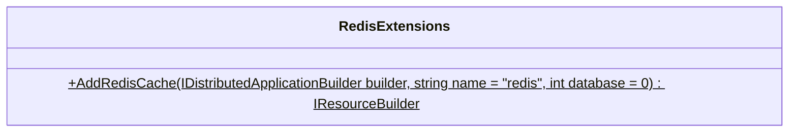

<div id="CacheAdminHelper-class-diagram"></div>

##### `CacheAdminHelper` class diagram

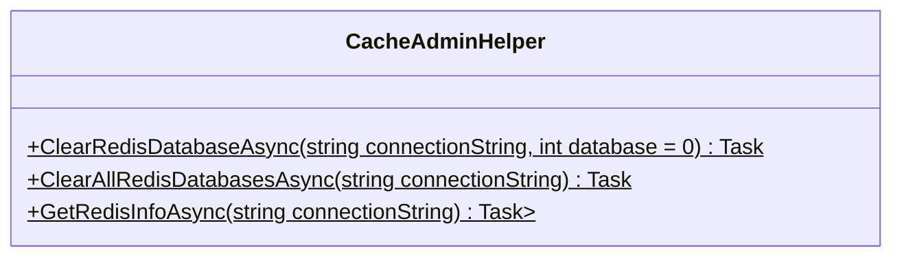

<div id="FakeCategory-class-diagram"></div>

##### `FakeCategory` class diagram

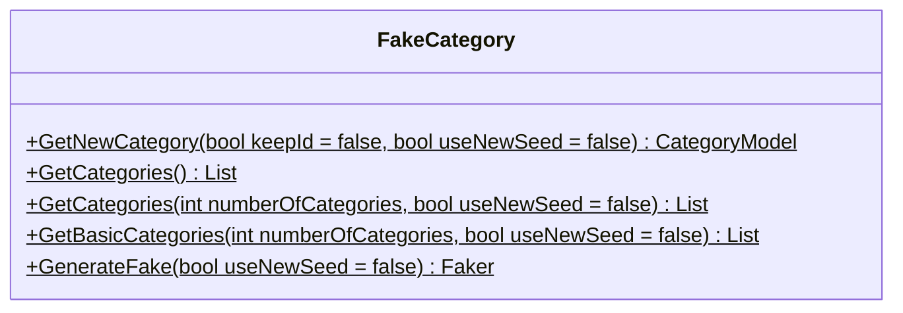

<div id="FakeComment-class-diagram"></div>

##### `FakeComment` class diagram

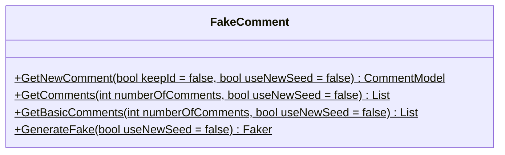

<div id="FakeIssue-class-diagram"></div>

##### `FakeIssue` class diagram

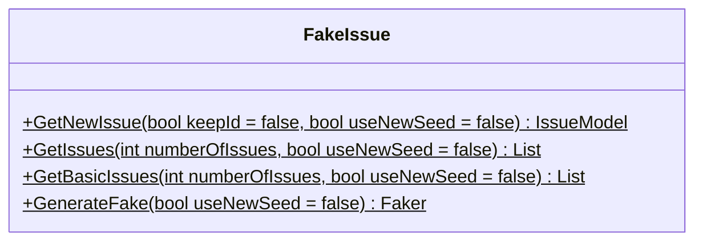

<div id="FakeStatus-class-diagram"></div>

##### `FakeStatus` class diagram

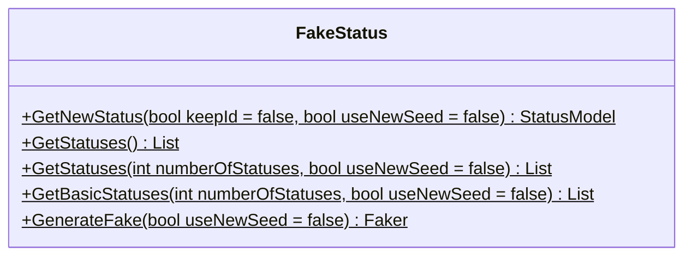

<div id="FakeUser-class-diagram"></div>

##### `FakeUser` class diagram

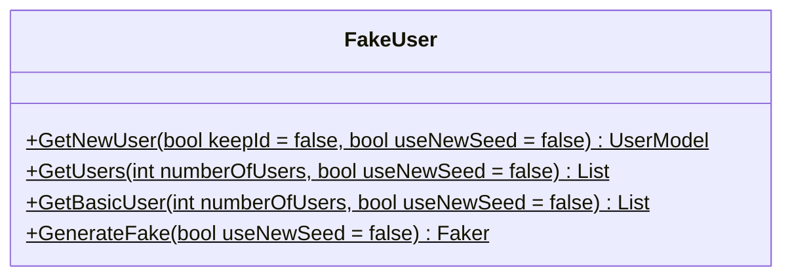

<div id="IDatabaseSettings-class-diagram"></div>

##### `IDatabaseSettings` class diagram

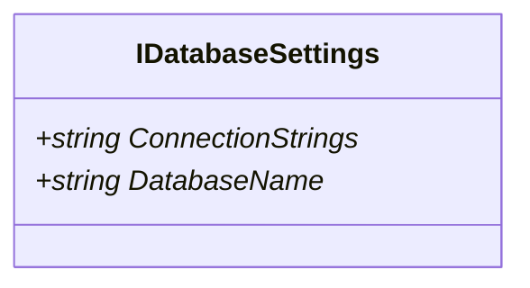

<div id="Enums.Category-class-diagram"></div>

##### `Enums.Category` class diagram

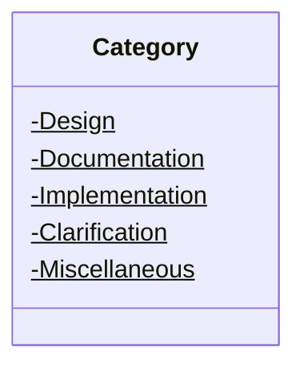

<div id="Enums-class-diagram"></div>

##### `Enums` class diagram

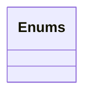

<div id="Enums.Status-class-diagram"></div>

##### `Enums.Status` class diagram

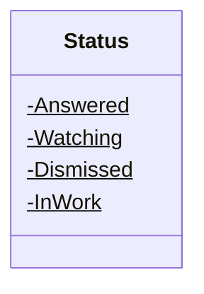

<div id="CollectionNames-class-diagram"></div>

##### `CollectionNames` class diagram

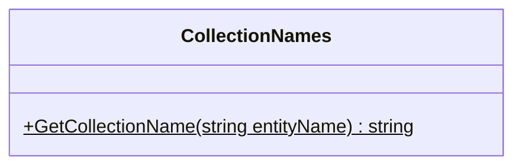

<div id="BasicCategoryModel-class-diagram"></div>

##### `BasicCategoryModel` class diagram

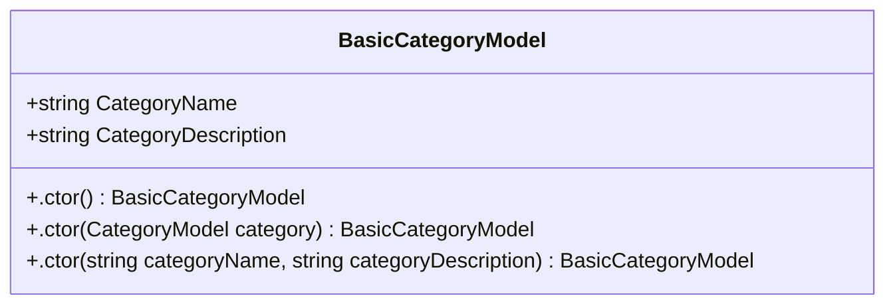

<div id="BasicCommentModel-class-diagram"></div>

##### `BasicCommentModel` class diagram

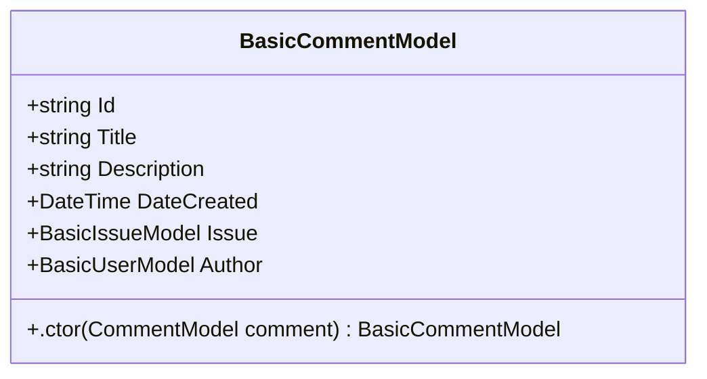

<div id="BasicIssueModel-class-diagram"></div>

##### `BasicIssueModel` class diagram

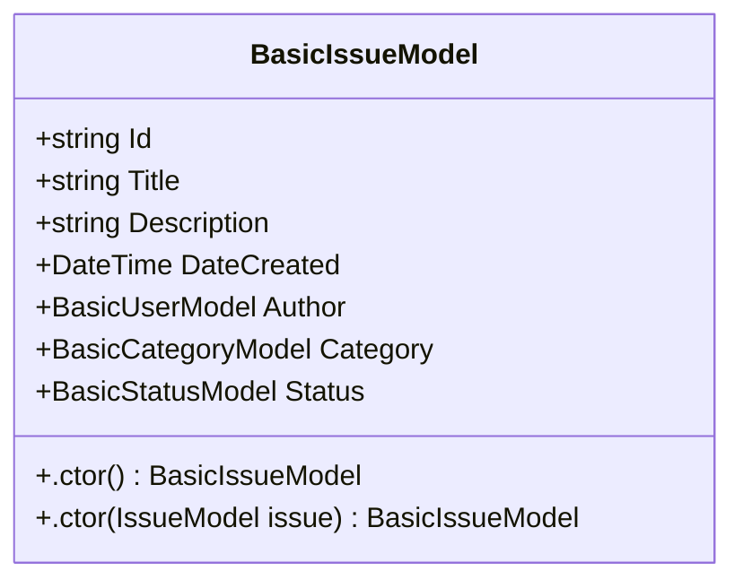

<div id="BasicStatusModel-class-diagram"></div>

##### `BasicStatusModel` class diagram

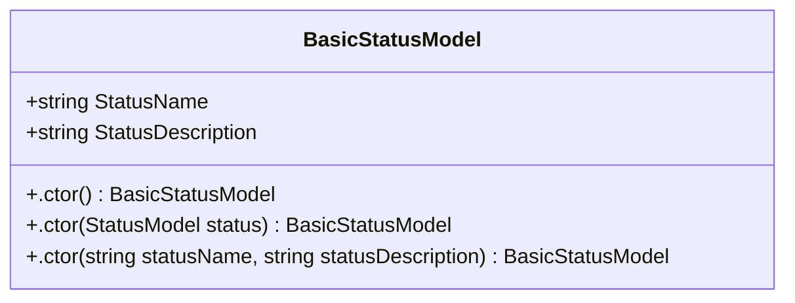

<div id="BasicUserModel-class-diagram"></div>

##### `BasicUserModel` class diagram

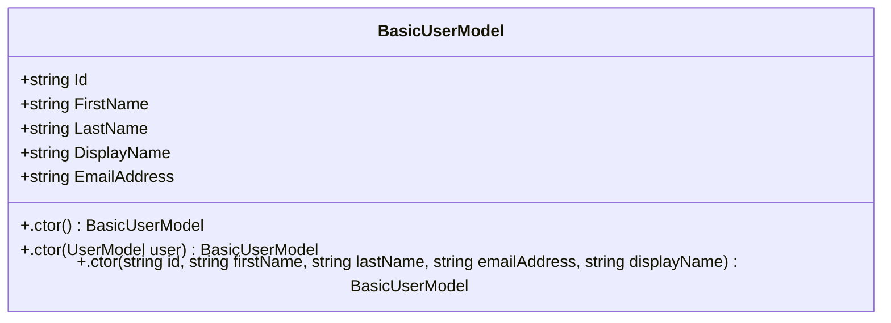

<div id="CategoryModel-class-diagram"></div>

##### `CategoryModel` class diagram

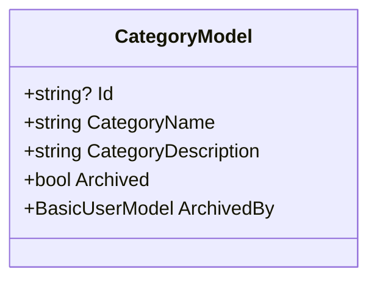

<div id="CommentModel-class-diagram"></div>

##### `CommentModel` class diagram

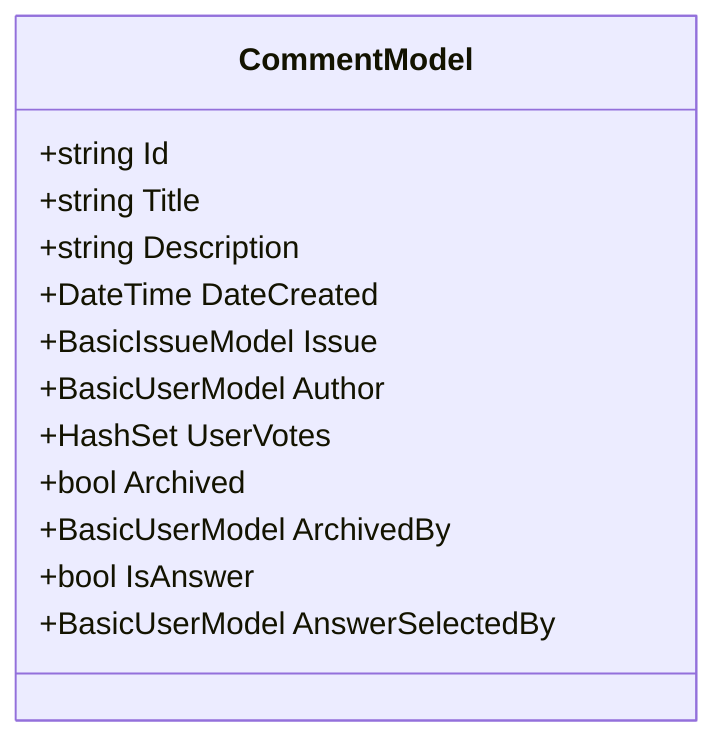

<div id="DatabaseSettings-class-diagram"></div>

##### `DatabaseSettings` class diagram

```mermaid
classDiagram
class DatabaseSettings{
    +string ConnectionStrings
    +string DatabaseName
    +.ctor() DatabaseSettings
    +.ctor(string connectionStrings, string databaseName) DatabaseSettings
}

```

<div id="IssueModel-class-diagram"></div>

##### `IssueModel` class diagram

```mermaid
classDiagram
class IssueModel{
    +string Id
    +string Title
    +string Description
    +DateTime DateCreated
    +BasicCategoryModel Category
    +BasicUserModel Author
    +BasicStatusModel IssueStatus
    +bool Archived
    +BasicUserModel ArchivedBy
    +bool ApprovedForRelease
    +bool Rejected
}

```

<div id="StatusModel-class-diagram"></div>

##### `StatusModel` class diagram

```mermaid
classDiagram
class StatusModel{
    +string Id
    +string StatusName
    +string StatusDescription
    +bool Archived
    +BasicUserModel ArchivedBy
}

```

<div id="UserModel-class-diagram"></div>

##### `UserModel` class diagram

```mermaid
classDiagram
class UserModel{
    +string Id
    +string ObjectIdentifier
    +string FirstName
    +string LastName
    +string DisplayName
    +string EmailAddress
    +bool Archived
    +BasicUserModel ArchivedBy
}

```

<div id="IMongoDbContextFactory-class-diagram"></div>

##### `IMongoDbContextFactory` class diagram

```mermaid
classDiagram
class IMongoDbContextFactory{
    +IMongoDatabase Database*
    +IMongoClient Client*
    +string ConnectionString*
    +string DbName*
    +GetCollection<T>(string name)* IMongoCollection<T>
}

```

<div id="CategoryRepository-class-diagram"></div>

##### `CategoryRepository` class diagram

```mermaid
classDiagram
class CategoryRepository{
}

```

<div id="CommentRepository-class-diagram"></div>

##### `CommentRepository` class diagram

```mermaid
classDiagram
class CommentRepository{
}

```

<div id="IssueRepository-class-diagram"></div>

##### `IssueRepository` class diagram

```mermaid
classDiagram
class IssueRepository{
}

```

<div id="MongoDbContextFactory-class-diagram"></div>

##### `MongoDbContextFactory` class diagram

```mermaid
classDiagram
class MongoDbContextFactory{
    +IMongoDatabase Database
    +IMongoClient Client
    +string ConnectionString
    +string DbName
    +.ctor(IDatabaseSettings settings) MongoDbContextFactory
    +GetCollection<T>(string? name) IMongoCollection<T>
}

```

<div id="StatusRepository-class-diagram"></div>

##### `StatusRepository` class diagram

```mermaid
classDiagram
class StatusRepository{
}

```

<div id="UserRepository-class-diagram"></div>

##### `UserRepository` class diagram

```mermaid
classDiagram
class UserRepository{
}

```

<div id="MongoDbHealthCheck-class-diagram"></div>

##### `MongoDbHealthCheck` class diagram

```mermaid
classDiagram
class MongoDbHealthCheck{
    -IMongoClient _client
    -TimeSpan Timeout$
    +.ctor(IMongoClient client) MongoDbHealthCheck
    +CheckHealthAsync(HealthCheckContext context, CancellationToken cancellationToken = null) Task<HealthCheckResult>
}

```

<div id="RedisHealthCheck-class-diagram"></div>

##### `RedisHealthCheck` class diagram

```mermaid
classDiagram
class RedisHealthCheck{
    -IConnectionMultiplexer _connection
    -TimeSpan Timeout$
    +.ctor(IConnectionMultiplexer connection) RedisHealthCheck
    +CheckHealthAsync(HealthCheckContext context, CancellationToken cancellationToken = null) Task<HealthCheckResult>
}

```

<div id="OpenTelemetryExtensions-class-diagram"></div>

##### `OpenTelemetryExtensions` class diagram

```mermaid
classDiagram
class OpenTelemetryExtensions{
    +AddOpenTelemetryExporters(IHostApplicationBuilder builder)$ IHostApplicationBuilder
}

```

<div id="CacheService-class-diagram"></div>

##### `CacheService` class diagram

```mermaid
classDiagram
class CacheService{
}

```

<div id="Extensions-class-diagram"></div>

##### `Extensions` class diagram

```mermaid
classDiagram
class Extensions{
    +AddServiceDefaults(IHostApplicationBuilder builder)$ IHostApplicationBuilder
    +MapDefaultEndpoints(WebApplication app)$ WebApplication
}

```

<div id="ICacheService-class-diagram"></div>

##### `ICacheService` class diagram

```mermaid
classDiagram
class ICacheService{
    +GetAsync<T>(string key)* Task<T?>
    +SetAsync<T>(string key, T value, TimeSpan? expiration = null)* Task
    +RemoveAsync(string key)* Task
}

```

<div id="CategoryService-class-diagram"></div>

##### `CategoryService` class diagram

```mermaid
classDiagram
class CategoryService{
}

```

<div id="CommentService-class-diagram"></div>

##### `CommentService` class diagram

```mermaid
classDiagram
class CommentService{
}

```

<div id="ICategoryService-class-diagram"></div>

##### `ICategoryService` class diagram

```mermaid
classDiagram
class ICategoryService{
    +ArchiveCategory(CategoryModel category)* Task
    +CreateCategory(CategoryModel category)* Task
    +GetCategory(string? categoryId)* Task<CategoryModel>
    +GetCategories()* Task<List<CategoryModel>>
    +UpdateCategory(CategoryModel category)* Task
}

```

<div id="ICommentService-class-diagram"></div>

##### `ICommentService` class diagram

```mermaid
classDiagram
class ICommentService{
    +ArchiveComment(CommentModel comment)* Task
    +CreateComment(CommentModel comment)* Task
    +GetComment(string commentId)* Task<CommentModel>
    +GetComments()* Task<List<CommentModel>>
    +GetCommentsByUser(string userId)* Task<List<CommentModel>>
    +GetCommentsByIssue(BasicIssueModel issue)* Task<List<CommentModel>>
    +UpdateComment(CommentModel comment)* Task
    +UpVoteComment(string commentId, string userId)* Task
}

```

<div id="IIssueService-class-diagram"></div>

##### `IIssueService` class diagram

```mermaid
classDiagram
class IIssueService{
    +ArchiveIssue(IssueModel issue)* Task
    +CreateIssue(IssueModel issue)* Task
    +GetIssue(string? issueId)* Task<IssueModel>
    +GetIssues()* Task<List<IssueModel>>
    +GetIssuesByUser(string userId)* Task<List<IssueModel>>
    +GetApprovedIssues()* Task<List<IssueModel>>
    +GetIssuesWaitingForApproval()* Task<List<IssueModel>>
    +UpdateIssue(IssueModel issue)* Task
}

```

<div id="IStatusService-class-diagram"></div>

##### `IStatusService` class diagram

```mermaid
classDiagram
class IStatusService{
    +ArchiveStatus(StatusModel status)* Task
    +CreateStatus(StatusModel status)* Task
    +GetStatus(string statusId)* Task<StatusModel>
    +GetStatuses()* Task<List<StatusModel>>
    +UpdateStatus(StatusModel status)* Task
}

```

<div id="IUserService-class-diagram"></div>

##### `IUserService` class diagram

```mermaid
classDiagram
class IUserService{
    +ArchiveUser(UserModel user)* Task
    +CreateUser(UserModel user)* Task
    +GetUser(string? userId)* Task<UserModel>
    +GetUserFromAuthentication(string? userObjectIdentifierId)* Task<UserModel>
    +GetUsers()* Task<List<UserModel>>
    +UpdateUser(UserModel user)* Task
}

```

<div id="IssueService-class-diagram"></div>

##### `IssueService` class diagram

```mermaid
classDiagram
class IssueService{
}

```

<div id="ICategoryRepository-class-diagram"></div>

##### `ICategoryRepository` class diagram

```mermaid
classDiagram
class ICategoryRepository{
    +ArchiveAsync(CategoryModel category)* Task
    +CreateAsync(CategoryModel category)* Task
    +GetAsync(string? itemId)* Task<CategoryModel>
    +GetAllAsync()* Task<IEnumerable<CategoryModel>>
    +UpdateAsync(string? itemId, CategoryModel category)* Task
}

```

<div id="ICommentRepository-class-diagram"></div>

##### `ICommentRepository` class diagram

```mermaid
classDiagram
class ICommentRepository{
    +ArchiveAsync(CommentModel comment)* Task
    +CreateAsync(CommentModel comment)* Task
    +GetAsync(string itemId)* Task<CommentModel>
    +GetAllAsync()* Task<IEnumerable<CommentModel>?>
    +GetByUserAsync(string userId)* Task<IEnumerable<CommentModel>>
    +GetByIssueAsync(BasicIssueModel issue)* Task<IEnumerable<CommentModel>>
    +UpdateAsync(string itemId, CommentModel comment)* Task
    +UpVoteAsync(string itemId, string userId)* Task
}

```

<div id="IIssueRepository-class-diagram"></div>

##### `IIssueRepository` class diagram

```mermaid
classDiagram
class IIssueRepository{
    +ArchiveAsync(IssueModel issue)* Task
    +CreateAsync(IssueModel issue)* Task
    +GetAsync(string itemId)* Task<IssueModel>
    +GetAllAsync()* Task<IEnumerable<IssueModel>>
    +GetApprovedAsync()* Task<IEnumerable<IssueModel>>
    +GetByUserAsync(string userId)* Task<IEnumerable<IssueModel>>
    +GetWaitingForApprovalAsync()* Task<IEnumerable<IssueModel>>
    +UpdateAsync(string itemId, IssueModel issue)* Task
}

```

<div id="IStatusRepository-class-diagram"></div>

##### `IStatusRepository` class diagram

```mermaid
classDiagram
class IStatusRepository{
    +ArchiveAsync(StatusModel status)* Task
    +CreateAsync(StatusModel status)* Task
    +GetAsync(string itemId)* Task<StatusModel>
    +GetAllAsync()* Task<IEnumerable<StatusModel>>
    +UpdateAsync(string itemId, StatusModel status)* Task
}

```

<div id="IUserRepository-class-diagram"></div>

##### `IUserRepository` class diagram

```mermaid
classDiagram
class IUserRepository{
    +ArchiveAsync(UserModel user)* Task
    +CreateAsync(UserModel user)* Task
    +GetAsync(string itemId)* Task<UserModel>
    +GetFromAuthenticationAsync(string userObjectIdentifierId)* Task<UserModel>
    +GetAllAsync()* Task<IEnumerable<UserModel>>
    +UpdateAsync(string itemId, UserModel user)* Task
}

```

<div id="StatusService-class-diagram"></div>

##### `StatusService` class diagram

```mermaid
classDiagram
class StatusService{
}

```

<div id="UserService-class-diagram"></div>

##### `UserService` class diagram

```mermaid
classDiagram
class UserService{
}

```

<div id="CommentComponent-class-diagram"></div>

##### `CommentComponent` class diagram

```mermaid
classDiagram
class CommentComponent{
    -CommentModel? _archivingComment
    +CommentModel Item
    +UserModel LoggedInUser
    +CanMarkAnswer() bool
    +VoteUp(CommentModel comment) Task
    +GetUpVoteTopText(CommentModel comment) string
    +GetUpVoteBottomText(CommentModel comment) string
    +GetVoteCssClass(CommentModel comment) string
    +ArchiveComment() Task
    +SetAnswer(CommentModel comment) Task
    +GetAnswerStatusCssClass(CommentModel comment)$ string
}

```

<div id="CommentCreateComponent-class-diagram"></div>

##### `CommentCreateComponent` class diagram

```mermaid
classDiagram
class CommentCreateComponent{
    -CreateCommentDto _comment
    +IssueModel Issue
    +UserModel LoggedInUser
    +CreateComment() Task
    +ClosePage() void
}

```

<div id="IssueComponent-class-diagram"></div>

##### `IssueComponent` class diagram

```mermaid
classDiagram
class IssueComponent{
    -IssueModel? _archivingIssue
    +IssueModel Item
    +UserModel LoggedInUser
    +GetIssueCategoryCssClass(IssueModel issue)$ string
    +GetIssueStatusCssClass(IssueModel issue)$ string
    +OpenDetailsPage(IssueModel issue) void
    +ArchiveIssue() Task
}

```

<div id="MyInputRadioGroup&lt;TValue&gt;-class-diagram"></div>

##### `MyInputRadioGroup<TValue>` class diagram

```mermaid
classDiagram
class MyInputRadioGroup<TValue>{
    -string? _fieldClass
    -string? _name
    +OnParametersSet() void
}

```

<div id="SetStatusComponent-class-diagram"></div>

##### `SetStatusComponent` class diagram

```mermaid
classDiagram
class SetStatusComponent{
    -string? _settingStatus
    -List<StatusModel> _statuses
    +IssueModel Issue
    +EventCallback<IssueModel> IssueChanged
    +OnInitializedAsync() Task
    +CompleteSetStatus() Task
    +SaveStatus() void
}

```

<div id="AllServicesToRegister-class-diagram"></div>

##### `AllServicesToRegister` class diagram

```mermaid
classDiagram
class AllServicesToRegister{
    +ConfigureServices(WebApplicationBuilder builder, ConfigurationManager config)$ void
}

```

<div id="ServiceCollectionExtensions-class-diagram"></div>

##### `ServiceCollectionExtensions` class diagram

```mermaid
classDiagram
class ServiceCollectionExtensions{
    +AddAuthenticationService(IServiceCollection services, ConfigurationManager config)$ IServiceCollection
    +AddAuthorizationService(IServiceCollection services)$ IServiceCollection
    +RegisterConnections(IServiceCollection services, ConfigurationManager config)$ IServiceCollection
    +RegisterDatabaseContext(IServiceCollection services)$ IServiceCollection
    +RegisterPlugInRepositories(IServiceCollection services)$ IServiceCollection
    +RegisterServicesCollections(IServiceCollection services)$ IServiceCollection
}

```

<div id="AuthenticationStateProviderHelpers-class-diagram"></div>

##### `AuthenticationStateProviderHelpers` class diagram

```mermaid
classDiagram
class AuthenticationStateProviderHelpers{
    +GetUserFromAuth(AuthenticationStateProvider provider, IUserService userData)$ Task<UserModel>
    +IsUserAdminAsync(AuthenticationStateProvider provider)$ Task<bool>
}

```

<div id="MongoHealthCheck-class-diagram"></div>

##### `MongoHealthCheck` class diagram

```mermaid
classDiagram
class MongoHealthCheck{
    -IMongoDbContextFactory _factory
    +.ctor(IMongoDbContextFactory factory) MongoHealthCheck
    +CheckHealthAsync(HealthCheckContext context, CancellationToken cancellationToken = null) Task<HealthCheckResult>
    +CheckMongoDbConnection() Task<bool>
}

```

<div id="CreateCommentDto-class-diagram"></div>

##### `CreateCommentDto` class diagram

```mermaid
classDiagram
class CreateCommentDto{
    +string? Title
    +string? Description
}

```

<div id="CreateIssueDto-class-diagram"></div>

##### `CreateIssueDto` class diagram

```mermaid
classDiagram
class CreateIssueDto{
    +string? Title
    +string? Description
    +string? CategoryId
}

```

<div id="Admin-class-diagram"></div>

##### `Admin` class diagram

```mermaid
classDiagram
class Admin{
    -string _currentEditingDescription
    -string _currentEditingTitle
    -string _editedDescription
    -string _editedTitle
    -List<IssueModel>? _issues
    +OnInitializedAsync() Task
    +ApproveIssue(IssueModel issue) Task
    +RejectIssue(IssueModel issue) Task
    +EditTitle(IssueModel model) void
    +SaveTitle(IssueModel model) Task
    +EditDescription(IssueModel model) void
    +SaveDescription(IssueModel model) Task
    +ClosePage() void
}

```

<div id="Categories-class-diagram"></div>

##### `Categories` class diagram

```mermaid
classDiagram
class Categories{
    -List<CategoryModel>? _categories
    -RadzenDataGrid<CategoryModel>? _categoriesGrid
    -CategoryModel? _categoryToInsert
    -CategoryModel? _categoryToUpdate
    +OnInitializedAsync() Task
    +EditRow(CategoryModel category) Task
    +OnUpdateRow(CategoryModel category) void
    +SaveRow(CategoryModel category) Task
    +CancelEdit(CategoryModel category) void
    +DeleteRow(CategoryModel category) Task
    +InsertRow() Task
    +OnCreateRow(CategoryModel category) void
    +ClosePage() void
}

```

<div id="Comment-class-diagram"></div>

##### `Comment` class diagram

```mermaid
classDiagram
class Comment{
    -CreateCommentDto _comment
    -IssueModel? _issue
    -UserModel? _loggedInUser
    +string? Id
    +OnInitializedAsync() Task
    +CreateComment() Task
    +OpenCommentForm(IssueModel issue) void
    +ClosePage() void
}

```

<div id="Create-class-diagram"></div>

##### `Create` class diagram

```mermaid
classDiagram
class Create{
    -List<CategoryModel>? _categories
    -CreateIssueDto _issue
    -UserModel? _loggedInUser
    -List<StatusModel>? _statuses
    +OnInitializedAsync() Task
    +CreateIssue() Task
    +ClosePage() void
}

```

<div id="Details-class-diagram"></div>

##### `Details` class diagram

```mermaid
classDiagram
class Details{
    -List<CommentModel>? _comments
    -IssueModel? _issue
    -UserModel? _loggedInUser
    +string? Id
    +OnInitializedAsync() Task
    +OpenCommentForm(IssueModel issue) void
    +ClosePage() void
}

```

<div id="ErrorModel-class-diagram"></div>

##### `ErrorModel` class diagram

```mermaid
classDiagram
class ErrorModel{
    +string RequestId
    +bool ShowRequestId
    +OnGet() void
}

```

<div id="Index-class-diagram"></div>

##### `Index` class diagram

```mermaid
classDiagram
class Index{
    -List<CategoryModel>? _categories
    -bool _isSortedByNew
    -List<IssueModel>? _issues
    -UserModel? _loggedInUser
    -string? _searchText
    -string? _selectedCategory
    -string? _selectedStatus
    -bool _showCategories
    -bool _showStatuses
    -List<StatusModel>? _statuses
    +OnInitializedAsync() Task
    +LoadCreateIssuePage() void
    +LoadAndVerifyUser() Task
    +OnAfterRenderAsync(bool firstRender) Task
    +LoadFilterState() Task
    +SaveFilterState() Task
    +FilterIssues() Task
    +OrderByNew(bool isNew) Task
    +OnSearchInput(string searchInput) Task
    +OnCategoryClick(string category = "All") Task
    +OnStatusClick(string status = "All") Task
    +SortedByNewCssClass(bool isNew) string
    +GetSelectedCategoryCssClass(string category = "All") string
    +GetSelectedStatusCssClass(string status = "All") string
}

```

<div id="Profile-class-diagram"></div>

##### `Profile` class diagram

```mermaid
classDiagram
class Profile{
    -List<IssueModel>? _approved
    -List<IssueModel>? _archived
    -List<CommentModel>? _comments
    -List<IssueModel>? _issues
    -UserModel? _loggedInUser
    -List<IssueModel>? _pending
    -List<IssueModel>? _rejected
    +OnInitializedAsync() Task
    +ClosePage() void
}

```

<div id="SampleData-class-diagram"></div>

##### `SampleData` class diagram

```mermaid
classDiagram
class SampleData{
    -bool _categoriesCreated
    -bool _commentsCreated
    -bool _issuesCreated
    -bool _statusesCreated
    -bool _usersCreated
    +OnInitializedAsync() Task
    +SetButtonStatus() Task
    +CreateUsers() Task
    +CreateCategories() Task
    +CreateStatuses() Task
    +CreateComments() Task
    +CreateIssues() Task
}

```

<div id="Statuses-class-diagram"></div>

##### `Statuses` class diagram

```mermaid
classDiagram
class Statuses{
    -List<StatusModel>? _statuses
    -RadzenDataGrid<StatusModel> _statusesGrid
    -StatusModel? _statusToInsert
    -StatusModel? _statusToUpdate
    +OnInitializedAsync() Task
    +EditRow(StatusModel status) Task
    +OnUpdateRow(StatusModel status) void
    +SaveRow(StatusModel status) Task
    +CancelEdit(StatusModel status) void
    +DeleteRow(StatusModel status) Task
    +InsertRow() Task
    +OnCreateRow(StatusModel status) void
    +ClosePage() void
}

```

<div id="NotAuthorized-class-diagram"></div>

##### `NotAuthorized` class diagram

```mermaid
classDiagram
class NotAuthorized{
    +ClosePage() void
}

```

<div id="IAppMarker-class-diagram"></div>

##### `IAppMarker` class diagram

```mermaid
classDiagram
class IAppMarker{
}

```

<div id="CacheAdminHelperTests-class-diagram"></div>

##### `CacheAdminHelperTests` class diagram

```mermaid
classDiagram
class CacheAdminHelperTests{
    +ClearRedisDatabaseAsync_WithNullConnectionString_ThrowsArgumentException() Task
    +ClearRedisDatabaseAsync_WithEmptyConnectionString_ThrowsArgumentException() Task
    +ClearRedisDatabaseAsync_WithNegativeDatabase_ThrowsArgumentException() Task
    +ClearAllRedisDatabasesAsync_WithNullConnectionString_ThrowsArgumentException() Task
    +ClearAllRedisDatabasesAsync_WithEmptyConnectionString_ThrowsArgumentException() Task
    +GetRedisInfoAsync_WithNullConnectionString_ThrowsArgumentException() Task
    +GetRedisInfoAsync_WithEmptyConnectionString_ThrowsArgumentException() Task
}

```

<div id="MongoDBHostingExtensionsTests-class-diagram"></div>

##### `MongoDBHostingExtensionsTests` class diagram

```mermaid
classDiagram
class MongoDBHostingExtensionsTests{
    +AddMongoDBWithManagement_CreatesMongoDBResource_WithCorrectName() void
    +AddMongoDBWithManagement_CreatesMongoDBResource_WithDefaultDatabase() void
    +AddMongoDBWithManagement_CreatesMongoDBResource_WithCustomDatabaseName() void
    +AddMongoDBWithManagement_ThrowsArgumentNullException_WhenBuilderIsNull() void
    +AddMongoDBWithManagement_ThrowsArgumentException_WhenNameIsNullOrWhitespace(string? name) void
    +AddMongoDBWithManagement_ThrowsArgumentException_WhenDatabaseNameIsNullOrWhitespace(string? databaseName) void
    +AddMongoDBWithManagement_AddsHealthCheckAnnotation() void
    +AddMongoDBWithManagement_AddsDataVolumeAnnotation() void
}

```

<div id="RedisExtensionsTests-class-diagram"></div>

##### `RedisExtensionsTests` class diagram

```mermaid
classDiagram
class RedisExtensionsTests{
    +AddRedisCache_WithValidBuilder_ReturnsResourceBuilder() void
    +AddRedisCache_WithCustomName_ReturnsResourceBuilderWithCustomName() void
    +AddRedisCache_WithCustomDatabase_ReturnsResourceBuilder() void
    +AddRedisCache_WithNullBuilder_ThrowsArgumentNullException() void
    +AddRedisCache_WithNullName_ThrowsArgumentException() void
    +AddRedisCache_WithEmptyName_ThrowsArgumentException() void
    +AddRedisCache_WithNegativeDatabase_ThrowsArgumentException() void
    +AddRedisCache_WithoutName_UsesDefaultName() void
    +AddRedisCache_WithoutDatabase_UsesDefaultDatabase() void
    +AddRedisCache_AddsHealthCheckAnnotation() void
    +AddRedisCache_AddsDataVolumeAnnotation() void
    +AddRedisCache_AddsCommandAnnotations() void
}

```

<div id="ArchitectureTests-class-diagram"></div>

##### `ArchitectureTests` class diagram

```mermaid
classDiagram
class ArchitectureTests{
    +AppHost_MustNotBeReferencedByOtherProjects() void
    +UI_ShouldNotDependOnAppHost() void
    +ServiceDefaults_MustHaveNoCircularDependencies() void
    +CoreBusiness_ShouldNotDependOnUIOrAppHost() void
}

```

<div id="CacheIntegrationTests-class-diagram"></div>

##### `CacheIntegrationTests` class diagram

```mermaid
classDiagram
class CacheIntegrationTests{
    +CreateCacheService()$ ICacheService
    +Cache_Service_Operations_Work_End_To_End() Task
    +Redis_And_MongoDB_Container_Integration() Task
    +Cache_TTL_Integration_Validated() Task
    +Multiple_Concurrent_Cache_Operations_Succeed() Task
    +RetrieveAndValidateAsync(ICacheService cacheService, int index)$ Task
    +Cache_Service_Handles_Corrupted_Entries_Gracefully() Task
    +Cache_Performance_Meets_Baseline() Task
    +Cache_Service_Handles_Null_Values() Task
    +Cache_Service_Throws_On_Invalid_Keys() Task
    +ServiceDefaults_Registers_ICacheService() void
    +Cache_Serializes_And_Deserializes_Complex_Objects() Task
    +Cache_Maintains_Multiple_Values() Task
}

```

<div id="CacheIntegrationTests.InMemoryDistributedCacheForTest-class-diagram"></div>

##### `CacheIntegrationTests.InMemoryDistributedCacheForTest` class diagram

```mermaid
classDiagram
class InMemoryDistributedCacheForTest{
    -Dictionary<string, (byte[] value, DateTime? expiration)> _cache
    +Get(string key) byte[]?
    +GetAsync(string key, CancellationToken token = null) Task<byte[]?>
    +Set(string key, byte[] value, DistributedCacheEntryOptions options) void
    +SetAsync(string key, byte[] value, DistributedCacheEntryOptions options, CancellationToken token = null) Task
    +Remove(string key) void
    +RemoveAsync(string key, CancellationToken token = null) Task
    +Refresh(string key) void
    +RefreshAsync(string key, CancellationToken token = null) Task
}

```

<div id="CacheIntegrationTests.TestCacheObject-class-diagram"></div>

##### `CacheIntegrationTests.TestCacheObject` class diagram

```mermaid
classDiagram
class TestCacheObject{
    +int Id
    +string? Name
    +DateTime CreatedAt
}

```

<div id="CacheIntegrationTests.TestLogger&lt;T&gt;-class-diagram"></div>

##### `CacheIntegrationTests.TestLogger<T>` class diagram

```mermaid
classDiagram
class TestLogger<T>{
    +List<(LogLevel, string)> Logs
    +BeginScope<TState>(TState state) IDisposable?
    +IsEnabled(LogLevel logLevel) bool
    +Log<TState>(LogLevel logLevel, EventId eventId, TState state, Exception? exception, Func<TState, Exception?, string> formatter) void
}

```

<div id="FakeCategoryTests-class-diagram"></div>

##### `FakeCategoryTests` class diagram

```mermaid
classDiagram
class FakeCategoryTests{
    +GetNewCategory_With_Boolean_Value_Should_Return_With_Or_Without_An_Id_Test(bool expected) void
    +GetNewCategory_Using_NewSeed_SetTrue_Should_ReturnRandomValues_Test(bool expected) void
    +GetCategories_With_No_Variable_Should_Return_A_List_Of_Categories_Test() void
    +GetCategories_With_RequestForCategories_Should_ReturnFakeCategories_Test(int countRequested) void
    +GetCategories_With_UseNewSeed_Should_ReturnFakeCategoriesThatAreDifferent_Test(int countRequested) void
    +GetBasicCategories_With_RequestForBasicCategories_Should_ReturnFakeBasicCategories_Test() void
    +GetBasicCategories_With_UseNewSeed_Should_ReturnFakeBasicCategories_Test() void
    +GenerateFake_Should_ReturnFakerInstance_Test() void
}

```

<div id="FakeCommentsTests-class-diagram"></div>

##### `FakeCommentsTests` class diagram

```mermaid
classDiagram
class FakeCommentsTests{
    +GetNewComment_With_Boolean_Should_Return_With_Or_Without_An_Id_Test(bool expected) void
    +GetComments_With_RequestForComments_Should_ReturnFakeComments_Test(int expectedCount) void
    +GetBasicComments_With_RequestForBasicComments_Should_ReturnFakeBasicComments_Test(int expectedCount) void
    +GetNewComment_With_Boolean_WithNewSeed_Should_Return_With_Or_Without_An_Id_Test(bool expected) void
    +GetComments_With_RequestForCommentsWithNewSeed_Should_ReturnFakeComments_Test(int expectedCount) void
    +GetBasicComments_With_RequestForBasicCommentsWithNewSeed_Should_ReturnFakeBasicComments_Test(int expectedCount) void
}

```

<div id="FakeIssuesTests-class-diagram"></div>

##### `FakeIssuesTests` class diagram

```mermaid
classDiagram
class FakeIssuesTests{
    +GetNewIssue_With_Boolean_Should_Return_With_Or_Without_An_Id_Test(bool expected) void
    +GetIssues_With_RequestForIssues_Should_ReturnFakeIssues_Test(int expectedCount) void
    +GetBasicIssues_With_RequestForBasicIssues_Should_ReturnFakeBasicIssues_Test(int expectedCount) void
    +GetNewIssue_With_BooleanWithNewSeed_Should_Return_With_Or_Without_An_Id_Test(bool expected) void
    +GetIssues_With_RequestForIssuesWithNewSeed_Should_ReturnFakeIssues_Test(int expectedCount) void
    +GetBasicIssues_With_RequestForBasicIssuesWithNewSeed_Should_ReturnFakeBasicIssues_Test(int expectedCount) void
}

```

<div id="FakeStatusTests-class-diagram"></div>

##### `FakeStatusTests` class diagram

```mermaid
classDiagram
class FakeStatusTests{
    +GetNewStatus_With_Boolean_Should_Return_With_Or_Without_An_Id_Test(bool expected) void
    +GetStatuses_With_No_Variable_Should_Return_A_List_Of_Statuses_Test() void
    +GetStatuses_With_NumberNeeded_Should_ReturnStatuses_Test(int expectedCount) void
    +GetBasicStatuses_With_RequestForBasicStatuses_Should_ReturnFakeBasicStatuses_Test(int expectedCount) void
    +GetNewStatus_With_BooleanAndWithNewSeed_Should_Return_With_Or_Without_An_Id_Test(bool expected) void
    +GetStatuses_With_NumberNeededAndWithNewSeed_Should_ReturnStatuses_Test(int expectedCount) void
    +GetBasicStatuses_With_RequestForBasicStatusesWithNewSeed_Should_ReturnFakeBasicStatuses_Test(int expectedCount) void
}

```

<div id="FakeUserTests-class-diagram"></div>

##### `FakeUserTests` class diagram

```mermaid
classDiagram
class FakeUserTests{
    +GetNewUser_With_Boolean_Should_Return_With_Or_Without_An_Id_Test(bool expected) void
    +GetUser_WhenUserRequested_Returns_FakeUser_Test(int expectedCount) void
    +GetBasicUser_WhenBasicUserRequested_Returns_FakeBasicUser_Test(int expectedCount) void
    +GetNewUser_With_BooleanAndWithNewSeed_Should_Return_With_Or_Without_An_Id_Test(bool expected) void
    +GetUser_With_NumberRequestedAndWithNewSeed_Returns_FakeUser_Test(int expectedCount) void
    +GetBasicUser_With_NumberRequestedAndWithNewSeed_Returns_FakeBasicUser_Test(int expectedCount) void
}

```

<div id="CollectionNamesTests-class-diagram"></div>

##### `CollectionNamesTests` class diagram

```mermaid
classDiagram
class CollectionNamesTests{
    +GetCollectionName_WithValidInput_Should_ReturnExpectedValue(string entityName, string expected) void
}

```

<div id="BasicCategoryModelTests-class-diagram"></div>

##### `BasicCategoryModelTests` class diagram

```mermaid
classDiagram
class BasicCategoryModelTests{
    +BasicCategoryModel_With_CategoryModel_Test() void
    +BasicCategoryModel_With_Values_Test() void
}

```

<div id="BasicCommentModelTests-class-diagram"></div>

##### `BasicCommentModelTests` class diagram

```mermaid
classDiagram
class BasicCommentModelTests{
    +BasicCommentModel_With_Comment_Should_Return_A_BasicComment_Test() void
}

```

<div id="BasicStatusModelTests-class-diagram"></div>

##### `BasicStatusModelTests` class diagram

```mermaid
classDiagram
class BasicStatusModelTests{
    +BasicStatusModel_With_AStatus_Should_BeValid_Test() void
    +BasicStatusModel_With_AStatusNameAndAStatusDescription_Should_BeValid_Test() void
}

```

<div id="CommentModelTests-class-diagram"></div>

##### `CommentModelTests` class diagram

```mermaid
classDiagram
class CommentModelTests{
    +Test_GetId_ReturnsString() void
    +Test_GetTitle_ReturnsString() void
    +Test_GetDescription_ReturnsString() void
    +Test_GetDateCreated_ReturnsDateTime() void
    +Test_GetIssue_ReturnsIssueModel() void
    +Test_GetAuthor_ReturnsBasicUserModel() void
    +Test_GetUserVotes_ReturnsHashSetString() void
    +Test_GetArchived_ReturnsBoolean(bool expected) void
    +Test_GetArchivedBy_ReturnsBasicUserModel() void
    +Test_GetIsAnswer_ReturnsBoolean(bool expected) void
    +Test_GetAnswerSelectedBy_ReturnsBasicUserModel() void
}

```

<div id="DatabaseSettingsTests-class-diagram"></div>

##### `DatabaseSettingsTests` class diagram

```mermaid
classDiagram
class DatabaseSettingsTests{
    +CreateDatabaseSettings(string expectedCs, string expectedDbName)$ DatabaseSettings
    +CreateDatabaseSettings_With_Valid_Data_Should_Be_Successful_Test() void
    +GetDatabaseSettings_With_Valid_Data_Should_Be_Successful_Test() void
}

```

<div id="ArchiveCategoryTests-class-diagram"></div>

##### `ArchiveCategoryTests` class diagram

```mermaid
classDiagram
class ArchiveCategoryTests{
    -string CleanupValue$
    -IssueTrackerTestFactory _factory
    -CategoryRepository _sut
    +.ctor(IssueTrackerTestFactory factory) ArchiveCategoryTests
    +InitializeAsync() Task
    +DisposeAsync() Task
    +ArchiveAsync_With_ValidData_Should_ArchiveACategory_TestAsync() Task
}

```

<div id="ArchiveCommentTests-class-diagram"></div>

##### `ArchiveCommentTests` class diagram

```mermaid
classDiagram
class ArchiveCommentTests{
    -string CleanupValue$
    -IssueTrackerTestFactory _factory
    -CommentRepository _sut
    +.ctor(IssueTrackerTestFactory factory) ArchiveCommentTests
    +InitializeAsync() Task
    +DisposeAsync() Task
    +ArchiveAsync_With_ValidData_Should_ArchiveAComment_TestAsync() Task
}

```

<div id="ArchiveIssueTests-class-diagram"></div>

##### `ArchiveIssueTests` class diagram

```mermaid
classDiagram
class ArchiveIssueTests{
    -string CleanupValue$
    -IssueTrackerTestFactory _factory
    -IssueRepository _sut
    +.ctor(IssueTrackerTestFactory factory) ArchiveIssueTests
    +InitializeAsync() Task
    +DisposeAsync() Task
    +ArchiveAsync_With_ValidData_Should_ArchiveAIssue_TestAsync() Task
}

```

<div id="ArchiveStatusTests-class-diagram"></div>

##### `ArchiveStatusTests` class diagram

```mermaid
classDiagram
class ArchiveStatusTests{
    -string CleanupValue$
    -IssueTrackerTestFactory _factory
    -StatusRepository _sut
    +.ctor(IssueTrackerTestFactory factory) ArchiveStatusTests
    +InitializeAsync() Task
    +DisposeAsync() Task
    +ArchiveAsync_With_ValidData_Should_ArchiveAStatus_TestAsync() Task
}

```

<div id="ArchiveUserTests-class-diagram"></div>

##### `ArchiveUserTests` class diagram

```mermaid
classDiagram
class ArchiveUserTests{
    -string CleanupValue$
    -IssueTrackerTestFactory _factory
    -UserRepository _sut
    +.ctor(IssueTrackerTestFactory factory) ArchiveUserTests
    +InitializeAsync() Task
    +DisposeAsync() Task
    +ArchiveAsync_With_ValidData_Should_ArchiveAUser_TestAsync() Task
}

```

<div id="CreateCategoryTests-class-diagram"></div>

##### `CreateCategoryTests` class diagram

```mermaid
classDiagram
class CreateCategoryTests{
    -string CleanupValue$
    -IssueTrackerTestFactory _factory
    -CategoryRepository _sut
    +.ctor(IssueTrackerTestFactory factory) CreateCategoryTests
    +InitializeAsync() Task
    +DisposeAsync() Task
    +CreateAsync_With_ValidData_Should_CreateACategory_TestAsync() Task
    +CreateAsync_With_InValidData_Should_FailToCreateACategory_TestAsync() Task
}

```

<div id="CreateCommentTests-class-diagram"></div>

##### `CreateCommentTests` class diagram

```mermaid
classDiagram
class CreateCommentTests{
    -string CleanupValue$
    -IssueTrackerTestFactory _factory
    -CommentRepository _sut
    +.ctor(IssueTrackerTestFactory factory) CreateCommentTests
    +InitializeAsync() Task
    +DisposeAsync() Task
    +CreateComment_With_ValidData_Should_CreateAComment_TestAsync() Task
    +CreateComment_With_InValidData_Should_FailToCreateAComment_TestAsync() Task
}

```

<div id="CreateIssueTests-class-diagram"></div>

##### `CreateIssueTests` class diagram

```mermaid
classDiagram
class CreateIssueTests{
    -string CleanupValue$
    -IssueTrackerTestFactory _factory
    -IssueRepository _sut
    +.ctor(IssueTrackerTestFactory factory) CreateIssueTests
    +InitializeAsync() Task
    +DisposeAsync() Task
    +CreateAsync_With_ValidData_Should_CreateAIssue_TestAsync() Task
    +CreateAsync_With_InValidData_Should_FailToCreateAIssue_TestAsync() Task
}

```

<div id="CreateStatusTests-class-diagram"></div>

##### `CreateStatusTests` class diagram

```mermaid
classDiagram
class CreateStatusTests{
    -string CleanupValue$
    -IssueTrackerTestFactory _factory
    -StatusRepository _sut
    +.ctor(IssueTrackerTestFactory factory) CreateStatusTests
    +InitializeAsync() Task
    +DisposeAsync() Task
    +CreateAsync_With_ValidData_Should_CreateAStatus_TestAsync() Task
    +CreateAsync_With_InValidData_Should_FailToCreateAStatus_TestAsync() Task
}

```

<div id="CreateUserTests-class-diagram"></div>

##### `CreateUserTests` class diagram

```mermaid
classDiagram
class CreateUserTests{
    -string CleanupValue$
    -IssueTrackerTestFactory _factory
    -UserRepository _sut
    +.ctor(IssueTrackerTestFactory factory) CreateUserTests
    +InitializeAsync() Task
    +DisposeAsync() Task
    +CreateAsync_With_ValidData_Should_CreateAUser_TestAsync() Task
    +CreateAsync_With_InValidData_Should_FailToCreateAUser_TestAsync() Task
}

```

<div id="GetApprovedIssuesTests-class-diagram"></div>

##### `GetApprovedIssuesTests` class diagram

```mermaid
classDiagram
class GetApprovedIssuesTests{
    -string CleanupValue$
    -IssueTrackerTestFactory _factory
    -IssueRepository _sut
    +.ctor(IssueTrackerTestFactory factory) GetApprovedIssuesTests
    +InitializeAsync() Task
    +DisposeAsync() Task
    +GetApprovedIssues_With_ValidData_Should_ReturnIssues_Test() Task
}

```

<div id="GetCategoriesTests-class-diagram"></div>

##### `GetCategoriesTests` class diagram

```mermaid
classDiagram
class GetCategoriesTests{
    -string CleanupValue$
    -IssueTrackerTestFactory _factory
    -CategoryRepository _sut
    +.ctor(IssueTrackerTestFactory factory) GetCategoriesTests
    +InitializeAsync() Task
    +DisposeAsync() Task
    +GetAllAsync_With_ValidData_Should_ReturnCategories_Test() Task
}

```

<div id="GetCategoryTests-class-diagram"></div>

##### `GetCategoryTests` class diagram

```mermaid
classDiagram
class GetCategoryTests{
    -string CleanupValue$
    -IssueTrackerTestFactory _factory
    -CategoryRepository _sut
    +.ctor(IssueTrackerTestFactory factory) GetCategoryTests
    +InitializeAsync() Task
    +DisposeAsync() Task
    +GetAsync_With_WithData_Should_Return_A_Valid_Category_TestAsync() Task
    +GetAsync_With_WithoutData_Should_Return_Nothing_TestAsync(string? value) Task
}

```

<div id="GetCommentsByIssueTests-class-diagram"></div>

##### `GetCommentsByIssueTests` class diagram

```mermaid
classDiagram
class GetCommentsByIssueTests{
    -string CleanupValue$
    -IssueTrackerTestFactory _factory
    -CommentRepository _sut
    +.ctor(IssueTrackerTestFactory factory) GetCommentsByIssueTests
    +InitializeAsync() Task
    +DisposeAsync() Task
    +GetByIssueAsync_With_ValidData_Should_ReturnValidComment_Test() Task
}

```

<div id="GetCommentsByUserTests-class-diagram"></div>

##### `GetCommentsByUserTests` class diagram

```mermaid
classDiagram
class GetCommentsByUserTests{
    -string CleanupValue$
    -IssueTrackerTestFactory _factory
    -CommentRepository _sut
    +.ctor(IssueTrackerTestFactory factory) GetCommentsByUserTests
    +InitializeAsync() Task
    +DisposeAsync() Task
    +GetByUserAsync_With_ValidData_Should_ReturnValidComment_Test() Task
}

```

<div id="GetCommentsTests-class-diagram"></div>

##### `GetCommentsTests` class diagram

```mermaid
classDiagram
class GetCommentsTests{
    -string CleanupValue$
    -IssueTrackerTestFactory _factory
    -CommentRepository _sut
    +.ctor(IssueTrackerTestFactory factory) GetCommentsTests
    +InitializeAsync() Task
    +DisposeAsync() Task
    +GetComments_With_ValidData_Should_ReturnComments_Test() Task
}

```

<div id="GetCommentTests-class-diagram"></div>

##### `GetCommentTests` class diagram

```mermaid
classDiagram
class GetCommentTests{
    -string CleanupValue$
    -IssueTrackerTestFactory _factory
    -CommentRepository _sut
    +.ctor(IssueTrackerTestFactory factory) GetCommentTests
    +InitializeAsync() Task
    +DisposeAsync() Task
    +GetComment_With_WithData_Should_ReturnAValidComment_TestAsync() Task
    +GetComment_With_WithoutData_Should_ReturnNothing_TestAsync() Task
    +GetComment_With_Empty_Id_Should_ThrowArgumentException_Test() Task
}

```

<div id="GetIssuesByUserTests-class-diagram"></div>

##### `GetIssuesByUserTests` class diagram

```mermaid
classDiagram
class GetIssuesByUserTests{
    -string CleanupValue$
    -IssueTrackerTestFactory _factory
    -IssueRepository _sut
    +.ctor(IssueTrackerTestFactory factory) GetIssuesByUserTests
    +InitializeAsync() Task
    +DisposeAsync() Task
    +GetByUserAsync_With_ValidData_Should_ReturnIssues_Test() Task
}

```

<div id="GetIssuesTests-class-diagram"></div>

##### `GetIssuesTests` class diagram

```mermaid
classDiagram
class GetIssuesTests{
    -string CleanupValue$
    -IssueTrackerTestFactory _factory
    -IssueRepository _sut
    +.ctor(IssueTrackerTestFactory factory) GetIssuesTests
    +InitializeAsync() Task
    +DisposeAsync() Task
    +GetAllAsync_With_ValidData_Should_ReturnIssues_Test() Task
}

```

<div id="GetIssuesWaitingForApprovalTests-class-diagram"></div>

##### `GetIssuesWaitingForApprovalTests` class diagram

```mermaid
classDiagram
class GetIssuesWaitingForApprovalTests{
    -string CleanupValue$
    -IssueTrackerTestFactory _factory
    -IssueRepository _sut
    +.ctor(IssueTrackerTestFactory factory) GetIssuesWaitingForApprovalTests
    +InitializeAsync() Task
    +DisposeAsync() Task
    +GetIssuesWaitingForApproval_With_ValidData_Should_ReturnIssues_Test() Task
}

```

<div id="GetIssueTests-class-diagram"></div>

##### `GetIssueTests` class diagram

```mermaid
classDiagram
class GetIssueTests{
    -string CleanupValue$
    -IssueTrackerTestFactory _factory
    -IssueRepository _sut
    +.ctor(IssueTrackerTestFactory factory) GetIssueTests
    +InitializeAsync() Task
    +DisposeAsync() Task
    +GetAsync_With_Data_Should_ReturnAValidIssue_TestAsync() Task
    +GetAsync_WithOutData_Should_Return_Nothing_TestAsync(string? value) Task
}

```

<div id="GetStatusesTests-class-diagram"></div>

##### `GetStatusesTests` class diagram

```mermaid
classDiagram
class GetStatusesTests{
    -string CleanupValue$
    -IssueTrackerTestFactory _factory
    -StatusRepository _sut
    +.ctor(IssueTrackerTestFactory factory) GetStatusesTests
    +InitializeAsync() Task
    +DisposeAsync() Task
    +GetAllAsync_With_ValidData_Should_ReturnStatuses_Test() Task
}

```

<div id="GetStatusTests-class-diagram"></div>

##### `GetStatusTests` class diagram

```mermaid
classDiagram
class GetStatusTests{
    -string CleanupValue$
    -IssueTrackerTestFactory _factory
    -StatusRepository _sut
    +.ctor(IssueTrackerTestFactory factory) GetStatusTests
    +InitializeAsync() Task
    +DisposeAsync() Task
    +GetAsync_With_WithData_Should_ReturnAValidStatus_TestAsync() Task
    +GetAsync_With_WithoutData_Should_ReturnNothing_TestAsync(string? value) Task
}

```

<div id="GetUserFromAuthenticationTests-class-diagram"></div>

##### `GetUserFromAuthenticationTests` class diagram

```mermaid
classDiagram
class GetUserFromAuthenticationTests{
    -string CleanupValue$
    -IssueTrackerTestFactory _factory
    -UserRepository _sut
    +.ctor(IssueTrackerTestFactory factory) GetUserFromAuthenticationTests
    +InitializeAsync() Task
    +DisposeAsync() Task
    +GetFromAuthenticationAsync_With_ValidData_Should_ReturnAUser_Test() Task
}

```

<div id="GetUsersTests-class-diagram"></div>

##### `GetUsersTests` class diagram

```mermaid
classDiagram
class GetUsersTests{
    -string CleanupValue$
    -IssueTrackerTestFactory _factory
    -UserRepository _sut
    +.ctor(IssueTrackerTestFactory factory) GetUsersTests
    +InitializeAsync() Task
    +DisposeAsync() Task
    +GetAllAsync_With_ValidData_Should_ReturnUsers_Test() Task
}

```

<div id="GetUserTests-class-diagram"></div>

##### `GetUserTests` class diagram

```mermaid
classDiagram
class GetUserTests{
    -string CleanupValue$
    -IssueTrackerTestFactory _factory
    -UserRepository _sut
    +.ctor(IssueTrackerTestFactory factory) GetUserTests
    +InitializeAsync() Task
    +DisposeAsync() Task
    +GetAsync_With_WithData_Should_ReturnAValidUser_TestAsync() Task
    +GetAsync_With_WithoutData_Should_ReturnNothing_TestAsync(string? value) Task
}

```

<div id="MongoDbContextFactoryTests-class-diagram"></div>

##### `MongoDbContextFactoryTests` class diagram

```mermaid
classDiagram
class MongoDbContextFactoryTests{
    -string CleanupValue$
    -IssueTrackerTestFactory _factory
    -IMongoDbContextFactory _dbContext
    +.ctor(IssueTrackerTestFactory factory) MongoDbContextFactoryTests
    +InitializeAsync() Task
    +DisposeAsync() Task
    +GetCollection_With_Valid_DbContext_Should_Return_Value_Test() void
    +ConnectionStateReturnsOpen() void
    +Be_healthy_if_mongodb_is_available() Task
}

```

<div id="UpdateCategoryTests-class-diagram"></div>

##### `UpdateCategoryTests` class diagram

```mermaid
classDiagram
class UpdateCategoryTests{
    -string CleanupValue$
    -IssueTrackerTestFactory _factory
    -CategoryRepository _sut
    +.ctor(IssueTrackerTestFactory factory) UpdateCategoryTests
    +InitializeAsync() Task
    +DisposeAsync() Task
    +UpdateAsync_With_ValidData_Should_UpdateTheCategory_Test() Task
    +UpdateAsync_With_WithInValidData_Should_ThrowArgumentNullException_Test() Task
}

```

<div id="UpdateCommentTests-class-diagram"></div>

##### `UpdateCommentTests` class diagram

```mermaid
classDiagram
class UpdateCommentTests{
    -string CleanupValue$
    -IssueTrackerTestFactory _factory
    -CommentRepository _sut
    +.ctor(IssueTrackerTestFactory factory) UpdateCommentTests
    +InitializeAsync() Task
    +DisposeAsync() Task
    +UpdateAsync_With_ValidData_Should_UpdateTheComment_Test() Task
    +UpdateAsync_With_WithInValidData_Should_ThrowArgumentNullException_Test() Task
}

```

<div id="UpdateIssueTests-class-diagram"></div>

##### `UpdateIssueTests` class diagram

```mermaid
classDiagram
class UpdateIssueTests{
    -string CleanupValue$
    -IssueTrackerTestFactory _factory
    -IssueRepository _sut
    +.ctor(IssueTrackerTestFactory factory) UpdateIssueTests
    +InitializeAsync() Task
    +DisposeAsync() Task
    +UpdateAsync_With_ValidData_Should_UpdateTheIssue_Test() Task
    +UpdateAsync_With_WithInValidData_Should_ThrowArgumentNullException_Test() Task
}

```

<div id="UpdateStatusTests-class-diagram"></div>

##### `UpdateStatusTests` class diagram

```mermaid
classDiagram
class UpdateStatusTests{
    -string CleanupValue$
    -IssueTrackerTestFactory _factory
    -StatusRepository _sut
    +.ctor(IssueTrackerTestFactory factory) UpdateStatusTests
    +InitializeAsync() Task
    +DisposeAsync() Task
    +UpdateAsync_With_ValidData_Should_UpdateTheStatus_Test() Task
    +UpdateAsync_With_WithInValidData_Should_ThrowArgumentNullException_Test() Task
}

```

<div id="UpdateUserTests-class-diagram"></div>

##### `UpdateUserTests` class diagram

```mermaid
classDiagram
class UpdateUserTests{
    -string CleanupValue$
    -IssueTrackerTestFactory _factory
    -UserRepository _sut
    +.ctor(IssueTrackerTestFactory factory) UpdateUserTests
    +InitializeAsync() Task
    +DisposeAsync() Task
    +UpdateAsync_With_ValidData_Should_UpdateTheUser_Test() Task
    +UpdateAsync_With_WithInValidData_Should_ThrowArgumentNullException_Test() Task
}

```

<div id="UpVoteCommentTests-class-diagram"></div>

##### `UpVoteCommentTests` class diagram

```mermaid
classDiagram
class UpVoteCommentTests{
    -string CleanupValue$
    -IssueTrackerTestFactory _factory
    -CommentRepository _sut
    +.ctor(IssueTrackerTestFactory factory) UpVoteCommentTests
    +InitializeAsync() Task
    +DisposeAsync() Task
    +UpVoteAsync_With_ValidComment_Should_AddUserToUpVoteField_Test() Task
    +UpVoteAsync_With_UserAlreadyVoted_Should_RemoveUsersVote_Test() Task
}

```

<div id="DatabaseCollection-class-diagram"></div>

##### `DatabaseCollection` class diagram

```mermaid
classDiagram
class DatabaseCollection{
}

```

<div id="IssueTrackerTestFactory-class-diagram"></div>

##### `IssueTrackerTestFactory` class diagram

```mermaid
classDiagram
IAsyncLifetime <|-- IssueTrackerTestFactory : implements
class IssueTrackerTestFactory{
    -ILogger<IssueTrackerTestFactory> _logger
    -string _databaseName
    -CancellationTokenSource _cts
    -MongoDbContainer? s_sharedContainer$
    -bool s_sharedContainerStarted$
    -Lock Lock$
    -SemaphoreSlim StartLock$
    -SemaphoreSlim DbLock$
    +.ctor() IssueTrackerTestFactory
    +GetConnectionString() string
    +ConfigureWebHost(IWebHostBuilder builder) void
    +InitializeAsync() Task
    +DisposeAsync() ValueTask
    +ResetDatabaseAsync() Task
    +ResetCollectionAsync(string collectionName) Task
    +DisposeAsync() Task
}

```

<div id="CategoryRepositoryTests-class-diagram"></div>

##### `CategoryRepositoryTests` class diagram

```mermaid
classDiagram
class CategoryRepositoryTests{
    -Mock<IAsyncCursor<CategoryModel>> _cursor
    -Mock<IMongoCollection<CategoryModel>> _mockCollection
    -Mock<IMongoDbContextFactory> _mockContext
    -List<CategoryModel> _list
    +.ctor() CategoryRepositoryTests
    +CreateRepository() CategoryRepository
    +ArchiveCategory_With_Valid_Category_Should_Archive_the_Category_TestAsync() Task
    +Create_With_Valid_Category_Should_Insert_A_New_Category_TestAsync() Task
    +GetCategory_With_Valid_Id_Should_Returns_One_Category_Test() Task
    +GetCategories_With_Valid_Context_Should_Return_A_List_Of_Categories_Test() Task
    +UpdateCategory_With_A_Valid_Id_And_Category_Should_UpdateCategory_Test() Task
    +SetupMongoCollection(CategoryModel? category) void
}

```

<div id="CommentRepositoryTests-class-diagram"></div>

##### `CommentRepositoryTests` class diagram

```mermaid
classDiagram
class CommentRepositoryTests{
    -Mock<IAsyncCursor<CommentModel>> _cursor
    -Mock<IMongoCollection<CommentModel>> _mockCollection
    -Mock<IMongoDbContextFactory> _mockContext
    -Mock<IMongoCollection<UserModel>> _mockUserCollection
    -Mock<IAsyncCursor<UserModel>> _userCursor
    -List<CommentModel> _list
    -List<UserModel> _users
    +.ctor() CommentRepositoryTests
    +CreateRepository() CommentRepository
    +CreateComment_With_A_Valid_Comment_Should_Return_Success_TestAsync() Task
    +GetComment_With_Valid_Id_Should_Returns_One_Comment_TestAsync() Task
    +GetComments_With_Valid_Context_Should_Return_A_List_Of_Comments_TestAsync() Task
    +GetUsersComments_With_Valid_Users_Id_Should_Return_A_List_Of_Users_Comments_TestAsync() Task
    +UpdateComment_With_A_Valid_Id_And_Comment_Should_UpdateComment_TestAsync() Task
    +ArchiveComment_With_A_Valid_Id_And_Comment_Should_ArchiveComment_TestAsync() Task
    +UpVoteComment_With_A_Valid_CommentId_And_UserId_Should_Return_Success_TestAsync() Task
    +UpVoteComment_With_User_Already_Voted_Should_Remove_The_User_And_The_Comment_Test() Task
    +GetCommentsByIssueAsync_With_ValidIssue_Should_Return_A_List_Of_Comments_TestAsync() Task
}

```

<div id="IssueRepositoryTests-class-diagram"></div>

##### `IssueRepositoryTests` class diagram

```mermaid
classDiagram
class IssueRepositoryTests{
    -Mock<IAsyncCursor<IssueModel>> _cursor
    -Mock<IMongoCollection<IssueModel>> _mockCollection
    -Mock<IMongoDbContextFactory> _mockContext
    -List<IssueModel> _list
    +.ctor() IssueRepositoryTests
    +CreateRepository() IssueRepository
    +ArchiveIssue_With_A_Valid_Id_And_Issue_Should_ArchiveIssue_TestAsync() Task
    +CreateIssue_With_Valid_Issue_Should_Insert_A_New_Issue_TestAsync() Task
    +GetIssue_With_Valid_Id_Should_Returns_One_Issue_TestAsync() Task
    +GetIssues_With_Valid_Context_Should_Return_A_List_Of_Issues_Test() Task
    +GetUsersIssues_With_Valid_Id_Should_Return_A_List_Of_User_Issues_TestAsync() Task
    +GetIssuesWaitingForApproval_With_ListOfIssues_Should_ReturnAListOfIssuesWaitingForApproval_Test() Task
    +GetApprovedIssues_With_ValidData_Should_ReturnAListOfIssues_Test() Task
    +UpdateIssue_With_A_Valid_Id_And_Issue_Should_UpdateIssue_Test() Task
}

```

<div id="MongoDbContextTests-class-diagram"></div>

##### `MongoDbContextTests` class diagram

```mermaid
classDiagram
class MongoDbContextTests{
    -string ConnectionString$
    -string DatabaseName$
    +UnitUnderTest()$ MongoDbContextFactory
    +MongoDbContext_With_Valid_Data_Should_Return_A_Context_Test() void
    +GetCollection_With_Invalid_Name_Should_Fail_Test(string? value, string expectedMessage) void
    +GetCollection_With_ValidName_Should_ReturnACollection_Test() void
}

```

<div id="StatusRepositoryTests-class-diagram"></div>

##### `StatusRepositoryTests` class diagram

```mermaid
classDiagram
class StatusRepositoryTests{
    -Mock<IAsyncCursor<StatusModel>> _cursor
    -Mock<IMongoCollection<StatusModel>> _mockCollection
    -Mock<IMongoDbContextFactory> _mockContext
    -List<StatusModel> _list
    +.ctor() StatusRepositoryTests
    +CreateRepository() StatusRepository
    +Create_With_Valid_Status_Should_Insert_A_New_Status_TestAsync() Task
    +ArchiveStatus_With_Valid_Status_Should_Archive_the_Status_TestAsync() Task
    +GetStatus_With_Valid_Id_Should_Returns_One_Status_Test() Task
    +GetStatuses_With_Valid_Context_Should_Return_A_List_Of_Statuses_Test() Task
    +UpdateStatus_With_A_Valid_Id_And_Status_Should_UpdateStatus_Test() Task
}

```

<div id="UserRepositoryTests-class-diagram"></div>

##### `UserRepositoryTests` class diagram

```mermaid
classDiagram
class UserRepositoryTests{
    -Mock<IAsyncCursor<UserModel>> _cursor
    -Mock<IMongoCollection<UserModel>> _mockCollection
    -Mock<IMongoDbContextFactory> _mockContext
    -List<UserModel> _list
    +.ctor() UserRepositoryTests
    +CreateRepository() UserRepository
    +CreateUser_With_Valid_User_Should_Insert_A_New_User_TestAsync() Task
    +GetUser_With_Valid_Id_Should_Returns_One_User_Test() Task
    +GetUserFromAuthentication_With_Valid_ObjectIdentifier_Should_Returns_One_User_Test() Task
    +GetUsers_With_Valid_Context_Should_Return_A_List_Of_Users_Test() Task
    +UpdateUser_With_A_Valid_Id_And_User_Should_UpdateUser_Test() Task
    +ArchiveUser_With_A_Valid_Id_And_User_Should_ArchiveUser_Test() Task
}

```

<div id="CategoryServiceTests-class-diagram"></div>

##### `CategoryServiceTests` class diagram

```mermaid
classDiagram
class CategoryServiceTests{
    -Mock<ICategoryRepository> _categoryRepositoryMock
    -Mock<IMemoryCache> _memoryCacheMock
    -Mock<ICacheEntry> _mockCacheEntry
    +.ctor() CategoryServiceTests
    +UnitUnderTest() CategoryService
    +ArchiveCategory_With_Invalid_Category_Should_Return_ArgumentNullException_TestAsync() Task
    +ArchiveCategory_With_Valid_Values_Should_Return_Test() Task
    +CreateCategory_With_Valid_Values_Should_Return_Test() Task
    +CreateCategory_With_Invalid_Category_Should_Return_ArgumentNullException_TestAsync() Task
    +GetCategory_With_Valid_Id_Should_Return_Expected_Category_Test() Task
    +GetCategory_With_Invalid_Id_Should_Return_An_ArgumentException_TestAsync(string? value, string expectedParamName, string expectedMessage) Task
    +GetCategories_Should_Return_A_List_Of_Categories_Test() Task
    +GetCategories_With_Memory_Cache_Should_A_List_Of_Categories_Test() Task
    +UpdateCategory_With_A_Valid_Category_Should_Succeed_Test() Task
    +UpdateCategory_With_Invalid_Category_Should_Return_ArgumentNullException_Test() Task
}

```

<div id="CategoryServiceTests.OutDelegate&lt;TIn, TOut&gt;-class-diagram"></div>

##### `CategoryServiceTests.OutDelegate<TIn, TOut>` class diagram

```mermaid
classDiagram
class OutDelegate<TIn, TOut>{
}

```

<div id="CommentServiceTests-class-diagram"></div>

##### `CommentServiceTests` class diagram

```mermaid
classDiagram
class CommentServiceTests{
    -Mock<ICommentRepository> _commentRepositoryMock
    -Mock<IMemoryCache> _memoryCacheMock
    -Mock<ICacheEntry> _mockCacheEntry
    +.ctor() CommentServiceTests
    +UnitUnderTest() CommentService
    +ArchiveComment_With_Invalid_Comment_Should_Return_ArgumentNullException_TestAsync() Task
    +ArchiveComment_With_Valid_Values_Should_Return_Test() Task
    +CreateComment_With_Valid_Values_Should_Return_Test() Task
    +Create_With_Invalid_Comment_Should_Return_ArgumentNullException_TestAsync() Task
    +GetComment_With_Valid_Id_Should_Return_Expected_Comment_Test() Task
    +GetComment_With_Invalid_Id_Should_Return_An_ArgumentException_TestAsync(string? value, string expectedParamName, string expectedMessage) Task
    +GetComments_Should_Return_A_List_Of_Comments_Test() Task
    +GetComments_With_Memory_Cache_Should_A_List_Of_Comments_Test() Task
    +GetByUserAsync_With_A_Valid_Id_Should_Return_A_List_Of_User_Comments_Test() Task
    +GetByUserAsync_With_Cache_Should_Return_A_ListOfComments_TestAsync() Task
    +GetUsersComments_With_Empty_String_Users_Id_Should_Return_An_ArgumentException_TestAsync(string? value, string expectedParamName, string expectedMessage) Task
    +UpdateComment_With_A_Valid_Comment_Should_Succeed_Test() Task
    +UpdateComment_With_Invalid_Comment_Should_Return_ArgumentNullException_Test() Task
    +UpVoteComment_With_Valid_Inputs_Should_Be_Successful_Test() Task
    +UpVoteComment_With_Invalid_Inputs_Should_Return_An_ArgumentNullException_TestAsync(string? commentId, string? userId, string expectedParamName, string expectedMessage) Task
}

```

<div id="CommentServiceTests.OutDelegate&lt;TIn, TOut&gt;-class-diagram"></div>

##### `CommentServiceTests.OutDelegate<TIn, TOut>` class diagram

```mermaid
classDiagram
class OutDelegate<TIn, TOut>{
}

```

<div id="IssueServiceTests-class-diagram"></div>

##### `IssueServiceTests` class diagram

```mermaid
classDiagram
class IssueServiceTests{
    -Mock<IIssueRepository> _issueRepositoryMock
    -Mock<IMemoryCache> _memoryCacheMock
    -Mock<ICacheEntry> _mockCacheEntry
    +.ctor() IssueServiceTests
    +UnitUnderTest() IssueService
    +ArchiveIssue_With_Invalid_Issue_Should_Return_ArgumentNullException_TestAsync() Task
    +ArchiveIssue_With_Valid_Values_Should_Return_Test() Task
    +CreateIssue_With_Valid_Values_Should_Return_Test() Task
    +Create_With_Invalid_Issue_Should_Return_ArgumentNullException_TestAsync() Task
    +GetIssue_With_Valid_Id_Should_Return_Expected_Issue_Test() Task
    +GetIssue_With_Invalid_Id_Should_Return_An_ArgumentException_TestAsync(string? value, string expectedParamName, string expectedMessage) Task
    +GetIssues_Should_Return_A_List_Of_Issues_Test() Task
    +GetIssues_With_Memory_Cache_Should_A_List_Of_Issues_Test() Task
    +GetUsersIssues_With_A_Valid_Id_Should_Return_A_List_Of_User_Issues_Test() Task
    +GetUsersIssues_With_Memory_Cache_Should_Return_A_List_Of_User_Issues_Test() Task
    +GetUsersIssues_With_Empty_String_Users_Id_Should_Return_An_ArgumentException_TestAsync(string? value, string expectedParamName, string expectedMessage) Task
    +GetIssuesWaitingForApproval_With_ValidData_Should_ReturnAListOfIssues_Test() Task
    +GetApprovedIssues_With_ValidData_Should_ReturnAListOfIssues_Test() Task
    +UpdateIssue_With_A_Valid_Issue_Should_Succeed_Test() Task
    +UpdateIssue_With_Invalid_Issue_Should_Return_ArgumentNullException_Test() Task
}

```

<div id="IssueServiceTests.OutDelegate&lt;TIn, TOut&gt;-class-diagram"></div>

##### `IssueServiceTests.OutDelegate<TIn, TOut>` class diagram

```mermaid
classDiagram
class OutDelegate<TIn, TOut>{
}

```

<div id="StatusServiceTests.OutDelegate&lt;TIn, TOut&gt;-class-diagram"></div>

##### `StatusServiceTests.OutDelegate<TIn, TOut>` class diagram

```mermaid
classDiagram
class OutDelegate<TIn, TOut>{
}

```

<div id="StatusServiceTests-class-diagram"></div>

##### `StatusServiceTests` class diagram

```mermaid
classDiagram
class StatusServiceTests{
    -Mock<IMemoryCache> _memoryCacheMock
    -Mock<ICacheEntry> _mockCacheEntry
    -Mock<IStatusRepository> _statusRepositoryMock
    +.ctor() StatusServiceTests
    +UnitUnderTest() StatusService
    +ArchiveStatus_With_Invalid_Status_Should_Return_ArgumentNullException_TestAsync() Task
    +ArchiveStatus_With_Valid_Values_Should_Return_Test() Task
    +CreateStatus_With_Valid_Values_Should_Return_Test() Task
    +CreateStatus_With_Invalid_Status_Should_Return_ArgumentNullException_TestAsync() Task
    +DeleteStatus_With_Valid_Value_Should_Delete_the_Status_TestAsync() Task
    +DeleteStatus_With_Invalid_Data_Should_Throw_ArgumentNullException_TestAsync() Task
    +GetStatus_With_Valid_Id_Should_Return_Expected_Status_Test() Task
    +GetStatus_With_Invalid_Id_Should_Return_An_ArgumentException_TestAsync(string? value, string expectedParamName, string expectedMessage) Task
    +GetStatuses_Should_Return_A_List_Of_Statuses_Test() Task
    +GetStatuses_With_Memory_Cache_Should_A_List_Of_Statuses_Test() Task
    +UpdateStatus_With_A_Valid_Status_Should_Succeed_Test() Task
    +UpdateStatus_With_Invalid_Status_Should_Return_ArgumentNullException_Test() Task
}

```

<div id="UserServiceTests-class-diagram"></div>

##### `UserServiceTests` class diagram

```mermaid
classDiagram
class UserServiceTests{
    -Mock<IUserRepository> _userRepositoryMock
    +.ctor() UserServiceTests
    +UnitUnderTest() UserService
    +ArchiveUser_With_Invalid_User_Should_Return_ArgumentNullException_TestAsync() Task
    +ArchiveUser_With_Valid_Values_Should_Return_Test() Task
    +CreateUser_With_Valid_Values_Should_Return_Test() Task
    +Create_With_Invalid_User_Should_Return_ArgumentNullException_TestAsync() Task
    +GetUser_With_Valid_Id_Should_Return_Expected_User_Test() Task
    +GetUser_With_Invalid_Id_Should_Return_An_ArgumentException_TestAsync(string? value, string expectedParamName, string expectedMessage) Task
    +GetUsers_Should_Return_A_List_Of_Users_Test() Task
    +GetUserFromAuthentication_With_Valid_Authentication_Id_Should_Return_A_User_Test() Task
    +GetUserFromAuthentication_With_Invalid_Value_Should_Return_A_ArgumentException_Test(string? value, string expectedParamName, string expectedMessage) Task
    +UpdateUser_With_A_Valid_User_Should_Succeed_Test() Task
    +UpdateUser_With_Invalid_User_Should_Return_ArgumentNullException_Test() Task
}

```

<div id="-class-diagram"></div>

##### `` class diagram

```mermaid
classDiagram
class {
}

```

<div id="-class-diagram"></div>

##### `` class diagram

```mermaid
classDiagram
class {
}

```

<div id="CommentComponentTests.-class-diagram"></div>

##### `CommentComponentTests.` class diagram

```mermaid
classDiagram
class {
}

```

<div id="IssueComponentTests.-class-diagram"></div>

##### `IssueComponentTests.` class diagram

```mermaid
classDiagram
div <|--  : implements
diff <|--  : implements
class {
}

```

<div id="SetStatusComponentTests.-class-diagram"></div>

##### `SetStatusComponentTests.` class diagram

```mermaid
classDiagram
class {
}

```

<div id="CommentComponentTests-class-diagram"></div>

##### `CommentComponentTests` class diagram

```mermaid
classDiagram
class CommentComponentTests{
    -Mock<ICommentRepository> _commentRepositoryMock
    -Mock<ICommentService> _commentServiceMock
    -CommentModel _expectedComment
    -UserModel _expectedUser
    -Mock<IMemoryCache> _memoryCacheMock
    -Mock<ICacheEntry> _mockCacheEntry
    -div id
    -div diff
    -div diff
    -div diff
    -div diff
    -IRenderedComponent<CommentComponent> cut
    +.ctor() CommentComponentTests
    +ComponentUnderTest() IRenderedComponent<CommentComponent>
    +CommentComponent_With_NotAdmin_Should_NotDisplaysArchiveButton_Test() void
    +.ctor( ,  ) CommentComponentTests
}

```

<div id="IssueComponentTests-class-diagram"></div>

##### `IssueComponentTests` class diagram

```mermaid
classDiagram
class IssueComponentTests{
    -IssueModel _expectedIssue
    -UserModel _expectedUser
    -Mock<IIssueRepository> _issueRepositoryMock
    -Mock<IIssueService> _issueServiceMock
    -Mock<IMemoryCache> _memoryCacheMock
    -Mock<ICacheEntry> _mockCacheEntry
    -div diff
    -div diff
    -div diff
    -div diff
    -IRenderedComponent<IssueComponent> cut
    +.ctor() IssueComponentTests
    +ComponentUnderTest() IRenderedComponent<IssueComponent>
    +IssueComponent_With_NotAdmin_Should_NotDisplaysArchiveButton_Test() void
    +.ctor( ,  ) IssueComponentTests
}

```

<div id="SetStatusComponentTests-class-diagram"></div>

##### `SetStatusComponentTests` class diagram

```mermaid
classDiagram
class SetStatusComponentTests{
    -IssueModel _expectedIssue
    -UserModel _expectedUser
    -Mock<IIssueRepository> _issueRepositoryMock
    -Mock<IIssueService> _issueServiceMock
    -Mock<IMemoryCache> _memoryCacheMock
    -Mock<ICacheEntry> _mockCacheEntry
    -Mock<IStatusRepository> _statusRepositoryMock
    -button id
    -button id
    -button id
    -IRenderedComponent<SetStatusComponent> cut
    +.ctor() SetStatusComponentTests
    +ComponentUnderTest() IRenderedComponent<SetStatusComponent>
    +SetStatusComponent_With_NotAdmin_Should_NotDisplaysArchiveButton_Test() void
    +SetStatusComponent_With_Admin_Should_DisplayTheStatusForm_Test() void
    +Status<>(button , button id = null) Set
    +.ctor( ,  ) SetStatusComponentTests
}

```

<div id="AuthenticationStateFactory-class-diagram"></div>

##### `AuthenticationStateFactory` class diagram

```mermaid
classDiagram
class AuthenticationStateFactory{
    +Create(bool isAuthenticated, bool isAdmin, UserModel user)$ AuthenticationState
}

```

<div id="AuthenticationStateProviderHelpersTests-class-diagram"></div>

##### `AuthenticationStateProviderHelpersTests` class diagram

```mermaid
classDiagram
class AuthenticationStateProviderHelpersTests{
    -UserModel _expectedUser
    -Mock<AuthenticationStateProvider> _mockProvider
    -Mock<IUserService> _mockUserData
    -AuthenticationState _authState
    +.ctor() AuthenticationStateProviderHelpersTests
    +GetUserFromAuth_Should_Call_GetAuthenticationStateAsync() Task
    +IsUserAuthorizedAsync_Should_Call_GetAuthenticationStateAsync() Task
    +IsUserAuthorizedAsync_Should_Return_True_For_Admin_JobTitle() Task
    +IsUserAuthorizedAsync_Should_Return_False_For_Normal_User_JobTitle() Task
    +SetupMocks() void
}

```

<div id="InMemorySessionStorageService-class-diagram"></div>

##### `InMemorySessionStorageService` class diagram

```mermaid
classDiagram
class InMemorySessionStorageService{
    -Dictionary<string, JsonElement> _store
    +ClearAsync(CancellationToken cancellationToken = null) ValueTask
    +GetItemAsync<T>(string key, CancellationToken cancellationToken = null) ValueTask<T>
    +GetItemAsStringAsync(string key, CancellationToken cancellationToken = null) ValueTask<string>
    +KeyAsync(int index, CancellationToken cancellationToken = null) ValueTask<string>
    +KeysAsync(CancellationToken cancellationToken = null) ValueTask<IEnumerable<string>>
    +ContainKeyAsync(string key, CancellationToken cancellationToken = null) ValueTask<bool>
    +LengthAsync(CancellationToken cancellationToken = null) ValueTask<int>
    +RemoveItemAsync(string key, CancellationToken cancellationToken = null) ValueTask
    +RemoveItemsAsync(IEnumerable<string> keys, CancellationToken cancellationToken = null) ValueTask
    +SetItemAsync<T>(string key, T data, CancellationToken cancellationToken = null) ValueTask
    +SetItemAsStringAsync(string key, string data, CancellationToken cancellationToken = null) ValueTask
}

```

<div id="MongoHealthCheckTests-class-diagram"></div>

##### `MongoHealthCheckTests` class diagram

```mermaid
classDiagram
class MongoHealthCheckTests{
    -Mock<IMongoDbContextFactory> _mockContext
    -Mock<IMongoDbContextFactory> _mockContextWithoutDatabase
    +.ctor() MongoHealthCheckTests
    +CreateMongoHealthCheck(bool withDatabase = true) MongoHealthCheck
    +CheckHealthAsync_With_Mock_Database_Returns_Healthy_Status_TestAsync() Task
    +CheckHealthAsync_WithOut_Mock_Database_Returns_UnHealthy_Status_TestAsync() Task
}

```

<div id="-class-diagram"></div>

##### `` class diagram

```mermaid
classDiagram
class {
}

```

<div id="AdminTests.-class-diagram"></div>

##### `AdminTests.` class diagram

```mermaid
classDiagram
class {
}

```

<div id="CategoriesTests.-class-diagram"></div>

##### `CategoriesTests.` class diagram

```mermaid
classDiagram
class {
}

```

<div id="CommentTests.-class-diagram"></div>

##### `CommentTests.` class diagram

```mermaid
classDiagram
class {
}

```

<div id="CreateTests.-class-diagram"></div>

##### `CreateTests.` class diagram

```mermaid
classDiagram
class {
}

```

<div id="DetailsTests.-class-diagram"></div>

##### `DetailsTests.` class diagram

```mermaid
classDiagram
class {
}

```

<div id="StatusesTests.-class-diagram"></div>

##### `StatusesTests.` class diagram

```mermaid
classDiagram
class {
}

```

<div id="AdminTests-class-diagram"></div>

##### `AdminTests` class diagram

```mermaid
classDiagram
class AdminTests{
    -UserModel _expectedUser
    -Mock<IIssueRepository> _issueRepositoryMock
    -Mock<IMemoryCache> _memoryCacheMock
    -Mock<ICacheEntry> _mockCacheEntry
    -IEnumerable<IssueModel> _expectedIssues
    -button id
    -IRenderedComponent<Admin> cut
    +.ctor() AdminTests
    +ComponentUnderTest() IRenderedComponent<Admin>
    +Admin_With_No_Issues_Should_DisplayHeaderAndIssueCountOfZero_Test() void
    +Issues<>(h1 , div ) Pending
    +.ctor() AdminTests
    +.ctor( ,  ) AdminTests
    +.ctor(expectedCount ) AdminTests
}

```

<div id="CategoriesTests-class-diagram"></div>

##### `CategoriesTests` class diagram

```mermaid
classDiagram
class CategoriesTests{
    -Mock<ICategoryRepository> _categoryRepositoryMock
    -IEnumerable<CategoryModel> _expectedCategories
    -UserModel _expectedUser
    -Mock<IMemoryCache> _memoryCacheMock
    -Mock<ICacheEntry> _mockCacheEntry
    -Mock<IUserRepository> _userRepositoryMock
    -button id
    -button tabindex
    -Add New
    -ignore tabindex
    -col id
    -ignore style
    -ignore style
    -ignore style
    -th rowspan
    -th rowspan
    -td style
    -td style
    -Assumenda iste
    -quia natus
    -et dignissimos
    -reiciendis ad
    -td style
    -button tabindex
    -button tabindex
    -IRenderedComponent<Categories> cut
    +.ctor() CategoriesTests
    +ComponentUnderTest() IRenderedComponent<Categories>
    +Categories_CloseButton_Should_WhenClickedNavigateToIndexPage_Test() void
    +Categories_Should_DisplayMarkup_Test() void
    +Name<>(span , span ) Category
}

```

<div id="CommentTests-class-diagram"></div>

##### `CommentTests` class diagram

```mermaid
classDiagram
class CommentTests{
    -Mock<ICommentRepository> _commentRepositoryMock
    -IssueModel _expectedIssue
    -UserModel _expectedUser
    -Mock<IIssueRepository> _issueRepositoryMock
    -Mock<IMemoryCache> _memoryCacheMock
    -Mock<ICacheEntry> _mockCacheEntry
    -Mock<IUserRepository> _userRepositoryMock
    -Comment on
    -button id
    -button id
    -div diff
    -div diff
    -div diff
    -div diff
    -Title of
    -Brief title
    -of the
    -textarea id
    -Comment On
    -full your
    -textarea id
    -button id
    +.ctor() CommentTests
    +ComponentUnderTest(string? issueId) IRenderedComponent<Comment>
    +Comment_With_NullLoggedInUser_Should_ThrowArgumentNullException_Test() void
    +Comment_With_ValidUser_Should_DisplayMarkup_TestAsync() void
    +Issue<>(h1 , div ) an
    +Comment<>(button , div , div ) Add
    +Comment<>(label , div ) the
    +Issue<>(label , div ) the
    +Comment<>(button , div , form , div , div ) Create
}

```

<div id="CreateTests-class-diagram"></div>

##### `CreateTests` class diagram

```mermaid
classDiagram
class CreateTests{
    -Mock<ICategoryRepository> _categoryRepositoryMock
    -List<CategoryModel> _expectedCategories
    -List<StatusModel> _expectedStatuses
    -UserModel _expectedUser
    -Mock<IIssueRepository> _issueRepositoryMock
    -Mock<IMemoryCache> _memoryCacheMock
    -Mock<ICacheEntry> _mockCacheEntry
    -Mock<IStatusRepository> _statusRepositoryMock
    -Mock<IUserRepository> _userRepositoryMock
    -Create An
    -button id
    -Focus on
    -the topic
    -or technology
    -you want
    -to learn
    -input id
    -Briefly describe
    -Choose one
    -input diff
    -label diff
    -input diff
    -label diff
    -input diff
    -label diff
    -input diff
    -label diff
    -input diff
    -label diff
    -button id
    -IRenderedComponent<Create> cut
    +.ctor() CreateTests
    +ComponentUnderTest() IRenderedComponent<Create>
    +Create_With_NullLoggedInUser_Should_ThrowArgumentNullException_Test() void
    +Create_ClosePageClick_Should_NavigateToIndexPage_Test() void
    +Create_With_AuthorizedUser_Should_DisplayPage_Test() void
    +Title<>(label , div ) Issue
    +Description<>(label , div ) Issue
    +<>(div , textarea id = null, name  = null) your
    +Issue<>(button , div , form , div , div , SetAuthenticationAndAuthorization , (, ) ,  ) Create
}

```

<div id="DetailsTests-class-diagram"></div>

##### `DetailsTests` class diagram

```mermaid
classDiagram
class DetailsTests{
    -Mock<ICommentRepository> _commentRepositoryMock
    -IssueModel _expectedIssue
    -List<StatusModel> _expectedStatuses
    -UserModel _expectedUser
    -Mock<IIssueRepository> _issueRepositoryMock
    -Mock<IMemoryCache> _memoryCacheMock
    -Mock<ICacheEntry> _mockCacheEntry
    -Mock<IStatusRepository> _statusRepositoryMock
    -Mock<IUserRepository> _userRepositoryMock
    -button id
    -div diff
    -div diff
    -IRenderedComponent<Details> cut
    +.ctor() DetailsTests
    +ComponentUnderTest(string? issueId) IRenderedComponent<Details>
    +Comment_With_NullLoggedInUser_Should_ThrowArgumentNullException_Test() void
    +Details_WithOut_IssueId_Should_ThrowArgumentNullExceptionOnInitialization_Test() void
    +Details_ClosePageClick_Should_NavigateToIndexPage_Test() void
    +Details_With_NonAdminUser_Should_ShowDetailsNotSetStatus_Test() void
    +Details<>(h1 , div diff, ignore , div , div ) Issue
    +.ctor( ,  ) DetailsTests
}

```

<div id="ErrorModelTests-class-diagram"></div>

##### `ErrorModelTests` class diagram

```mermaid
classDiagram
class ErrorModelTests{
    +ShowRequestIdShouldReturnRequestId() void
    +ShowRequestIdShouldNotReturnRequestId() void
}

```

<div id="ErrorTests-class-diagram"></div>

##### `ErrorTests` class diagram

```mermaid
classDiagram
class ErrorTests{
    -ErrorModel _errorModel
    +.ctor() ErrorTests
    +ShowRequestId_Should_ReturnFalse() void
    +RequestId_Should_ReturnNull() void
}

```

<div id="IndexTests-class-diagram"></div>

##### `IndexTests` class diagram

```mermaid
classDiagram
class IndexTests{
    -Mock<ICategoryRepository> _categoryRepositoryMock
    -List<CategoryModel>? _expectedCategories
    -List<IssueModel>? _expectedIssues
    -List<StatusModel>? _expectedStatuses
    -UserModel? _expectedUser
    -Mock<IIssueRepository> _issueRepositoryMock
    -Mock<IMemoryCache> _memoryCacheMock
    -Mock<ICacheEntry> _mockCacheEntry
    -Mock<IStatusRepository> _statusRepositoryMock
    -Mock<IUserRepository> _userRepositoryMock
    -ISessionStorageService? _sessionStorageService
    +.ctor() IndexTests
    +Index_OnInitialize_Should_SaveSessionValues_Test(string key, string expectedValue) Task
    +Index_With_DataAndAsAdmin_Should_DisplayIssuesWithArchiveButton_Test() void
    +Index_With_DataNotAsAdmin_Should_DisplayIssuesWithOutArchiveButton_Test() void
    +Index_With_ClickingOnIssue_Should_NavigateToDetailsPage_Test() void
    +Index_With_ClickOfNewIssueButton_Should_NavigateToTheCreatePage_Test() void
    +Index_With_NotAuthenticatedAnClickCreateIssue_Should_NavigateToLoginPage_Test() void
    +Index_With_LoggedOnUserInfoIsDifferent_Should_UpdateUser_Test() void
    +Index_With_ArchiveButtonClick_Should_UpdateIssueToArchived_Test() void
    +Index_With_SelectingACategory_Should_FilterIssues_Test(int index, string expected) Task
    +Index_With_SelectingAStatus_Should_FilterTheIssues_TestAsync(int index, string expected) Task
    +Index_With_SelectingSortByNewest_Should_OrderIssuesNewestFirst_TestAsync() Task
    +Index_With_SelectingSortByPopular_Should_OrderIssuesByPopularity_TestAsync() Task
    +Index_With_EnterSearchText_Should_FilterByText_TestAsync() Task
    +Index_With_NewUser_Should_SaveToDatabase_Test() void
    +SetUpTests(bool isAuth, bool isAdmin, bool difUser, bool newUser = false) void
    +SetupMocks() void
    +SetAuthenticationAndAuthorization(bool isAuth, bool isAdmin, bool difUser, bool newUser = false) void
    +RegisterServices() void
    +SetMemoryCache() void
}

```

<div id="ProfileTests-class-diagram"></div>

##### `ProfileTests` class diagram

```mermaid
classDiagram
class ProfileTests{
    -Mock<ICommentRepository> _commentRepositoryMock
    -List<CommentModel>? _expectedComments
    -List<IssueModel>? _expectedIssues
    -UserModel? _expectedUser
    -Mock<IIssueRepository> _issueRepositoryMock
    -Mock<IMemoryCache> _memoryCacheMock
    -Mock<ICacheEntry> _mockCacheEntry
    -Mock<IUserRepository> _userRepositoryMock
    +.ctor() ProfileTests
    +ComponentUnderTest() IRenderedComponent<Profile>
    +Profile_With_NullLoggedInUser_Should_ThrowArgumentNullException_Test() void
    +Profile_With_ClosePageClick_Should_NavigateToTheIndexPage_Test() void
    +Profile_With_ValidIssuesAndComments_Should_DisplayTheIssuesAndComments_Test() void
    +SetupMocks() void
    +SetAuthenticationAndAuthorization(bool isAdmin, bool isAuth) void
    +RegisterServices() void
    +SetMemoryCache() void
}

```

<div id="StatusesTests-class-diagram"></div>

##### `StatusesTests` class diagram

```mermaid
classDiagram
class StatusesTests{
    -IEnumerable<StatusModel> _expectedStatuses
    -UserModel _expectedUser
    -Mock<IMemoryCache> _memoryCacheMock
    -Mock<ICacheEntry> _mockCacheEntry
    -Mock<IStatusRepository> _statusRepositoryMock
    -Mock<IUserRepository> _userRepositoryMock
    -button id
    -button tabindex
    -Add New
    -ignore tabindex
    -col id
    -ignore style
    -ignore style
    -ignore style
    -th rowspan
    -th rowspan
    -td style
    -td style
    -The issue
    -was accepted
    -and the
    -corresponding item
    -button tabindex
    -button tabindex
    -td style
    -td style
    -The issue
    -We are
    -watching to
    -see how
    -much interest
    -td style
    -button tabindex
    -button tabindex
    -td style
    -td style
    -The issue
    -was accepted
    -and it
    -td style
    -button tabindex
    -button tabindex
    -td style
    -td style
    -The issue
    -was not
    -something that
    -we are
    -going to
    -td style
    -button tabindex
    -button tabindex
    -IRenderedComponent<Statuses> cut
    +.ctor() StatusesTests
    +ComponentUnderTest() IRenderedComponent<Statuses>
    +Statuses_CloseButton_Should_WhenClickedNavigateToIndexPage_Test() void
    +Statuses_Should_DisplayMarkup_Test() void
    +Name<>(span , span ) Status
    +<>(span , span , td , td style = null) was
    +.ctor( ,  ) StatusesTests
}

```

<div id="LoginDisplayTests-class-diagram"></div>

##### `LoginDisplayTests` class diagram

```mermaid
classDiagram
class LoginDisplayTests{
    -UserModel _expectedUser
    +.ctor() LoginDisplayTests
    +LoginDisplay_WithOut_Authorization_Should_DisplayLoginLink_Test() void
    +LoginDisplay_With_AuthenticationAndAuthorization_Should_DisplayProfileAndLogoutLinks_Test() void
    +LoginDisplay_With_AuthenticationAndAuthorizationAndPolicy_Should_DisplayAdminAndProfileAndLogoutLinks_Test() void
    +SetAuthenticationAndAuthorization(bool isAdmin, bool isAuth) void
}

```

<div id="MainLayoutTests-class-diagram"></div>

##### `MainLayoutTests` class diagram

```mermaid
classDiagram
class MainLayoutTests{
    -UserModel _expectedUser
    +.ctor() MainLayoutTests
    +MainLayout_Should_DisplayMainLayout_Test() void
    +SetAuthenticationAndAuthorization(bool isAdmin, bool isAuth) void
}

```

<div id="NotAuthorizedTests-class-diagram"></div>

##### `NotAuthorizedTests` class diagram

```mermaid
classDiagram
class NotAuthorizedTests{
    +NotAuthorized_Should_DisplayMarkup_Test() void
    +NotAuthorized_ClosePageButtonClick_Should_NavigateToIndexPage_Test() void
}

```

<div id="RedirectToLoginTests-class-diagram"></div>

##### `RedirectToLoginTests` class diagram

```mermaid
classDiagram
class RedirectToLoginTests{
    -UserModel _expectedUser
    +RedirectToLogin_NavigatesToSignIn() void
    +SetAuthenticationAndAuthorization(bool isAdmin, bool isAuth) void
}

```

<div id="CacheServiceTests-class-diagram"></div>

##### `CacheServiceTests` class diagram

```mermaid
classDiagram
class CacheServiceTests{
    +CreateTestCacheService()$ ICacheService
    +GetAsync_ReturnsNull_WhenKeyNotSet() Task
    +SetAsync_StoresValue_AndGetAsync_RetrievesValue() Task
    +SetAsync_StoresComplexObject_AndGetAsync_RetrievesObject() Task
    +RemoveAsync_DeletesCachedValue() Task
    +SetAsync_WithExpiration_ExpiresAfterTimespan() Task
    +GetAsync_ThrowsArgumentException_WhenKeyIsNull() Task
    +GetAsync_ThrowsArgumentException_WhenKeyIsEmpty() Task
    +SetAsync_ThrowsArgumentException_WhenKeyIsNull() Task
    +RemoveAsync_ThrowsArgumentException_WhenKeyIsNull() Task
    +ICacheService_IsRegistered_InServiceDefaults() void
}

```

<div id="ServiceDefaultsExtensionsTests.InMemoryCacheForTest-class-diagram"></div>

##### `ServiceDefaultsExtensionsTests.InMemoryCacheForTest` class diagram

```mermaid
classDiagram
class InMemoryCacheForTest{
    -Dictionary<string, byte[]> _cache
    +Get(string key) byte[]?
    +GetAsync(string key, CancellationToken token = null) Task<byte[]?>
    +Set(string key, byte[] value, DistributedCacheEntryOptions options) void
    +SetAsync(string key, byte[] value, DistributedCacheEntryOptions options, CancellationToken token = null) Task
    +Remove(string key) void
    +RemoveAsync(string key, CancellationToken token = null) Task
    +Refresh(string key) void
    +RefreshAsync(string key, CancellationToken token = null) Task
}

```

<div id="CacheServiceTests.InMemoryDistributedCache-class-diagram"></div>

##### `CacheServiceTests.InMemoryDistributedCache` class diagram

```mermaid
classDiagram
class InMemoryDistributedCache{
    -Dictionary<string, (byte[] value, DateTime? expiration)> _cache
    +Get(string key) byte[]?
    +GetAsync(string key, CancellationToken token = null) Task<byte[]?>
    +Set(string key, byte[] value, DistributedCacheEntryOptions options) void
    +SetAsync(string key, byte[] value, DistributedCacheEntryOptions options, CancellationToken token = null) Task
    +Remove(string key) void
    +RemoveAsync(string key, CancellationToken token = null) Task
    +Refresh(string key) void
    +RefreshAsync(string key, CancellationToken token = null) Task
}

```

<div id="ServiceDefaultsExtensionsTests-class-diagram"></div>

##### `ServiceDefaultsExtensionsTests` class diagram

```mermaid
classDiagram
class ServiceDefaultsExtensionsTests{
    +AddServiceDefaults_RegistersICacheService() void
    +AddServiceDefaults_RegistersHealthChecks() void
}

```

<div id="CacheServiceTests.TestObject-class-diagram"></div>

##### `CacheServiceTests.TestObject` class diagram

```mermaid
classDiagram
class TestObject{
    +int Id
    +string? Name
    +DateTime CreatedAt
}

```

<div id="TestFixtures-class-diagram"></div>

##### `TestFixtures` class diagram

```mermaid
classDiagram
class TestFixtures{
    +GetMockCursor<TEntity>(IEnumerable<TEntity> list)$ Mock<IAsyncCursor<TEntity>>
    +GetMockCollection<TEntity>(Mock<IAsyncCursor<TEntity>> cursor)$ Mock<IMongoCollection<TEntity>>
    +GetMockContext()$ Mock<IMongoDbContextFactory>
    +GetMockContextWithOutDataBase()$ Mock<IMongoDbContextFactory>
    +Settings()$ DatabaseSettings
    +Settings(string connectionStrings, string databaseName)$ IOptions<DatabaseSettings>
}

```

*This file is maintained by a bot.*

<!-- markdownlint-restore -->
